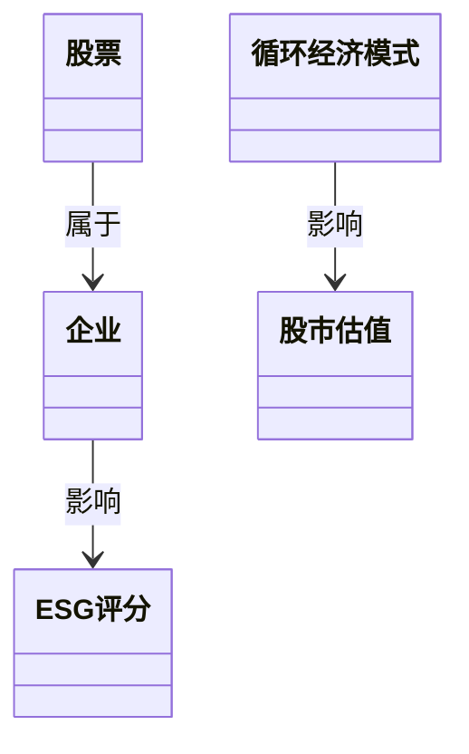
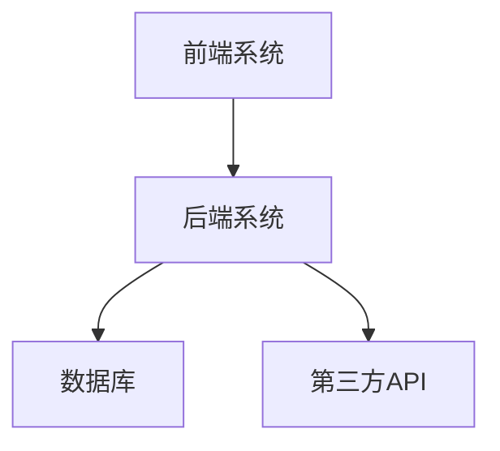
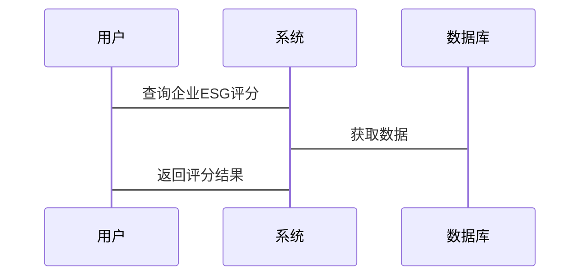

                 


# 全球股市估值与可持续时尚循环经济模式的关联

> 关键词：全球股市估值、可持续时尚、循环经济、ESG投资、绿色金融

> 摘要：随着全球可持续发展理念的兴起，循环经济模式在时尚产业中的应用日益广泛。本文探讨了全球股市估值与可持续时尚循环经济模式之间的关联，分析了ESG投资对股市估值的影响，揭示了绿色金融在推动循环经济中的作用。

---

# 第一部分: 全球股市估值与可持续时尚循环经济模式的背景与概述

## 第1章: 全球股市估值的现状与趋势

### 1.1 全球股市估值的定义与核心指标

#### 1.1.1 市盈率（P/E Ratio）的定义与计算公式
市盈率是衡量企业股票价值的重要指标，计算公式为：
$$ P/E = \frac{\text{股价}}{\text{每股净利润}} $$

#### 1.1.2 市净率（P/B Ratio）的计算与应用
市净率用于评估股票相对于其账面价值的高低，计算公式为：
$$ P/B = \frac{\text{股价}}{\text{每股净资产}} $$

#### 1.1.3 市值与企业价值（EV）的关联
企业价值（EV）是公司整体价值的衡量标准，公式为：
$$ EV = \text{企业市值} + \text{债务} - \text{现金及等价物} $$

### 1.2 可持续发展与股市估值的关联

#### 1.2.1 可持续发展对企业估值的影响
企业采用可持续发展策略可以提升品牌形象，增强投资者信心，从而提高企业估值。

#### 1.2.2 环境、社会和治理（ESG）因素对股市估值的作用
ESG评分高的企业通常具有更低的金融风险和更高的长期收益，吸引更多投资者。

#### 1.2.3 绿色金融与股市估值的未来趋势
绿色金融通过支持可持续项目，推动企业向循环经济模式转型，进而影响股市估值。

### 1.3 循环经济模式的定义与特点

#### 1.3.1 循环经济的基本概念
循环经济强调资源的高效利用和循环再生，减少浪费和污染。

#### 1.3.2 循环经济与传统线性经济的对比
传统线性经济遵循“取、做、丢”的原则，而循环经济则是“取、做、再用”的闭环模式。

#### 1.3.3 可持续时尚在循环经济中的角色
可持续时尚通过设计、生产、消费和废弃物处理的闭环流程，推动循环经济的发展。

---

## 第2章: 可持续时尚的兴起与发展趋势

### 2.1 可持续时尚的定义与核心要素

#### 2.1.1 可持续时尚的定义
可持续时尚是指在服装生产、消费和废弃过程中，尽量减少对环境和资源的消耗。

#### 2.1.2 可持续时尚的核心要素
| 要素 | 描述 |
|------|------|
| 材料 | 使用环保材料，如有机棉、再生聚酯纤维 |
| 生产 | 采用低能耗、低水耗的生产方式 |
| 消费 | 提倡消费者进行理性消费，延长产品生命周期 |
| 废弃物处理 | 实现废弃物的回收再利用 |

### 2.2 循环经济模式在时尚产业中的应用

#### 2.2.1 产品生命周期管理
通过设计可回收、可分解的产品，延长产品生命周期。

#### 2.2.2 共享经济与租赁模式
消费者通过租赁或共享的方式使用产品，减少资源浪费。

#### 2.2.3 零售模式的创新
采用线上线下的整合模式，提供个性化服务，提升消费体验。

### 2.3 可持续时尚对股市估值的影响

#### 2.3.1 可持续时尚企业的市场表现
可持续时尚企业通常具有较高的品牌溢价能力，吸引更多投资者。

#### 2.3.2 ESG评分与企业估值的关系
ESG评分高的企业通常具有更高的市值和更低的金融风险。

#### 2.3.3 投资者对可持续时尚的关注与投资趋势
越来越多的投资者将ESG因素纳入投资决策，推动可持续时尚企业的发展。

---

## 第3章: 全球股市估值与可持续时尚循环经济模式的关联分析

### 3.1 循环经济模式对股市估值的正向影响

#### 3.1.1 提高企业社会责任形象
循环经济模式展示了企业的社会责任感，增强投资者信心。

#### 3.1.2 降低生产成本与风险
通过资源循环利用，企业可以降低生产成本，减少环境风险。

#### 3.1.3 提升品牌忠诚度与市场竞争力
可持续时尚企业通过创新的商业模式和环保理念，吸引更多的消费者。

### 3.2 可持续时尚对企业估值的潜在挑战

#### 3.2.1 初期投资成本较高
循环经济模式的转型需要较高的初期投资，可能影响企业的短期利润。

#### 3.2.2 消费者接受度的问题
部分消费者对可持续时尚产品的认知和接受度较低，可能影响销售。

#### 3.2.3 政策与法规的不确定性
不同国家和地区对循环经济的支持力度不一，政策不确定性可能影响企业的投资决策。

---

## 第4章: 系统分析与架构设计方案

### 4.1 问题场景介绍
本文将分析全球股市估值与可持续时尚循环经济模式的关联，构建数学模型，设计系统架构。

### 4.2 系统功能设计

#### 4.2.1 领域模型类图


### 4.3 系统架构设计

#### 4.3.1 系统架构图


### 4.4 系统交互设计

#### 4.4.1 系统交互序列图


---

## 第5章: 项目实战

### 5.1 环境安装
需要安装Python、Pandas、Scikit-learn等工具。

### 5.2 核心实现源代码

#### 5.2.1 数据清洗代码
```python
import pandas as pd

# 读取数据
df = pd.read_csv('stock_data.csv')

# 删除缺失值
df.dropna(inplace=True)

# 标准化处理
from sklearn.preprocessing import StandardScaler

scaler = StandardScaler()
scaled_data = scaler.fit_transform(df[['市盈率', '市净率']])
```

#### 5.2.2 模型构建代码
```python
from sklearn.linear_model import LinearRegression

model = LinearRegression()
model.fit(scaled_data, df['市值'])
```

### 5.3 案例分析

#### 5.3.1 某公司转型案例
分析某时尚企业从传统模式向循环经济模式转型的过程，包括ESG评分的变化和市值的波动。

#### 5.3.2 代码应用解读
解释代码的功能，展示如何通过数据清洗和建模来预测股市估值的变化。

---

## 第6章: 总结与展望

### 6.1 总结
本文探讨了全球股市估值与可持续时尚循环经济模式的关联，分析了ESG投资对股市估值的影响，提出了绿色金融在推动循环经济中的作用。

### 6.2 投资策略的建议
投资者应关注企业的ESG评分，选择具有可持续发展能力的企业进行投资。

### 6.3 未来研究方向
未来可以进一步研究循环经济模式对股市估值的动态影响，以及不同市场环境下的表现差异。

---

# 作者：AI天才研究院/AI Genius Institute & 禅与计算机程序设计艺术 /Zen And The Art of Computer Programming

