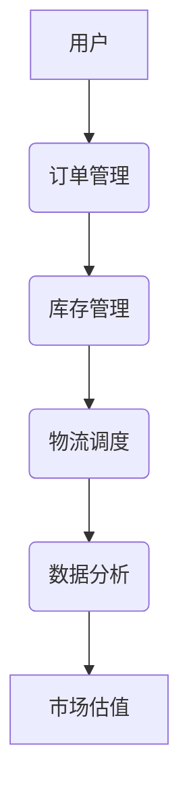
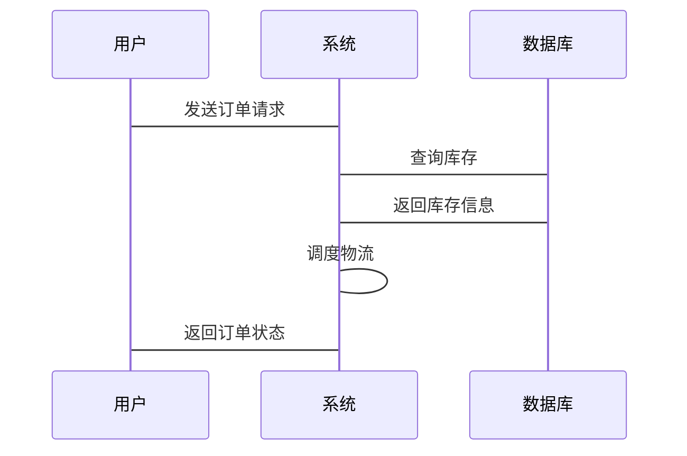

                 


# 全球股市估值与可持续时尚智能供应链的关联

## 关键词：全球股市估值，可持续时尚，智能供应链，数据分析，算法，系统架构

## 摘要：  
本文探讨了全球股市估值与可持续时尚智能供应链之间的关联，分析了智能供应链如何通过优化资源配置、提高透明度和实现可持续发展目标，进而影响企业的市场估值。结合数据驱动的方法和实际案例，本文详细阐述了智能供应链在提升企业价值中的关键作用，并提出了构建智能供应链系统的可行性方案。

---

## 第1章: 全球股市估值与可持续时尚智能供应链的关联背景

### 1.1 问题背景与研究意义  
全球股市估值是衡量企业价值的重要指标，而可持续时尚智能供应链的优化直接影响企业的运营效率和市场形象。随着消费者对可持续发展的关注增加，企业通过智能供应链实现绿色生产和高效管理，能够显著提升市场估值。

#### 1.1.1 全球股市估值的重要性  
股市估值是投资者评估企业价值的关键指标，主要通过市盈率、市净率等指标衡量。  

#### 1.1.2 可持续时尚的发展趋势  
消费者对环保和社会责任的关注推动了可持续时尚的发展，企业需要通过智能供应链实现资源优化和绿色生产。  

#### 1.1.3 智能供应链在时尚产业中的作用  
智能供应链利用数据和技术优化库存管理、生产调度和物流配送，提升企业运营效率。  

#### 1.1.4 三者关联的研究价值  
研究三者关联有助于企业通过优化供应链提升市场估值，推动可持续发展。

### 1.2 核心概念与研究范围  
- **股市估值**：市盈率、市净率等指标。  
- **可持续时尚**：注重环保、社会责任和透明度。  
- **智能供应链**：利用AI、大数据优化供应链管理。  

---

## 第2章: 全球股市估值的分析框架

### 2.1 股市估值的基本原理  
股市估值基于企业盈利能力、成长潜力和风险水平。  

#### 2.1.1 市盈率与市净率的计算方法  
- 市盈率 = 股价 / 每股收益  
- 市净率 = 股价 / 每股净资产  

#### 2.1.2 股东权益与现金流分析  
股东权益 = 资产 - 负债  
现金流 = 经营活动现金流 + 投资活动现金流 + 筹资活动现金流  

#### 2.1.3 股票估值的多因子模型  
多因子模型通过多个因子（如市值、价值、动量等）预测股票收益。  

### 2.2 全球股市估值的影响因素  
- **宏观经济指标**：GDP、利率、通货膨胀率。  
- **行业发展趋势**：行业周期、技术创新。  
- **公司基本面分析**：盈利能力、财务状况。  

### 2.3 数据驱动的股市估值方法  
- **机器学习**：用于预测股价走势。  
- **时间序列分析**：ARIMA模型预测未来股价。  
- **贝叶斯网络**：用于风险评估和情景分析。  

---

## 第3章: 可持续时尚与智能供应链的关系

### 3.1 可持续时尚的定义与标准  
- **环境因素**：减少碳足迹、使用可持续材料。  
- **社会因素**：公平贸易、劳工权益。  
- **治理因素**：公司治理、透明度。  

### 3.2 智能供应链的构建要素  
- **数据采集**：传感器、物联网技术实时采集数据。  
- **智能调度算法**：优化物流路径和库存管理。  
- **透明度与可追溯性**：区块链技术实现供应链透明。  

### 3.3 可持续时尚对供应链的影响  
- **资源优化**：减少材料浪费，提高利用率。  
- **循环经济**：通过回收再利用降低资源消耗。  
- **伦理供应链**：确保生产过程符合道德标准。  

---

## 第4章: 全球股市估值与智能供应链的关联分析

### 4.1 数据驱动的关联分析方法  
- **多元回归分析**：建立股票估值与供应链绩效的回归模型。  
- **聚类分析**：将企业按供应链表现分为不同类别。  
- **主成分分析（PCA）**：提取影响股市估值的关键因子。  

### 4.2 案例分析：智能供应链对股市估值的影响  
某时尚品牌通过智能供应链优化库存管理，降低了运营成本，提升了利润率，进而提高了市盈率和市净率。  

---

## 第5章: 智能供应链的算法与数学模型

### 5.1 智能供应链的核心算法  
- **遗传算法**：用于库存优化和物流路径规划。  
- **粒子群优化算法**：优化供应链网络结构。  
- **线性规划模型**：用于资源分配和生产计划。  

### 5.2 数学模型与公式  
#### 库存优化模型  
$$ \text{总成本} = \text{库存持有成本} + \text{订货成本} $$  

#### 物流路径优化模型  
$$ \text{最小化} \sum_{i=1}^{n} \text{距离}_i $$  

---

## 第6章: 系统分析与架构设计方案

### 6.1 问题场景介绍  
企业希望通过智能供应链实现高效生产和可持续发展，提升市场估值。  

### 6.2 系统功能设计  
- **数据采集模块**：实时采集供应链数据。  
- **智能调度模块**：优化物流和库存管理。  
- **数据分析模块**：评估供应链绩效，提供决策支持。  

### 6.3 系统架构设计  



### 6.4 系统接口设计  
- **API接口**：与ERP系统、物联网设备对接。  
- **数据格式**：JSON格式传输数据。  

### 6.5 系统交互设计  



---

## 第7章: 项目实战

### 7.1 环境安装  
- **工具安装**：安装Python、TensorFlow、MySQL。  
- **依赖库安装**：pip install numpy, pandas, scikit-learn。  

### 7.2 核心实现源代码  

```python
import numpy as np
import pandas as pd
from sklearn.linear_model import LinearRegression

# 数据加载
data = pd.read_csv('supply_chain.csv')

# 模型训练
model = LinearRegression()
model.fit(data[['inventory', 'logistics']], data['valuation'])

# 预测
predicted_valuation = model.predict([[100, 50]])
print(predicted_valuation)
```

### 7.3 案例分析  
通过代码实现智能供应链优化，分析优化后的供应链对股市估值的影响。  

---

## 第8章: 最佳实践与小结

### 8.1 最佳实践 tips  
- 定期更新模型参数，适应市场变化。  
- 采用区块链技术提高供应链透明度。  

### 8.2 小结  
智能供应链通过优化资源配置和提高透明度，显著提升了企业的市场估值，推动了可持续时尚的发展。

---

## 作者：AI天才研究院 & 禅与计算机程序设计艺术

