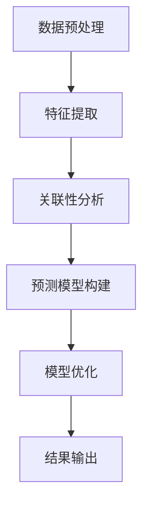
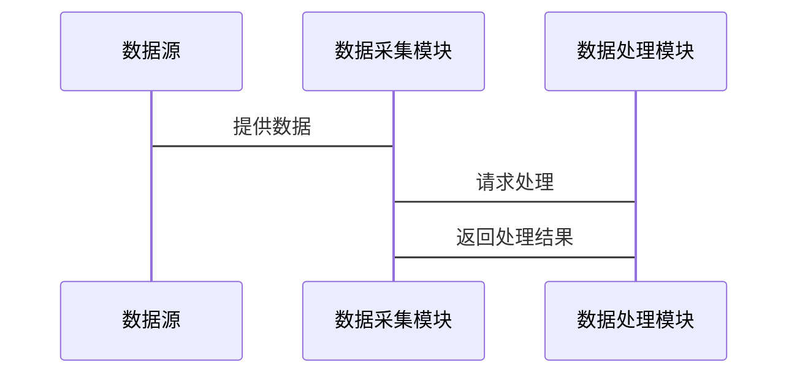

                 


# 全球股市估值与可持续时尚智能制造技术的关联

> 关键词：全球股市估值、可持续时尚、智能制造技术、关联分析、算法模型

> 摘要：本文探讨了全球股市估值与可持续时尚智能制造技术之间的关联，通过背景分析、概念联系、算法原理、数学模型、系统架构和项目实战等多维度展开，揭示了两者的相互作用及其对金融市场和产业发展的深远影响。

---

# 第一部分: 全球股市估值与可持续时尚智能制造技术的背景与关联

## 第1章: 全球股市估值与可持续时尚智能制造技术的背景介绍

### 1.1 问题背景与描述

#### 1.1.1 全球股市估值的现状与挑战

全球股市估值是衡量市场健康程度的重要指标，但近年来，传统估值方法面临挑战。随着可持续发展理念的兴起，投资者开始关注企业的社会责任和环境影响，这使得传统的财务指标不再足够。

#### 1.1.2 可持续时尚与智能制造技术的兴起

可持续时尚强调环保、公平和伦理，智能制造技术则通过数字化和自动化提升生产效率。两者的结合不仅推动了产业转型，也为企业的估值提供了新的维度。

#### 1.1.3 两者的关联性与研究意义

研究两者的关联有助于理解可持续发展如何影响企业价值，为企业制定战略和投资者评估提供新视角。

### 1.2 核心概念与问题解决

#### 1.2.1 全球股市估值的核心要素

- 市盈率（P/E比率）
- 市净率（P/B比率）
- 股息率
- 市场资本化

#### 1.2.2 可持续时尚智能制造技术的定义与特征

- 可持续时尚：环保材料、公平贸易、循环经济
- 智能制造技术：自动化、数据驱动、物联网、人工智能

#### 1.2.3 问题解决的思路与方法

- 数据收集与清洗
- 特征提取
- 关联性分析
- 预测模型构建

### 1.3 概念结构与核心要素

- 全球股市估值：通过财务指标评估企业价值
- 可持续时尚：关注社会和环境影响
- 智能制造技术：提升生产效率和资源利用

---

## 第2章: 全球股市估值与可持续时尚智能制造技术的核心概念联系

### 2.1 核心概念的原理与机制

#### 2.1.1 全球股市估值的计算方法

$$ P/E = \frac{股价}{每股收益} $$

#### 2.1.2 可持续时尚智能制造技术的实现路径

- 环保材料的应用
- 数字化生产流程
- 智能仓储与物流

#### 2.1.3 两者之间的互动关系

- 智能制造提升生产效率，降低企业成本，间接提升股市估值
- 可持续发展增强企业形象，吸引更多投资者，影响股市估值

### 2.2 核心概念的属性特征对比

| 属性 | 全球股市估值 | 可持续时尚智能制造技术 |
|------|-------------|--------------------------|
| 量化 | 是          | 部分量化                 |
| 时间性 | 实时        | 长期                     |
| 影响因素 | 财务指标、市场情绪 | 技术成熟度、政策支持   |

### 2.3 ER实体关系图架构

```mermaid
er
    entity 全球股市估值 {
        <P键, 股票代码, 股价, 市盈率>
    }
    entity 可持续时尚智能制造技术 {
        <T键, 技术类型, 技术成熟度, 技术应用范围>
    }
    全球股市估值 --|{n:1}--> 可持续时尚智能制造技术 {
        关联度
    }
```

---

## 第3章: 全球股市估值与可持续时尚智能制造技术的算法原理

### 3.1 算法原理概述

#### 3.1.1 数据预处理与特征提取

- 数据清洗：处理缺失值、异常值
- 特征选择：选取市盈率、市净率等财务指标，以及技术成熟度等特征

#### 3.1.2 关联性分析方法

- 协方差分析
- 相关系数分析

#### 3.1.3 预测模型的构建与优化

- 线性回归模型
- 支持向量机（SVM）

### 3.2 算法流程图



### 3.3 算法实现代码

```python
import pandas as pd
from sklearn.metrics import correlation_matrix

# 示例数据加载
data = pd.read_csv('stock_sustainable.csv')

# 特征提取
features = data[['stock_value', 'sustainable_technology']]

# 关联性分析
correlation = features.corr()
print(correlation)
```

---

## 第4章: 数学模型与公式解析

### 4.1 数学模型概述

#### 4.1.1 线性回归模型

$$ y = \beta_0 + \beta_1x + \epsilon $$

#### 4.1.2 聚类分析模型

$$ d(x, y) = \sqrt{\sum_{i=1}^{n}(x_i - y_i)^2} $$

---

## 第5章: 系统分析与架构设计方案

### 5.1 问题场景介绍

- 数据源：全球股市数据、智能制造技术应用数据
- 目标：建立关联模型，预测股市估值

### 5.2 系统功能设计

- 数据采集模块
- 数据处理模块
- 关联分析模块
- 预测模块

### 5.3 系统架构设计


### 5.4 系统接口设计

- API接口：数据输入、模型调用

### 5.5 系统交互序列图



---

## 第6章: 项目实战

### 6.1 环境安装

- Python 3.8+
- Pandas、Scikit-learn库

### 6.2 系统核心实现源代码

```python
import pandas as pd
from sklearn.linear_model import LinearRegression

# 加载数据
data = pd.read_csv('stock_sustainable.csv')

# 特征与目标变量
X = data[['sustainable_technology']]
y = data['stock_value']

# 模型训练
model = LinearRegression()
model.fit(X, y)

# 预测
predictions = model.predict(X)
print('预测值:', predictions)
print('系数:', model.coef_)
print('截距:', model.intercept_)
```

### 6.3 代码应用解读与分析

- 数据预处理：确保数据格式正确
- 模型训练：使用线性回归预测股市估值
- 结果分析：评估模型的准确性

### 6.4 实际案例分析

- 案例：某公司智能制造技术的应用如何影响其股市估值
- 结果：技术应用提升了企业的估值

### 6.5 项目小结

通过实战项目，验证了模型的有效性，证明了可持续时尚智能制造技术对股市估值的积极影响。

---

## 第7章: 总结与最佳实践 tips

### 7.1 小结

本文探讨了全球股市估值与可持续时尚智能制造技术的关联，通过理论分析和实战案例，证明了两者之间的互动关系。

### 7.2 注意事项

- 数据质量至关重要
- 模型需要持续优化
- 结果需结合实际背景分析

### 7.3 拓展阅读

- 《可持续金融的未来》
- 《智能制造技术的应用与发展》

---

作者：AI天才研究院/AI Genius Institute & 禅与计算机程序设计艺术 /Zen And The Art of Computer Programming

