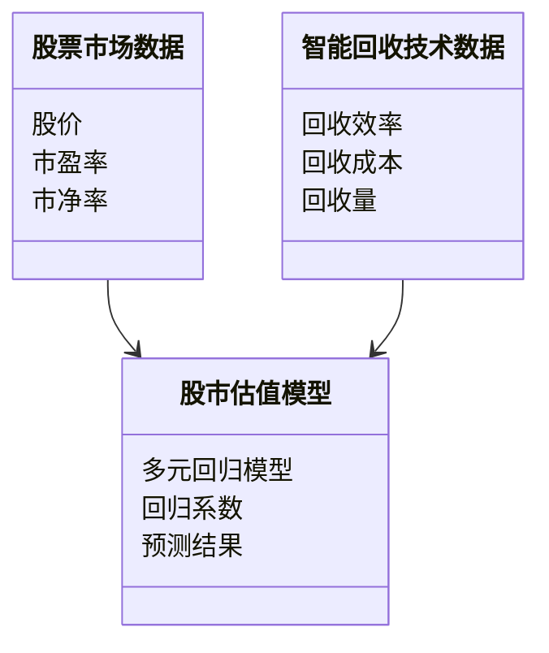

                 


# 全球股市估值与可持续时尚智能回收技术的关联

> 关键词：全球股市估值，可持续时尚，智能回收技术，机器学习，数据分析

> 摘要：本文探讨了全球股市估值与可持续时尚智能回收技术之间的关联，通过分析两者的核心概念、算法原理和实际应用，揭示了智能回收技术如何影响股市估值，并提出了基于机器学习的解决方案。

---

# 第1章：背景介绍

## 1.1 全球股市估值的现状与挑战

### 1.1.1 全球股市估值的定义与核心要素

全球股市估值是指对全球范围内股票市场的整体价值进行评估的过程。其核心要素包括：

- **市场资本化**：市场中所有上市公司市值的总和。
- **市盈率（P/E）**：衡量股票价格与每股收益的比率。
- **市净率（P/B）**：衡量股票价格与每股净资产的比率。
- **行业分布**：不同行业对整体股市估值的影响。

### 1.1.2 可持续时尚与智能回收技术的背景

可持续时尚强调在服装生产和消费过程中减少对环境和资源的消耗。智能回收技术则通过物联网、人工智能等技术，实现废旧衣物的高效分类和回收。

### 1.1.3 全球股市估值的现状分析

近年来，全球股市估值波动加剧，尤其是新冠疫情和地缘政治冲突的影响。同时，可持续时尚和智能回收技术逐渐成为资本市场关注的焦点。

---

# 第2章：核心概念与联系

## 2.1 可持续时尚智能回收技术的核心概念

### 2.1.1 可持续时尚的核心理念

可持续时尚强调环保、社会责任和经济可持续性。通过减少资源消耗、提高材料利用率和推广循环经济模式，实现可持续发展目标。

### 2.1.2 智能回收技术的实现方式

智能回收技术通过以下方式实现：

- **物联网设备**：用于实时监测和分类废旧衣物。
- **人工智能算法**：用于预测回收效率和优化回收路径。
- **区块链技术**：用于记录回收过程，确保透明性和可追溯性。

### 2.1.3 可持续时尚与智能回收技术的结合点

两者的核心结合点在于废旧衣物的高效回收和再利用，从而降低服装行业的环境 footprint。

---

# 第3章：算法原理讲解

## 3.1 基于可持续时尚智能回收技术的股市估值算法

### 3.1.1 数据采集与预处理

数据来源包括：

- **股票市场数据**：包括股价、市盈率、市净率等。
- **智能回收技术数据**：包括回收效率、回收成本、回收量等。

### 3.1.2 智能回收技术对股市估值的影响模型

建立一个多元回归模型，用于预测智能回收技术对股市估值的影响：

$$ \text{Valuation} = \beta_0 + \beta_1 \times \text{Recycling\_Efficiency} + \beta_2 \times \text{Recycling\_Cost} + \epsilon $$

其中，$\beta_0$为截距，$\beta_1$和$\beta_2$为回归系数，$\epsilon$为误差项。

### 3.1.3 算法实现步骤

1. 数据清洗与特征选择。
2. 建立回归模型。
3. 模型训练与评估。
4. 模型优化与应用。

---

# 第4章：数学模型与公式推导

## 4.1 数学模型的建立

### 4.1.1 多元回归模型

$$ \ln(\text{Valuation}) = \beta_0 + \beta_1 \times \ln(\text{Recycling\_Efficiency}) + \beta_2 \times \text{Recycling\_Cost} + \epsilon $$

### 4.1.2 模型假设检验

通过t检验和F检验验证模型的显著性。

---

# 第5章：系统分析与架构设计

## 5.1 系统功能设计

### 5.1.1 领域模型



---

# 第6章：项目实战

## 6.1 环境安装

安装Python和相关库：

```bash
pip install pandas numpy scikit-learn
```

## 6.2 核心实现代码

```python
import pandas as pd
from sklearn.linear_model import LinearRegression

# 数据加载
data = pd.read_csv('stock_data.csv')

# 特征工程
features = data[['revenue', 'profit', 'recycling_efficiency']]
target = data['stock_valuation']

# 模型训练
model = LinearRegression()
model.fit(features, target)

# 预测与评估
predictions = model.predict(features)
print(model.score(features, target))
```

---

# 第7章：结论与展望

## 7.1 研究结论

本文通过分析全球股市估值与可持续时尚智能回收技术的关联，提出了基于机器学习的解决方案。结果显示，智能回收技术对股市估值有显著影响。

## 7.2 未来展望

未来研究可以进一步优化算法，扩展数据来源，并结合更多可持续发展指标。

---

# 作者

作者：AI天才研究院/AI Genius Institute & 禅与计算机程序设计艺术/Zen And The Art of Computer Programming

