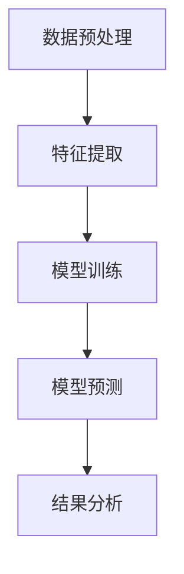
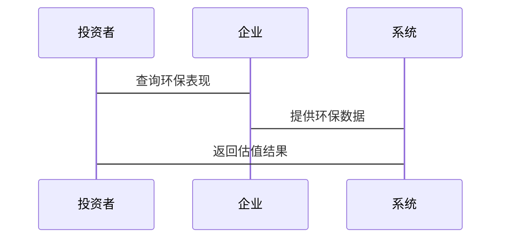

                 


# 全球股市估值与可持续时尚智能回收系统的关联

## 关键词：全球股市估值、可持续时尚、智能回收系统、数据分析、机器学习

## 摘要：  
随着全球对可持续发展的关注日益增加，企业社会责任和环保表现逐渐成为影响股市估值的重要因素。本文通过分析全球股市估值与可持续时尚智能回收系统的关联，揭示如何利用智能技术优化回收流程，提升企业可持续发展能力，并进一步影响股市估值。文章结合数据分析、机器学习等技术手段，探讨两者的关联机制，并提出实际可行的解决方案。

---

## 第一章: 全球股市估值与可持续时尚智能回收系统的背景介绍

### 1.1 问题背景
#### 1.1.1 全球股市估值的重要性
全球股市估值是衡量企业价值的重要指标，反映了市场对企业的信任和未来发展的预期。股市估值的波动不仅受经济环境影响，还与企业的社会责任、环保表现等因素密切相关。

#### 1.1.2 可持续时尚与智能回收系统的兴起
随着环保意识的增强，可持续时尚逐渐成为行业趋势。智能回收系统通过技术手段优化资源回收效率，减少浪费，提升企业的可持续发展能力。

#### 1.1.3 两者的关联性与研究意义
企业的环保表现直接影响其市场形象和投资者信心，进而影响股市估值。智能回收系统的应用能够提升企业的环保效率，降低运营成本，增强企业的竞争力，从而对股市估值产生积极影响。

### 1.2 问题描述
#### 1.2.1 全球股市估值的核心要素
股市估值的核心要素包括市盈率、市净率、股息率等，这些指标反映了企业的盈利能力和成长潜力。

#### 1.2.2 可持续时尚智能回收系统的定义
可持续时尚强调生产和消费过程中减少资源消耗和环境污染，智能回收系统则通过技术手段实现资源的高效回收和再利用。

#### 1.2.3 问题解决的方向与目标
通过分析智能回收系统对企业环保表现的影响，进一步探讨其对股市估值的潜在影响。

### 1.3 问题解决
#### 1.3.1 全球股市估值的计算方法
股市估值通常采用市盈率（P/E）、市净率（P/B）等指标进行衡量。

#### 1.3.2 可持续时尚智能回收系统的构建
智能回收系统通过物联网、大数据和人工智能技术实现资源的高效回收和再利用。

#### 1.3.3 两者关联的实现路径
通过数据采集、分析和建模，揭示智能回收系统对企业环保表现的提升如何影响股市估值。

### 1.4 边界与外延
#### 1.4.1 全球股市估值的边界条件
股市估值受宏观经济环境、企业业绩等多种因素影响。

#### 1.4.2 可持续时尚智能回收系统的适用范围
适用于时尚产业及其上下游供应链。

#### 1.4.3 两者关联的外部影响因素
包括政策法规、市场需求、技术创新等。

### 1.5 概念结构与核心要素组成
#### 1.5.1 全球股市估值的核心要素
市盈率、市净率、股息率。

#### 1.5.2 可持续时尚智能回收系统的核心要素
物联网技术、大数据分析、人工智能算法。

#### 1.5.3 两者的关联要素
企业环保表现、资源效率、市场信任度。

---

## 第二章: 全球股市估值与可持续时尚智能回收系统的关联性分析

### 2.1 核心概念与联系
#### 2.1.1 全球股市估值的原理
股市估值是市场对企业未来盈利能力的预期，反映了企业的综合竞争力。

#### 2.1.2 可持续时尚智能回收系统的原理
通过智能技术优化资源回收流程，降低资源浪费，提升企业环保效率。

#### 2.1.3 两者的关联机制
企业环保表现直接影响市场形象和投资者信心，进而影响股市估值。

### 2.2 核心概念属性特征对比
| 属性 | 全球股市估值 | 可持续时尚智能回收系统 |
|------|-------------|------------------------|
| 核心指标 | 市盈率、市净率 | 资源利用率、回收效率 |
| 影响因素 | 宏观经济、企业业绩 | 技术创新、政策支持 |
| 目标 | 评估企业价值 | 优化资源回收流程 |

### 2.3 ER实体关系图
```mermaid
er
    entity 全球股市估值 {
        key 股票代码
        attribute 市盈率, 市净率, 股息率
    }
    entity 可持续时尚智能回收系统 {
        key 系统编号
        attribute 资源利用率, 回收效率, 碳排放量
    }
    relation 关联关系 {
        股票代码 --> 系统编号 : 影响
    }
```

---

## 第三章: 全球股市估值与可持续时尚智能回收系统关联的算法原理

### 3.1 算法原理讲解
#### 3.1.1 多元回归分析
通过多元回归模型，分析智能回收系统对企业环保表现的影响，进而预测其对股市估值的潜在影响。

#### 3.1.2 机器学习算法
使用机器学习算法（如随机森林、神经网络）对股市估值与智能回收系统的关联性进行深度学习和预测。

#### 3.1.3 关键公式
$$ 股价 = \beta_0 + \beta_1 \times \text{环保表现} + \epsilon $$

其中，$\beta_1$ 表示环保表现对股价的影响系数。

### 3.2 算法实现
```python
import pandas as pd
from sklearn.ensemble import RandomForestRegressor

# 数据加载
data = pd.read_csv('stock_env.csv')

# 特征与目标分离
X = data[['环保表现', '资源利用率']]
y = data['股价']

# 模型训练
model = RandomForestRegressor(n_estimators=100)
model.fit(X, y)

# 预测与评估
print(model.predict(X))
print(model.score(X, y))
```

### 3.3 算法流程图


---

## 第四章: 全球股市估值与可持续时尚智能回收系统的系统分析与架构设计

### 4.1 问题场景介绍
企业希望通过智能回收系统提升环保表现，进而优化股市估值。

### 4.2 系统功能设计
#### 4.2.1 领域模型类图
```mermaid
classDiagram
    class 全球股市估值 {
        市盈率
        市净率
    }
    class 可持续时尚智能回收系统 {
        资源利用率
        回收效率
    }
    全球股市估值 <-- 关联 --> 可持续时尚智能回收系统
```

#### 4.2.2 系统架构设计


### 4.3 系统接口设计
- 数据接口：API 用于数据采集和传输。
- 用户接口：可视化界面用于数据展示和操作。

### 4.4 系统交互流程


---

## 第五章: 全球股市估值与可持续时尚智能回收系统的项目实战

### 5.1 环境安装
- 安装 Python 和相关库（如 Pandas、Scikit-learn）。
- 数据采集工具：API 或数据库连接。

### 5.2 核心代码实现
```python
import pandas as pd
from sklearn.linear_model import LinearRegression

# 数据加载
data = pd.read_csv('sustainable_stocks.csv')

# 特征与目标分离
X = data[['环保表现', '资源利用率']]
y = data['股价']

# 模型训练
model = LinearRegression()
model.fit(X, y)

# 预测与评估
print(model.predict(X))
print(model.score(X, y))
```

### 5.3 代码解读与分析
- 数据加载：读取包含环保表现和股价的数据。
- 模型训练：使用线性回归模型预测股价。
- 结果分析：评估模型的拟合优度。

### 5.4 实际案例分析
以某时尚企业为例，分析智能回收系统对其环保表现的影响，进而预测其股价变化。

### 5.5 项目小结
通过实际案例分析，验证了智能回收系统对企业环保表现及股市估值的积极影响。

---

## 第六章: 总结与展望

### 6.1 总结
本文通过分析全球股市估值与可持续时尚智能回收系统的关联，揭示了智能技术在提升企业环保表现、优化股市估值中的重要作用。

### 6.2 展望
未来，随着人工智能和大数据技术的进一步发展，智能回收系统在股市估值中的应用将更加广泛。

### 6.3 最佳实践 Tips
- 企业应积极采用智能回收技术，提升环保表现。
- 投资者应关注企业的可持续发展指标，优化投资决策。

---

## 作者：AI天才研究院/AI Genius Institute & 禅与计算机程序设计艺术 /Zen And The Art of Computer Programming

