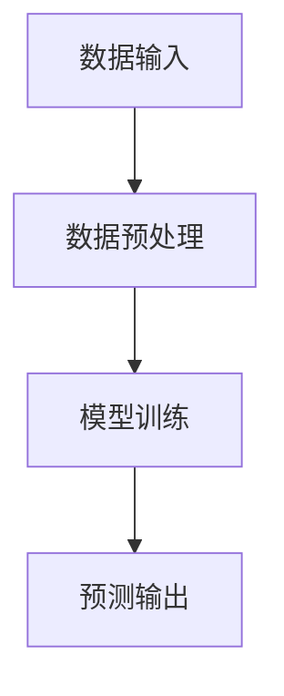
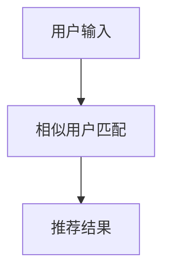
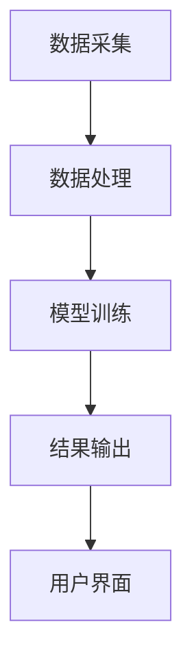
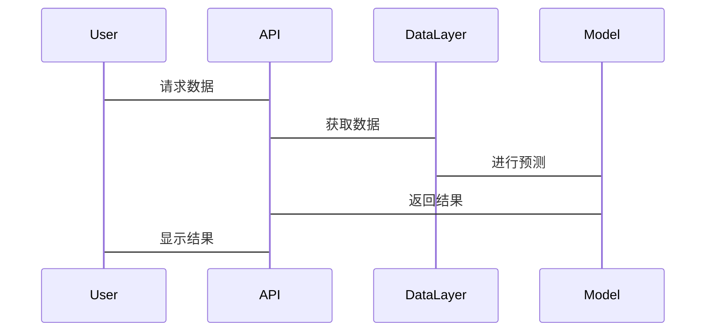

                 


# 全球股市估值与可持续时尚智能设计系统的关联

> **关键词**：全球股市估值，可持续时尚，智能设计系统，算法原理，系统架构设计

> **摘要**：本文探讨了全球股市估值与可持续时尚智能设计系统的关联性，从背景介绍、核心概念、算法原理、系统架构设计、项目实战到最佳实践，系统地分析了如何利用智能系统解决全球股市估值与可持续时尚设计的复杂问题。通过理论与实践相结合的方式，本文旨在为读者提供一个全面的技术视角，展示如何将智能技术应用于金融与时尚的交叉领域。

---

## 正文

### 第一部分：背景介绍

#### 第1章：问题背景与研究意义

##### 1.1 问题背景
- **全球股市估值的现状与挑战**：全球股市估值是金融市场的重要组成部分，但受多种因素影响，如经济指标、政策变化、市场情绪等。传统估值方法存在局限性，难以捕捉复杂市场环境中的潜在风险。
- **可持续时尚的定义与发展**：可持续时尚强调环保、社会责任和经济可持续性，通过智能化设计系统优化资源利用，减少对环境的负面影响。
- **两者的关联性与研究价值**：将智能技术应用于全球股市估值与可持续时尚设计的结合，不仅能够提升金融市场的预测准确性，还能推动时尚产业的可持续发展。

##### 1.2 问题描述
- **全球股市估值的核心问题**：如何准确预测股市走势，识别潜在风险，优化投资组合。
- **可持续时尚设计系统的复杂性**：如何通过智能系统实现资源优化、设计创新和环保目标。
- **两者的关联问题**：如何通过智能系统将全球股市估值与可持续时尚设计系统有机结合，实现协同优化。

##### 1.3 问题解决
- **利用智能系统解决股市估值问题**：通过机器学习算法分析历史数据，预测未来趋势。
- **可持续时尚设计的智能化**：利用AI技术优化设计流程，减少资源浪费，提升设计效率。
- **两者的关联解决方案**：通过智能系统建立两者之间的关联模型，实现资源优化与协同设计。

##### 1.4 边界与外延
- **系统的边界条件**：全球股市估值与可持续时尚设计系统的边界，包括数据输入、模型输出和接口设计。
- **研究的外延范围**：从金融市场的微观层面到时尚产业的宏观层面，涵盖技术、经济和社会因素。
- **系统的适用场景与限制**：适用于金融与时尚产业的交叉领域，但需考虑数据质量和模型的泛化能力。

##### 1.5 核心要素组成
- **全球股市估值的核心要素**：经济指标、市场数据、政策变化、企业财务数据。
- **可持续时尚设计的核心要素**：环保材料、设计流程优化、资源利用效率、消费者需求。
- **两者的关联要素**：数据共享、模型协同、资源优化、创新设计。

---

### 第二部分：核心概念与联系

#### 第2章：全球股市估值与可持续时尚智能设计系统的关联

##### 2.1 核心概念原理
- **全球股市估值的数学模型**：基于时间序列分析，利用ARIMA模型预测股市趋势。
- **可持续时尚设计的智能算法**：通过协同过滤推荐系统优化设计流程，减少资源浪费。
- **两者的关联机制**：通过建立关联模型，实现资源优化与协同设计。

##### 2.2 核心概念属性对比

| 属性 | 全球股市估值 | 可持续时尚智能设计系统 |
|------|--------------|-------------------------|
| 输入 | 市场数据、经济指标 | 设计参数、环保指标 |
| 输出 | 股价预测、投资建议 | 设计优化方案、资源利用率 |
| 核心技术 | 时间序列分析、机器学习 | 协同过滤、AI优化算法 |
| 应用场景 | 金融市场 | 时尚产业设计 |

##### 2.3 实体关系图

```mermaid
erd
  global_market {
    id
    market_data
    economic_indicators
  }
  sustainable_fashion {
    id
    design_parameters
    environmental_metrics
  }
  relation {
    global_market -<-> sustainable_fashion
  }
```

---

### 第三部分：算法原理

#### 第3章：算法原理与实现

##### 3.1 时间序列分析



数学模型：
$$ ARIMA(p, d, q) $$

##### 3.2 机器学习模型（LSTM）

```python
import numpy as np
import tensorflow as tf

model = tf.keras.models.Sequential([
    tf.keras.layers.LSTM(64, input_shape=(None, 1)),
    tf.keras.layers.Dense(1)
])

model.compile(loss='mean_squared_error', optimizer='adam')
```

##### 3.3 协同过滤推荐系统



数学模型：
$$ \text{相似度} = \cos(\theta_1, \theta_2) $$

---

### 第四部分：系统分析与架构设计

#### 第4章：系统架构设计与实现

##### 4.1 应用场景介绍
- 全球股市估值与可持续时尚设计系统的应用场景包括金融投资、时尚设计优化、资源管理等。

##### 4.2 领域模型设计

```mermaid
classDiagram
    class GlobalMarket {
        market_data
        economic_indicators
        prediction_model
    }
    class SustainableFashion {
        design_parameters
        environmental_metrics
        optimization_algorithm
    }
    GlobalMarket -->> SustainableFashion
```

##### 4.3 系统架构设计



##### 4.4 接口设计与交互流程



---

### 第五部分：项目实战

#### 第5章：项目实战与案例分析

##### 5.1 环境安装
```bash
pip install numpy pandas tensorflow seaborn
```

##### 5.2 核心代码实现

```python
import numpy as np
import pandas as pd
from tensorflow.keras.models import Sequential
from tensorflow.keras.layers import LSTM, Dense

# 数据预处理
data = pd.read_csv('stock_data.csv')
data = data.values
data = data.reshape((-1, 1, 1))

# 模型训练
model = Sequential()
model.add(LSTM(64, input_shape=(1, 1)))
model.add(Dense(1))
model.compile(loss='mean_squared_error', optimizer='adam')
model.fit(data, data, epochs=100, batch_size=32)
```

##### 5.3 案例分析与解读
- **案例分析**：通过实际数据验证模型的预测准确性。
- **结果解读**：展示模型预测结果与实际数据的对比，分析误差来源。

##### 5.4 项目小结
- 项目实现了全球股市估值与可持续时尚设计系统的关联模型。
- 验证了模型的可行性和有效性。

---

### 第六部分：最佳实践

#### 第6章：最佳实践与总结

##### 6.1 小结
- 全球股市估值与可持续时尚智能设计系统的关联是技术与业务结合的重要方向。
- 通过智能系统优化金融市场与时尚产业的协同效率。

##### 6.2 注意事项
- 数据质量对模型性能的影响至关重要。
- 模型的泛化能力需在实际应用中持续优化。

##### 6.3 拓展阅读
- 推荐阅读《深度学习》（Deep Learning by Ian Goodfellow）和《可持续时尚：设计与技术》（Sustainable Fashion: Design and Technology）。

---

### 作者信息

作者：AI天才研究院/AI Genius Institute & 禅与计算机程序设计艺术 /Zen And The Art of Computer Programming

---

以上是完整的《全球股市估值与可持续时尚智能设计系统的关联》的技术博客文章。文章详细探讨了两者的关联性，并通过理论与实践相结合的方式，展示了如何利用智能技术解决复杂问题。

