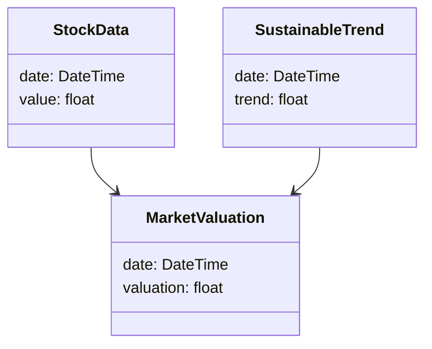
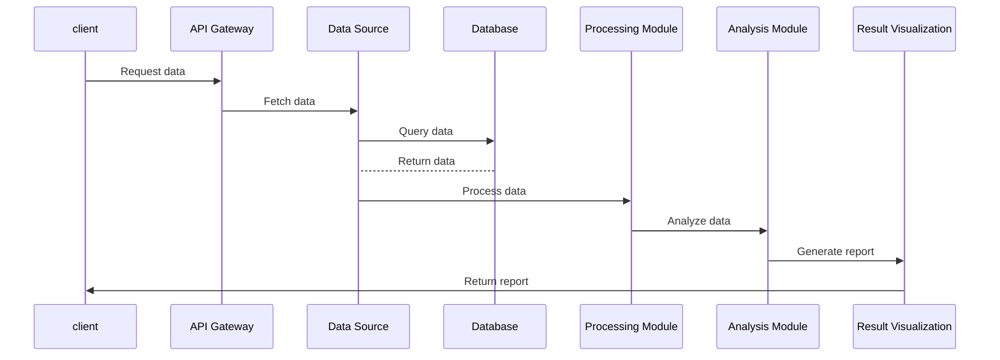

                 


# 全球股市估值与可持续时尚消费趋势的关联

> 关键词：全球股市估值，可持续时尚消费趋势，数据关联分析，时间序列预测，回归分析

> 摘要：本文深入探讨了全球股市估值与可持续时尚消费趋势之间的关联性。通过分析股市估值的核心指标和可持续时尚消费趋势的关键特征，结合数据采集与处理、算法模型构建、系统架构设计等技术手段，揭示两者之间的潜在联系。文章首先从背景与概念出发，逐步展开数据采集、分析、关联性建模、系统架构设计等核心内容，最终通过项目实战验证关联性分析的有效性，并总结研究发现和未来展望。

---

# 第一部分: 全球股市估值与可持续时尚消费趋势的背景与概念

## 第1章: 全球股市估值概述

### 1.1 全球股市的基本概念

#### 1.1.1 股市估值的定义与意义
股市估值是衡量市场上所有上市公司总市值的方法，通常通过股票价格、市盈率（P/E ratio）、市净率（P/B ratio）等指标来评估市场的整体表现和潜力。股市估值的意义在于为投资者提供市场健康状况的参考，帮助判断市场的买入或卖出信号。

#### 1.1.2 股市估值的主要指标
- **市盈率（P/E ratio）**：公司股价与每股收益的比率，反映市场对公司的盈利预期。
- **市净率（P/B ratio）**：公司股价与每股净资产的比率，适用于评估资产密集型行业。
- **市值（Market Cap）**：上市公司总发行股份的市场价值，分为大、中、小盘股。
- **指数表现**：如标普500、纳斯达克指数等，反映特定市场或行业的整体表现。

#### 1.1.3 全球主要股市的现状与特点
全球主要股市包括美国的纳斯达克、纽约证券交易所，欧洲的伦敦金融时报指数，以及亚洲的东京证券交易所等。不同市场的特点在于行业分布、投资者结构和经济政策的差异，这些差异会影响股市估值的变化趋势。

### 1.2 可持续时尚消费趋势的定义与特征

#### 1.2.1 可持续时尚的定义
可持续时尚是指在服装和纺织品的生产、消费和废弃过程中，最大限度减少对环境和人类健康的影响。它强调材料的环保性、生产过程的公平性和产品的耐用性。

#### 1.2.2 可持续时尚消费趋势的特征
- **消费者行为的变化**：消费者 increasingly prefer eco-friendly products and brands with sustainable practices.
- **市场需求的驱动因素**：政策法规、环保意识、品牌责任感等。
- **行业发展的挑战与机遇**：传统企业转型压力大，但新兴品牌通过可持续理念快速崛起。

### 1.3 股市估值与可持续时尚消费趋势的关联性分析

#### 1.3.1 股市估值对消费趋势的影响
股市估值反映了市场对企业的信心，直接影响企业的融资能力，进而影响其产品开发和市场推广能力，间接推动或制约可持续时尚的发展。

#### 1.3.2 消费趋势对股市估值的反馈作用
可持续时尚消费趋势的兴起可能提升相关企业的市场地位和盈利能力，从而提高其股票估值，反过来吸引更多投资者关注该领域。

#### 1.3.3 两者关系的动态变化
股市估值与可持续时尚消费趋势之间存在动态反馈关系。消费趋势的变化会影响企业的财务表现，进而影响股市估值；而股市估值的变化则会反过来影响企业的投资能力和消费者的信心。

---

## 第2章: 数据采集与分析方法

### 2.1 数据采集与预处理

#### 2.1.1 数据来源与采集方法
- **股市数据**：来源于金融数据提供商（如 Yahoo Finance、 Bloomberg），包括每日股价、成交量等。
- **可持续时尚消费数据**：来源于市场调研机构（如 McKinsey、Statista）和企业社会责任报告。

#### 2.1.2 数据清洗与预处理技术
- 数据清洗：处理缺失值、异常值和重复数据。
- 数据转换：将时间序列数据标准化，便于模型训练。

#### 2.1.3 数据特征提取
从股市数据中提取市盈率、市净率等指标，从消费数据中提取消费者偏好、市场增长率等。

### 2.2 数据分析与可视化

#### 2.2.1 数据分析方法
- **时间序列分析**：使用ARIMA模型预测股市估值和消费趋势的变化。
- **关联性分析**：计算相关系数，判断两者之间的相关性。

#### 2.2.2 数据可视化工具与技术
- **工具**：使用Matplotlib和Seaborn绘制趋势图和散点图。
- **可视化结果**：展示股市估值与可持续时尚消费趋势的变化趋势及其相关性。

---

## 第3章: 算法原理与模型构建

### 3.1 时间序列分析

#### 3.1.1 ARIMA模型
ARIMA（Auto-Regressive Integrated Moving Average）模型用于预测时间序列数据。模型参数包括自回归系数（AR）、差分阶数（I）和移动平均系数（MA）。

#### 3.1.2 ARIMA模型的实现步骤
1. 数据预处理：检查数据的平稳性，必要时进行差分。
2. 参数估计：通过最大似然估计确定ARIMA参数。
3. 模型验证：使用AIC准则选择最优模型。
4. 预测与评估：计算预测值并评估模型的准确性。

#### 3.1.3 Python代码实现
```python
from statsmodels.tsa.arima.model import ARIMA
import pandas as pd
import matplotlib.pyplot as plt

# 示例数据加载
data = pd.read_csv('stock_valuation.csv')
data['date'] = pd.to_datetime(data['date'])
data.set_index('date', inplace=True)

# 差分处理
diff_data = data['value'].diff().dropna()

# 模型训练
model = ARIMA(diff_data, order=(1, 1, 1))
model_fit = model.fit()

# 预测
forecast = model_fit.forecast(steps=5)
plt.plot(diff_data, label='Actual')
plt.plot(forecast, label='Forecast')
plt.legend()
plt.show()
```

### 3.2 关联性分析

#### 3.2.1 回归分析
回归分析用于量化股市估值与可持续时尚消费趋势之间的关系强度。使用多元线性回归模型，考虑多个自变量对因变量的影响。

#### 3.2.2 回归模型的实现步骤
1. 数据准备：收集股市估值和消费趋势的指标。
2. 模型训练：使用最小二乘法估计回归系数。
3. 模型评估：计算R平方值和p值，判断模型的显著性。

#### 3.2.3 Python代码实现
```python
import statsmodels.api as sm

# 示例数据加载
data = pd.read_csv('data.csv')

# 回归分析
X = data[['stock_valuation', 'sustainable_trend']]
X = sm.add_constant(X)
y = data['target']

model = sm.OLS(y, X).fit()
print(model.summary())
```

---

## 第4章: 系统架构设计与实现

### 4.1 系统功能设计

#### 4.1.1 领域模型


#### 4.1.2 系统架构设计
```mermaid
client --> API Gateway
API Gateway --> Data Source
Data Source --> Database
Database --> Processing Module
Processing Module --> Analysis Module
Analysis Module --> Result Visualization
```

### 4.2 接口设计

#### 4.2.1 数据接口
- 数据获取接口：`GET /api/data/{symbol}`
- 数据处理接口：`POST /api/process`

#### 4.2.2 分析接口
- 关联性分析接口：`POST /api/analyze`

### 4.3 交互设计



---

## 第5章: 项目实战与案例分析

### 5.1 项目环境搭建

#### 5.1.1 安装依赖
```bash
pip install pandas matplotlib statsmodels requests
```

### 5.2 核心代码实现

#### 5.2.1 数据采集与预处理
```python
import requests
import pandas as pd

# 从API获取数据
def get_data(api_url):
    response = requests.get(api_url)
    data = response.json()
    df = pd.DataFrame(data)
    return df

# 数据清洗
def preprocess_data(df):
    df.dropna(inplace=True)
    df['date'] = pd.to_datetime(df['date'])
    return df

# 示例
data = get_data('http://example.com/api/stock')
data = preprocess_data(data)
```

#### 5.2.2 关联性分析与预测
```python
from statsmodels.tsa.arima.model import ARIMA

# 示例
data = preprocess_data(data)
model = ARIMA(data['value'], order=(1, 1, 1))
model_fit = model.fit()
forecast = model_fit.forecast(steps=10)
print(forecast)
```

---

## 第6章: 总结与展望

### 6.1 研究总结
本文通过数据分析和模型构建，揭示了全球股市估值与可持续时尚消费趋势之间的关联性。通过时间序列分析和回归分析，验证了两者之间的动态反馈关系。

### 6.2 未来展望
未来研究可以进一步结合文本挖掘和自然语言处理技术，分析社交媒体和新闻数据对消费趋势的影响，从而更全面地评估股市估值的变化。

### 6.3 最佳实践 Tips
- 数据采集与处理是关键，确保数据的准确性和完整性。
- 模型选择需结合实际业务需求，合理调整参数。
- 可视化结果有助于更好地理解数据，提升报告的可读性。

---

作者：AI天才研究院 & 禅与计算机程序设计艺术

