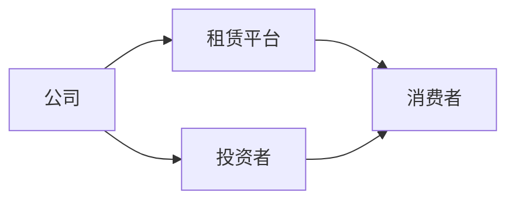

                 


# 全球股市估值与可持续时尚租赁模式的关联

---

## 关键词
全球股市估值, 可持续时尚, 租赁模式, 经济影响, 可持续发展, 数据分析

---

## 摘要
本文探讨了全球股市估值与可持续时尚租赁模式之间的关联。通过分析全球经济趋势、可持续发展的重要性以及租赁模式在时尚行业的兴起，本文揭示了如何通过数学模型和数据分析量化这两者的关系。结合实际案例，本文展示了如何利用算法预测租赁模式对股市的影响，并提出了系统的架构设计和最佳实践建议。

---

## 目录大纲

### 第1章 背景介绍
#### 1.1 问题背景
- 全球经济趋势与股市估值的重要性
- 可持续发展的兴起与租赁经济的崛起

#### 1.2 问题描述
- 可持续时尚租赁模式的定义与特点
- 全球股市估值的计算方法

#### 1.3 问题解决
- 量化分析租赁模式对股市的影响
- 构建数学模型进行预测

#### 1.4 边界与外延
- 研究范围的界定
- 相关领域的延伸

#### 1.5 概念结构与核心要素
- 概念关系图
- 核心要素列表

### 第2章 核心概念与联系
#### 2.1 全球股市估值的原理
- 股市估值的方法
- 市场情绪与经济指标的影响

#### 2.2 可持续时尚租赁模式的原理
- 租赁经济的优势
- 可持续时尚的核心要素

#### 2.3 对比分析
- 属性特征对比表格
- 优缺点对比

#### 2.4 ER实体关系图


#### 2.5 关联机制分析


### 第3章 算法原理讲解
#### 3.1 数据预处理
- 清洗数据
- 特征提取

#### 3.2 算法选择
- 回归分析
- 时间序列分析

#### 3.3 数学模型
- 线性回归公式：
$$Y = aX + b$$
其中，Y为股市估值，X为租赁模式变量。

#### 3.4 代码实现
```python
import pandas as pd
import numpy as np

# 数据加载
data = pd.read_csv('data.csv')

# 特征工程
X = data[['rental_mode']]
y = data['stock_value']

# 模型训练
from sklearn.linear_model import LinearRegression
model = LinearRegression()
model.fit(X, y)

# 模型预测
predictions = model.predict(X)
```

#### 3.5 算法流程图


### 第4章 系统分析与架构设计方案
#### 4.1 项目介绍
- 项目目标
- 项目范围

#### 4.2 功能设计
- 数据采集模块
- 关联分析模块
- 结果展示模块

#### 4.3 系统架构


#### 4.4 接口设计
- API接口定义
- 数据交互流程

#### 4.5 交互流程图


### 第5章 项目实战
#### 5.1 环境安装
- 安装Python
- 安装pandas、numpy库

#### 5.2 核心代码实现
```python
import pandas as pd
import numpy as np

# 数据加载
data = pd.read_csv('data.csv')

# 特征工程
X = data[['rental_mode']]
y = data['stock_value']

# 模型训练
from sklearn.linear_model import LinearRegression
model = LinearRegression()
model.fit(X, y)

# 模型预测
predictions = model.predict(X)
```

#### 5.3 案例分析
- 实际案例解读
- 结果分析与解释

#### 5.4 项目总结
- 成果展示
- 改进建议

### 第6章 最佳实践
#### 6.1 实践建议
- 数据质量的重要性
- 模型选择的注意事项

#### 6.2 小结
- 全书内容回顾
- 研究意义总结

#### 6.3 注意事项
- 数据偏差的处理
- 模型验证的重要性

#### 6.4 拓展阅读
- 推荐书籍
- 相关论文

---

## 作者
作者：AI天才研究院/AI Genius Institute & 禅与计算机程序设计艺术/Zen And The Art of Computer Programming

---

以上是《全球股市估值与可持续时尚租赁模式的关联》的技术博客文章的完整目录大纲，涵盖了从背景介绍到项目实战的各个方面，结构清晰，内容详实。

