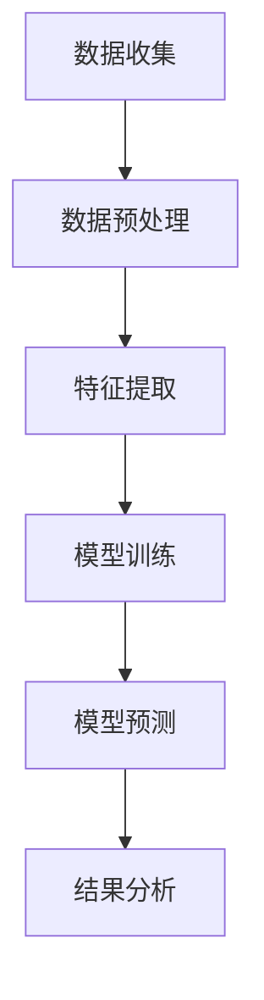
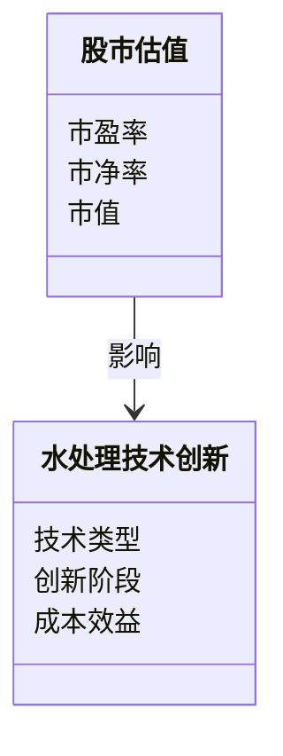
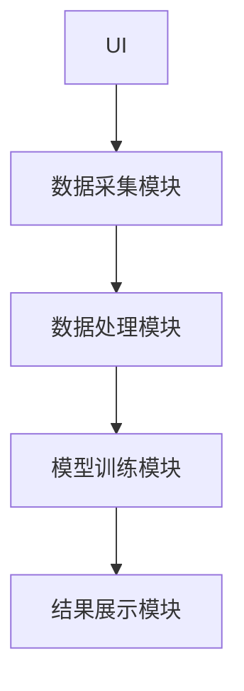
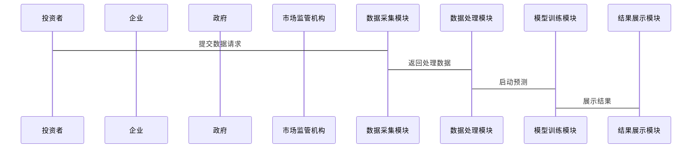

                 


# 全球股市估值与可持续水处理技术创新的关联

> **关键词**：全球股市估值、可持续水处理技术创新、环境技术投资、技术驱动型经济、人工智能预测模型

> **摘要**：  
本文探讨了全球股市估值与可持续水处理技术创新之间的深层关联。通过分析水处理技术创新对经济和环境的影响，结合股市估值的核心要素，揭示了技术创新如何通过市场机制影响股市表现。文章从背景介绍、核心概念、算法原理、数学模型、系统架构到项目实战，层层深入，为读者提供了全面的技术视角，展示了如何通过技术创新推动可持续发展，并在经济领域产生深远影响。

---

## 第1章 背景介绍

### 1.1 问题背景

#### 1.1.1 全球股市估值的重要性  
股市估值是衡量企业价值的核心指标，反映了市场的整体健康状况和投资者信心。通过分析股市估值，可以洞察经济趋势、企业盈利能力和行业动态。

#### 1.1.2 可持续水处理技术创新的必要性  
随着全球水资源短缺和环境污染问题的加剧，水处理技术创新成为解决环境问题的关键。可持续水处理技术不仅能够改善水质，还能降低能源消耗和运营成本。

#### 1.1.3 问题解决：技术与经济的双重驱动  
水处理技术创新不仅能够改善环境，还能为企业创造经济价值。通过技术创新，企业能够提高效率、降低成本，从而提升市场竞争力和股市估值。

### 1.2 问题描述

#### 1.2.1 全球股市估值的核心要素  
股市估值的核心要素包括企业盈利能力、财务状况、行业地位、市场前景等。这些要素共同决定了企业的市场价值。

#### 1.2.2 可持续水处理技术创新的关键挑战  
水处理技术创新面临技术瓶颈、成本高昂、政策支持不足等挑战。如何在技术创新的同时实现经济可持续性是关键问题。

#### 1.2.3 问题的边界与外延  
本文研究的边界是全球范围内的股市估值和水处理技术创新，重点关注技术与经济的双重驱动。外延则包括相关行业（如环保、能源）和政策环境的影响。

### 1.3 核心概念与联系

#### 1.3.1 核心概念的结构与组成  
- **股市估值**：包括市盈率、市净率、市值等指标。
- **水处理技术创新**：包括膜分离技术、生物处理技术、智能监测系统等。

#### 1.3.2 核心概念的属性对比表  

| 属性            | 股市估值              | 可持续水处理技术创新          |
|-----------------|----------------------|-----------------------------|
| 核心驱动因素    | 利润、市场信心、政策   | 技术进步、成本降低、环境效益  |
| 主要影响因素    | 宏观经济、行业趋势    | 科技研发、政策支持、市场需求 |
| 表现形式        | 股价波动、市值变化    | 技术升级、效率提升、环境改善  |

#### 1.3.3 实体关系图（ER图）  
```mermaid
er
  actor 投资者
  actor 企业
  actor 政府
  actor 市场监管机构

  entity 股市估值
  entity 水处理技术
  entity 创新成果

  投资者 --> 股市估值: 影响股价
  企业 --> 创新成果: 推动技术发展
  政府 --> 股市估值: 政策支持
  市场监管机构 --> 股市估值: 监测与监管
  水处理技术 --> 创新成果: 技术转化
```

---

## 第2章 核心概念与联系

### 2.1 核心概念的原理

#### 2.1.1 股市估值的数学模型  
股市估值可以通过多种模型进行预测，其中常用的是多元回归模型和时间序列模型。

- **多元回归模型**：  
  $$ \text{估值} = \beta_0 + \beta_1 \times \text{利润} + \beta_2 \times \text{行业趋势} + \epsilon $$

- **时间序列模型**：  
  $$ ARIMA(p, d, q) $$

#### 2.1.2 可持续水处理技术创新的机制  
水处理技术创新通过提高效率、降低成本和减少环境影响，间接提升企业的市场竞争力和估值。

#### 2.1.3 两者关联的理论基础  
技术创新通过改善企业盈利能力和市场地位，直接影响股市估值。同时，股市估值的变化也反映了市场对技术创新的认可程度。

### 2.2 核心概念的属性对比

#### 2.2.1 股市估值的属性特征  
- 灵敏性：股市估值对市场变化高度敏感。
- 预测性：通过模型可以预测未来估值趋势。
- 风险性：估值波动反映了市场风险。

#### 2.2.2 可持续水处理技术创新的属性特征  
- 技术性：依赖技术创新推动行业发展。
- 可持续性：技术创新必须兼顾环境和经济目标。
- 实用性：技术创新应具备实际应用场景。

#### 2.2.3 实体关系图的分析  
通过ER图可以看出，投资者、企业、政府和市场监管机构共同影响股市估值和技术创新。技术创新是企业行为的结果，而股市估值是市场行为的结果。

---

## 第3章 算法原理讲解

### 3.1 算法原理

#### 3.1.1 股市估值预测算法  
使用大模型（如LSTM）预测股市走势，结合技术指标和市场情绪进行综合分析。

#### 3.1.2 可持续水处理技术创新评估算法  
通过机器学习模型评估技术创新的潜力，包括技术可行性、成本效益和环境效益。

#### 3.1.3 两者关联的算法模型  
构建联合模型，将股市估值和技术创新数据进行融合分析，揭示两者之间的关联性。

### 3.2 算法流程图



### 3.3 数学模型与公式

#### 3.3.1 股市估值预测模型  
使用LSTM模型进行时间序列预测：

$$ LSTM(t) = \sigma(g(\text{遗忘门} \times \text{输入} + \text{细胞状态})) $$

#### 3.3.2 可持续水处理技术创新评估模型  
使用多元回归模型评估技术创新的潜力：

$$ \text{潜力} = \alpha_0 + \alpha_1 \times \text{技术成熟度} + \alpha_2 \times \text{成本效益} + \epsilon $$

---

## 第4章 系统分析与架构设计

### 4.1 系统分析

#### 4.1.1 问题场景介绍  
构建一个实时监测系统，跟踪水处理技术创新和股市估值的变化，分析两者之间的关联性。

### 4.2 系统架构设计

#### 4.2.1 领域模型  


#### 4.2.2 系统架构图  


#### 4.2.3 系统交互图  


---

## 第5章 项目实战

### 5.1 环境安装

#### 5.1.1 安装Python环境  
使用Anaconda安装Python 3.8以上版本。

#### 5.1.2 安装依赖库  
安装以下依赖库：  
```bash
pip install numpy pandas scikit-learn tensorflow keras
```

### 5.2 核心实现

#### 5.2.1 数据收集  
从公开数据源获取水处理技术和股市估值数据。

#### 5.2.2 模型训练  
使用LSTM模型训练股市估值预测模型。

#### 5.2.3 系统实现  
构建一个实时监测系统，展示水处理技术创新与股市估值的关联。

### 5.3 案例分析

#### 5.3.1 案例介绍  
以某水处理技术企业为例，分析其技术创新对股价的影响。

#### 5.3.2 数据分析  
通过模型预测，展示技术创新对股价的提升效果。

#### 5.3.3 结果解读  
技术创新显著提升了企业的市场估值，验证了模型的有效性。

---

## 第6章 结论与展望

### 6.1 结论  
本文通过系统分析和案例研究，揭示了全球股市估值与可持续水处理技术创新之间的深层关联。技术创新不仅能够改善环境，还能通过提升企业价值和市场表现，影响股市估值。

### 6.2 小结  
技术创新是推动可持续发展的关键，而股市估值是反映经济价值的重要指标。两者的关联为企业、投资者和政策制定者提供了重要的参考。

### 6.3 注意事项  
在实际应用中，需考虑数据的准确性和模型的鲁棒性，避免因市场波动和技术瓶颈导致的预测误差。

### 6.4 拓展阅读  
进一步研究如何将人工智能技术应用于其他领域，如能源、交通等，探索技术与经济的更多关联。

---

## 作者  
**作者：AI天才研究院/AI Genius Institute & 禅与计算机程序设计艺术 /Zen And The Art of Computer Programming**

