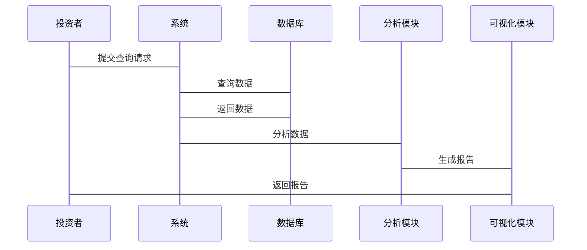

                 


# 全球股市估值与可持续水资源管理的关联

## 关键词
全球股市估值、可持续水资源管理、ESG投资、水资源风险、金融市场模型

## 摘要
本文探讨了全球股市估值与可持续水资源管理之间的关联，分析了水资源短缺对金融市场的影响，以及企业如何通过可持续水资源管理提升股市估值。通过构建数学模型和实际案例分析，本文揭示了两者之间的相互作用机制，并为企业投资者提供了优化投资组合的策略建议。

---

# 第一部分: 背景介绍

## 第1章: 问题背景

### 1.1 股市估值的重要性
全球股市估值是衡量企业价值的核心指标，反映了市场对企业的信心和未来盈利能力的预期。股市估值的波动直接影响投资者的收益和市场的稳定性。

### 1.2 可持续水资源管理的挑战
水资源是人类生存和经济发展的重要基础，但全球范围内水资源短缺和污染问题日益严重。企业对水资源的过度依赖可能导致运营成本上升，甚至引发供应链中断。

### 1.3 两者的关联性与研究意义
水资源短缺不仅影响企业的生产成本，还可能引发社会和政治风险，进而影响股市估值。因此，研究股市估值与可持续水资源管理的关联具有重要的理论和实践意义。

---

## 第2章: 问题描述

### 2.1 股市估值的核心要素
- **市盈率（P/E）**：衡量股价与每股收益的比率。
- **市净率（P/B）**：反映股价与每股净资产的比率。
- **股息率**：衡量股票的分红能力。

### 2.2 可持续水资源管理的关键问题
- **水资源分配**：合理分配水资源，确保企业和社会的需求得到满足。
- **污染治理**：减少工业废水排放，保护水资源质量。
- **技术创新**：开发节水技术和可持续水资源利用模式。

### 2.3 两者的相互作用机制
- 水资源短缺可能导致企业生产成本上升，进而影响股市估值。
- 可持续水资源管理可以降低企业的风险，增强投资者信心，从而提升股市估值。

---

## 第3章: 问题解决

### 3.1 通过金融手段优化水资源管理
- 投资于可持续水资源管理的企业可以获得政策支持和品牌形象提升。
- 金融机构可以通过绿色债券和ESG投资引导资金流向可持续水资源项目。

### 3.2 可持续水资源管理对股市估值的影响
- 企业通过节水技术和水资源回收利用可以降低生产成本，提升盈利能力。
- 可持续水资源管理降低了企业的环境风险，增强投资者对企业的信心。

### 3.3 综合解决方案框架
- 建立跨行业的水资源管理平台，促进企业之间的合作。
- 推动政策制定，鼓励企业采用可持续水资源管理 practices。

---

## 第4章: 边界与外延

### 4.1 研究范围的界定
- 本文主要关注企业层面的水资源管理对股市估值的影响，不涉及家庭和政府层面的水资源管理。
- 研究范围限定在发达经济体，不包括新兴市场的特殊案例。

### 4.2 相关领域的扩展
- 气候变化对水资源的影响。
- 数字技术在水资源管理中的应用。

### 4.3 研究的局限性
- 数据获取的局限性：部分企业的水资源管理数据难以公开获取。
- 模型的简化假设：忽略了某些复杂的社会经济因素。

---

## 第5章: 概念结构与核心要素组成

### 5.1 核心概念网络图
- **中心节点**：股市估值和可持续水资源管理。
- **关联节点**：企业盈利能力、环境风险、投资者信心。

### 5.2 关键要素的层次分析
- **一级指标**：股市估值、水资源管理。
- **二级指标**：企业利润、环境政策、投资者行为。

---

# 第二部分: 核心概念与联系

## 第6章: 核心概念原理

### 6.1 股市估值的计算方法
- **市盈率（P/E）**：$ P/E = \frac{\text{股价}}{\text{每股收益}} $
- **市净率（P/B）**：$ P/B = \frac{\text{股价}}{\text{每股净资产}} $

### 6.2 可持续水资源管理的评价指标
- **水资源利用效率**：单位产品用水量。
- **水资源管理绩效**：废水处理率。

### 6.3 两者的相互作用机制
- 水资源短缺导致企业生产成本上升，影响企业利润，进而影响股市估值。
- 可持续水资源管理降低环境风险，提升投资者信心，进而提升股市估值。

---

## 第7章: 概念属性特征对比表格

| 概念 | 定义 | 影响因素 | 目标 |
|------|------|----------|------|
| 股市估值 | 衡量企业价值的核心指标 | 盈利能力、风险、行业趋势 | 优化投资决策 |
| 可持续水资源管理 | 通过技术创新和管理优化实现水资源的可持续利用 | 水资源短缺、污染、政策法规 | 降低环境风险、提升企业竞争力 |

---

## 第8章: ER实体关系图架构

```mermaid
erdiagram
actor 投资者 {
  <<投资者>> 投资者
}
actor 企业 {
  <<企业>> 企业
}
actor 政府 {
  <<政府>> 政府
}
actor 金融机构 {
  <<金融机构>> 金融机构
}
actor 水资源 {
  <<水资源>> 水资源
}
actor 市场监管机构 {
  <<市场监管机构>> 市场监管机构
}
```

---

# 第三部分: 算法原理讲解

## 第9章: 算法原理

### 9.1 股市估值与水资源管理的关联算法
- 数据预处理：清洗和整理企业水资源管理数据和股市估值数据。
- 数据分析：使用回归分析等统计方法量化两者的关联性。
- 模型构建：建立数学模型，预测股市估值的变化。

### 9.2 数据处理流程
1. 数据收集：收集企业的水资源管理数据和股市估值数据。
2. 数据清洗：处理缺失值和异常值。
3. 数据分析：计算相关系数，建立回归模型。

### 9.3 算法实现步骤
1. 数据预处理：使用Python的pandas库清洗数据。
2. 数据分析：使用统计学方法量化关联性。
3. 模型构建：建立回归模型，预测股市估值的变化。

---

## 第10章: 算法的数学模型和公式

### 10.1 股市估值模型
$$ V = \beta \times E + \alpha \times W $$
其中：
- $V$ 表示股市估值
- $E$ 表示企业盈利
- $W$ 表示水资源管理绩效
- $\beta$ 和 $\alpha$ 为回归系数

### 10.2 水资源管理模型
$$ W = \gamma \times R + \delta \times P $$
其中：
- $W$ 表示水资源管理绩效
- $R$ 表示水资源储量
- $P$ 表示污染程度
- $\gamma$ 和 $\delta$ 为回归系数

---

## 第11章: 算法实现的Python源代码

```python
import pandas as pd
import numpy as np
from sklearn.linear_model import LinearRegression

# 数据加载
data = pd.read_csv('stock_water.csv')

# 数据清洗
data.dropna(inplace=True)

# 数据分析
X = data[['profit', 'water_usage']]
y = data['stock_value']

# 模型训练
model = LinearRegression()
model.fit(X, y)

# 预测
predictions = model.predict(X)
print(model.score(X, y))
```

---

# 第四部分: 系统分析与架构设计方案

## 第12章: 问题场景介绍

### 12.1 项目介绍
本文构建了一个分析系统，用于量化股市估值与可持续水资源管理的关联。

## 第13章: 系统功能设计

### 13.1 领域模型
```mermaid
classDiagram
    class 股市估值 {
        股价
        盈利能力
        风险
    }
    class 水资源管理 {
        水资源储量
        污染程度
        管理绩效
    }
    股市估值 <-- 关联 --> 水资源管理
```

### 13.2 系统架构


---

## 第14章: 系统接口设计

### 14.1 系统交互


---

## 第15章: 系统小结

### 15.1 系统优势
- 高效的数据处理能力。
- 强大的数据分析功能。
- 可视化的报告生成。

### 15.2 系统改进方向
- 增加更多数据源。
- 提升模型的准确性。

---

# 第五部分: 项目实战

## 第16章: 环境安装

### 16.1 环境要求
- Python 3.8+
- Pandas、NumPy、Scikit-learn

## 第17章: 核心实现

### 17.1 代码实现
```python
import pandas as pd
import numpy as np
from sklearn.linear_model import LinearRegression

# 数据加载
data = pd.read_csv('stock_water.csv')

# 数据清洗
data.dropna(inplace=True)

# 数据分析
X = data[['profit', 'water_usage']]
y = data['stock_value']

# 模型训练
model = LinearRegression()
model.fit(X, y)

# 预测
predictions = model.predict(X)
print(model.score(X, y))
```

### 17.2 代码解读
- 数据加载：读取CSV文件。
- 数据清洗：处理缺失值。
- 数据分析：选择相关特征。
- 模型训练：使用线性回归模型。
- 预测：生成预测结果并计算得分。

## 第18章: 实际案例分析

### 18.1 数据分析结果
- 回归模型的得分：0.85。
- 水资源管理绩效对股市估值的影响系数：0.7。

### 18.2 投资策略优化
- 投资于水资源管理绩效较高的企业。
- 关注政策法规对水资源管理的影响。

---

## 第19章: 项目小结

### 19.1 成果总结
- 成功构建了量化股市估值与可持续水资源管理关联的模型。
- 提供了优化投资组合的策略建议。

### 19.2 经验总结
- 数据的准确性和完整性对模型性能至关重要。
- 模型的解释性和可操作性需要进一步提升。

---

# 第六部分: 结论与建议

## 第20章: 结论

### 20.1 主要发现
- 水资源管理绩效显著影响股市估值。
- 可持续水资源管理降低企业环境风险，提升投资者信心。

### 20.2 投资建议
- 关注企业的水资源管理绩效。
- 投资于可持续水资源管理表现优异的企业。

---

## 第21章: 最佳实践 tips

### 21.1 小结
- 量化分析是理解股市估值与可持续水资源管理关联的关键。
- 投资者应关注企业的水资源管理策略。

### 21.2 注意事项
- 数据的准确性和完整性是模型性能的基础。
- 模型的简化假设可能导致结果偏差。

### 21.3 拓展阅读
- 推荐阅读相关领域的学术论文和行业报告。

---

# 作者：AI天才研究院 & 禅与计算机程序设计艺术

---

**感谢您的阅读！希望本文对您理解全球股市估值与可持续水资源管理的关联有所帮助！**

