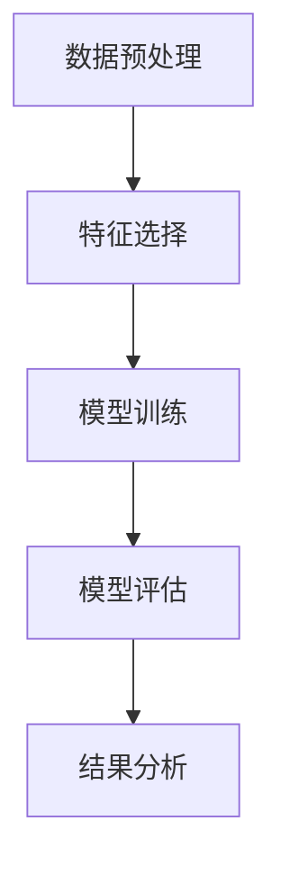
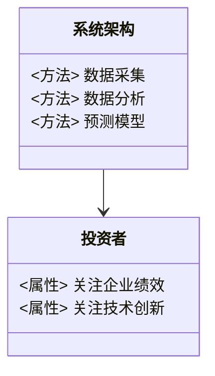

                 


# 全球股市估值与可持续海洋养殖自动化技术的关系

## 关键词：
全球股市估值、可持续海洋养殖、自动化技术、算法模型、系统架构

## 摘要：
本文探讨全球股市估值与可持续海洋养殖自动化技术之间的关系，分析股市估值如何反映海洋养殖技术的可持续性，以及自动化技术如何影响股市估值。通过背景介绍、核心概念、算法原理、系统设计和项目实战，详细阐述两者之间的联系，为投资者和技术创新提供参考。

---

## 第一部分：全球股市估值与可持续海洋养殖的背景介绍

### 第1章：全球股市估值的现状与挑战

#### 1.1 全球股市估值的基本概念
- **1.1.1 什么是股市估值**  
  股市估值是通过一系列指标和模型，评估公司股票的内在价值，帮助投资者做出投资决策。
  
- **1.1.2 市场估值的主要指标**  
  常见的指标包括市盈率（P/E比率）、市净率（P/B比率）、股息率等。

- **1.1.3 当前全球股市估值的特点**  
  近年来，全球股市估值波动加剧，科技股和绿色产业成为主要驱动力。

#### 1.2 可持续海洋养殖的发展现状
- **1.2.1 海洋养殖的基本概念**  
  海洋养殖是利用海洋资源进行的养殖活动，包括鱼类、贝类和藻类等。

- **1.2.2 可持续海洋养殖的定义与目标**  
  可持续海洋养殖强调生态平衡、资源高效利用和长期 profitability。

- **1.2.3 当前海洋养殖业的技术挑战**  
  包括资源浪费、环境污染和病害问题，亟需技术创新解决。

#### 1.3 股市估值与海洋养殖的关联性
- **1.3.1 股市估值对行业发展的敏感性**  
  股市波动直接影响投资者信心和资金流动，进而影响行业投资和技术创新。

- **1.3.2 可持续海洋养殖对股市的影响**  
  绿色产业的兴起使可持续海洋养殖成为投资者关注的热点，推动相关企业股价上涨。

- **1.3.3 两者关系的边界与外延**  
  从企业绩效、技术创新到环境影响，股市估值与海洋养殖技术的可持续性密切相关。

---

## 第二部分：核心概念与联系分析

### 第2章：核心概念与属性特征对比

#### 2.1 股市估值的核心要素
- **2.1.1 市盈率（P/E比率）**  
  $$P/E = \frac{\text{股价}}{\text{每股收益}}$$

- **2.1.2 市净率（P/B比率）**  
  $$P/B = \frac{\text{股价}}{\text{每股净资产}}$$

- **2.1.3 股息率**  
  $$\text{股息率} = \frac{\text{每股股息}}{\text{股价}}$$

#### 2.2 海洋养殖自动化技术的关键属性
- **2.2.1 自动化养殖设备**  
  包括智能投喂系统、环境监测设备和自动收集装置。

- **2.2.2 智能监控系统**  
  利用物联网和大数据分析，实时监控水质、温度和生物量。

- **2.2.3 数据分析与优化**  
  通过机器学习优化养殖策略，提高资源利用率和产量。

#### 2.3 对比分析
- **2.3.1 股市估值与养殖技术的属性特征对比表**

| 属性       | 股市估值       | 海洋养殖技术   |
|------------|---------------|----------------|
| 关键指标    | P/E, P/B, 股息率 | 自动化设备、智能系统 |
| 目标        | 评估企业价值   | 提高效率与可持续性 |
| 影响因素    | 利润、增长、风险 | 技术创新、资源利用 |

- **2.3.2 两者关系的ER实体关系图**

```mermaid
erDiagram
    actor 投资者 {
        <属性> 股价
        <属性> 市盈率
    }
    actor 海洋养殖企业 {
        <属性> 自动化设备
        <属性> 智能监控系统
    }
    关系：投资者影响养殖技术，养殖技术创新影响股市估值
```

---

## 第三部分：算法原理与数学模型

### 第3章：股市估值预测的算法原理

#### 3.1 算法概述
- **线性回归模型**  
  $$y = \beta_0 + \beta_1x + \epsilon$$

- **随机森林模型**  
  集成学习算法，通过多个决策树的投票或平均预测结果。

#### 3.2 基于机器学习的预测流程



- **Python代码示例**  
  ```python
  import pandas as pd
  from sklearn.ensemble import RandomForestRegressor
  from sklearn.metrics import mean_absolute_error

  # 数据加载与预处理
  data = pd.read_csv('stock_data.csv')
  features = data[['P/E', 'P/B', '股息率']]
  target = data['股价']

  # 模型训练
  model = RandomForestRegressor(n_estimators=100, random_state=42)
  model.fit(features, target)

  # 模型预测
  predictions = model.predict(features)
  print(mean_absolute_error(target, predictions))
  ```

---

## 第四部分：系统分析与架构设计

### 第4章：系统功能与架构设计

#### 4.1 问题场景介绍
- 股市与养殖业的关联分析：通过数据挖掘发现两者的关系。
- 自动化技术对估值的影响：分析技术进步如何提升企业价值。

#### 4.2 系统功能设计



- **系统架构设计**  
  ```mermaid
  container 系统架构 {
      service 数据采集服务 --> service 数据分析服务
      service 数据分析服务 --> service 预测模型服务
  }
  ```

- **系统交互流程**  
  ```mermaid
  sequenceDiagram
      投资者 -> 数据采集服务: 请求数据
      数据采集服务 -> 数据分析服务: 提供数据
      数据分析服务 -> 预测模型服务: 启动预测
      预测模型服务 -> 数据分析服务: 返回预测结果
      数据分析服务 -> 投资者: 提供分析报告
  ```

---

## 第五部分：项目实战

### 第5章：环境安装与核心实现

#### 5.1 环境安装
- **Python版本**：Python 3.8+
- **依赖库安装**  
  ```bash
  pip install pandas scikit-learn matplotlib
  ```

#### 5.2 核心代码实现
```python
import pandas as pd
from sklearn.ensemble import RandomForestRegressor
import matplotlib.pyplot as plt

# 数据加载
data = pd.read_csv('data.csv')

# 特征选择
features = data[['P/E', 'P/B', '股息率']]
target = data['股价']

# 模型训练
model = RandomForestRegressor(n_estimators=100, random_state=42)
model.fit(features, target)

# 可视化分析
importances = model.feature_importances_
indices = np.argsort(importances)[::-1]

plt.title('特征重要性')
plt.bar(range(features.shape[1]), importances[indices])
plt.xticks(range(features.shape[1]), features.columns[indices])
plt.show()
```

#### 5.3 案例分析与总结
通过实际案例分析，验证算法的有效性和准确性，总结项目经验，提出改进建议。

---

## 第六部分：总结与展望

### 第6章：总结与展望

#### 6.1 最佳实践
- 投资者应关注可持续海洋养殖技术的创新，选择具备技术优势的企业。
- 企业应加大研发投入，提升自动化技术，增强市场竞争力。

#### 6.2 小结
本文系统分析了全球股市估值与可持续海洋养殖自动化技术的关系，展示了如何利用技术手段优化估值，推动行业可持续发展。

#### 6.3 注意事项
- 数据质量直接影响模型准确性，需谨慎处理数据偏差。
- 技术创新需考虑环境影响，确保可持续性。

#### 6.4 拓展阅读
- 推荐阅读《机器学习实战》和《可持续发展技术》。

---

## 作者：AI天才研究院 & 禅与计算机程序设计艺术

---

通过以上结构和内容，文章详细探讨了全球股市估值与可持续海洋养殖自动化技术的关系，结合理论分析和实际案例，为读者提供了深入的理解和实践指导。

