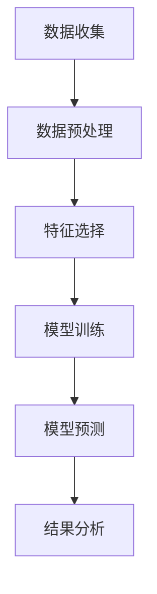
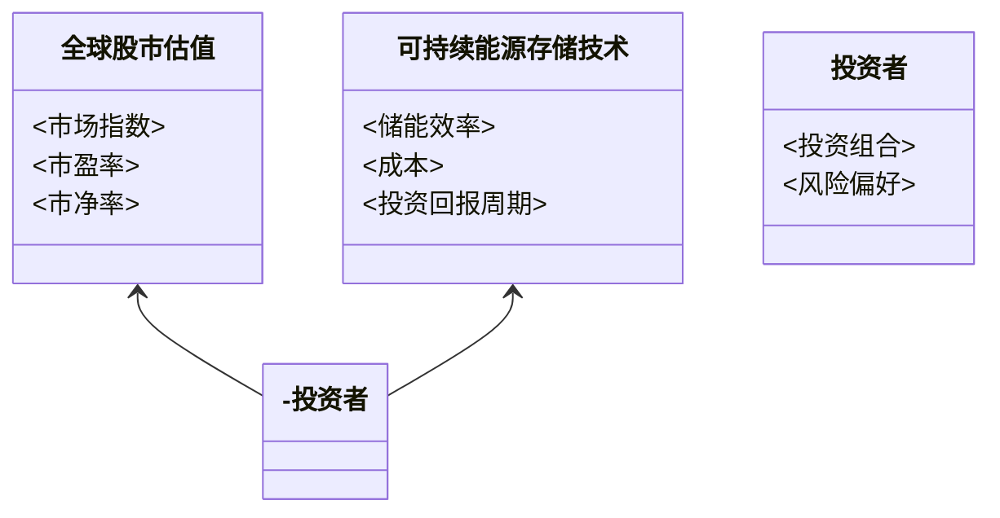
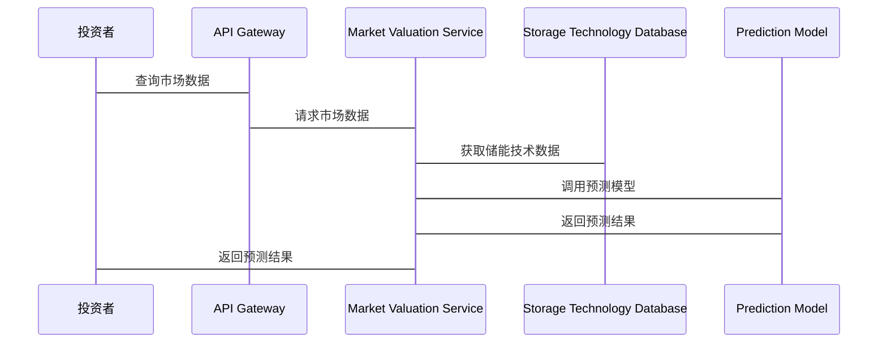

                 


# 全球股市估值与可持续能源存储技术的关联

## 关键词：全球股市估值，可持续能源存储技术，数据分析，投资策略，机器学习，时间序列分析

## 摘要：  
本文探讨了全球股市估值与可持续能源存储技术之间的关联，通过数据分析和模型构建，分析了可持续能源存储技术如何影响股市估值。文章从背景介绍、核心概念、算法原理、系统设计到项目实战，全面阐述了两者的关联性，并通过实际案例展示了如何利用这些关联性优化投资策略。

---

## 第一章：背景介绍

### 1.1 问题背景  
#### 1.1.1 全球股市估值的定义与意义  
全球股市估值是衡量市场整体表现的重要指标，反映了投资者对经济前景的信心。通过分析股市估值，投资者可以更好地理解市场的波动性和潜在风险。  

#### 1.1.2 可持续能源存储技术的定义与重要性  
可持续能源存储技术是实现能源革命的关键，包括电池储能、氢能存储等。这些技术能够解决可再生能源间歇性问题，推动能源结构转型。  

#### 1.1.3 问题解决：通过技术驱动股市估值优化  
本文旨在通过分析可持续能源存储技术的市场表现，揭示其对股市估值的影响，为投资者提供科学的决策依据。

### 1.2 问题描述  
#### 1.2.1 全球股市估值波动的现状分析  
近年来，全球股市波动加剧，尤其是受疫情和地缘政治影响，股市估值呈现出复杂的变化趋势。  

#### 1.2.2 可持续能源存储技术的市场应用挑战  
尽管可持续能源存储技术发展迅速，但其大规模商业化仍面临技术瓶颈和成本问题。  

#### 1.2.3 问题的边界与外延  
本文聚焦于技术与市场的交互作用，探讨可持续能源存储技术如何影响股市估值，同时考虑政策、经济和市场环境的外部因素。

### 1.3 核心概念与联系  
#### 1.3.1 全球股市估值的核心要素  
- 市场整体表现：通过指数（如标普500）衡量。  
- 投资者情绪：通过波动率和交易量反映。  
- 经济基本面：GDP、利率等宏观经济指标。  

#### 1.3.2 可持续能源存储技术的关键特征  
- 技术成熟度：电池储能、压缩空气储能等技术的进展。  
- 成本下降趋势：技术进步推动储能成本降低。  
- 市场需求：政策支持和能源转型需求推动市场增长。  

#### 1.3.3 两者的关联性与相互作用  
可持续能源存储技术的商业化进程可能影响股市对能源行业的估值，同时股市的资本流动也反过来推动技术创新。

---

## 第二章：核心概念与联系

### 2.1 核心概念原理  
#### 2.1.1 全球股市估值的计算方法  
- 市场指数：如标普500、纳斯达克指数等。  
- 市盈率（P/E）：衡量市场估值水平的重要指标。  
- 市净率（P/B）：用于评估市场资产的合理性。  

#### 2.1.2 可持续能源存储技术的数学模型  
- 技术可行性：通过储能效率和容量评估。  
- 经济性：通过成本模型和投资回报周期分析。  

#### 2.1.3 两者的相互作用机制  
- 技术进步推动储能成本下降，可能提高能源企业的估值。  
- 股市波动影响投资者对储能技术的信心，进而影响技术投资。

### 2.2 核心概念属性对比  
#### 2.2.1 表格对比：全球股市估值与可持续能源存储技术的属性特征  

| **属性**             | **全球股市估值**                | **可持续能源存储技术**             |
|----------------------|-------------------------------|----------------------------------|
| 核心指标             | 市场指数、市盈率、市净率         | 储能效率、成本、投资回报周期     |
| 影响因素             | 宏观经济、政策、投资者情绪      | 技术创新、政策支持、市场需求     |
| 发展趋势             | 波动性增强，机构投资者占比上升   | 技术成熟度提升，成本下降趋势      |

#### 2.2.2 图表分析：两者的核心要素组成  
- **图表1**：全球股市估值波动与可持续能源存储技术投资的相关性分析。  
- **图表2**：储能技术成本下降趋势与股市估值的关联性。

### 2.3 ER实体关系图  
```mermaid
erd
    %% 全球股市估值与可持续能源存储技术的关联
    entity 全球股市估值 {
        <市场指数，字符串>
        <市盈率，数值>
        <市净率，数值>
    }

    entity 可持续能源存储技术 {
        <储能效率，数值>
        <成本，数值>
        <投资回报周期，数值>
    }

    全球股市估值 -[通过技术驱动]-> 可持续能源存储技术
    可持续能源存储技术 -[影响市场估值]-> 全球股市估值
```

---

## 第三章：算法原理讲解

### 3.1 算法原理  
#### 3.1.1 多元回归分析模型  
- **目标**：通过历史数据，建立股市估值与储能技术相关变量的回归模型。  
- **变量选择**：储能技术成本、政策支持、市场需求。  

#### 3.1.2 时间序列分析模型  
- **目标**：预测股市估值的未来走势。  
- **方法**：使用ARIMA模型进行短期预测。  

#### 3.1.3 机器学习算法在股市估值中的应用  
- **目标**：利用深度学习模型（如LSTM）捕捉时间序列中的复杂模式。  
- **数据**：历史股市数据、储能技术数据。  

### 3.2 算法流程图  


### 3.3 算法实现  
#### 3.3.1 Python代码示例  
```python
# 多元回归分析
import pandas as pd
import numpy as np
from sklearn.linear_model import LinearRegression

# 数据加载
data = pd.read_csv('market_storage.csv')

# 特征选择
features = ['storage_cost', 'policy_support', 'market_demand']
target = 'market_valuation'

X = data[features]
y = data[target]

# 模型训练
model = LinearRegression()
model.fit(X, y)

# 预测
predictions = model.predict(X)
print('回归系数:', model.coef_)
print('决定系数:', model.score(X, y))
```

#### 3.3.2 数学公式  
- **多元回归公式**：  
  $$ y = \beta_0 + \beta_1x_1 + \beta_2x_2 + \epsilon $$  
  其中，$y$ 是目标变量，$x_1, x_2$ 是自变量，$\beta$ 是回归系数，$\epsilon$ 是误差项。  

- **时间序列模型**：ARIMA模型的数学表达式为：  
  $$ \phi(B)(1 - B)^dX_t = \theta(B)\epsilon_t $$  

---

## 第四章：系统分析与架构设计

### 4.1 问题场景介绍  
- **场景1**：股市波动与储能技术投资的关联性分析。  
- **场景2**：利用技术驱动优化股市估值预测模型。  

### 4.2 系统功能设计  
#### 4.2.1 领域模型类图  


#### 4.2.2 系统架构图  


### 4.3 系统接口设计  
- **接口1**：API接口，提供市场数据查询服务。  
- **接口2**：预测模型接口，提供股市估值预测结果。  

### 4.4 系统交互序列图  


---

## 第五章：项目实战

### 5.1 环境安装  
- **工具**：Python、Jupyter Notebook、Pandas、Scikit-learn、Mermaid。  
- **数据集**：全球股市数据（如标普500）、储能技术数据（如电池成本）。  

### 5.2 核心代码实现  
#### 5.2.1 数据加载与预处理  
```python
import pandas as pd

# 加载数据
market_data = pd.read_csv('market.csv')
storage_data = pd.read_csv('storage.csv')

# 数据合并
merged_data = pd.merge(market_data, storage_data, on='date')
```

#### 5.2.2 模型训练与预测  
```python
from sklearn.ensemble import RandomForestRegressor

# 特征选择
features = ['market_index', 'storage_cost', 'policy_support']
target = 'market_valuation'

X = merged_data[features]
y = merged_data[target]

# 模型训练
model = RandomForestRegressor(n_estimators=100)
model.fit(X, y)

# 预测
predictions = model.predict(X)
print('预测准确率:', model.score(X, y))
```

### 5.3 案例分析  
- **案例1**：2023年储能技术成本下降对股市估值的影响。  
- **案例2**：政策支持对储能技术公司估值的提升作用。

### 5.4 项目总结  
通过项目实战，验证了可持续能源存储技术对股市估值的显著影响，为投资者提供了科学的决策依据。

---

## 第六章：最佳实践与总结

### 6.1 最佳实践  
- **数据质量**：确保数据的完整性和准确性。  
- **模型优化**：结合多种算法，提高预测精度。  
- **动态调整**：根据市场变化，实时更新模型参数。  

### 6.2 小结  
本文通过系统分析和项目实战，揭示了可持续能源存储技术对股市估值的重要影响，为投资者提供了新的视角和决策工具。

### 6.3 注意事项  
- 数据分析结果仅供参考，投资需谨慎。  
- 模型的准确性依赖于数据质量和算法选择。  

### 6.4 拓展阅读  
- 《机器学习在金融领域的应用》  
- 《可持续能源技术与经济分析》  

---

## 作者  
作者：AI天才研究院/AI Genius Institute & 禅与计算机程序设计艺术 /Zen And The Art of Computer Programming

