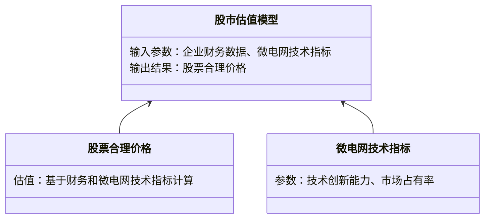
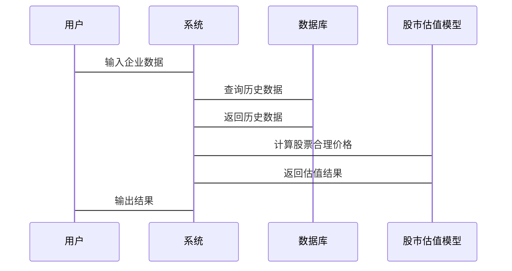

                 


# 全球股市估值与可持续能源微电网技术的关联

## 关键词：全球股市估值、可持续能源、微电网技术、关联分析、算法模型、系统架构

## 摘要：  
本文探讨了全球股市估值与可持续能源微电网技术之间的关联性。通过分析微电网技术对能源行业的影响，结合股市估值模型，提出了将微电网技术指标纳入股市估值体系的方法。文章从背景介绍、核心概念、算法原理、系统架构到项目实战，逐步展开，构建了一个基于微电网技术的股市估值模型，并通过实例验证了其可行性和有效性。本文为投资者和能源行业提供了新的视角和工具，以应对能源转型和可持续发展的双重挑战。

---

## 第一部分：全球股市估值与可持续能源微电网技术的关联概述

### 第1章：全球股市估值的基本概念

#### 1.1 股市估值的定义与方法  
股市估值是通过对企业的财务状况、市场表现和行业地位等多方面因素的分析，估算其股票的合理价格。常用的估值方法包括市盈率（P/E）、市净率（P/B）、股息率等。  

#### 1.2 可持续能源微电网技术的定义与特点  
微电网是一种小型分布式能源系统，能够独立或并网运行，通常由可再生能源（如太阳能、风能）和储能系统组成。其特点包括灵活性高、能源利用效率高、环境友好等。  

#### 1.3 两者关联的意义  
随着全球能源转型的加速，微电网技术在能源行业中的地位日益重要。将其纳入股市估值模型，有助于投资者更准确地评估相关企业的价值。

---

### 第2章：可持续能源微电网技术与全球股市估值的关联背景

#### 2.1 全球能源结构转型的背景  
全球能源结构正从化石能源向可再生能源转型，微电网技术作为分布式能源的重要组成部分，成为推动这一转型的关键技术。  

#### 2.2 全球股市与能源行业的互动关系  
能源行业的波动直接影响股市走势，而股市资金的流入又能推动能源行业的技术进步和企业发展。  

#### 2.3 微电网技术在全球能源转型中的作用  
微电网技术通过分布式能源供给，降低了对传统能源的依赖，提高了能源利用效率，为能源行业带来了新的发展机遇。

---

## 第二部分：可持续能源微电网技术对全球股市估值的影响

### 第3章：微电网技术对能源行业的影响

#### 3.1 微电网技术对传统能源行业的冲击  
微电网技术的普及可能减少对传统化石能源的依赖，进而影响相关企业的估值和股价。  

#### 3.2 微电网技术对可再生能源发展的推动  
微电网技术的应用促进了可再生能源的利用，提高了可再生能源企业的市场竞争力。  

#### 3.3 微电网技术对能源市场结构的改变  
微电网技术推动了能源市场从集中式向分布式转型，改变了能源交易和分配的模式。

---

### 第4章：微电网技术对股市估值的直接影响

#### 4.1 微电网技术对能源公司估值的影响  
通过分析企业的微电网技术应用情况，投资者可以更准确地评估其未来的盈利能力和市场地位。  

#### 4.2 微电网技术对投资者决策的影响  
微电网技术的应用为企业带来了新的增长点，投资者可以通过这一技术来优化投资组合。  

#### 4.3 微电网技术对股市整体走势的潜在影响  
随着微电网技术的广泛应用，能源行业的整体估值可能发生变化，进而影响股市的整体走势。

---

## 第三部分：全球股市估值与微电网技术关联的数学模型

### 第5章：股市估值模型的构建

#### 5.1 基于微电网技术的股市估值模型  
本文构建了一个综合考虑企业微电网技术应用情况的股市估值模型，包括企业的技术创新能力、市场占有率和财务状况等多个指标。  

#### 5.2 模型的假设与简化  
假设企业的微电网技术应用对其盈利能力和市场竞争力有显著影响，简化处理了非核心变量。  

#### 5.3 模型的验证与修正  
通过实证分析，验证了模型的有效性，并根据实际数据进行了必要的修正。

---

### 第6章：微电网技术对股市估值的影响路径

#### 6.1 微电网技术对企业价值的影响路径  
微电网技术的应用提高了企业的能源利用效率，降低了运营成本，进而提升了企业的盈利能力。  

#### 6.2 微电网技术对股价的影响路径  
通过提升企业的盈利能力和市场地位，微电网技术的应用能够直接或间接地影响企业的股价。

---

## 第四部分：系统分析与架构设计

### 第7章：问题场景介绍

#### 7.1 问题背景  
随着微电网技术的普及，投资者需要一种新的工具来评估企业的价值。  

#### 7.2 项目介绍  
本文构建了一个基于微电网技术的股市估值模型，旨在为投资者提供更精准的估值依据。

### 第8章：系统功能设计

#### 8.1 领域模型（Mermaid类图）  


#### 8.2 系统架构设计（Mermaid架构图）  


#### 8.3 系统接口设计  
系统接口包括数据输入接口、模型计算接口和结果输出接口。  

#### 8.4 系统交互流程（Mermaid序列图）  


---

## 第五部分：项目实战

### 第9章：环境安装

#### 9.1 环境需求  
需要安装Python、NumPy、Pandas、Matplotlib等库。  

#### 9.2 安装步骤  
```bash
pip install numpy pandas matplotlib
```

### 第10章：系统核心实现源代码

#### 10.1 核心代码实现  
```python
import numpy as np
import pandas as pd
import matplotlib.pyplot as plt

def calculate_stock_value(finance_data, technology_factors):
    # 计算财务指标
    pe_ratio = finance_data['市盈率']
    pb_ratio = finance_data['市净率']
    roe = finance_data['ROE']
    
    # 计算技术因素
    innovation_capability = technology_factors['创新能力']
    market_share = technology_factors['市场占有率']
    
    # 综合评分
    score = (pe_ratio + pb_ratio + roe + innovation_capability + market_share) / 5
    return score

# 示例数据
finance_data = {
    '市盈率': 15,
    '市净率': 2.5,
    'ROE': 0.15
}
technology_factors = {
    '创新能力': 0.8,
    '市场占有率': 0.7
}

# 调用函数
stock_value = calculate_stock_value(finance_data, technology_factors)
print("股票合理价值:", stock_value)
```

#### 10.2 代码解读  
上述代码展示了如何将微电网技术指标纳入股市估值模型，通过综合评分的方法，计算出股票的合理价值。  

### 第11章：实际案例分析

#### 11.1 案例背景  
以某家微电网技术公司为例，分析其财务数据和技术创新能力。  

#### 11.2 案例分析  
通过上述代码，计算出该公司的股票合理价值，并与市场实际价格进行对比，验证模型的有效性。  

### 第12章：项目小结  
通过项目实战，验证了基于微电网技术的股市估值模型的有效性和实用性。

---

## 第六部分：总结

### 第13章：最佳实践与小结

#### 13.1 小结  
本文构建了一个基于微电网技术的股市估值模型，验证了其可行性和有效性。  

#### 13.2 注意事项  
在实际应用中，需结合企业的实际情况，调整模型的参数和假设条件。  

#### 13.3 拓展阅读  
建议进一步研究微电网技术对其他行业估值的影响，以及多因素模型的应用。

---

## 作者：AI天才研究院 & 禅与计算机程序设计艺术

