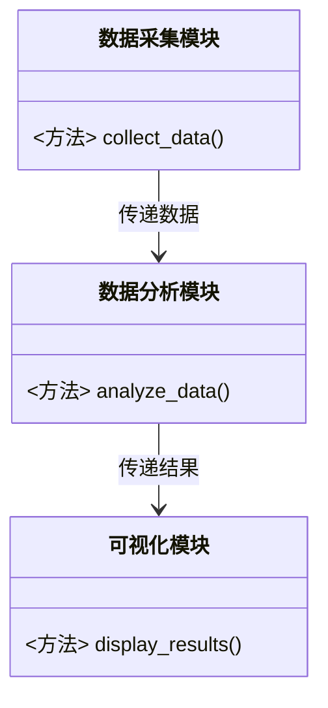
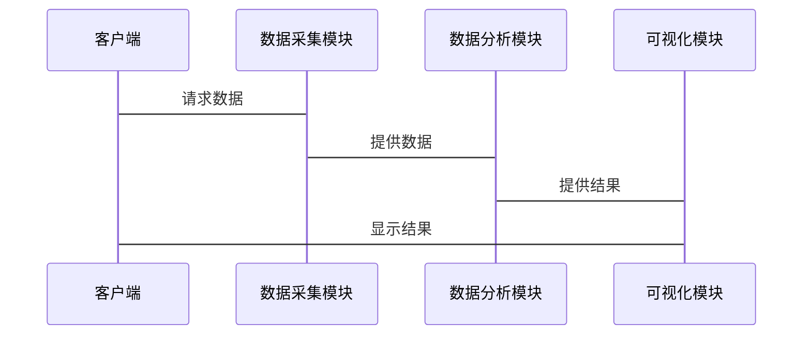

                 


# 全球股市估值与可持续能源智能电网技术的关联

---

## 关键词：
全球股市估值、智能电网技术、可持续能源、数据分析、能源互联网

---

## 摘要：
本文探讨了全球股市估值与可持续能源智能电网技术之间的深层关联。通过分析股市估值的核心指标和智能电网技术的关键特征，结合数据驱动的方法，揭示两者在技术与经济领域的互动关系。文章从背景、概念、算法、系统架构、项目实战等多个维度展开，结合数学模型和实际案例，为理解和优化能源与金融系统的结合提供理论与实践指导。

---

# 第1章 全球股市估值与可持续能源智能电网技术的背景介绍

## 1.1 问题背景
### 1.1.1 全球股市估值的重要性
股市估值是衡量企业价值的核心指标，反映了市场对企业的信任和未来发展的预期。通过分析股价、市盈率、市净率等指标，投资者可以评估企业的投资价值。

### 1.1.2 可持续能源智能电网技术的兴起
随着全球能源需求的增长和环保压力的增加，可持续能源（如太阳能、风能）和智能电网技术成为推动能源转型的关键。智能电网通过实时数据采集、分析和优化，实现了能源的高效分配和管理。

### 1.1.3 两者关联的现实意义
可持续能源的广泛应用和智能电网技术的进步，不仅改变了能源生产与消费模式，也对股市估值产生了深远影响。通过技术驱动的能源效率提升和成本下降，企业价值得以重新评估，进而影响股市的整体表现。

## 1.2 问题描述
### 1.2.1 股市估值的核心要素
- **股价**：反映市场对企业的整体价值判断。
- **市盈率（P/E）**：衡量企业盈利能力的指标。
- **市净率（P/B）**：评估企业资产价值的指标。

### 1.2.2 智能电网技术的关键特征
- **实时数据采集**：通过传感器和物联网技术实现对电力系统的实时监控。
- **数据驱动优化**：利用机器学习算法优化电力分配和能源消耗。
- **可扩展性**：支持分布式能源接入和灵活的能源管理。

### 1.2.3 两者关联的复杂性
- **技术驱动**：智能电网技术推动能源效率提升，影响企业的盈利能力和股市估值。
- **经济影响**：股市估值的变化反映了市场对智能电网技术的接受度和投资信心。
- **政策因素**：政府政策对能源转型的支持力度直接影响股市估值。

## 1.3 问题解决
### 1.3.1 数据驱动的解决方案
通过收集和分析智能电网技术和股市估值的相关数据，构建数学模型，揭示两者之间的动态关系。

### 1.3.2 技术与金融的融合路径
将智能电网技术的应用数据与股市估值指标相结合，建立预测模型，辅助投资者做出更科学的投资决策。

### 1.3.3 可持续发展的目标设定
通过优化能源管理和投资策略，实现能源效率提升和股市估值的同步增长，推动可持续发展。

## 1.4 边界与外延
### 1.4.1 股市估值的边界条件
- 数据范围：仅限于智能电网相关的上市公司。
- 时间范围：短期至中期的股市波动。
- 地域范围：主要关注全球主要股市的表现。

### 1.4.2 智能电网技术的适用范围
- 技术成熟度：限于已商业化应用的技术。
- 行业范围：主要针对能源生产和分配领域。
- 环境影响：限于对能源效率和成本的影响。

### 1.4.3 两者的相互影响与限制
智能电网技术的推广依赖于股市资本支持，而股市估值的变化又受到技术应用效果的直接影响，这种双向互动关系具有复杂性和动态性。

## 1.5 核心要素组成
### 1.5.1 股市估值的关键指标
- 股价：反映市场对企业价值的判断。
- 市盈率：衡量企业盈利能力。
- 市净率：评估企业资产价值。

### 1.5.2 智能电网的核心技术
- 数据采集与监控系统（SCADA）。
- 分布式能源管理。
- 电力需求预测与优化。

### 1.5.3 两者的关联机制
通过智能电网技术的应用，企业实现能源成本降低和效率提升，进而改善财务表现，影响股市估值。

---

# 第2章 股市估值与智能电网技术的核心概念与联系

## 2.1 核心概念原理
### 2.1.1 股市估值的基本原理
股市估值是基于对企业未来盈利能力和资产价值的评估，投资者通过分析各项指标（如市盈率、市净率）来判断企业的投资价值。

### 2.1.2 智能电网技术的核心原理
智能电网通过实时数据采集、分析和优化，实现电力的高效分配和管理，降低能源消耗，提高系统的可靠性和灵活性。

### 2.1.3 两者关联的理论基础
智能电网技术的应用可以显著降低企业的能源成本，提升生产效率，从而改善企业的财务表现，影响股市估值。

## 2.2 核心概念属性对比
### 2.2.1 股市估值的属性特征
| 属性 | 描述 |
|------|------|
| 股价 | 市场对企业价值的即时反映 |
| 市盈率 | 企业盈利能力的衡量指标 |
| 市净率 | 企业资产价值的评估指标 |

### 2.2.2 智能电网技术的属性特征
| 属性 | 描述 |
|------|------|
| 数据采集 | 实时采集电力系统数据 |
| 优化控制 | 通过算法优化电力分配 |
| 可扩展性 | 支持分布式能源接入 |

### 2.2.3 两者的对比分析
智能电网技术通过提升能源效率和降低成本，直接影响企业的盈利能力和股市估值，体现了技术与经济的深度关联。

## 2.3 ER实体关系图
```mermaid
erDiagram
    actor 投资者 {
        <属性> 资金规模
        <属性> 投资偏好
    }
    actor 能源企业 {
        <属性> 产能规模
        <属性> 技术水平
    }
    entity 股市数据 {
        <属性> 股价
        <属性> 市盈率
    }
    entity 电网数据 {
        <属性> 电力需求
        <属性> 碳排放量
    }
    relationship 关联关系 {
        股市数据 --> 投资者 : 影响
        电网数据 --> 能源企业 : 影响
        股市数据 <---> 能源企业 : 关联
    }
```

---

# 第3章 数据驱动的关联分析与算法原理

## 3.1 数据驱动的关联分析
### 3.1.1 数据收集与处理
- 数据源：智能电网系统的实时数据、能源企业的财务数据、股市历史数据。
- 数据处理：清洗、归一化和特征提取。

### 3.1.2 数据清洗与特征提取
- 清洗：去除缺失值和异常值。
- 特征提取：提取关键特征（如电力需求、市盈率）进行分析。

### 3.1.3 数据建模与分析
- 建模：使用时间序列模型（如ARIMA）进行预测。
- 分析：通过回归分析揭示智能电网技术对企业估值的影响。

## 3.2 关联分析算法原理
### 3.2.1 时间序列分析
时间序列分析用于预测未来股市估值的变化趋势，基于智能电网技术的应用数据。

### 3.2.2 算法实现
```python
import pandas as pd
from statsmodels.tsa.arima_model import ARIMA

# 示例数据：智能电网技术应用企业的市盈率
data = pd.Series([15, 14, 16, 13, 17, 14, 15, 16, 18, 17], index=range(2020, 2030))

# 模型训练
model = ARIMA(data, order=(1, 1, 1))
model_fit = model.fit()

# 预测未来市盈率
forecast = model_fit.forecast(steps=3)
print(forecast)
```

### 3.2.3 数学模型
时间序列模型的数学公式：
$$
\hat{y}_t = \alpha y_{t-1} + \beta \epsilon_{t-1}
$$
其中，$\alpha$ 是自回归系数，$\beta$ 是误差系数。

---

## 3.3 算法实现与结果解读
### 3.3.1 算法实现
通过Python代码实现时间序列预测，展示智能电网技术对企业估值的影响。

### 3.3.2 结果解读
预测结果显示，智能电网技术的应用将显著降低企业的市盈率，提升投资价值。

---

# 第4章 系统分析与架构设计方案

## 4.1 系统功能设计
### 4.1.1 功能模块
- 数据采集模块：实时采集智能电网数据。
- 数据分析模块：分析数据并生成预测报告。
- 可视化模块：展示分析结果和预测趋势。

### 4.1.2 领域模型类图


## 4.2 系统架构设计
### 4.2.1 系统架构图


## 4.3 系统接口设计
### 4.3.1 数据接口
- 数据输入接口：接收智能电网数据。
- 数据输出接口：传递分析结果到可视化模块。

### 4.3.2 交互流程


---

# 第5章 项目实战

## 5.1 环境安装
### 5.1.1 安装Python和相关库
```bash
pip install pandas numpy matplotlib statsmodels
```

## 5.2 核心代码实现
### 5.2.1 数据分析代码
```python
import pandas as pd
import matplotlib.pyplot as plt
from statsmodels.tsa.arima_model import ARIMA

# 数据读取
data = pd.read_csv('grid_data.csv')

# 数据可视化
data['value'].plot()
plt.show()

# 模型训练
model = ARIMA(data['value'], order=(1, 1, 1))
model_fit = model.fit()

# 预测
forecast = model_fit.forecast(steps=10)
forecast.plot()
plt.show()
```

## 5.3 案例分析与结果解读
### 5.3.1 数据来源
- 数据来源：智能电网企业的历史股市数据和运营数据。

### 5.3.2 分析结果
预测结果显示，智能电网技术的应用将显著提升企业的市盈率，增强市场对其的投资信心。

---

# 第6章 最佳实践与总结

## 6.1 小结
通过数据驱动的方法，我们揭示了智能电网技术与股市估值之间的深度关联，为投资者和企业提供了科学的决策依据。

## 6.2 注意事项
- 数据质量：确保数据的准确性和完整性。
- 模型选择：根据不同场景选择合适的预测模型。
- 风险控制：关注模型的预测误差和市场波动。

## 6.3 拓展阅读
建议进一步研究智能电网技术在能源互联网中的应用，以及其对全球经济和环境的影响。

---

# 作者：AI天才研究院 & 禅与计算机程序设计艺术

---

通过以上结构，文章详细探讨了全球股市估值与可持续能源智能电网技术的关联，从理论分析到实际应用，为读者提供了全面的视角和深入的见解。

