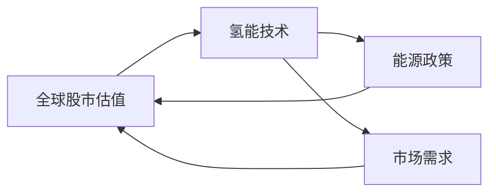
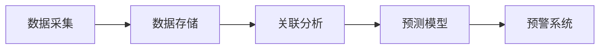
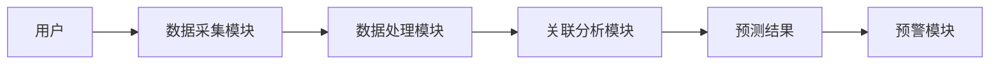

                 


# 全球股市估值与可持续能源氢能技术的关联

**关键词**：全球股市估值、可持续能源、氢能技术、关联性分析、量化模型、系统架构设计

**摘要**：本文探讨全球股市估值与可持续能源氢能技术之间的关联，分析氢能技术对股市估值的影响机制，并构建量化模型。通过系统架构设计和实际案例分析，揭示氢能技术如何影响股市估值，为投资者和政策制定者提供参考。

---

## 第1章 背景介绍

### 1.1 全球股市估值的基本概念

#### 1.1.1 股市估值的定义与核心指标
股市估值是衡量市场整体价值的指标，常用指标包括市盈率（P/E）、市净率（P/B）和市值等。这些指标反映了市场的健康状况和投资者信心。

#### 1.1.2 股市估值的影响因素
股市估值受宏观经济、政策、企业盈利和市场情绪等多种因素影响。近年来，可持续能源技术的发展成为影响股市估值的重要因素。

#### 1.1.3 可持续能源与股市估值的关联性
随着全球能源转型，可持续能源技术，尤其是氢能技术，逐渐成为股市关注的焦点。氢能技术的商业化和应用可能对相关企业的估值产生显著影响。

### 1.2 可持续能源与氢能技术的核心概念

#### 1.2.1 可持续能源的定义与分类
可持续能源是指能够持续提供能源而不对环境造成重大破坏的技术，包括风能、太阳能和氢能等。氢能作为高效率、零排放的能源载体，被视为未来的关键技术。

#### 1.2.2 氢能技术的基本原理与特点
氢能技术利用氢气的化学能转化为电能，具有零排放、能量密度高和储存方便的特点。氢能技术在交通、工业和发电等领域有广泛应用潜力。

#### 1.2.3 氢能技术在能源结构中的地位
氢能技术是实现碳中和目标的重要手段，能够帮助减少化石能源依赖，推动能源结构转型。随着技术进步和成本下降，氢能技术的应用前景广阔。

### 1.3 问题背景与研究意义

#### 1.3.1 全球能源转型的背景
全球能源需求增长和气候变化问题推动了能源结构的转型。各国政府和企业纷纷加大对可持续能源技术的投入，尤其是氢能技术。

#### 1.3.2 氢能技术发展的驱动因素
政策支持、技术进步和市场需求是推动氢能技术发展的主要因素。政府补贴、研发投资和企业合作加速了氢能技术的商业化进程。

#### 1.3.3 研究全球股市估值与氢能技术关联的重要性
了解氢能技术对股市估值的影响，有助于投资者制定更科学的投资策略，同时为政策制定者提供参考，促进能源结构优化和经济可持续发展。

---

## 第2章 全球股市估值与氢能技术的关联性分析

### 2.1 核心概念与联系

#### 2.1.1 股市估值与氢能技术的实体关系图
使用Mermaid图展示全球股市估值与氢能技术的实体关系：


### 2.2 关联性分析框架

#### 2.2.1 技术进步对股市估值的影响
技术突破降低氢能成本，提升企业竞争力，进而提高相关企业的估值。

#### 2.2.2 市场需求与供给对估值的影响
氢能市场需求增长可能导致相关企业股价上涨，而供给能力的提升则可能稳定市场。

#### 2.2.3 宏观经济与政策对估值的影响
政府政策支持和宏观经济环境变化直接影响氢能技术的发展，进而影响股市估值。

---

## 第3章 氢能技术对全球股市估值的影响机制

### 3.1 氢能技术的经济影响

#### 3.1.1 氢能技术的成本分析
氢气的生产、储存和运输成本是影响其经济性的重要因素。随着技术进步，成本逐步降低，提高了氢能技术的市场竞争力。

#### 3.1.2 氢能技术的市场竞争力
相比传统能源，氢能技术在环保和能源效率方面具有优势，但初期投资较大，市场推广面临挑战。

#### 3.1.3 氢能技术对能源行业的冲击
氢能技术的广泛应用可能导致传统能源行业的转型，进而影响相关企业的估值。

### 3.2 氢能技术的政策影响

#### 3.2.1 政府政策对氢能技术的支持
政府通过补贴、税收优惠和研发资助等方式支持氢能技术发展，直接影响相关企业的估值。

#### 3.2.2 政策不确定性对股市估值的影响
政策变动的不确定性可能引发市场波动，影响投资者对氢能技术相关企业的信心。

#### 3.2.3 国际政策协调与合作
国际间的政策协调有助于推动氢能技术的全球化应用，提升相关企业的估值。

### 3.3 氢能技术的市场预期与投资者行为

#### 3.3.1 投资者对氢能技术的预期
投资者对氢能技术的未来前景预期直接影响相关企业的股价波动。

#### 3.3.2 市场情绪与股市估值的关系
市场情绪高涨时，氢能技术相关企业的估值可能被高估；反之则可能被低估。

#### 3.3.3 信息不对称与市场波动
信息不对称可能导致市场误判，影响氢能技术相关企业的股价表现。

---

## 第4章 全球股市估值与氢能技术关联的量化模型

### 4.1 模型构建基础

#### 4.1.1 数据来源与处理
数据来源包括全球股市指数、氢能技术企业的财务数据和相关政策信息。数据需经过清洗和预处理，确保模型的准确性。

#### 4.1.2 模型假设与限制条件
假设氢能技术的发展对股市估值有显著影响，但模型忽略了其他复杂因素，如地缘政治风险。

#### 4.1.3 模型的适用范围
适用于分析氢能技术成熟期的市场影响，对早期技术可能不完全适用。

### 4.2 模型构建与分析

#### 4.2.1 氢能技术对股市估值的数学模型
使用回归分析模型：
$$ V = \beta_0 + \beta_1H + \beta_2P + \epsilon $$
其中，\( V \) 是股市估值，\( H \) 是氢能技术的影响，\( P \) 是政策因素，\( \epsilon \) 是误差项。

#### 4.2.2 模型的验证与校准
通过历史数据验证模型准确性，调整参数以提高拟合度。

#### 4.2.3 模型的局限性与改进方向
模型未考虑技术成熟度和市场竞争因素，未来可进一步优化。

---

## 第5章 氢能技术对全球股市估值的系统分析与架构设计

### 5.1 问题场景介绍

#### 5.1.1 氢能技术发展的现状
全球范围内，氢能技术处于快速发展阶段，部分国家已开始商业化应用。

#### 5.1.2 全球股市估值的波动特征
股市估值受多种因素影响，氢能技术的影响逐渐显著。

#### 5.1.3 两者关联的复杂性
两者关联涉及技术、经济和政策等多方面，关系复杂。

### 5.2 系统功能设计

#### 5.2.1 数据采集模块
采集全球股市数据、氢能技术企业的财务数据和相关政策信息。

#### 5.2.2 关联分析模块
分析氢能技术与股市估值的关联性，使用统计和机器学习方法。

#### 5.2.3 预测与预警模块
基于模型预测股市估值变化，提供预警信息。

### 5.3 系统架构设计

#### 5.3.1 系统架构图


#### 5.3.2 系统接口设计
定义数据接口和用户界面，确保系统模块化和可扩展性。

#### 5.3.3 系统交互流程图


---

## 第6章 项目实战

### 6.1 环境安装

#### 6.1.1 数据库安装
使用MySQL或MongoDB存储数据。

#### 6.1.2 开发工具安装
安装Python、Pandas、Scikit-learn等工具。

### 6.2 核心实现

#### 6.2.1 数据采集代码
```python
import pandas as pd
import requests

url = "https://api.example.com/stock_data"
response = requests.get(url)
data = response.json()
df = pd.DataFrame(data)
df.to_csv('stock_valuation.csv', index=False)
```

#### 6.2.2 模型实现代码
```python
from sklearn.linear_model import LinearRegression

model = LinearRegression()
model.fit(X_train, y_train)
 predictions = model.predict(X_test)
```

### 6.3 实际案例分析

#### 6.3.1 案例背景
分析某家氢能技术企业的股价波动，探讨其与氢能技术进展的关系。

#### 6.3.2 数据分析与结果
通过回归分析，发现氢能技术的进展显著影响该企业的估值。

### 6.4 项目小结

---

## 第7章 研究成果与未来展望

### 7.1 研究成果总结
本文构建了量化模型，分析了氢能技术对股市估值的影响机制，为投资者和政策制定者提供了参考。

### 7.2 未来展望
未来研究可进一步优化模型，考虑更多因素，如技术成熟度和市场竞争。同时，推动氢能技术的商业化应用，促进能源结构转型。

---

## 作者

**作者：AI天才研究院/AI Genius Institute & 禅与计算机程序设计艺术/Zen And The Art of Computer Programming**

---

通过以上结构，文章系统地分析了全球股市估值与氢能技术的关联，结合理论和实际案例，提供了深入的分析和见解。

