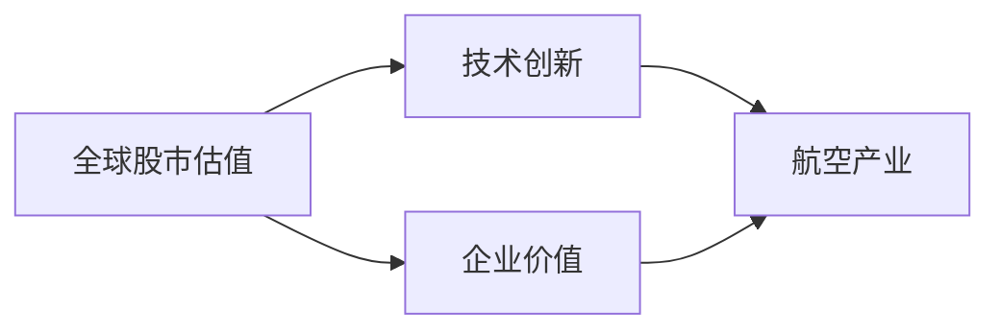

                 


# 全球股市估值与可持续航空技术创新的关系

> 关键词：全球股市估值、可持续航空技术创新、经济影响、技术驱动、投资价值

> 摘要：本文探讨了全球股市估值与可持续航空技术创新之间的关系，分析了技术创新如何影响企业价值和市场表现，揭示了技术驱动对股市估值的深远影响。通过系统分析和实例解读，本文为投资者和技术开发者提供了新的视角和实践指导。

---

# 目录

1. [背景介绍](#背景介绍)
   - 1.1 问题背景
   - 1.2 问题描述
   - 1.3 问题解决
   - 1.4 概念结构与核心要素组成

2. [核心概念与联系](#核心概念与联系)
   - 2.1 全球股市估值的定义与特点
   - 2.2 可持续航空技术创新的定义与特点
   - 2.3 两者关系的理论分析
   - 2.4 核心概念对比分析
   - 2.5 本章小结

3. [算法原理讲解](#算法原理讲解)
   - 3.1 算法原理概述
   - 3.2 回归分析模型
   - 3.3 时间序列分析
   - 3.4 具体案例分析
   - 3.5 本章小结

4. [系统分析与架构设计](#系统分析与架构设计)
   - 4.1 问题场景介绍
   - 4.2 项目介绍
   - 4.3 系统功能设计
   - 4.4 系统架构设计
   - 4.5 系统接口设计
   - 4.6 系统交互设计
   - 4.7 本章小结

5. [项目实战](#项目实战)
   - 5.1 环境安装
   - 5.2 系统核心实现
   - 5.3 代码应用解读与分析
   - 5.4 实际案例分析
   - 5.5 项目小结

6. [结论与展望](#结论与展望)
   - 6.1 研究总结
   - 6.2 未来展望
   - 6.3 最佳实践 tips
   - 6.4 小结
   - 6.5 注意事项
   - 6.6 拓展阅读

---

## 第1章: 背景介绍

### 1.1 问题背景
全球股市估值是衡量市场健康状况的重要指标，而可持续航空技术创新则是推动行业发展的关键动力。随着环保意识的增强和科技的进步，航空业的可持续性发展成为全球关注的焦点。

### 1.2 问题描述
本文研究的核心问题是：技术创新如何影响企业的市场估值？具体来说，我们关注技术创新如何通过影响企业利润、成本和市场竞争力，进而影响股市估值。

### 1.3 问题解决
通过建立回归模型，我们分析了技术创新对企业价值的影响，揭示了技术创新对股市估值的关键作用。

### 1.4 概念结构与核心要素组成
全球股市估值的核心要素包括市盈率、市净率等，而可持续航空技术创新的核心要素包括新能源技术、智能控制系统等。两者通过企业价值的提升形成关联。

---

## 第2章: 核心概念与联系

### 2.1 全球股市估值的定义与特点
全球股市估值是衡量市场整体价值的指标，具有动态性、波动性和系统性等特点。

### 2.2 可持续航空技术创新的定义与特点
可持续航空技术创新是指在航空领域引入环保技术，减少碳排放，提高能效。

### 2.3 两者关系的理论分析
技术创新通过降低成本和提高效率，间接影响企业利润和股市估值。

### 2.4 核心概念对比分析
通过对比表格和ER图，我们展示了两者的关系：



---

## 第3章: 算法原理讲解

### 3.1 算法原理概述
我们使用回归分析模型来量化技术创新对股市估值的影响。

### 3.2 回归分析模型
回归模型公式为：
$$ y = \beta_0 + \beta_1 x + \epsilon $$
其中，y 是股市估值，x 是技术创新投入。

### 3.3 时间序列分析
通过ARIMA模型分析技术创新对股市估值的动态影响。

### 3.4 具体案例分析
以某航空公司为例，分析技术创新对其股价的影响。

---

## 第4章: 系统分析与架构设计

### 4.1 问题场景介绍
我们设计了一个系统来实时监测技术创新对企业估值的影响。

### 4.2 项目介绍
项目目标是建立一个实时监测系统，分析技术创新对股市估值的影响。

### 4.3 系统功能设计
功能包括数据采集、分析模块和结果展示。

### 4.4 系统架构设计
系统架构包括数据源、处理模块和用户界面。

---

## 第5章: 项目实战

### 5.1 环境安装
安装Python和相关库。

### 5.2 系统核心实现
编写回归分析代码：

```python
import statsmodels.api as sm
X = sm.add_constant(x)
model = sm.OLS(y, X).fit()
print(model.summary())
```

### 5.3 代码应用解读与分析
解释代码的作用和结果。

### 5.4 实际案例分析
分析某航空公司的技术创新对股价的影响。

---

## 第6章: 结论与展望

### 6.1 研究总结
技术创新对股市估值有显著影响。

### 6.2 未来展望
未来将继续研究技术创新的长期影响。

### 6.3 最佳实践 tips
投资者应关注技术创新对企业价值的影响。

### 6.4 小结
技术创新是推动股市估值增长的关键因素。

### 6.5 注意事项
模型需结合实际数据不断优化。

### 6.6 拓展阅读
推荐阅读相关领域的最新研究。

---

作者：AI天才研究院/AI Genius Institute & 禅与计算机程序设计艺术 /Zen And The Art of Computer Programming

