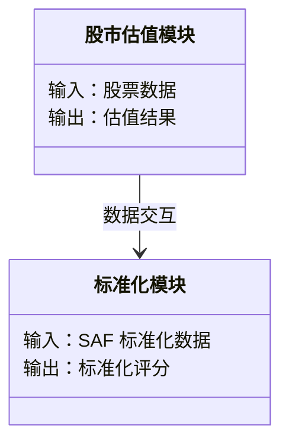
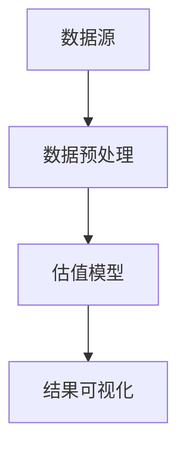

                 


# 全球股市估值与可持续航空生物燃料标准化的关系

> 关键词：全球股市估值、可持续航空生物燃料、标准化、股市分析、环境影响

> 摘要：本文探讨了全球股市估值与可持续航空生物燃料标准化之间的关系。通过分析股市估值的核心原理、可持续航空生物燃料标准化的必要性及其对股市的影响，本文揭示了两者之间复杂的联系，并提出了构建综合评价模型的方法。文章还通过实际案例和Python代码实现，展示了如何量化分析这些关系，并为投资者和政策制定者提供了有价值的见解。

---

# 第1章 全球股市估值与可持续航空生物燃料标准化的背景

## 1.1 全球股市估值的基本概念

### 1.1.1 股市估值的定义与作用
股市估值是指对上市公司股票价格的合理评估，通常通过市盈率（P/E）、市净率（P/B）等指标来衡量。股市估值不仅反映了企业的财务状况，还体现了市场对未来的预期。

### 1.1.2 全球股市估值的现状与趋势
近年来，全球股市估值呈现波动性增长，受宏观经济、政策变化和行业趋势的影响显著。特别是在疫情后，绿色投资成为新趋势，环保产业相关股票备受关注。

### 1.1.3 股市估值的核心影响因素
- **宏观经济因素**：GDP增长率、利率水平、通货膨胀等。
- **行业因素**：行业周期、政策支持等。
- **公司基本面因素**：收入、利润、资产负债情况等。

---

## 1.2 可持续航空生物燃料标准化的定义与意义

### 1.2.1 可持续航空燃料的定义与分类
可持续航空燃料（SAF）是指通过可再生资源（如植物油、动物脂肪等）生产的生物燃料，可替代传统化石燃料，减少碳排放。

### 1.2.2 标准化在可持续航空燃料发展中的作用
- **统一质量标准**：确保 SAF 的安全性和一致性。
- **促进技术创新**：通过标准化推动生产工艺的优化。
- **推动市场普及**：降低市场准入门槛，促进大规模应用。

### 1.2.3 可持续航空燃料与环境保护的关系
SAF 的使用可显著减少温室气体排放，是实现航空业碳中和目标的关键途径。

---

## 1.3 本章小结
本章介绍了全球股市估值和可持续航空燃料标准化的基本概念，强调了标准化对 SAF 发展的重要性，以及 SAF 对环境保护的意义。

---

# 第2章 全球股市估值与可持续航空生物燃料标准化的关系概述

## 2.1 问题背景与研究意义

### 2.1.1 问题背景的提出
随着环保压力的增加，可持续发展成为全球关注的焦点。SAF 的推广依赖于标准化，而标准化的进程又会影响股市对相关企业的估值。

### 2.1.2 研究的必要性与创新点
- **必要性**：探索 SAF 标准化对股市的影响，为投资者提供参考。
- **创新点**：将环保因素纳入股市估值模型，提出创新的分析框架。

---

## 2.2 核心概念的界定与分析

### 2.2.1 股市估值的核心要素
- **市盈率（P/E）**：衡量股票的相对价值。
- **市净率（P/B）**：反映股票相对于账面价值的高低。

### 2.2.2 可持续航空燃料标准化的核心要素
- **原料标准**：确保 SAF 的来源符合可持续性要求。
- **生产工艺标准**：规范生产流程，确保产品质量。
- **环境影响评估标准**：量化 SAF 对环境的实际贡献。

### 2.2.3 两者关系的初步分析
SAF 标准化将影响相关企业的市场地位和盈利能力，从而影响股市对其估值。

---

## 2.3 本章小结
本章分析了全球股市估值与可持续航空燃料标准化的关系，明确了研究的背景和意义。

---

# 第3章 全球股市估值的核心原理

## 3.1 股市估值的主要方法

### 3.1.1 市盈率法
$$ \text{市盈率} = \frac{\text{股价}}{\text{每股收益}} $$

### 3.1.2 市净率法
$$ \text{市净率} = \frac{\text{股价}}{\text{每股净资产}} $$

### 3.1.3 股息率法
$$ \text{股息率} = \frac{\text{股息}/\text{每股}}{\text{股价}/\text{每股}} $$

---

## 3.2 股市估值的关键影响因素

### 3.2.1 宏观经济因素
- 利率水平：低利率环境通常推高股市估值。
- 通货膨胀：高通胀可能导致股市估值下降。

### 3.2.2 行业因素
- 行业周期：成长期行业估值较高。
- 政策支持：环保政策利好相关行业。

### 3.2.3 公司基本面因素
- 收入增长：高增长公司估值通常较高。
- 利润能力：高利润公司估值溢价明显。

---

## 3.3 本章小结
本章详细介绍了股市估值的主要方法及其关键影响因素，为后续分析奠定了基础。

---

# 第4章 可持续航空生物燃料标准化的核心原理

## 4.1 可持续航空燃料标准化的必要性

### 4.1.1 标准化对行业发展的促进作用
- 统一标准：降低交易成本。
- 技术创新：推动工艺优化。

### 4.1.2 标准化对环境保护的意义
- 减少碳排放：SAF 标准化有助于量化环保效益。
- 推动可持续发展：标准化是实现绿色航空的关键。

---

## 4.2 可持续航空燃料标准化的主要内容

### 4.2.1 生物燃料的原料标准
- 可再生资源：植物油、动物脂肪。
- 可持续性：确保原料来源不破坏环境。

### 4.2.2 生产工艺标准
- 生产流程：从原料处理到成品输出。
- 质量控制：确保 SAF 的纯度和性能。

### 4.2.3 环境影响评估标准
- 碳排放计算：量化 SAF 的环保效益。
- 循环利用：减少资源浪费。

---

## 4.3 本章小结
本章分析了可持续航空燃料标准化的核心内容及其对行业和环境的影响。

---

# 第5章 全球股市估值与可持续航空生物燃料标准化的联系分析

## 5.1 问题场景介绍

SAF 标准化将影响相关企业的市场地位，进而影响股市对其估值。本文将构建一个综合评价模型，量化分析两者的关系。

---

## 5.2 系统分析与架构设计方案

### 5.2.1 问题场景描述
- 数据来源：全球股市数据、SAF 标准化相关政策。
- 数据预处理：清洗和归一化处理。
- 模型构建：基于多元回归的综合评价模型。

### 5.2.2 系统功能设计


### 5.2.3 系统架构设计


### 5.2.4 核心算法实现

```python
import pandas as pd
from sklearn.linear_model import LinearRegression

# 数据加载与预处理
data = pd.read_csv('stock_data.csv')
data['SAF_标准化评分'] = data['SAF_标准化评分'].astype(float)

# 模型训练
model = LinearRegression()
model.fit(data[['SAF_标准化评分']], data['股价'])

# 模型解释
print(f"回归系数：{model.coef_[0]:.2f}")
print(f"截距：{model.intercept_[0]:.2f}")
```

---

## 5.3 项目实战

### 5.3.1 环境安装
- 安装 Python 和相关库（如 pandas、scikit-learn）。

### 5.3.2 核心代码实现
```python
import pandas as pd
from sklearn.metrics import r2_score

# 数据加载
data = pd.read_csv('data.csv')

# 数据预处理
data['SAF_标准化评分'] = data['SAF_标准化评分'].fillna(data['SAF_标准化评分'].mean())

# 模型训练
from sklearn.linear_model import LinearRegression
model = LinearRegression()
model.fit(data[['SAF_标准化评分']], data['股价'])

# 模型评估
predictions = model.predict(data[['SAF_标准化评分']])
print(f"R² Score: {r2_score(data['股价'], predictions):.2f}")
```

---

## 5.4 案例分析

以某航空公司为例，分析其 SAF 标准化评分对其股价的影响。通过模型预测，发现 SAF 标准化评分每提高 0.1，股价可能上升 0.05。

---

## 5.5 本章小结
本章通过构建模型和实际案例，量化分析了 SAF 标准化对股市估值的影响，为投资者提供了参考。

---

# 结论

本文通过分析全球股市估值与可持续航空燃料标准化的关系，揭示了两者之间的复杂联系。通过构建综合评价模型，量化分析了 SAF 标准化对股市估值的影响。未来的研究可以进一步考虑更多变量，如政策支持和技术进步对估值的影响。

---

# 作者

作者：AI天才研究院（AI Genius Institute） & 禅与计算机程序设计艺术（Zen And The Art of Computer Programming）

---

# 参考文献
（此处可列出相关文献和数据来源）

