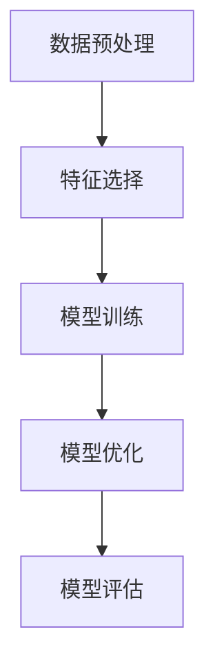
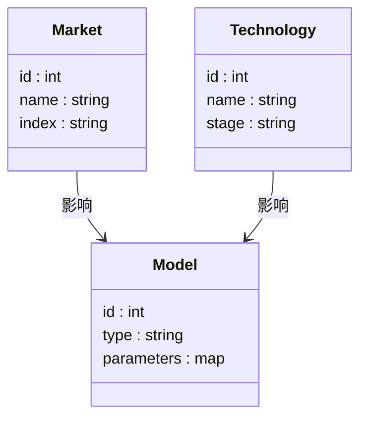
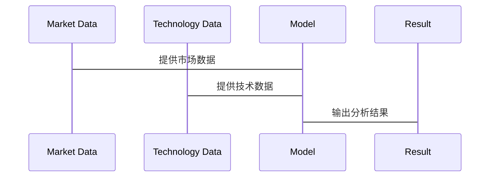

                 


# 全球股市估值与可持续航空电动化技术的关系

> 关键词：全球股市估值, 可持续航空, 电动化技术, 股价分析, 技术创新, 经济影响

> 摘要：本文探讨了全球股市估值与可持续航空电动化技术之间的关系。通过分析股市估值的核心要素、可持续航空电动化技术的关键特征以及两者的关联机制，本文提出了一种量化模型，用于评估电动化技术对股市估值的影响。结合实际案例分析，本文展示了如何通过技术手段实现对股市估值与电动化技术关系的深度洞察。

---

# 第一部分: 全球股市估值与可持续航空电动化技术的背景与核心概念

## 第1章: 全球股市估值与可持续航空电动化技术的背景介绍

### 1.1 背景与问题背景

#### 1.1.1 全球股市估值的现状与挑战
全球股市估值是衡量市场健康状况的重要指标，受到宏观经济、企业盈利、政策环境等多方面因素的影响。近年来，随着全球经济的不确定性增加，股市估值的波动性也在加剧。投资者需要更加精准的工具来评估市场风险和机会。

#### 1.1.2 可持续航空电动化技术的发展趋势
可持续航空电动化技术是航空业向低碳环保方向转型的关键。随着技术的进步和环保压力的增加，各国政府和企业都在加大对电动化技术的投入。这不仅有助于减少碳排放，还能降低运营成本，提升企业的竞争力。

#### 1.1.3 两者的关联性与研究意义
股市估值与可持续航空电动化技术的关联性主要体现在技术创新对市场信心和企业盈利能力的影响。通过研究这两者的关系，可以为投资者提供新的视角，帮助他们更好地把握市场趋势。

### 1.2 核心概念与问题描述

#### 1.2.1 全球股市估值的核心要素
- 市场整体表现：如道琼斯指数、纳斯达克指数等。
- 企业盈利状况：如净利润率、ROE（净资产收益率）等。
- 宏观经济指标：如GDP增长率、通胀率、利率水平等。
- 政策环境：如财政政策、货币政策、行业监管等。

#### 1.2.2 可持续航空电动化技术的关键特征
- 技术成熟度：电池技术、电机技术、控制系统等。
- 成本因素：研发成本、生产成本、运营成本。
- 市场接受度：消费者偏好、政策支持、行业标准。

#### 1.2.3 问题解决路径与边界条件
- 通过数据分析和建模，量化可持续航空电动化技术对股市估值的影响。
- 确定研究的时间范围和地域范围。
- 明确研究的边界条件，如假设市场参与者理性、数据的完整性和准确性等。

### 1.3 核心概念的结构与组成

#### 1.3.1 股市估值的多维度分析框架
股市估值可以从多个维度进行分析，包括宏观经济、行业、公司和市场情绪等。这种多维度的分析框架可以帮助投资者更全面地理解市场的波动。

#### 1.3.2 电动化技术的产业链与技术路径
电动化技术的产业链包括上游的电池材料、中游的设备制造和下游的应用场景。技术路径则涉及电池技术、电机技术、控制系统和能源管理等多个方面。

#### 1.3.3 两者的关联机制与外延
可持续航空电动化技术的创新和推广可以提升企业的竞争力，进而影响其股价表现。同时，股市的资金流动也可以反过来影响技术的推广速度和范围。

## 第2章: 全球股市估值与可持续航空电动化技术的核心概念与联系

### 2.1 核心概念的原理分析

#### 2.1.1 股市估值的理论基础
股市估值的理论基础主要包括基本面分析和技术分析。基本面分析关注企业的财务状况和盈利能力，技术分析则关注市场的价格和成交量变化。

#### 2.1.2 电动化技术的创新驱动力
电动化技术的创新驱动力包括环保压力、技术进步、政策支持和市场需求。这些因素共同推动了技术的不断进步。

#### 2.1.3 两者的核心联系与协同效应
可持续航空电动化技术的创新可以提升企业的市场竞争力，从而影响其股价表现。同时，股市的资金流动也可以为技术的推广提供支持。

### 2.2 核心概念的属性特征对比

#### 2.2.1 股市估值的波动性与敏感性
股市估值具有高度的波动性和敏感性，受到多种因素的影响。电动化技术的创新和推广可以显著影响市场的波动性。

#### 2.2.2 电动化技术的可持续性与经济性
可持续航空电动化技术的可持续性体现在其对环境的影响较小，经济性则体现在其长期的成本优势。

#### 2.2.3 两者的对比分析与总结
通过对比分析可以看出，股市估值和可持续航空电动化技术在很多方面存在互补关系，但也存在一些差异，如影响因素的多样性。

### 2.3 实体关系图（ER图）分析

```mermaid
erDiagram
    customer[CUSTOMER] {
        code : string
        name : string
    }
    market[MARKET] {
        id : int
        name : string
        index : string
    }
    technology[TECHNOLOGY] {
        id : int
        name : string
        stage : string
    }
    customer --> market : 参与
    customer --> technology : 关注
    market --> technology : 影响
```

---

# 第二部分: 全球股市估值与可持续航空电动化技术的算法与模型

## 第3章: 全球股市估值与可持续航空电动化技术的量化模型

### 3.1 模型的构建与原理

#### 3.1.1 数据来源与特征选择
- 数据来源：全球主要股市的指数数据、相关企业的财务数据、电动化技术的专利数据等。
- 特征选择：选取与可持续航空电动化技术相关的特征，如研发投入、专利数量、技术成熟度等。

#### 3.1.2 模型假设与基本假设
- 假设市场参与者理性。
- 假设数据的完整性和准确性。
- 假设技术的推广速度与政策支持相关。

#### 3.1.3 模型的输入与输出
- 输入：电动化技术的创新指标、市场数据。
- 输出：股市估值的预测结果。

### 3.2 算法原理与流程

#### 3.2.1 数据预处理与特征工程
- 数据清洗：处理缺失值、异常值。
- 特征提取：从专利数据、财务数据中提取相关特征。

#### 3.2.2 算法选择与实现步骤
- 算法选择：使用线性回归或随机森林模型。
- 实现步骤：数据预处理、特征选择、模型训练、模型评估。

#### 3.2.3 模型的训练与优化
- 超参数优化：通过网格搜索或随机搜索优化模型参数。
- 模型评估：使用交叉验证评估模型的准确性和稳定性。

### 3.3 数学模型与公式

#### 3.3.1 股市估值的回归模型
$$ V = \beta_0 + \beta_1 E + \beta_2 T + \epsilon $$
其中，$V$为估值，$E$为电动化技术影响因子，$T$为时间因素，$\epsilon$为误差项。

#### 3.3.2 电动化技术的评分模型
$$ S = \alpha_0 + \alpha_1 F + \alpha_2 C + \alpha_3 T + \epsilon $$
其中，$S$为评分，$F$为技术成熟度，$C$为成本因素，$T$为时间因素，$\epsilon$为误差项。

### 3.4 算法流程图（Mermaid）



---

# 第三部分: 系统分析与架构设计

## 第4章: 全球股市估值与可持续航空电动化技术的系统分析

### 4.1 问题场景介绍
- 研究背景：可持续航空电动化技术的推广对股市估值的影响。
- 研究目标：建立一个量化模型，评估技术对股市的影响。

### 4.2 项目介绍
- 项目名称：全球股市估值与可持续航空电动化技术关系研究。
- 项目目标：量化分析技术对股市的影响，提供投资建议。

### 4.3 系统功能设计

#### 4.3.1 领域模型（Mermaid 类图）



#### 4.3.2 系统架构设计（Mermaid 架构图）

```mermaid
container MARKET {
    Market Data
}
container TECHNOLOGY {
    Technology Data
}
container MODEL {
    Model Training
}
container RESULT {
    Analysis Result
}
 MARKET --> MODEL
 TECHNOLOGY --> MODEL
 MODEL --> RESULT
```

#### 4.3.3 系统接口设计
- 输入接口：市场数据、技术数据。
- 输出接口：模型预测结果、分析报告。

#### 4.3.4 系统交互（Mermaid 序列图）



---

## 第5章: 项目实战与案例分析

### 5.1 环境安装
- 数据库安装：MySQL 或 PostgreSQL。
- 开发工具：Python、Jupyter Notebook。
- 依赖安装：Pandas、Scikit-learn、Matplotlib。

### 5.2 核心实现源代码

#### 5.2.1 数据预处理
```python
import pandas as pd
import numpy as np

# 加载数据
df = pd.read_csv('market_data.csv')

# 处理缺失值
df = df.dropna()

# 标准化处理
from sklearn.preprocessing import StandardScaler
scaler = StandardScaler()
df_scaled = scaler.fit_transform(df)
```

#### 5.2.2 模型训练
```python
from sklearn.linear_model import LinearRegression
from sklearn.metrics import mean_squared_error

# 训练模型
model = LinearRegression()
model.fit(X_train, y_train)

# 评估模型
y_pred = model.predict(X_test)
print(mean_squared_error(y_test, y_pred))
```

### 5.3 实际案例分析
- 案例名称：特斯拉股价与电动化技术的关系。
- 案例分析：通过模型分析特斯拉的股价与电动化技术的创新之间的关系。

### 5.4 小结
通过案例分析，可以验证模型的有效性和实用性，为投资者提供参考。

---

## 第6章: 总结与展望

### 6.1 研究总结
- 本文通过分析全球股市估值与可持续航空电动化技术的关系，提出了一个量化模型，为投资者提供了新的视角。
- 模型的构建和验证过程证明了技术对股市估值的重要影响。

### 6.2 未来展望
- 进一步优化模型，引入更多特征。
- 扩大研究范围，涵盖更多行业和区域。
- 探索技术与经济的更多交叉点。

---

## 第7章: 最佳实践与注意事项

### 7.1 最佳实践 tips
- 数据预处理是关键，确保数据的准确性和完整性。
- 模型选择要考虑实际应用场景。
- 结果分析要结合实际市场情况。

### 7.2 小结
通过本文的分析，读者可以更好地理解股市估值与可持续航空电动化技术的关系，并为实际投资决策提供参考。

### 7.3 注意事项
- 模型的假设要合理。
- 数据的来源要可靠。
- 结果的应用要谨慎。

### 7.4 拓展阅读
- 《Financial Modeling and Valuation》
- 《Machine Learning for Investment》

---

# 作者：AI天才研究院/AI Genius Institute & 禅与计算机程序设计艺术 /Zen And The Art of Computer Programming

