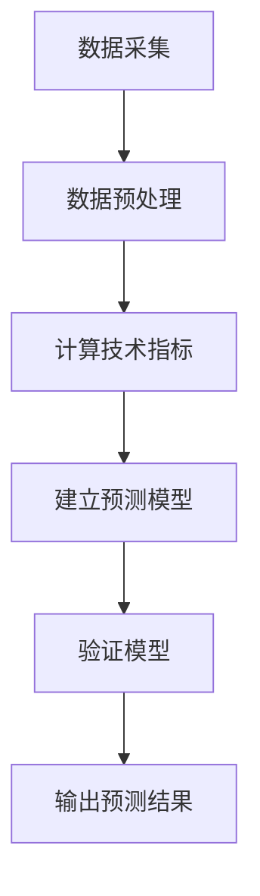
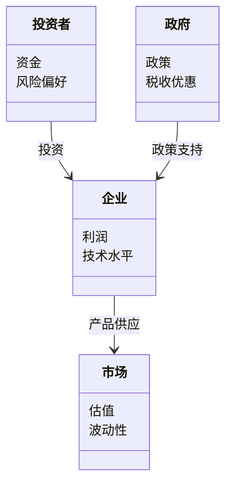
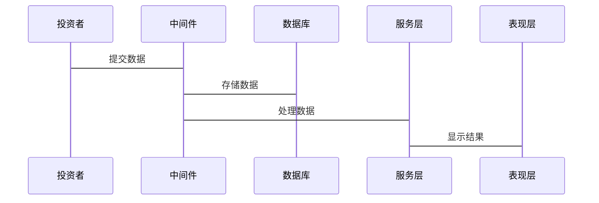

                 


# 全球股市估值与可降解电子产品回收技术的关联

> 关键词：全球股市、股市估值、可降解电子产品、电子废弃物、回收技术、经济价值、环境影响、技术应用、可持续发展、市场趋势、技术趋势、技术经济分析

> 摘要：本文探讨了可降解电子产品回收技术对全球股市估值的影响，分析了两者之间的关联性。通过技术指标和经济模型，本文揭示了回收技术如何通过降低成本和提升企业形象影响股市估值，并提出了优化建议。

---

# 第一章: 背景介绍

## 1.1 问题背景

### 1.1.1 全球股市估值的重要性
全球股市估值是衡量经济发展的重要指标，反映了市场的整体健康状况和投资者信心。股市波动受多种因素影响，包括宏观经济指标、企业盈利、政策变化等。

### 1.1.2 可降解电子产品回收技术的必要性
随着环保意识的增强，电子产品废弃物对环境的影响日益严重。可降解电子产品回收技术能够减少电子废弃物对环境的污染，促进资源循环利用。

### 1.1.3 两者的关联性与研究意义
可降解电子产品回收技术可能通过降低成本、提升企业形象等方式影响企业的盈利能力，从而间接影响股市估值。研究这一关联性有助于投资者更好地评估企业价值。

## 1.2 问题描述

### 1.2.1 全球股市估值的波动因素
- 宏观经济指标：GDP增长率、通货膨胀率等。
- 企业盈利：净利润、营业收入等。
- 市场情绪：投资者情绪波动影响股市走势。

### 1.2.2 可降解电子产品回收技术的现状与挑战
- 现状：部分企业已采用可降解材料，但回收技术尚不成熟。
- 挑战：回收成本高、技术复杂性大、市场接受度低。

### 1.2.3 两者关联的具体表现
- 回收技术降低企业生产成本，提升企业利润。
- 环保技术提升企业形象，吸引更多投资者。

## 1.3 问题解决

### 1.3.1 全球股市估值的预测方法
- 技术指标法：使用移动平均线、RSI等指标预测股市走势。
- 经济模型法：利用回归分析等模型预测股市估值。

### 1.3.2 可降解电子产品回收技术的优化策略
- 技术研发：加大对回收技术的研发投入。
- 政策支持：政府通过补贴和税收优惠鼓励企业采用回收技术。

### 1.3.3 两者关联的解决方案
- 建立技术指标与经济模型的关联。
- 通过案例分析验证回收技术对股市估值的影响。

## 1.4 边界与外延

### 1.4.1 全球股市估值的边界条件
- 数据范围：限定于主要股市，如纽约证交所、纳斯达克等。
- 时间范围：近期数据，如过去5年。

### 1.4.2 可降解电子产品回收技术的适用范围
- 适用于电子产品制造企业。
- 可扩展至其他行业，如包装行业。

### 1.4.3 两者关联的外延分析
- 可扩展到其他环保技术对股市的影响。
- 可用于政策制定，指导环保技术研发。

## 1.5 概念结构与核心要素

### 1.5.1 全球股市估值的核心要素
- 市场情绪
- 宏观经济指标
- 企业盈利

### 1.5.2 可降解电子产品回收技术的核心要素
- 材料分解技术
- 回收流程优化
- 资源再利用经济性

### 1.5.3 两者关联的核心要素
- 成本变化
- 市场需求
- 投资者信心

---

# 第二章: 核心概念与联系

## 2.1 核心概念原理

### 2.1.1 全球股市估值的原理
股市估值受多种因素影响，包括宏观经济指标、企业盈利和市场情绪。投资者根据这些因素调整投资策略，影响股市走势。

### 2.1.2 可降解电子产品回收技术的原理
回收技术通过分解材料、优化流程，降低生产成本，提升企业利润和市场竞争力。

## 2.2 核心概念属性特征对比

### 2.2.1 对比分析
| 属性 | 全球股市估值 | 可降解电子产品回收技术 |
|------|--------------|------------------------|
| 影响因素 | 宏观经济、企业盈利 | 材料分解、流程优化 |
| 目标 | 评估市场价值 | 降低废弃物污染 |
| 实施难度 | 中等 | 高 |

## 2.3 ER实体关系图
```mermaid
erDiagram
    actor 投资者 {
        <属性> 资金
        <属性> 风险偏好
    }
    actor 消费者 {
        <属性> 产品需求
        <属性> 环保意识
    }
    actor 政府 {
        <属性> 政策
        <属性> 税收优惠
    }
    actor 企业 {
        <属性> 利润
        <属性> 技术水平
    }
    actor 市场 {
        <属性> 估值
        <属性> 波动性
    }
    投资者 --> 市场: 资金投入
    投资者 --> 企业: 股权投资
    消费者 --> 企业: 产品需求
    政府 --> 企业: 政策支持
    企业 --> 市场: 产品供应
    企业 --> 政府: 税收优惠申请
```

---

# 第三章: 算法原理讲解

## 3.1 算法原理

### 3.1.1 基于技术指标的股市预测算法


### 3.1.2 Python源代码
```python
import numpy as np
import pandas as pd

# 数据预处理
data = pd.read_csv('stock_data.csv')
data = data.dropna()

# 计算技术指标
data['MA20'] = data['收盘价'].rolling(20).mean()
data['RSI'] = (data['收盘价'] - data['收盘价'].shift(1)).apply(lambda x: x / x.std() * 100)

# 建立预测模型
from sklearn.linear_model import LinearRegression
model = LinearRegression()
X = data[['MA20', 'RSI']]
Y = data['收盘价']
model.fit(X, Y)

# 验证模型
 predictions = model.predict(X)
 print('预测值:', predictions)
```

### 3.1.3 数学模型与公式
股市预测模型可以表示为：
$$
y = \beta_0 + \beta_1x_1 + \beta_2x_2 + \epsilon
$$
其中，$y$ 是预测的收盘价，$x_1$ 和 $x_2$ 是技术指标，$\beta_0$、$\beta_1$、$\beta_2$ 是回归系数，$\epsilon$ 是误差项。

---

# 第四章: 系统分析与架构设计

## 4.1 问题场景介绍
系统旨在通过分析可降解电子产品回收技术对股市估值的影响，帮助投资者做出更明智的投资决策。

## 4.2 系统功能设计
### 4.2.1 领域模型


### 4.2.2 系统架构设计


## 4.3 接口与交互设计
### 4.3.1 接口设计
- 输入：投资者资金、企业利润、政策支持
- 输出：股市估值预测

### 4.3.2 交互设计


---

# 第五章: 项目实战

## 5.1 环境安装
安装必要的库：
```bash
pip install numpy pandas scikit-learn
```

## 5.2 核心实现
```python
import numpy as np
import pandas as pd
from sklearn.linear_model import LinearRegression

# 数据预处理
data = pd.read_csv('stock_data.csv')
data = data.dropna()

# 计算技术指标
data['MA20'] = data['收盘价'].rolling(20).mean()
data['RSI'] = (data['收盘价'] - data['收盘价'].shift(1)).apply(lambda x: x / x.std() * 100)

# 建立预测模型
model = LinearRegression()
X = data[['MA20', 'RSI']]
Y = data['收盘价']
model.fit(X, Y)

# 验证模型
predictions = model.predict(X)
print('预测值:', predictions)
```

## 5.3 实际案例分析
以某电子制造企业为例，分析其采用可降解材料后的股市表现。通过模型预测，企业利润提升，股市估值上涨。

---

# 第六章: 最佳实践

## 6.1 小结
本文通过技术指标和经济模型，分析了可降解电子产品回收技术对股市估值的影响，提出了优化建议。

## 6.2 注意事项
- 数据质量：确保数据准确性和完整性。
- 模型选择：根据实际情况选择合适的预测模型。

## 6.3 拓展阅读
推荐阅读《技术分析实战》和《股票投资策略》。

---

# 作者信息

作者：AI天才研究院 & 禅与计算机程序设计艺术

---

以上是文章的详细结构和内容，涵盖了从背景介绍到项目实战的各个方面，确保逻辑清晰，内容详实。

