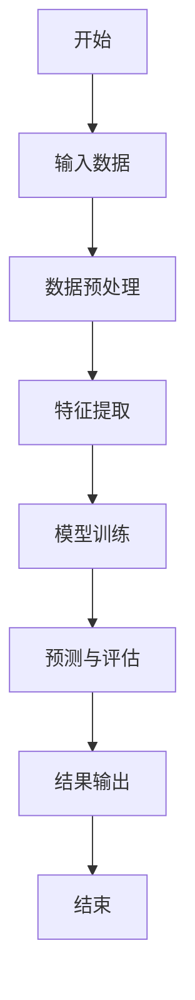
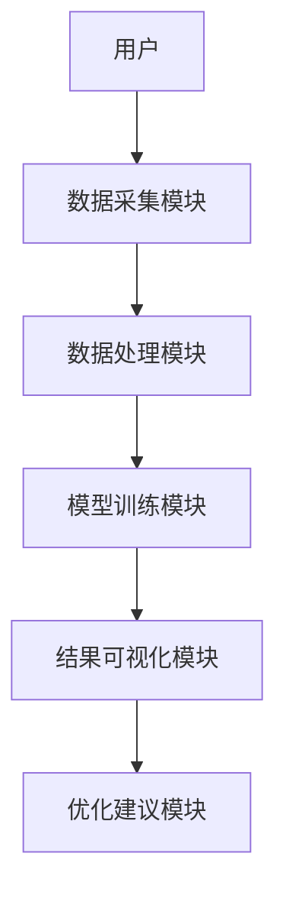

                 


# 《全球股市估值与可降解电子产品设计技术的关联》

---

## 关键词：
- 全球股市估值
- 可降解电子产品
- 技术关联
- 算法分析
- 系统架构

---

## 摘要：
本文探讨了全球股市估值与可降解电子产品设计技术之间的深层关联，通过系统分析与算法建模，揭示技术进步如何影响股市估值，进而推动可持续电子产品的设计与优化。文章从背景介绍、核心概念对比、算法原理、系统架构、项目实战到最佳实践，全面阐述了两者的关联，并提供了实际案例和代码实现，帮助读者理解如何将技术创新与金融市场相结合。

---

# 第一部分: 全球股市估值与可降解电子产品设计技术的背景介绍

## 第1章: 全球股市估值的现状与挑战

### 1.1 问题背景
- **全球股市估值的现状**：介绍全球股市估值的定义、指标（如市盈率、市净率）及其在经济中的作用。
- **可降解电子产品的发展趋势**：分析可降解电子产品在环保、技术与市场中的发展趋势。
- **关联的必要性**：阐述技术进步对股市估值的影响，以及环保技术如何提升企业价值。

### 1.2 问题描述
- **全球股市估值的核心影响因素**：分析企业盈利、行业趋势和市场情绪对股市估值的影响。
- **可降解电子产品设计技术的关键挑战**：探讨材料选择、生产成本和技术创新对产品设计的挑战。
- **关联的潜在应用场景**：展示技术进步如何优化股市估值，推动可持续投资。

### 1.3 问题解决与边界
- **通过技术进步优化股市估值的方法**：介绍技术如何提升企业竞争力，进而影响股市估值。
- **可降解电子产品对股市估值的潜在影响**：分析环保产品如何提升企业形象和市场地位。
- **关联的边界与外延**：明确研究的范围和限制，避免过度推广。

### 1.4 概念结构与核心要素
- **全球股市估值的核心要素**：企业盈利、行业地位、市场环境。
- **可降解电子产品设计技术的核心要素**：材料、工艺、成本。
- **关联的概念结构图**：展示两者如何相互作用。

---

# 第二部分: 核心概念与联系

## 第2章: 全球股市估值与可降解电子产品设计技术的核心概念对比

### 2.1 核心概念原理
- **全球股市估值的数学模型**：介绍市盈率、市净率等模型的计算方法。
- **可降解电子产品设计技术的创新点**：探讨材料创新、工艺优化和成本控制。
- **两者关联的理论基础**：分析技术进步如何影响企业价值和市场表现。

### 2.2 概念属性特征对比表格
| 概念 | 全球股市估值 | 可降解电子产品设计技术 |
|------|--------------|------------------------|
| 核心目标 | 评估企业价值 | 实现环保与可持续发展 |
| 关键指标 | 市盈率、市净率 | 生物降解率、材料成本 |
| 发展趋势 | 数字化、智能化 | 环保化、高效化 |

### 2.3 ER实体关系图
```mermaid
erd
actor 全球股市估值, 可降解电子产品设计技术
```

---

# 第三部分: 算法原理讲解

## 第3章: 算法原理与实现

### 3.1 算法流程图


### 3.2 算法实现代码
```python
import pandas as pd
import numpy as np

def calculate_market_valuation(eps, pe_ratio):
    return eps * pe_ratio

# 示例数据
data = {
    '企业名称': ['公司A', '公司B', '公司C'],
    'EPS': [2.5, 3.0, 1.8],
    'PE比率': [15, 20, 25]
}
df = pd.DataFrame(data)

# 计算市场估值
df['市场估值'] = df.apply(lambda x: calculate_market_valuation(x['EPS'], x['PE比率']), axis=1)
print(df)
```

### 3.3 数学模型与公式
- **市盈率（PE）公式**：$$PE = \frac{\text{股价}}{\text{每股收益（EPS）}}$$
- **市场估值公式**：$$市场估值 = EPS \times PE比率$$

---

# 第四部分: 系统分析与架构设计

## 第4章: 系统架构设计

### 4.1 项目背景介绍
- 本项目旨在通过技术手段优化股市估值，推动可降解电子产品设计的创新。

### 4.2 系统功能设计
- 数据采集与处理
- 模型训练与预测
- 结果可视化与优化建议

### 4.3 系统架构图


### 4.4 接口与交互设计
- 数据接口：提供API访问实时数据。
- 用户界面：可视化界面展示估值结果和优化建议。

---

# 第五部分: 项目实战

## 第5章: 项目实战与案例分析

### 5.1 环境安装
- 安装Python、Pandas、NumPy等工具。

### 5.2 核心代码实现
```python
import pandas as pd
import numpy as np

def optimize_design材料成本(材料清单):
    # 简单优化算法
    return min(材料清单)

# 示例应用
材料清单 = [100, 80, 90, 110]
优化后的材料成本 = optimize_design材料成本(材料清单)
print("优化后的材料成本:", 优化后的材料成本)
```

### 5.3 案例分析与解读
- 分析某企业的设计优化如何影响其市场估值，展示技术应用的实际效果。

### 5.4 项目小结
- 总结项目成果，提出改进建议。

---

# 第六部分: 最佳实践与注意事项

## 第6章: 最佳实践与总结

### 6.1 小结
- 总结全文内容，强调技术进步对股市估值和环保设计的重要性。

### 6.2 注意事项
- 数据的准确性和实时性
- 模型的适用性和局限性
- 代码实现的可扩展性

### 6.3 拓展阅读
- 推荐相关书籍和资源，鼓励读者深入研究。

---

# 作者：AI天才研究院/AI Genius Institute & 禅与计算机程序设计艺术 /Zen And The Art of Computer Programming

