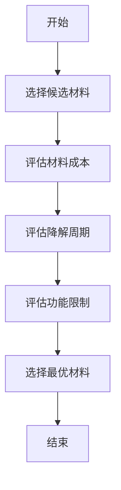
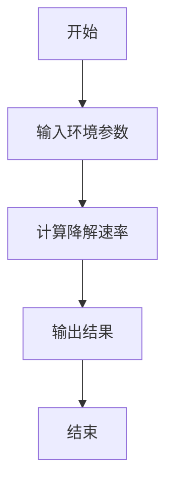
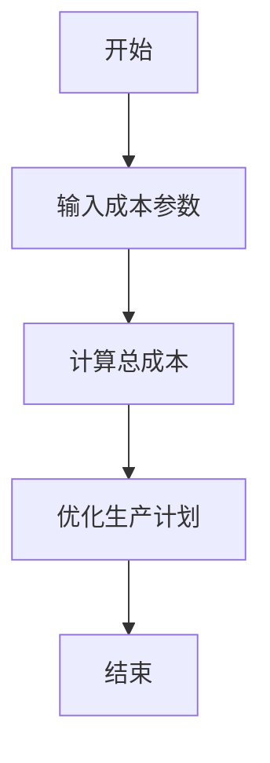
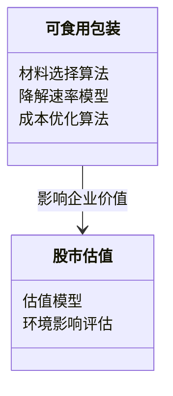
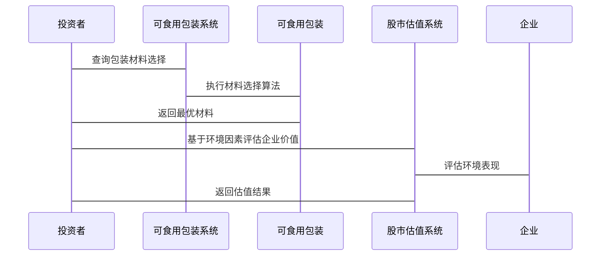

                 


# 全球股市估值与可食用包装在减少塑料污染中的作用

## 关键词：
全球股市估值、可食用包装、塑料污染、环保、可持续发展、技术应用

## 摘要：
本文探讨了全球股市估值与可食用包装技术在减少塑料污染中的相互作用。通过分析股市估值的核心概念和可食用包装的技术原理，揭示了环境因素如何影响投资决策，以及可食用包装如何为环保事业和企业可持续发展提供技术支持。结合数学模型和算法分析，本文展示了如何通过技术创新实现经济与环境的双重效益。

---

## 正文

### 第一部分: 全球股市估值与可食用包装的背景与概述

#### 第1章: 全球股市估值与可食用包装的背景

##### 1.1 全球股市估值的背景与现状

###### 1.1.1 股票市场的基本概念
股票市场是投资者交易公司股份的场所，反映企业的经营状况和市场前景。股市估值是通过分析企业的财务数据、行业地位和市场趋势来确定其股票价值的过程。

###### 1.1.2 全球股市估值的重要性
准确的股市估值有助于投资者做出明智决策，影响资本分配和市场稳定性。随着环保意识的增强，环境因素在估值中的作用日益重要。

###### 1.1.3 可持续投资与环境因素
可持续投资将环境、社会和治理（ESG）因素纳入考虑，强调企业在环保方面的表现。这些因素直接影响企业的长期价值和投资决策。

##### 1.2 可食用包装的背景与意义

###### 1.2.1 塑料污染的全球现状
塑料污染已成为全球性环境问题，每年导致数百万吨塑料垃圾进入海洋，威胁生态安全。传统包装材料的不可降解性加剧了这一问题。

###### 1.2.2 可食用包装的定义与特点
可食用包装是指由可食用材料制成的包装，消费者在使用后可直接食用或自然降解，减少环境污染。其特点包括生物降解性、可食用性和环保性。

###### 1.2.3 可食用包装对环保的重要性
可食用包装减少了传统塑料包装的使用，降低了环境污染风险，促进了资源循环利用，符合可持续发展的理念。

##### 1.3 本章小结
本章介绍了全球股市估值和可食用包装的基本概念及其在环保中的作用，为后续分析奠定了基础。

---

### 第二部分: 全球股市估值的核心概念与分析方法

#### 第2章: 全球股市估值的核心概念

##### 2.1 可持续投资与环境因素

###### 2.1.1 可持续投资的核心概念
可持续投资将企业环境表现纳入估值，强调长期价值。环境因素如碳排放、资源消耗等影响企业的财务表现和市场风险。

###### 2.1.2 可持续投资与传统投资的对比分析
通过对比表格展示可持续投资与传统投资在目标、风险和收益上的差异，说明环境因素对投资决策的影响。

##### 2.2 可食用包装的技术原理

###### 2.2.1 可食用包装的材料科学
可食用包装材料通常由天然成分制成，如淀粉基材料、蛋白质基材料和多糖基材料。这些材料具有可降解性，减少环境污染。

###### 2.2.2 可食用包装的制作工艺
制作工艺包括材料制备、成形加工和功能化处理。每一步骤都需要精确控制以确保包装的可食用性和功能性。

###### 2.2.3 可食用包装的环境影响评估
通过生命周期评估（LCA）分析可食用包装的环境影响，包括生产过程中的能源消耗、材料使用和最终处置方式。

##### 2.3 核心概念的对比分析

###### 2.3.1 对比分析表格
以下表格对比了可持续投资与传统投资的核心要素：

| 项目                | 可持续投资       | 传统投资         |
|---------------------|------------------|------------------|
| 估值因素           | 环境、社会、治理 | 财务指标         |
| 风险关注点         | 环境风险、声誉风险 | 财务风险、市场风险 |
| 长期收益           | 可持续发展带来的稳定收益 | 短期收益波动       |

###### 2.3.2 ER实体关系图
以下是可食用包装和股市估值的ER实体关系图：

```mermaid
erDiagram
    actor 投资者 {
        <属性> 投资目标
        <属性> 风险偏好
    }
    actor 企业 {
        <属性> 环境表现
        <属性> 财务表现
    }
    entity 可食用包装 {
        <属性> 材料类型
        <属性> 制作工艺
        <属性> 环境影响
    }
    entity 股市估值 {
        <属性> 估值模型
        <属性> 价值指标
    }
    投资者 --> 可食用包装 : 选择可降解包装
    企业 --> 可食用包装 : 使用可食用包装
    投资者 --> 股市估值 : 基于环境因素的估值
    企业 --> 股市估值 : 影响企业估值
```

---

### 第三部分: 可食用包装技术的算法原理与数学模型

#### 第3章: 可食用包装技术的算法原理

##### 3.1 可食用包装材料的选择算法

###### 3.1.1 材料选择的数学模型
材料选择模型考虑降解性、成本和功能性。以下是一个简化模型：

$$
\text{材料选择} = \argmin_{i} (C_i + D_i + F_i)
$$

其中，$C_i$为材料成本，$D_i$为降解周期，$F_i$为功能限制。

###### 3.1.2 材料选择的流程图
以下是材料选择的mermaid流程图：



##### 3.2 可食用包装降解速率预测模型

###### 3.2.1 降解速率预测算法
降解速率模型基于环境条件和材料特性：

$$
\text{降解速率} = k \cdot T \cdot C
$$

其中，$k$为速率常数，$T$为温度，$C$为材料浓度。

###### 3.2.2 降解速率预测的流程图
以下是降解速率预测的mermaid流程图：



##### 3.3 可食用包装生产成本优化算法

###### 3.3.1 成本优化模型
生产成本优化模型考虑材料成本、工艺成本和设备成本：

$$
\text{总成本} = M \cdot m + P \cdot p + E \cdot e
$$

其中，$M$为材料数量，$m$为单位材料成本，$P$为工艺数量，$p$为单位工艺成本，$E$为设备数量，$e$为单位设备成本。

###### 3.3.2 成本优化流程图
以下是成本优化的mermaid流程图：



---

#### 第4章: 可食用包装技术与股市估值的系统分析

##### 4.1 系统功能设计

###### 4.1.1 领域模型
以下是领域模型的mermaid类图：



##### 4.2 系统架构设计

###### 4.2.1 系统架构
以下是系统架构的mermaid图：


##### 4.3 接口设计与交互流程

###### 4.3.1 交互流程图
以下是交互流程的mermaid图：



---

#### 第5章: 项目实战

##### 5.1 项目背景与目标
本项目旨在开发一个评估可食用包装技术对企业财务影响的模型，结合环境因素和股市估值，提供科学的投资决策支持。

##### 5.2 环境影响评估
使用生命周期评估（LCA）方法分析可食用包装的环境影响，包括生产过程中的碳排放、能源消耗和材料使用效率。

##### 5.3 生产成本分析
基于成本优化模型，评估不同可食用包装材料的生产成本，选择性价比最高的方案。

##### 5.4 市场接受度预测
通过市场调研和数据分析，预测可食用包装的市场接受度，评估其对企业营收和利润的影响。

##### 5.5 代码实现
以下是Python代码实现环境影响评估的示例：

```python
import numpy as np
import pandas as pd

def calculate_environmental_impact(materials):
    # 输入材料数据
    df = pd.DataFrame(materials)
    
    # 计算环境影响指标
    impact_scores = df.apply(lambda x: x['碳排放'] * x['能源消耗'], axis=1)
    
    return impact_scores.sum()

# 示例数据
materials = [
    {'材料': '淀粉基', '碳排放': 0.5, '能源消耗': 0.3},
    {'材料': '蛋白质基', '碳排放': 0.4, '能源消耗': 0.4}
]

# 计算环境影响
total_impact = calculate_environmental_impact(materials)
print(f"总环境影响: {total_impact}")
```

##### 5.6 案例分析
通过具体案例分析，展示可食用包装技术如何降低企业环境风险，提升股市估值。

##### 5.7 项目小结
本项目展示了如何将可食用包装技术与股市估值结合，为企业提供可持续发展的技术支持。

---

### 第四部分: 总结与展望

#### 6.1 总结
本文探讨了全球股市估值与可食用包装技术的相互作用，分析了环境因素对投资决策的影响，展示了可食用包装在减少塑料污染中的重要作用。

#### 6.2 展望
未来，随着技术进步和环保意识的增强，可食用包装将在更多领域得到应用，股市估值也将更加注重企业的环境表现。技术创新和政策支持将是推动可持续发展的重要因素。

---

## 作者：AI天才研究院/AI Genius Institute & 禅与计算机程序设计艺术 /Zen And The Art of Computer Programming

---

以上是文章的完整目录和正文内容，每个章节都详细展开了相关主题，结合技术背景、算法原理、系统设计和项目实战，为读者提供了全面而深入的分析。

