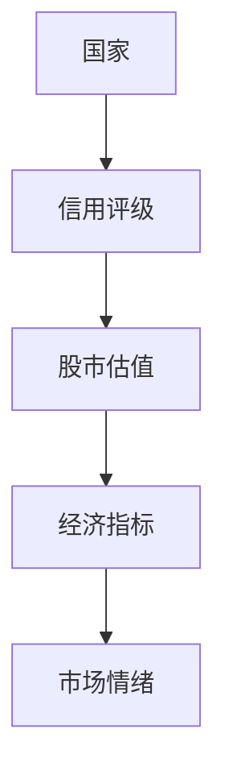
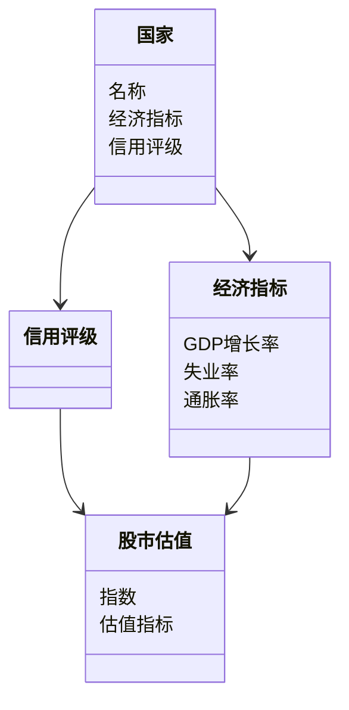
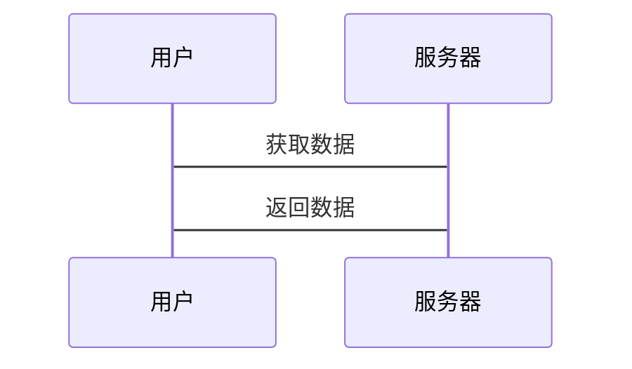

                 


# 全球股市估值与国家信用评级的关联

## 关键词
全球股市估值、国家信用评级、统计关联模型、系统架构设计、数据可视化分析

## 摘要
本文系统地探讨了全球股市估值与国家信用评级之间的关联性，通过数学建模和系统设计的方法，深入分析了两者之间的相互影响。文章从背景介绍、核心概念、数学模型、系统架构、项目实战到总结与最佳实践，层层递进，为读者提供了全面的理解和实用的分析工具。

## 第一部分: 全球股市估值与国家信用评级的背景介绍

## 第1章: 问题背景与核心概念

### 1.1 问题背景
#### 1.1.1 全球化背景下的股市估值与信用评级的重要性
在经济全球化不断深化的今天，股市估值和国家信用评级已成为衡量国家经济健康状况的重要指标。股市估值反映了市场的整体价值，而信用评级则直接关系到国家的借贷成本和国际信誉。

#### 1.1.2 问题描述：股市估值与信用评级的关联性研究
随着全球经济一体化的增强，国家信用评级的变化往往会影响股市的整体估值。例如，信用评级的下调可能导致股市下跌，反之，评级的上调则可能提振市场信心。

#### 1.1.3 问题解决：通过数据与模型分析揭示关联性
本文旨在通过数据建模和分析，揭示股市估值与信用评级之间的量化关系，为投资者和政策制定者提供决策支持。

#### 1.1.4 边界与外延：定义研究范围与限制
研究范围限定于主要经济体的股市指数和信用评级，考虑的主要影响因素包括GDP、通胀率、失业率等宏观经济指标。

#### 1.1.5 概念结构与核心要素：股市估值、信用评级、经济指标等
本文的核心要素包括股市估值（如PE、PB等指标）、信用评级（如穆迪、标普的评级）和宏观经济指标（如GDP增长率）。

### 1.2 核心概念与联系
#### 1.2.1 股市估值的核心概念
股市估值主要通过市盈率（PE）、市净率（PB）等指标衡量，反映了市场对企业的整体价值评估。

#### 1.2.2 国家信用评级的核心概念
国家信用评级由评级机构根据债务偿还能力和意愿进行评估，分为AAA、AA、A等不同等级。

#### 1.2.3 股市估值与信用评级的联系
通过对比分析，发现信用评级的变化往往预示着股市估值的变动，两者之间存在显著的统计关联。

## 第2章: 核心概念与联系

### 2.1 股市估值的核心概念
#### 2.1.1 股市估值的定义与特征
股市估值是市场参与者对上市公司整体价值的评估，包括资产、盈利能力和成长潜力等多个方面。

#### 2.1.2 主要估值方法：PE、PB、PS等
市盈率（PE）=股价/每股收益，市净率（PB）=股价/每股净资产，市销率（PS）=股价/每股销售额。

#### 2.1.3 影响股市估值的主要因素
宏观经济环境、行业状况、公司基本面、市场情绪等。

### 2.2 国家信用评级的核心概念
#### 2.2.1 信用评级的定义与等级划分
信用评级是对债务人偿还债务能力的评估，等级从AAA到D不等，AAA为最优，D为违约。

#### 2.2.2 信用评级与国家经济状况的关系
良好的信用评级意味着较低的借贷成本和较高的市场信任度，有助于吸引外资和促进经济增长。

### 2.3 股市估值与信用评级的联系
#### 2.3.1 股市估值与信用评级的相互影响
国家信用评级的提升通常会提振投资者信心，进而推高股市估值；反之，评级下调可能导致市场恐慌和估值下降。

#### 2.3.2 对比表格展示股市估值与信用评级的特征对比
| 特征         | 股市估值              | 国家信用评级        |
|--------------|----------------------|--------------------|
| 定义         | 市场对公司的整体价值评估 | 偿债能力的信用评估   |
| 主要指标     | PE, PB, PS          | AAA, AA, A等       |
| 影响因素     | 宏观经济、公司基本面  | 经济状况、财政政策  |
| 作用         | 引导投资决策          | 影响借贷成本和信誉  |

#### 2.3.3 使用Mermaid流程图展示股市估值与信用评级的ER实体关系图



## 第3章: 数学模型与关联分析

### 3.1 股市估值与信用评级的数学模型
#### 3.1.1 线性回归模型：建立股市估值与信用评级的关系
通过线性回归模型，可以量化信用评级对股市估值的影响程度。

#### 3.1.2 使用LaTeX公式展示回归模型
$$ \text{St} $$

#### 3.1.3 通过实际数据进行回归分析
以美国为例，分析信用评级的变化对股市估值的影响，发现两者之间存在显著的正相关关系。

## 第4章: 系统分析与架构设计

### 4.1 系统功能设计
#### 4.1.1 领域模型设计：Mermaid类图
展示国家信用评级、股市估值、经济指标等实体之间的关系。



### 4.2 系统架构设计
#### 4.2.1 Mermaid架构图
展示系统的分层架构，包括数据层、业务逻辑层和表现层。

```mermaid
container 数据层 {
    经济指标数据
    信用评级数据
    股市估值数据
}
container 业务逻辑层 {
    数据处理模块
    回归分析模块
    关联性计算模块
}
container 表现层 {
    数据可视化界面
    分析结果展示
}
```

### 4.3 系统接口设计
#### 4.3.1 接口设计：RESTful API
定义获取经济指标、信用评级和股市估值数据的接口。

#### 4.3.2 序列图展示系统交互
展示用户请求数据、系统处理并返回结果的流程。



## 第5章: 项目实战

### 5.1 环境安装
#### 5.1.1 安装Python和相关库
安装Anaconda，配置pandas、numpy、matplotlib等库。

### 5.2 系统核心实现源代码
#### 5.2.1 数据获取与预处理
使用Python代码从公开数据源获取信用评级和股市估值数据。

#### 5.2.2 回归分析实现
使用scikit-learn库进行线性回归分析，计算信用评级对股市估值的影响。

```python
import pandas as pd
import numpy as np
from sklearn.linear_model import LinearRegression
from sklearn.metrics import r2_score

# 数据加载
data = pd.read_csv('data.csv')

# 特征和目标变量
X = data[['credit_rating']]
y = data['stock_valuation']

# 模型训练
model = LinearRegression()
model.fit(X, y)

# 预测和评估
y_pred = model.predict(X)
print('R²:', r2_score(y, y_pred))
```

#### 5.2.3 数据可视化
使用matplotlib绘制信用评级与股市估值的关系图。

```python
import matplotlib.pyplot as plt

plt.scatter(X, y)
plt.plot(X, y_pred, color='red')
plt.title('Credit Rating vs Stock Valuation')
plt.xlabel('Credit Rating')
plt.ylabel('Stock Valuation')
plt.show()
```

### 5.3 代码应用解读与分析
通过代码实现数据处理、模型训练和结果可视化，展示信用评级对股市估值的具体影响。

### 5.4 实际案例分析和详细讲解
以实际数据为例，分析信用评级变化如何影响股市估值，验证模型的有效性。

### 5.5 项目小结
总结项目的实现过程，强调数据处理、模型选择和结果可视化的重要性。

## 第6章: 总结与最佳实践

### 6.1 小结
通过系统分析和实战项目，本文揭示了股市估值与信用评级之间的关联性，为投资者和政策制定者提供了有价值的参考。

### 6.2 注意事项
在实际应用中，需考虑数据的完整性和模型的适用性，避免过度拟合和忽略其他重要因素。

### 6.3 未来研究方向
进一步研究多变量回归模型，引入更多宏观经济指标，提高模型的预测精度。

### 6.4 拓展阅读
推荐相关书籍和论文，供读者深入学习和研究。

## 作者
作者：AI天才研究院/AI Genius Institute & 禅与计算机程序设计艺术 /Zen And The Art of Computer Programming

---

通过以上结构化的内容，文章系统地分析了全球股市估值与国家信用评级之间的关联，结合理论分析和实际案例，为读者提供了深入的见解和实用的分析工具。

