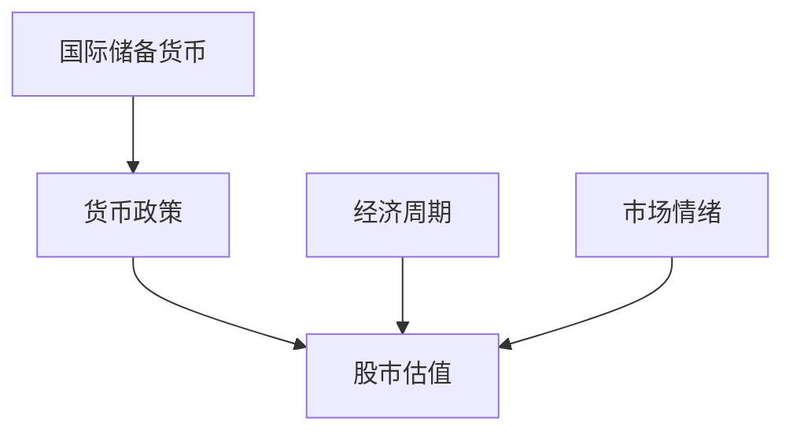
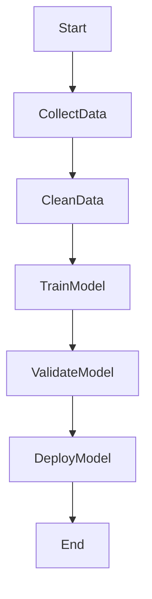
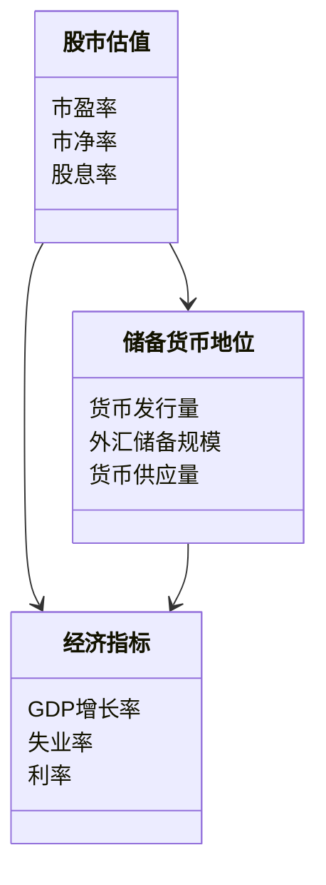
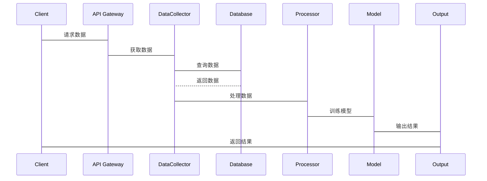

                 


# 全球股市估值与国际储备货币地位的互动

> 关键词：全球股市估值、国际储备货币、货币政策、经济周期、金融市场

> 摘要：本文探讨了全球股市估值与国际储备货币地位之间的互动关系，分析了影响两者的主要因素，包括货币政策、经济周期和市场情绪。通过建立数学模型，结合实际案例，本文揭示了储备货币地位变化对股市估值的影响机制，并提出了优化投资策略的建议。

---

# 第1章: 背景介绍

## 1.1 问题背景
### 1.1.1 全球化经济与金融市场的现状
全球化的深入发展使得金融市场高度一体化，各国经济相互影响。国际储备货币作为全球贸易和金融体系的核心，其地位的变化直接影响着全球资本流动和金融市场估值。

### 1.1.2 国际储备货币的定义与特征
国际储备货币是指在国际贸易和国际支付中广泛使用的货币，如美元、欧元等。其特征包括稳定性、流动性、广泛接受性和抗风险性。

### 1.1.3 全球股市估值的定义与计算方法
全球股市估值通常通过市盈率（P/E Ratio）、市净率（P/B Ratio）和股息率（Dividend Yield）等指标进行衡量。这些指标反映了市场的整体估值水平。

## 1.2 核心概念与问题描述
### 1.2.1 全球股市估值与国际储备货币的互动关系
国际储备货币的流动性和稳定性对全球股市估值有直接影响。例如，当主要储备货币（如美元）贬值时，全球资本可能流向新兴市场，推高这些地区的股市估值。

### 1.2.2 问题的边界与外延
本文关注的主要储备货币包括美元、欧元、日元和英镑等。研究范围涵盖全球主要股市指数，如标普500、纳斯达克指数、MSCI指数等。

### 1.2.3 核心概念的结构与组成要素
- **国际储备货币**：货币政策、经济实力、地缘政治因素。
- **全球股市估值**：市场情绪、经济基本面、货币政策。

## 1.3 互动机制的初步分析
### 1.3.1 货币政策对股市估值的影响
宽松的货币政策通常会降低利率，推动资金流入股市，推高估值。例如，美联储的量化宽松政策显著影响了全球股市估值。

### 1.3.2 经济周期与股市估值的关联
经济周期的波动直接影响企业的盈利能力和投资者信心，从而影响股市估值。例如，在经济衰退期，股市估值通常会下降。

### 1.3.3 国际储备货币地位的变化对全球股市的影响
当一种货币的储备地位上升时，投资者会增加对该货币资产的配置，导致相关市场的股市估值上升。

## 1.4 当前研究现状与挑战
### 1.4.1 学术界对股市估值与货币关系的研究进展
学术界已对货币政策与股市估值的关系进行了大量研究，但对储备货币地位变化对全球股市估值的系统性影响研究较少。

### 1.4.2 实际应用中的难点与局限性
数据获取、模型复杂性和地缘政治因素是实际应用中的主要难点。

### 1.4.3 研究的创新点与价值
本文尝试构建一个综合模型，将储备货币地位变化与全球股市估值的变化联系起来，为投资者提供新的分析工具。

## 1.5 本章小结
本章通过对全球股市估值和国际储备货币的定义、特征及互动关系的分析，为后续研究奠定了基础。

---

# 第2章: 核心概念与联系

## 2.1 全球股市估值的核心要素
### 2.1.1 市盈率（P/E Ratio）的计算与意义
市盈率=股价/每股收益。低市盈率可能意味着低估，高市盈率可能意味着高估。

### 2.1.2 市净率（P/B Ratio）的应用
市净率=股价/每股净资产。适用于评估银行、保险公司等资产密集型行业的估值。

### 2.1.3 股息率（Dividend Yield）的作用
股息率=每股股息/股价。高股息率可能意味着较高的分红回报。

## 2.2 国际储备货币的属性与特征
### 2.2.1 主要国际储备货币的定义与现状
- 美元：全球主要储备货币，占比约60%。
- 欧元：第二大储备货币，占比约20%。
- 日元和英镑：分别占比约5%和4%。

### 2.2.2 货币政策对储备货币的影响
中央银行的货币政策直接影响储备货币的流动性和价值。例如，美联储的利率政策会影响美元的储备地位。

### 2.2.3 经济实力对储备货币的影响
经济实力雄厚的国家更容易成为储备货币发行国。例如，美国的经济实力是美元保持储备货币地位的重要原因。

## 2.3 全球股市估值与国际储备货币的互动关系
### 2.3.1 货币政策对股市估值的影响
- 宽松货币政策：降低利率，推动股市估值上升。
- 紧缩货币政策：提高利率，可能抑制股市估值。

### 2.3.2 经济周期对股市估值的影响
- 经济衰退期：企业盈利下降，股市估值可能下降。
- 经济复苏期：企业盈利上升，股市估值可能上升。

### 2.3.3 国际储备货币地位变化对全球股市的影响
- 当美元储备地位上升时，全球资本可能从新兴市场流向美国市场，导致新兴市场股市估值下降。
- 当欧元储备地位上升时，欧洲股市可能受益，估值上升。

## 2.4 核心概念的对比与分析
### 2.4.1 对比分析
| 比较维度 | 全球股市估值 | 国际储备货币 |
|----------|--------------|---------------|
| 主要指标 | 市盈率、市净率、股息率 | 货币发行量、外汇储备规模、货币供应量 |
| 影响因素 | 经济周期、货币政策、市场情绪 | 经济实力、货币政策、地缘政治 |

### 2.4.2 实体关系图


---

# 第3章: 算法原理讲解

## 3.1 算法概述
本文构建了一个基于回归分析的模型，用于分析国际储备货币地位变化对全球股市估值的影响。

## 3.2 算法流程图


## 3.3 算法实现
### 3.3.1 数据预处理
- 数据清洗：处理缺失值、异常值。
- 数据标准化：对数据进行标准化处理。

### 3.3.2 模型训练
使用线性回归模型，将储备货币地位变化（自变量）与股市估值（因变量）进行回归分析。

### 3.3.3 模型验证
通过交叉验证评估模型的准确性。

### 3.3.4 模型部署
将模型部署到实时数据流中，用于实时监测储备货币地位变化对股市估值的影响。

## 3.4 数学模型
### 3.4.1 回归模型
$$ y = \beta_0 + \beta_1x + \epsilon $$

其中：
- $y$ 表示股市估值
- $x$ 表示储备货币地位变化
- $\beta_0$ 和 $\beta_1$ 是回归系数
- $\epsilon$ 是误差项

### 3.4.2 实例分析
假设储备货币地位变化 $x$ 增加 1%，则股市估值 $y$ 预测变化为：
$$ \Delta y = \beta_1 \times 1\% $$

---

# 第4章: 系统分析与架构设计方案

## 4.1 问题场景介绍
本文构建了一个实时监测系统，用于分析国际储备货币地位变化对全球股市估值的影响。

## 4.2 系统功能设计
### 4.2.1 领域模型


### 4.2.2 系统架构设计
```mermaid
graph TD
    API Gateway --> DataCollector
    DataCollector --> Database
    Database --> Processor
    Processor --> Model
    Model --> Output
```

### 4.2.3 系统接口设计
- 数据接口：提供REST API用于数据采集和传输。
- 模型接口：提供API用于回归模型的训练和预测。

### 4.2.4 系统交互设计


---

# 第5章: 项目实战

## 5.1 环境配置
### 5.1.1 安装Python
使用Anaconda安装Python 3.8以上版本。

### 5.1.2 安装依赖库
```bash
pip install numpy pandas scikit-learn matplotlib
```

## 5.2 系统核心实现源代码
### 5.2.1 数据采集
```python
import pandas as pd
import numpy as np

def collect_data():
    # 示例数据
    data = {
        '储备货币地位变化': np.random.rand(100),
        '股市估值': np.random.rand(100)
    }
    return pd.DataFrame(data)
```

### 5.2.2 模型实现
```python
from sklearn.linear_model import LinearRegression
from sklearn.metrics import mean_squared_error

def train_model(X, y):
    model = LinearRegression()
    model.fit(X, y)
    return model

def evaluate_model(model, X, y):
    y_pred = model.predict(X)
    mse = mean_squared_error(y, y_pred)
    return mse
```

### 5.2.3 数据可视化
```python
import matplotlib.pyplot as plt

def visualize_results(data, model):
    plt.scatter(data['储备货币地位变化'], data['股市估值'])
    plt.plot(data['储备货币地位变化'], model.predict(data[['储备货币地位变化']]), color='red')
    plt.xlabel('储备货币地位变化')
    plt.ylabel('股市估值')
    plt.show()
```

## 5.3 代码应用解读与分析
### 5.3.1 数据采集与处理
使用`collect_data()`函数生成示例数据，并使用`pandas`进行数据清洗和处理。

### 5.3.2 模型训练与评估
使用`train_model()`函数训练回归模型，并使用`evaluate_model()`函数评估模型性能。

### 5.3.3 模型可视化
使用`visualize_results()`函数将模型预测结果可视化，验证模型的拟合效果。

## 5.4 案例分析
### 5.4.1 数据来源与处理
使用实际的储备货币地位变化数据和全球股市估值数据进行分析。

### 5.4.2 模型实现与优化
通过调整模型参数和优化算法，提高模型的预测精度。

### 5.4.3 结果解读
解释模型预测结果，分析储备货币地位变化对股市估值的具体影响。

## 5.5 项目小结
本项目通过实际案例分析，验证了模型的有效性，并为后续研究提供了参考。

---

# 第6章: 总结与展望

## 6.1 核心发现
本文揭示了国际储备货币地位变化对全球股市估值的系统性影响，构建了一个综合模型，并通过实际案例进行了验证。

## 6.2 研究局限性
本文的研究主要基于假设数据，未来可以结合更多实际数据进行验证。

## 6.3 未来研究方向
未来可以研究其他因素（如地缘政治风险）对股市估值的影响，构建更复杂的模型。

## 6.4 最佳实践 tips
- 投资者应关注国际储备货币地位变化对股市估值的影响。
- 政策制定者应考虑货币政策对全球金融市场的系统性影响。

## 6.5 注意事项
- 数据质量对模型性能至关重要。
- 模型应结合实际情况进行调整和优化。

## 6.6 拓展阅读
推荐阅读相关领域的经典文献和最新研究成果。

---

# 作者信息

作者：AI天才研究院/AI Genius Institute & 禅与计算机程序设计艺术/Zen And The Art of Computer Programming

