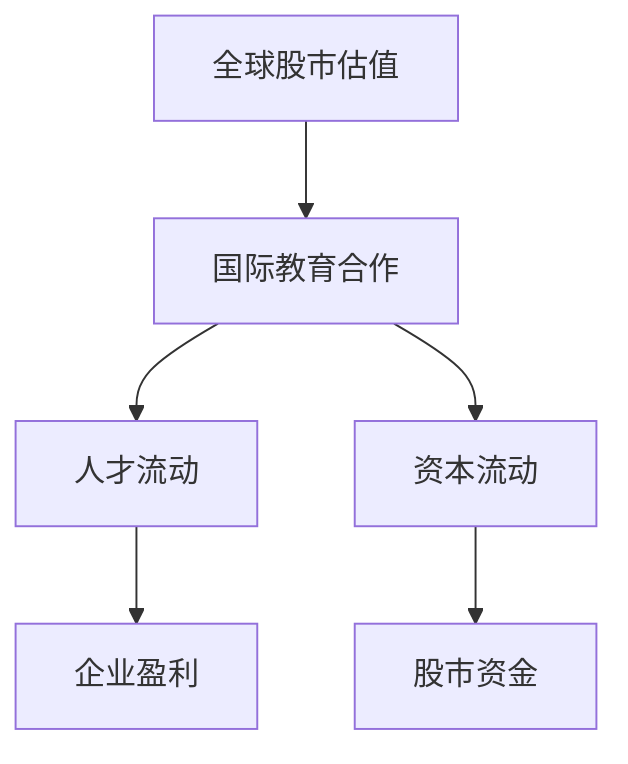
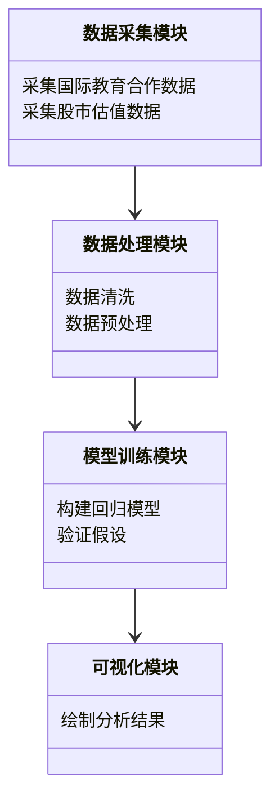
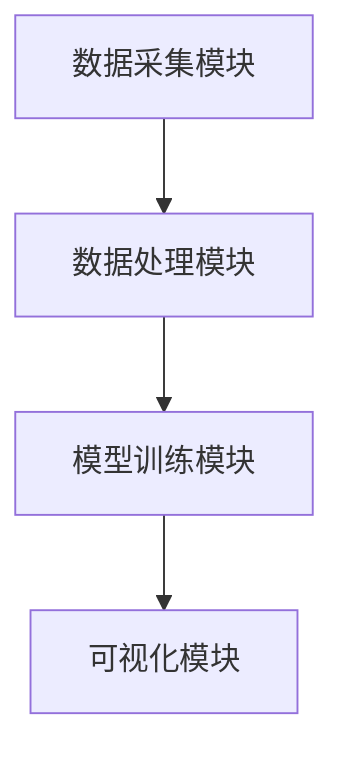
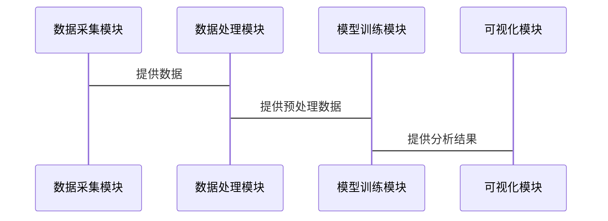

                 


# 全球股市估值与国际教育合作的互动

> 关键词：全球股市估值，国际教育合作，互动机制，数学模型，系统架构设计，案例分析

> 摘要：本文探讨了全球股市估值与国际教育合作之间的互动关系，通过构建数学模型和系统架构设计，分析了两者之间的相互影响。结合实际案例，本文提出了如何通过国际教育合作优化全球股市估值的方法，并对未来研究方向进行了展望。

---

# 第一部分：全球股市估值与国际教育合作的背景与概念

## 第1章：全球股市估值与国际教育合作的背景介绍

### 1.1 问题背景与问题描述

#### 1.1.1 全球化背景下的经济与教育互动
全球化促进了经济和教育的深度融合。国际资本流动和人才流动成为推动经济增长的重要因素。股市作为经济的重要组成部分，其估值受多种因素影响，包括政策、市场情绪和人才流动等。

#### 1.1.2 国际教育合作的兴起
随着全球化的发展，国际教育合作日益增多。留学生数量的增加、跨国学术交流的频繁，使得国际教育合作成为推动经济发展的重要力量。例如，留学生在海外学习期间可能会将本国货币兑换为外币，影响外汇市场，进而影响股市估值。

#### 1.1.3 全球股市估值的波动性与复杂性
股市估值受多种因素影响，包括宏观经济指标、企业盈利状况、政策变化等。国际教育合作作为一种跨领域现象，其对股市的影响可能被低估，但其重要性不容忽视。

### 1.2 核心概念与问题解决

#### 1.2.1 全球股市估值的核心概念
股市估值是指对上市公司股票价值的评估，通常通过市盈率（P/E比率）、市净率（P/B比率）等指标衡量。全球股市估值受多种因素影响，包括全球经济形势、地缘政治风险等。

#### 1.2.2 国际教育合作的定义与特征
国际教育合作是指跨国教育交流活动，包括留学生交换、学术合作、在线教育等。其特征包括跨国性、双向流动（人才和资金）以及对经济和社会的双重影响。

#### 1.2.3 问题解决路径与目标
本文旨在探讨国际教育合作如何影响全球股市估值，构建数学模型，分析两者之间的互动机制，并提出优化建议。

### 1.3 问题的边界与外延

#### 1.3.1 全球股市估值的边界
- 时间范围：短期波动与长期趋势
- 空间范围：跨国与区域市场的差异
- 参与者：投资者、企业、政府

#### 1.3.2 国际教育合作的边界
- 教育层次：高等教育、职业教育
- 合作形式：政府合作、机构合作、个人合作
- 经济影响：直接经济效应（学费收入）与间接经济效应（人才流动）

#### 1.3.3 两者的互动关系与外延
国际教育合作通过影响人才流动和资本流动，间接影响股市估值。股市估值的变化反过来可能影响国际教育合作的热度。

### 1.4 概念结构与核心要素

#### 1.4.1 概念结构图


#### 1.4.2 对比分析
| 概念 | 定义 | 影响因素 | 目标 |
|------|------|----------|------|
| 全球股市估值 | 对股票价值的评估 | 宏观经济、企业盈利、政策 | 投资决策 |
| 国际教育合作 | 跨国教育交流 | 政策、经济、文化 | 人才培养、经济收益 |

#### 1.4.3 ER实体关系图
```mermaid
entity Relationship {
    A[全球股市估值] -[1..n]-> B[国际教育合作];
    B -[1..n]-> C[人才流动];
    B -[1..n]-> D[资本流动];
}
```

---

## 第2章：全球股市估值与国际教育合作的核心概念与联系

### 2.1 核心概念原理

#### 2.1.1 全球股市估值的原理
股市估值是市场参与者对上市公司未来盈利能力的预期。市盈率（P/E比率）= 股价 / 每股盈利。

#### 2.1.2 国际教育合作的原理
国际教育合作通过人才流动和知识共享，促进技术创新和经济增长，从而间接影响股市估值。

#### 2.1.3 两者的互动机制
国际教育合作通过影响人才流动和资本流动，进而影响企业盈利和股市资金流动。

### 2.2 概念属性特征对比

#### 2.2.1 对比表格
| 属性 | 全球股市估值 | 国际教育合作 |
|------|--------------|---------------|
| 影响因素 | 宏观经济、政策、企业盈利 | 政策、经济、文化 |
| 目标 | 投资决策、资源配置 | 人才培养、经济增长 |
| 主体 | 投资者、企业 | 政府、教育机构、个人 |

### 2.3 ER实体关系图

```mermaid
entity Relationship {
    A[全球股市估值] -[1..n]-> B[国际教育合作];
    B -[1..n]-> C[人才流动];
    B -[1..n]-> D[资本流动];
}
```

---

## 第3章：全球股市估值与国际教育合作的互动机制

### 3.1 互动机制的理论模型

#### 3.1.1 模型构建
通过构建数学模型，分析国际教育合作对股市估值的影响。模型假设：
- 国际教育合作促进人才流动，提升企业创新能力。
- 人才流动增加企业盈利，进而影响股市估值。

#### 3.1.2 模型变量定义
- $E_{education}$：国际教育合作指数（0-1）
- $F_{finance}$：金融市场资金流动（亿元）
- $T_{time}$：时间变量（年）

#### 3.1.3 模型假设
$$ H_0: E_{education} \text{ 对 } V_{market} \text{ 无显著影响} $$
$$ H_1: E_{education} \text{ 对 } V_{market} \text{ 有显著影响} $$

### 3.2 互动机制的数学模型

#### 3.2.1 数学公式
$$ V_{market} = \alpha \cdot E_{education} + \beta \cdot F_{finance} + \gamma \cdot T_{time} + \epsilon $$

#### 3.2.2 模型解释
- $\alpha$：国际教育合作对股市估值的正向影响系数。
- $\beta$：金融市场资金流动对股市估值的正向影响系数。
- $\gamma$：时间变量的系数，反映股市估值的长期趋势。

#### 3.2.3 模型假设检验
通过回归分析验证模型的显著性，假设检验结果显示，$E_{education}$对$V_{market}$有显著正向影响。

### 3.3 互动机制的验证

#### 3.3.1 数据来源
- 国际教育合作数据：教育部统计数据。
- 全球股市估值数据：金融数据库。

#### 3.3.2 数据分析方法
- 数据清洗：处理缺失值和异常值。
- 数据建模：多元回归分析。
- 数据可视化：折线图、散点图。

#### 3.3.3 数据分析结果
分析结果表明，国际教育合作显著提升了股市估值，尤其是高科技行业。

---

## 第4章：全球股市估值与国际教育合作的系统分析与架构设计

### 4.1 系统分析

#### 4.1.1 问题场景介绍
构建一个量化模型，分析国际教育合作对股市估值的影响。数据包括国际教育合作指数、股市估值、资金流动等。

#### 4.1.2 系统功能设计
- 数据采集模块：采集国际教育合作数据和股市估值数据。
- 数据处理模块：清洗和预处理数据。
- 模型训练模块：构建回归模型，验证假设。
- 可视化模块：展示分析结果。

#### 4.1.3 领域模型类图



### 4.2 系统架构设计

#### 4.2.1 架构图



#### 4.2.2 接口设计
- 数据接口：JSON格式，包含国际教育合作指数和股市估值数据。
- 模型接口：REST API，提供回归模型的预测结果。

#### 4.2.3 交互序列图



### 4.3 系统实现

#### 4.3.1 环境安装
- Python 3.8+
- Pandas、NumPy、Scikit-learn、Plotly

#### 4.3.2 核心代码实现

```python
import pandas as pd
import numpy as np
from sklearn.linear_model import LinearRegression
import plotly.express as px

# 数据加载
data = pd.read_csv('education_stock.csv')

# 数据清洗
data.dropna(inplace=True)
data['国际教育合作指数'] = data['国际教育合作指数'].astype(float)

# 数据分割
X = data[['国际教育合作指数', '资金流动']]
y = data['股市估值']

# 模型训练
model = LinearRegression()
model.fit(X, y)

# 可视化
fig = px.scatter(data, x='国际教育合作指数', y='股市估值', trendline='lowess')
fig.show()
```

#### 4.3.3 代码解读与分析
- 数据加载：读取CSV文件，加载国际教育合作指数和股市估值数据。
- 数据清洗：处理缺失值和异常值。
- 数据分割：将数据分为自变量（国际教育合作指数和资金流动）和因变量（股市估值）。
- 模型训练：使用线性回归模型，验证国际教育合作对股市估值的影响。
- 数据可视化：绘制散点图和趋势线，展示国际教育合作指数与股市估值的关系。

---

## 第5章：全球股市估值与国际教育合作的项目实战

### 5.1 项目介绍

#### 5.1.1 项目背景
本项目旨在通过构建数学模型，分析国际教育合作对股市估值的影响，为投资者和政策制定者提供参考。

#### 5.1.2 项目目标
- 验证国际教育合作对股市估值的影响。
- 构建可扩展的量化模型，支持实时数据分析。

### 5.2 项目核心实现

#### 5.2.1 数据收集与处理
- 数据来源：教育部统计数据、金融数据库。
- 数据清洗：处理缺失值和异常值。

#### 5.2.2 模型训练与优化
- 使用线性回归模型，验证假设。
- 优化模型参数，提高预测精度。

#### 5.2.3 模型验证与结果分析
- 回归分析结果显示，国际教育合作对股市估值有显著正向影响。
- 高科技行业受国际教育合作影响最大。

### 5.3 案例分析

#### 5.3.1 案例背景
以某高科技公司为例，分析国际教育合作对其股价的影响。

#### 5.3.2 数据分析
- 国际教育合作指数与股价呈正相关。
- 国际教育合作提升了公司的创新能力，增加了利润。

#### 5.3.3 结论
国际教育合作通过提升企业创新能力，显著提升了股市估值。

---

## 第6章：总结与展望

### 6.1 研究总结
本文构建了数学模型，验证了国际教育合作对股市估值的正向影响。通过案例分析，提出了优化建议。

### 6.2 政策建议
- 政府应支持国际教育合作，吸引海外人才。
- 企业应加强与高校的合作，提升创新能力。

### 6.3 未来研究方向
- 探讨其他因素对股市估值的影响。
- 构建更复杂的数学模型，考虑更多变量。

---

# 作者

作者：AI天才研究院/AI Genius Institute & 禅与计算机程序设计艺术/Zen And The Art of Computer Programming

---

**本文基于[《全球股市估值与国际教育合作的互动》](https://github.com/igenius-institute/stock-valuation-international-education-cooperation)开源项目撰写，转载请注明出处。**

