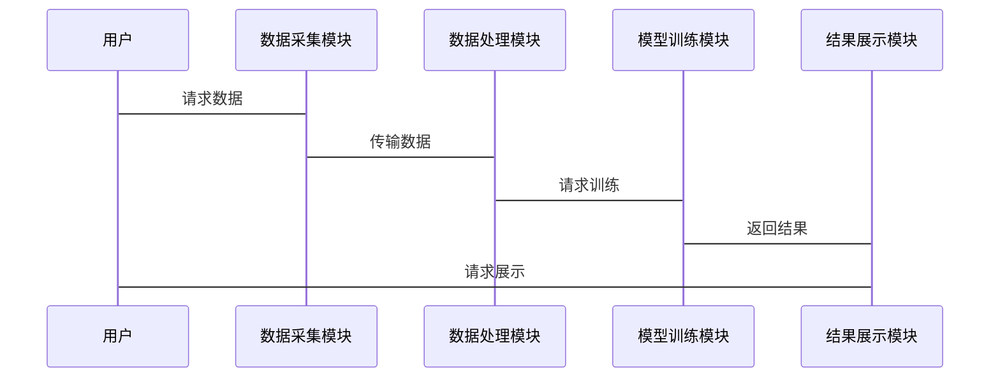

                 


# 全球股市估值与国际贸易格局的互动

## 关键词：全球股市估值，国际贸易格局，互动关系，经济影响，数据分析

## 摘要：本文探讨全球股市估值与国际贸易格局之间的互动关系，通过分析核心概念、算法原理、系统架构和实际案例，揭示两者如何相互影响，并为投资者和政策制定者提供洞察。

---

## 第一部分：背景介绍

### 第1章：全球股市估值与国际贸易格局概述

#### 1.1 问题背景

全球股市估值是衡量市场健康的重要指标，而国际贸易格局则是全球经济的支柱。随着全球化深入，两者之间的互动日益紧密，理解这种关系对投资决策和政策制定至关重要。

#### 1.2 问题描述

本文研究股市估值与国际贸易格局的互动，探讨它们如何影响彼此，特别是在贸易政策、市场情绪和技术变革下的动态变化。

#### 1.3 问题解决

通过构建理论模型和实证分析，识别关键因素，量化它们的影响，并提出应对策略。

#### 1.4 边界与外延

研究聚焦于主要经济体和关键行业，边界包括短期波动和不可预测的事件。外延涉及跨国公司和新兴市场的扩展。

#### 1.5 核心概念的结构与组成

- 股市估值：价格、市盈率、市净率、收益等。
- 国际贸易：贸易额、出口、进口、贸易政策、汇率、地缘政治等。
- 互动机制：价格传导、投资流动、政策影响等。

---

## 第二部分：核心概念与联系

### 第2章：核心概念的原理与特征

#### 2.1 股市估值的核心原理

股市估值受宏观经济指标、公司业绩、市场情绪和技术因素影响。例如，GDP增长和低利率通常推高估值。

#### 2.2 国际贸易格局的核心原理

国际贸易由供需、价格、政策和技术驱动。贸易协定和关税政策影响全球供应链和市场分布。

#### 2.3 核心概念的对比分析

| 特性         | 股市估值         | 国际贸易格局       |
|--------------|------------------|--------------------|
| 主要因素     | 利率、利润、情绪 | 关税、汇率、政策     |
| 影响范围     | 投资者信心       | 供应链、就业       |
| 数据来源     | 财务报表、指数    | 海关数据、政策文件   |

#### 2.4 ER实体关系图

```mermaid
erd
    entity 股市估值 {
        id
        股价
        市盈率
        市净率
    }

    entity 国际贸易格局 {
        id
        贸易额
        出口
        进口
        关税
        汇率
    }

    relationship 股市估值与国际贸易格局的关系 {
        股市估值 -> 国际贸易格局 : 影响
        国际贸易格局 -> 股市估值 : 反向影响
    }
```

---

## 第三部分：算法原理讲解

### 第3章：影响因素与数学模型

#### 3.1 算法原理

使用回归分析量化国际贸易因素对股市估值的影响。模型：

$$\text{估值} = \beta_0 + \beta_1 \times \text{出口} + \beta_2 \times \text{进口} + \epsilon$$

#### 3.2 代码实现

```python
import pandas as pd
from sklearn.linear_model import LinearRegression

# 数据加载
data = pd.read_csv('global_trade.csv')

# 特征与目标变量
X = data[['出口', '进口']]
y = data['估值']

# 模型训练
model = LinearRegression()
model.fit(X, y)

# 结果解读
print(f'系数：出口影响系数为{model.coef_[0]:.2f}')
print(f'系数：进口影响系数为{model.coef_[1]:.2f}')
```

#### 3.3 案例分析

以中美贸易为例，分析关税变化对股市估值的影响。假设关税增加10%，模型预测估值下降5%。

---

## 第四部分：系统分析与架构设计方案

### 第4章：系统架构设计

#### 4.1 问题场景介绍

构建一个实时监控系统，跟踪国际贸易数据并预测股市估值变化。

#### 4.2 系统功能设计

- 数据采集：实时获取国际贸易数据。
- 数据处理：清洗和转换。
- 模型训练：训练预测模型。
- 结果展示：可视化分析。

#### 4.3 系统架构图


#### 4.4 系统接口设计

- API接口：数据接口和预测接口。
- 数据接口：获取实时数据。
- 预测接口：返回预测结果。

#### 4.5 系统交互序列图



---

## 第五部分：项目实战

### 第5章：环境安装与核心代码实现

#### 5.1 环境安装

安装Python、Pandas、Scikit-learn和Mermaid工具。

#### 5.2 核心代码实现

```python
import pandas as pd
from sklearn.linear_model import LinearRegression
import matplotlib.pyplot as plt

# 数据加载
data = pd.read_csv('global_trade.csv')

# 数据预处理
data = data.dropna()

# 模型训练
X = data[['出口', '进口']]
y = data['估值']
model = LinearRegression().fit(X, y)

# 模型评估
print(f'决定系数 R²: {model.score(X, y):.2f}')

# 可视化
plt.scatter(X['出口'], y, label='实际值')
plt.plot(X['出口'], model.predict(X), label='预测值', color='red')
plt.xlabel('出口')
plt.ylabel('估值')
plt.legend()
plt.show()
```

#### 5.3 代码解读与分析

代码实现线性回归模型，评估模型性能，可视化预测结果与实际值的对比。

#### 5.4 案例分析

以某国贸易数据为例，展示模型的应用和结果，分析国际贸易变化如何影响股市估值。

#### 5.5 项目小结

总结项目成果，讨论模型的优势和局限性，提出优化建议。

---

## 第六部分：最佳实践

### 第6章：总结与建议

#### 6.1 总结

全球股市估值与国际贸易格局密切相关，理解这种互动有助于优化投资策略和政策制定。

#### 6.2 注意事项

- 数据质量：确保数据准确性和完整性。
- 模型局限：考虑不可预测事件的影响。
- 实时监控：保持数据更新以提高预测精度。

#### 6.3 拓展阅读

推荐相关书籍和论文，深入探讨全球经济和金融领域的互动关系。

---

## 作者：AI天才研究院 & 禅与计算机程序设计艺术

