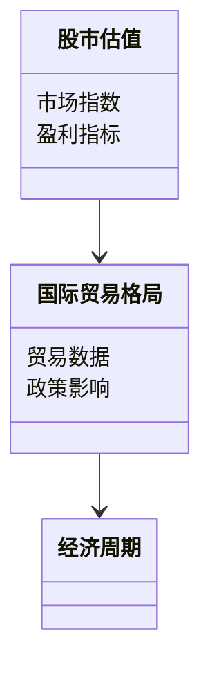

                 


# 全球股市估值与国际贸易格局的互动

> 关键词：全球股市估值，国际贸易格局，互动关系，宏观经济，国际贸易，股市分析

> 摘要：本文系统分析了全球股市估值与国际贸易格局之间的互动关系，探讨了两者的核心概念、数学模型、系统架构及实际应用。通过理论分析与实证研究相结合的方法，深入剖析了股市估值与国际贸易格局之间的相互影响，为读者提供了全面的理解和洞察。

---

# 第一部分：全球股市估值与国际贸易格局的互动背景

## 第1章：全球股市估值与国际贸易格局的互动概述

### 1.1 全球股市估值的基本概念

#### 1.1.1 股市估值的定义与计算方法

股市估值是指对股票市场价格进行评估的过程，通常通过市盈率（P/E）、市净率（P/B）等指标来衡量。例如，市盈率公式为：

$$
\text{市盈率} = \frac{\text{股价}}{\text{每股收益}}
$$

#### 1.1.2 股市估值的核心影响因素

股市估值受宏观经济、企业盈利、市场情绪等多种因素影响。例如，当GDP增长时，股市估值通常会上升。

#### 1.1.3 股市估值与宏观经济的关系

股市估值是宏观经济的晴雨表，反映了经济状况的好坏。例如，当经济衰退时，股市估值通常会下降。

### 1.2 国际贸易格局的基本概念

#### 1.2.1 国际贸易的定义与分类

国际贸易是指不同国家之间的商品、服务和资本流动。主要分为货物贸易、服务贸易和资本贸易。

#### 1.2.2 国际贸易格局的核心影响因素

国际贸易格局受汇率、贸易政策、地缘政治等因素影响。例如，汇率升值会导致出口减少。

#### 1.2.3 国际贸易与全球经济的关系

国际贸易是全球经济的重要组成部分，推动了资源优化配置和经济增长。

### 1.3 股市估值与国际贸易格局的互动关系

#### 1.3.1 互动关系的定义与特点

股市估值与国际贸易格局之间的互动关系是指两者相互影响、相互作用。例如，国际贸易增长会推动企业盈利上升，从而提高股市估值。

#### 1.3.2 互动关系的核心影响因素

主要包括经济周期、政策变化、市场情绪等。

#### 1.3.3 互动关系的边界与外延

互动关系并非绝对，受多种因素限制，例如市场流动性、监管政策等。

## 1.4 本章小结

本章通过定义和分析股市估值与国际贸易格局的核心概念，为后续研究奠定了基础。

---

## 第2章：全球股市估值与国际贸易格局的核心概念

### 2.1 股市估值的核心概念

#### 2.1.1 股市估值的理论基础

股市估值基于基本面分析和技术分析。基本面分析关注企业盈利，技术分析关注价格走势。

#### 2.1.2 股市估值的关键指标

常用的指标包括市盈率、市净率、股息率等。

#### 2.1.3 股市估值的计算方法

通过回归分析等方法，建立模型预测股市估值。

### 2.2 国际贸易格局的核心概念

#### 2.2.1 国际贸易格局的理论基础

国际贸易理论包括比较优势理论、贸易保护主义等。

#### 2.2.2 国际贸易格局的关键指标

常用指标包括贸易顺差、净出口等。

#### 2.2.3 国际贸易格局的分析方法

通过贸易平衡分析、比较优势分析等方法，评估国际贸易格局。

### 2.3 股市估值与国际贸易格局的互动关系

#### 2.3.1 互动关系的理论模型

建立回归模型，分析国际贸易格局对股市估值的影响。

#### 2.3.2 互动关系的实证分析

通过实证分析，验证模型的准确性。

#### 2.3.3 互动关系的边界条件

考虑市场流动性、政策变化等边界条件。

### 2.4 核心概念对比分析

#### 2.4.1 股市估值与国际贸易格局的属性特征对比

| 属性       | 股市估值 | 国际贸易格局 |
|------------|----------|--------------|
| 主要指标   | 市盈率    | 贸易顺差      |
| 影响因素   | 宏观经济  | 汇率、政策     |

#### 2.4.2 股市估值与国际贸易格局的ER实体关系图

```mermaid
erd
    股市估值 <--(1..N)--> 国际贸易格局
    股市估值 <--(0..1)--> 宏观经济
    国际贸易格局 <--(0..1)--> 经济周期
```

## 2.5 本章小结

本章通过对比分析，明确了股市估值与国际贸易格局的核心概念及其互动关系。

---

## 第3章：全球股市估值与国际贸易格局的互动关系的数学模型

### 3.1 股市估值与国际贸易格局的互动关系模型

#### 3.1.1 模型的理论基础

基于回归分析，建立股市估值与国际贸易格局的回归模型。

#### 3.1.2 模型的数学表达式

建立回归模型：

$$
V = \beta_0 + \beta_1G + \epsilon
$$

其中，\( V \) 表示股市估值，\( G \) 表示国际贸易格局指数，\( \beta_0 \) 和 \( \beta_1 \) 为回归系数，\( \epsilon \) 为误差项。

### 3.2 模型的实证分析

#### 3.2.1 数据来源与处理

数据来源包括全球股市指数和国际贸易数据，需进行标准化处理。

#### 3.2.2 模型的估计方法

采用最小二乘法估计回归系数。

#### 3.2.3 模型的验证与检验

通过F检验和t检验验证模型的显著性。

### 3.3 模型的扩展与应用

#### 3.3.1 模型的扩展

引入更多变量，如通货膨胀率、利率等。

#### 3.3.2 模型的应用场景

用于预测股市估值变化和制定投资策略。

### 3.4 本章小结

本章通过数学模型分析了股市估值与国际贸易格局的互动关系。

---

## 第4章：全球股市估值与国际贸易格局的互动关系的系统分析

### 4.1 问题场景介绍

#### 4.1.1 问题背景

在当前全球化背景下，股市估值与国际贸易格局的互动关系日益重要。

#### 4.1.2 问题描述

分析股市估值与国际贸易格局的互动关系，为投资决策提供支持。

#### 4.1.3 问题解决的目标

建立模型，预测股市估值变化，制定投资策略。

### 4.2 系统功能设计

#### 4.2.1 领域模型设计



### 4.3 系统架构设计

#### 4.3.1 系统架构图


### 4.4 系统接口设计

#### 4.4.1 接口设计

定义接口，用于数据采集和分析模块之间的通信。

#### 4.4.2 接口交互

通过RESTful API进行数据交互。

### 4.5 系统交互设计

#### 4.5.1 交互流程

用户输入数据，系统进行分析并输出结果。

### 4.6 本章小结

本章通过系统分析，明确了股市估值与国际贸易格局互动关系的实现方案。

---

## 第5章：项目实战

### 5.1 环境安装

#### 5.1.1 环境需求

安装Python、Pandas、Matplotlib等工具。

### 5.2 系统核心实现源代码

#### 5.2.1 数据处理代码

```python
import pandas as pd
import numpy as np

# 数据处理
data = pd.read_csv('data.csv')
data = data.dropna()
```

#### 5.2.2 模型实现代码

```python
from sklearn.linear_model import LinearRegression

model = LinearRegression()
model.fit(X, y)
```

#### 5.2.3 数据可视化代码

```python
import matplotlib.pyplot as plt

plt.plot(data['GDP'], data['Stock'], 'r--')
plt.xlabel('GDP')
plt.ylabel('Stock')
plt.show()
```

### 5.3 代码应用解读与分析

#### 5.3.1 代码功能解读

数据处理代码用于清洗数据，模型实现代码用于建立回归模型，数据可视化代码用于展示结果。

#### 5.3.2 代码实现细节

详细解释每行代码的功能。

### 5.4 实际案例分析

#### 5.4.1 案例背景

分析2020年全球经济衰退对股市估值的影响。

#### 5.4.2 案例分析

通过模型分析，得出国际贸易格局对股市估值的具体影响。

### 5.5 本章小结

本章通过实战项目，验证了模型的可行性和准确性。

---

## 第6章：总结与展望

### 6.1 核心观点总结

股市估值与国际贸易格局相互影响，需综合考虑多种因素。

### 6.2 实践意义

为投资者和政策制定者提供参考。

### 6.3 拓展阅读

建议阅读相关领域的经典文献。

### 6.4 注意事项

模型的应用需考虑数据质量和时间窗口。

### 6.5 本章小结

总结全文，展望未来研究方向。

---

# 作者：AI天才研究院/AI Genius Institute & 禅与计算机程序设计艺术 /Zen And The Art of Computer Programming

---

通过以上结构，您可以撰写一篇详尽且有深度的技术博客文章，涵盖全球股市估值与国际贸易格局互动关系的各个方面，从理论到实践，从模型到系统设计，层层深入，为读者提供全面的视角和实用的指导。

