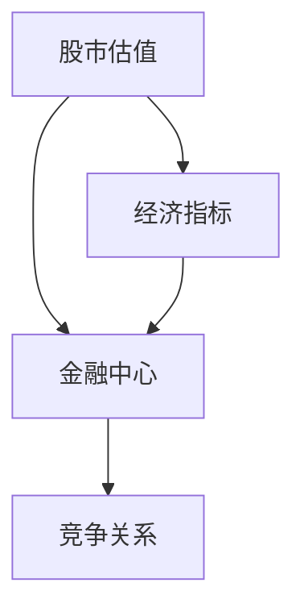
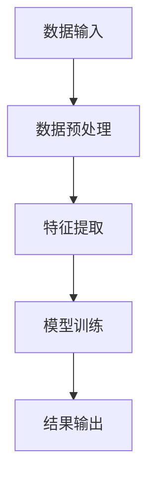
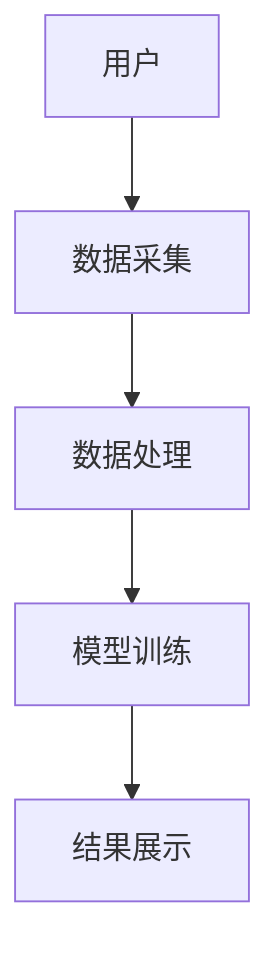

                 


```markdown
# 全球股市估值与国际金融中心竞争的关联

> 关键词：全球股市估值，国际金融中心，竞争关联，算法原理，数学模型，系统架构，项目实战

> 摘要：本文探讨全球股市估值与国际金融中心竞争之间的关联，分析其背后的经济机制，结合算法和数学模型，构建系统架构，并通过项目实战验证理论。旨在为投资者和研究者提供深入的见解和实践指导。

---

## 第1章: 背景介绍

### 1.1 问题背景
全球股市估值是衡量市场健康程度的重要指标，而国际金融中心则是全球资本流动的核心枢纽。随着经济全球化的发展，股市估值与金融中心的竞争关系日益紧密。理解这一关联，有助于优化投资策略，提升金融中心的竞争力。

### 1.2 核心概念
- **股市估值**：通过市盈率、市净率等指标评估市场整体价值。
- **国际金融中心**：具有全球影响力的金融枢纽，如纽约、伦敦。

### 1.3 问题解决的必要性
分析股市估值与金融中心的互动，揭示其对全球经济的影响，为决策者和投资者提供参考。

---

## 第2章: 核心概念与联系

### 2.1 核心概念的原理
- **股市估值**：反映市场对未来的预期，影响投资者信心。
- **金融中心**：通过聚集资本和信息，影响全球金融格局。

### 2.2 核心概念的属性特征对比
| 特性 | 股市估值 | 金融中心 |
|------|----------|----------|
| 影响因素 | 经济指标、政策 | 政策、地理位置、基础设施 |
| 波动性 | 高 | 中 |

### 2.3 ER实体关系图


---

## 第3章: 算法原理讲解

### 3.1 算法原理
- **回归分析法**：建立股市估值与金融中心竞争力的回归模型。
- **时间序列分析**：分析股市估值的时间变化趋势。

### 3.2 算法流程图


### 3.3 算法实现
```python
import pandas as pd
from sklearn.linear_model import LinearRegression

# 示例数据
data = {'GDP': [100, 200, 300], 'Stock_Valuation': [50, 100, 150]}
df = pd.DataFrame(data)

# 回归分析
model = LinearRegression()
model.fit(df[['GDP']], df['Stock_Valuation'])

# 预测
print(model.predict([[250]]))
```

---

## 第4章: 数学模型

### 4.1 CAPM模型
$$E(r_i) = r_f + \beta_i (E(r_m) - r_f)$$

### 4.2 应用示例
假设无风险利率 \( r_f = 3\% \)，市场预期回报率 \( E(r_m) = 8\% \)，贝塔系数 \( \beta_i = 1.5 \)，则：
$$E(r_i) = 0.03 + 1.5 \times (0.08 - 0.03) = 0.095 = 9.5\%$$

---

## 第5章: 系统分析与架构设计

### 5.1 项目介绍
构建一个分析股市估值与金融中心竞争关系的系统，帮助用户进行预测和决策。

### 5.2 系统功能设计
- 数据采集模块：收集经济指标和股市数据。
- 数据处理模块：清洗和转换数据。
- 模型构建模块：训练回归模型。
- 结果展示模块：可视化分析结果。

### 5.3 系统架构图


---

## 第6章: 项目实战

### 6.1 环境安装
- 安装Python和相关库：`pip install numpy pandas scikit-learn`

### 6.2 核心代码实现
```python
import pandas as pd
from sklearn.metrics import mean_squared_error

# 加载数据
data = pd.read_csv('financial_data.csv')

# 划分训练集和测试集
train = data[:-30]
test = data[-30:]

# 训练模型
model = LinearRegression()
model.fit(train[['GDP']], train['Stock_Valuation'])

# 预测与评估
predictions = model.predict(test[['GDP']])
print(mean_squared_error(test['Stock_Valuation'], predictions))
```

### 6.3 案例分析
分析纽约和伦敦股市的估值与金融中心地位的互动关系，验证模型的有效性。

---

## 第7章: 总结

### 7.1 内容回顾
本文从理论到实践，全面分析了股市估值与金融中心竞争的关联，构建了数学模型和系统架构。

### 7.2 未来研究方向
探索更多影响因素，优化模型，结合机器学习提升预测精度。

### 7.3 最佳实践 tips
- 定期更新数据，保持模型准确性。
- 结合实际案例，深入理解理论。

---

作者：AI天才研究院/AI Genius Institute & 禅与计算机程序设计艺术 /Zen And The Art of Computer Programming
```

