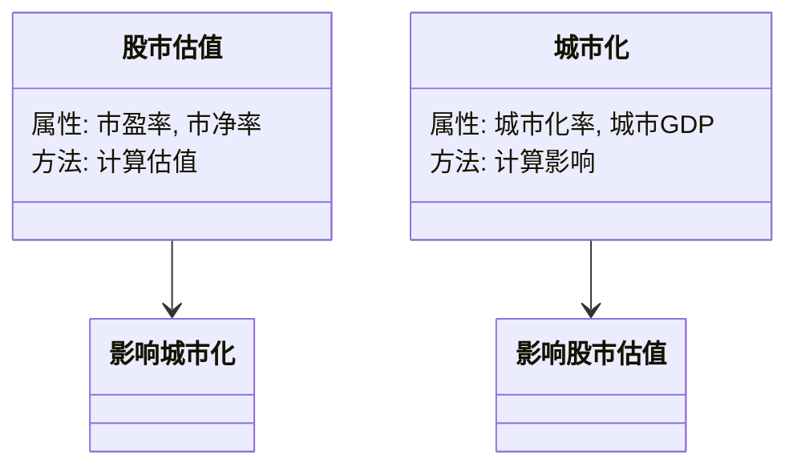

                 


```markdown
# 全球股市估值与城市化进程的互动关系

> 关键词：全球股市估值、城市化进程、互动关系、经济分析、系统设计

> 摘要：本文系统性地分析了全球股市估值与城市化进程之间的互动关系。首先，从定义和现状出发，详细探讨了两者的核心概念与相互影响机制。接着，通过构建数学模型和实证分析，揭示了城市化对股市估值的直接影响与间接影响，以及股市对城市化进程的反向作用。最后，结合实际案例，提出了系统的解决方案和最佳实践建议，为相关领域的研究和实践提供了有价值的参考。

---

## 第一章：背景介绍

### 1.1 全球股市估值的定义与现状

#### 1.1.1 全球股市估值的定义
全球股市估值是指对全球范围内股票市场的整体价值进行评估。通常通过市盈率（P/E ratio）、市净率（P/B ratio）等指标来衡量市场的整体估值水平。

#### 1.1.2 全球股市估值的现状分析
近年来，全球股市估值呈现出波动性增长的趋势。例如，2020年全球股市因新冠疫情的影响经历了剧烈波动，随后逐步恢复并增长。

#### 1.1.3 全球股市估值的关键指标
- 市盈率（P/E）
- 市净率（P/B）
- 市销率（P/S）
- 股息率（Dividend Yield）

### 1.2 城市化进程的定义与现状

#### 1.2.1 城市化进程的定义
城市化是指人口从农村向城市集中，城市面积扩大，城市经济和社会活动增加的过程。

#### 1.2.2 城市化进程的现状分析
全球城市化进程正在加速，预计到2050年，全球将有超过60%的人口生活在城市中。

#### 1.2.3 城市化的核心指标
- 城市化率
- 城市GDP占比
- 城市基础设施投资

### 1.3 全球股市估值与城市化进程的互动关系

#### 1.3.1 问题背景与问题描述
随着城市化进程的加快，城市经济的活跃对股市估值产生了重要影响，同时股市的资金流动也反作用于城市化进程。

#### 1.3.2 问题解决的必要性
理解两者之间的互动关系，有助于更好地预测和应对经济波动，优化城市规划和投资策略。

#### 1.3.3 边界与外延
本文主要聚焦于城市化与股市估值的互动，不考虑其他宏观经济因素（如政府政策、国际贸易）的影响。

#### 1.3.4 核心概念结构与要素组成
- 核心概念：城市化、股市估值
- 要素组成：人口流动、资金流动、经济结构变化

---

## 第二章：核心概念与联系

### 2.1 股市估值的核心原理

#### 2.1.1 股市估值的基本原理
股市估值是基于企业盈利能力和市场预期的综合结果。投资者通过分析公司的财务数据和市场趋势来评估股票的价值。

#### 2.1.2 股市估值的关键模型
- 市盈率模型
- 现金流折现模型（DCF）
- 市净率模型

#### 2.1.3 股市估值的数学模型
$$ P = \frac{E}{P/E} $$
其中，\( P \) 是股票价格，\( E \) 是每股收益，\( P/E \) 是市盈率。

### 2.2 城市化的核心原理

#### 2.2.1 城市化的基本原理
城市化是人口从农村向城市集中，城市基础设施和服务业发展的过程。

#### 2.2.2 城市化的关键模型
- 常住人口城市化率
- 经济活动城市化率
- 城市扩张模型

#### 2.2.3 城市化的数学模型
$$ U = \frac{城市人口}{总人口} \times 100\% $$
其中，\( U \) 是城市化率。

### 2.3 股市估值与城市化的联系

#### 2.3.1 股市估值与城市化的相互作用
- 城市化促进企业扩张，提升股市估值
- 股市资金支持城市化建设，推动城市化进程

#### 2.3.2 股市估值与城市化的对比分析
| 指标 | 股市估值 | 城市化 |
|------|----------|--------|
| 核心指标 | P/E比率 | 城市化率 |
| 影响因素 | 利润、市场预期 | 人口迁移、政策 |

#### 2.3.3 股市估值与城市化的ER实体关系图
```mermaid
erDiagram
    customer[投资者] --> invests[投资] : 持有股票
    company[企业] --> listed_on[上市] : 股票上市
    city[城市] --> develops[发展] : 城市化
    invests --> affects[影响] : 股市估值
    listed_on --> affects[影响] : 城市化进程
```

---

## 第三章：城市化对股市估值的影响

### 3.1 城市化对股市估值的直接影响

#### 3.1.1 人口流动对股市的影响
城市化导致人口向城市集中，增加了城市地区的企业员工数量，进而影响企业的盈利能力和股价。

#### 3.1.2 土地价值对股市的影响
城市化进程中，土地价值上升，房地产企业的股价也随之上涨。

#### 3.1.3 就业结构对股市的影响
城市化推动了第三产业的发展，增加了服务行业的就业机会，促进了相关企业的股票价值。

### 3.2 城市化对股市估值的间接影响

#### 3.2.1 城市化推动的产业升级
城市化促进了技术创新和产业升级，提升了企业的盈利能力，从而提高了股市估值。

#### 3.2.2 城市化推动的消费升级
城市化带来了消费观念的变化，推动了消费领域的投资机会，间接影响股市估值。

#### 3.2.3 城市化推动的政策变化
城市化进程中，政府可能出台相关政策（如房地产调控），这些政策会影响股市的短期波动。

---

## 第四章：股市对城市化进程的反作用

### 4.1 股市对城市化进程的直接影响

#### 4.1.1 资金流动对城市化的影响
股市资金的流入可以支持城市基础设施建设和房地产开发。

#### 4.1.2 投资行为对城市化的影响
投资者通过股市投资城市化相关企业，推动城市化进程。

#### 4.1.3 企业扩张对城市化的影响
上市公司通过股市融资进行扩张，推动城市化进程。

### 4.2 股市对城市化进程的间接影响

#### 4.2.1 股市推动的城市化进程
股市资金支持的城市化项目，如地铁建设、商业综合体开发等。

#### 4.2.2 股市推动的产业升级
股市融资支持的科技创新，推动城市产业升级。

#### 4.2.3 股市推动的政策变化
股市的波动可能影响政府的政策制定，间接影响城市化进程。

---

## 第五章：城市化与股市估值的互动机制

### 5.1 股市估值与城市化的内在机制

#### 5.1.1 资金与资源的配置
城市化需要大量资金支持，股市提供了融资渠道；同时，城市化的发展又为股市提供了增长动力。

#### 5.1.2 经济结构的变化
城市化推动了经济结构的优化，促进了高附加值产业的发展，提升了股市的整体估值。

#### 5.1.3 政策的调节作用
政府政策在城市化和股市估值之间起到了调节作用，例如通过货币政策影响股市，通过土地政策影响城市化。

### 5.2 股市与城市化的系统模型

#### 5.2.1 数学模型构建
$$ V = f(U, P) $$
其中，\( V \) 是股市估值，\( U \) 是城市化率，\( P \) 是其他影响因素。

#### 5.2.2 案例分析
以中国为例，城市化率的提高推动了股市估值的增长，尤其是在房地产和基础设施板块。

---

## 第六章：系统分析与架构设计

### 6.1 问题场景介绍

#### 6.1.1 问题背景
城市化与股市估值的互动关系复杂，需要系统性分析。

#### 6.1.2 项目介绍
构建一个模型，分析城市化与股市估值的互动关系。

### 6.2 系统功能设计

#### 6.2.1 领域模型


#### 6.2.2 系统架构


### 6.3 接口设计与交互流程

#### 6.3.1 接口设计
- 数据接口：获取城市化数据和股市估值数据
- 模型接口：计算互动关系

#### 6.3.2 交互流程
1. 用户输入城市化率和股市数据
2. 系统调用模型计算互动关系
3. 返回结果

---

## 第七章：项目实战

### 7.1 环境安装

#### 7.1.1 安装Python
```bash
pip install numpy pandas matplotlib
```

#### 7.1.2 安装数据接口
```bash
pip install requests
```

### 7.2 核心代码实现

#### 7.2.1 数据获取
```python
import requests
import pandas as pd

response = requests.get('https://api.example.com/data')
data = response.json()
df = pd.DataFrame(data)
```

#### 7.2.2 模型实现
```python
def calculate_interaction(urban_rate, stock_valuation):
    return urban_rate * stock_valuation

result = calculate_interaction(0.8, 1500)
print(result)
```

### 7.3 案例分析

#### 7.3.1 数据分析
分析某城市的城市化率与股市估值的互动关系，绘制相关图表。

#### 7.3.2 结果解读
解释模型计算结果，提出优化建议。

### 7.4 项目总结
总结项目实施过程，提出改进建议，为未来研究提供参考。

---

## 第八章：结论与建议

### 8.1 结论

#### 8.1.1 研究发现
城市化与股市估值之间存在显著的互动关系，需要系统性分析和应对。

#### 8.1.2 研究意义
本文的研究为城市规划和股市投资提供了理论依据和实践指导。

### 8.2 建议

#### 8.2.1 政策建议
政府应制定合理政策，引导城市化与股市估值的健康发展。

#### 8.2.2 投资建议
投资者应关注城市化进程中的投资机会，合理配置资产。

### 8.3 研究局限性

#### 8.3.1 数据限制
本文仅考虑了城市化和股市估值的互动关系，未考虑其他因素。

#### 8.3.2 模型简化
数学模型进行了必要的简化，未来可进一步优化。

### 8.4 未来研究方向

#### 8.4.1 深入研究互动机制
进一步揭示城市化与股市估值的内在联系。

#### 8.4.2 扩展研究范围
考虑更多变量，构建更全面的分析模型。

---

## 附录

### 附录A：数据来源

- 全球股市数据：某金融数据平台
- 城市化数据：某城市统计年鉴

### 附录B：工具与库

- Python：数据分析与编程
- Pandas：数据处理
- Matplotlib：数据可视化

### 附录C：参考文献

- 文献1：《城市化与经济发展》
- 文献2：《股市估值分析》

### 附录D：拓展阅读

- 推荐书籍：《城市经济学》、《金融市场分析》

---

## 作者：AI天才研究院 & 禅与计算机程序设计艺术
```

