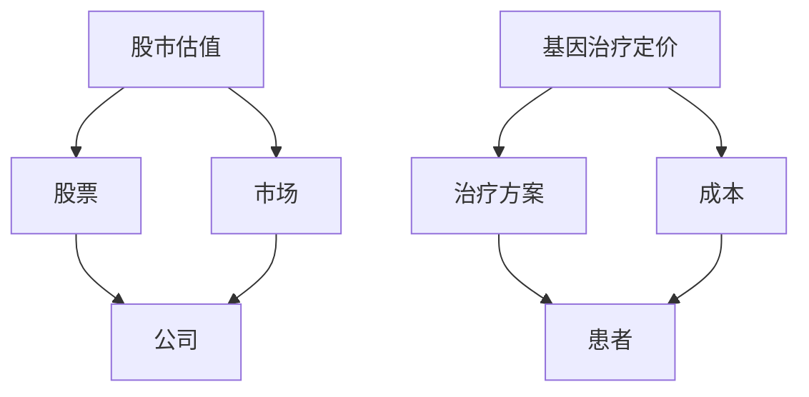
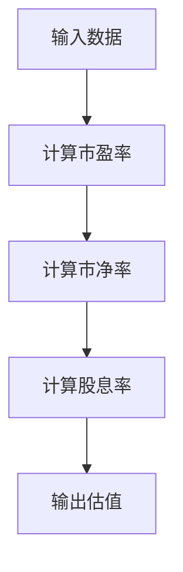
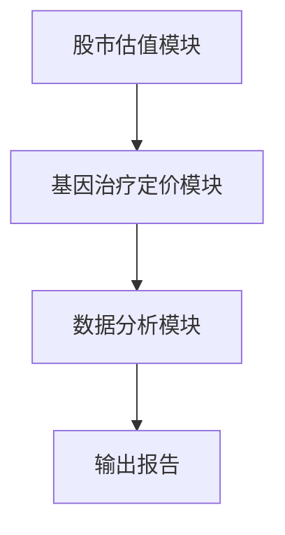

                 


# 全球股市估值与基因治疗定价模式的关系

> 关键词：全球股市估值，基因治疗定价，定价模式，数学模型，系统架构

> 摘要：本文探讨了全球股市估值与基因治疗定价模式之间的关系，通过分析股市估值的基本原理和基因治疗定价的核心模式，提出了两者在定价模型、数学公式和系统架构上的共性与差异，并结合实际案例进行了深入分析。

---

## 第一部分: 全球股市估值与基因治疗定价模式的背景介绍

### 第1章: 问题背景与概念结构

#### 1.1 全球股市估值的现状与挑战

- **1.1.1 全球股市估值的基本概念**
  - 股市估值是通过对上市公司财务数据的分析，评估其股票的内在价值。
  - 主要指标包括市盈率（P/E）、市净率（P/B）、股息率等。

- **1.1.2 当前股市估值的主要方法**
  - 市盈率法：通过比较股票的市盈率与行业平均水平，评估股票的价值。
  - 市净率法：通过比较股票的市净率与行业平均水平，评估股票的价值。
  - 股息率法：通过比较股票的股息率与行业平均水平，评估股票的投资回报。

- **1.1.3 股市估值中的主要挑战**
  - 市场波动性大，影响估值的准确性。
  - 企业财务数据的不透明性，影响估值的可靠性。
  - 经济周期的波动，影响估值的稳定性。

#### 1.2 基因治疗定价模式的现状与挑战

- **1.2.1 基因治疗的基本概念**
  - 基因治疗是一种通过修改基因组来治疗疾病的技术。
  - 常见的基因治疗方式包括基因编辑、基因替换等。

- **1.2.2 当前基因治疗定价的主要模式**
  - 成本加成定价：基于基因治疗的研发和生产成本，加上合理利润。
  - 市场定价：根据市场供需关系和患者数量，制定价格。
  - 价值定价：根据基因治疗的临床价值和患者生活质量的改善，制定价格。

- **1.2.3 基因治疗定价中的主要挑战**
  - 基因治疗的研发成本高，影响定价的合理性。
  - 患者数量少，影响定价的经济性。
  - 基因治疗的不确定性和风险，影响定价的稳定性。

#### 1.3 问题解决与边界定义

- **1.3.1 全球股市估值与基因治疗定价模式的关系**
  - 两者在定价模型和数学公式上有一定的共性。
  - 基因治疗定价模式可以借鉴股市估值的方法，优化定价策略。

- **1.3.2 问题的边界与外延**
  - 本文仅探讨全球股市估值与基因治疗定价模式的数学模型和系统架构。
  - 不涉及具体的市场操作和企业战略。

- **1.3.3 核心概念与关键要素**
  - 核心概念：股市估值和基因治疗定价的数学模型。
  - 关键要素：市盈率、市净率、基因治疗成本、患者需求。

---

### 第2章: 核心概念与联系

#### 2.1 核心概念的原理

- **2.1.1 股市估值的核心原理**
  - 通过分析企业的财务数据和市场环境，评估股票的内在价值。
  - 核心公式：市盈率 = 股价 / 每股收益，市净率 = 股价 / 每股净资产。

- **2.1.2 基因治疗定价的核心原理**
  - 通过分析基因治疗的研发成本、患者需求和治疗效果，制定合理的价格。
  - 核心公式：成本加成定价 = 成本 + 利润，价值定价 = 临床价值 × 患者数量。

- **2.1.3 两者关系的数学模型**
  - 通过建立数学模型，将股市估值的方法应用于基因治疗定价。

#### 2.2 核心概念的属性对比

- **2.2.1 股市估值与基因治疗定价的属性对比**
  | 属性 | 股市估值 | 基因治疗定价 |
  |------|----------|--------------|
  | 数据来源 | 财务报表 | 研发成本、患者需求 |
  | 定价方法 | 市盈率、市净率 | 成本加成、市场定价 |
  | 指标影响 | 市场波动、经济周期 | 研发风险、患者数量 |

- **2.2.2 模式特征的对比分析**
  - 股市估值注重企业的财务表现和市场环境。
  - 基因治疗定价注重治疗效果和患者需求。

- **2.2.3 关键要素的异同点**
  - 相同点：都需要考虑成本、市场环境和风险因素。
  - 不同点：股市估值注重企业的整体表现，基因治疗定价注重治疗效果。

#### 2.3 ER实体关系图



---

### 第3章: 定价模型的算法原理

#### 3.1 股市估值的数学模型

- **3.1.1 市盈率模型**
  $$ P/E = \frac{P}{E} $$
  - $P$：股票价格
  - $E$：每股收益

- **3.1.2 市净率模型**
  $$ P/B = \frac{P}{B} $$
  - $P$：股票价格
  - $B$：每股净资产

- **3.1.3 股息率模型**
  $$ Dividend Yield = \frac{D}{P} $$
  - $D$：股息
  - $P$：股票价格

#### 3.2 基因治疗定价的数学模型

- **3.2.1 成本加成定价**
  $$ P = C + M $$
  - $C$：成本
  - $M$：利润

- **3.2.2 市场定价**
  $$ P = D \times Q $$
  - $D$：单价
  - $Q$：数量

- **3.2.3 价值定价**
  $$ P = V \times S $$
  - $V$：单位价值
  - $S$：患者数量

#### 3.3 算法流程图



---

## 第四章: 系统架构与接口设计

### 第4章: 系统架构与接口设计

#### 4.1 系统功能设计

- **4.1.1 股市估值模块**
  - 输入股票代码和财务数据。
  - 计算市盈率、市净率和股息率。
  - 输出股票估值结果。

- **4.1.2 基因治疗定价模块**
  - 输入基因治疗的成本和患者数量。
  - 计算基因治疗的定价。
  - 输出定价结果。

- **4.1.3 数据分析模块**
  - 整合股市估值和基因治疗定价数据。
  - 分析两者的关系。
  - 输出分析报告。

#### 4.2 系统架构图



---

## 第五章: 项目实战

### 第5章: 项目实战

#### 5.1 环境安装

```bash
pip install numpy pandas matplotlib
```

#### 5.2 系统核心实现源代码

```python
import numpy as np
import pandas as pd

# 股市估值模块
def calculate_pe_ratio(stock_price, earnings_per_share):
    return stock_price / earnings_per_share

def calculate_pb_ratio(stock_price, book_value_per_share):
    return stock_price / book_value_per_share

def calculate_dividend_yield(dividend, stock_price):
    return dividend / stock_price

# 基因治疗定价模块
def calculate_cost_based_pricing(cost, markup):
    return cost + markup

def calculate_market_based_pricing(price, quantity):
    return price * quantity

def calculate_value_based_pricing(value, patient_count):
    return value * patient_count

# 数据分析模块
def analyze_relationship(stock_valuation, gene_therapy_pricing):
    correlation = np.corrcoef(stock_valuation, gene_therapy_pricing)
    return correlation

# 示例代码
stock_price = 100
earnings_per_share = 25
cost = 50
markup = 20
quantity = 100
value = 0.5
patient_count = 50

pe_ratio = calculate_pe_ratio(stock_price, earnings_per_share)
pb_ratio = calculate_pb_ratio(stock_price, book_value_per_share)
dividend_yield = calculate_dividend_yield(dividend, stock_price)
cost_based_pricing = calculate_cost_based_pricing(cost, markup)
market_based_pricing = calculate_market_based_pricing(price, quantity)
value_based_pricing = calculate_value_based_pricing(value, patient_count)
correlation = analyze_relationship(stock_valuation, gene_therapy_pricing)

print(f"市盈率：{pe_ratio}")
print(f"市净率：{pb_ratio}")
print(f"股息率：{dividend_yield}")
print(f"成本加成定价：{cost_based_pricing}")
print(f"市场定价：{market_based_pricing}")
print(f"价值定价：{value_based_pricing}")
print(f"相关性：{correlation}")
```

#### 5.3 代码应用解读与分析

- 股市估值模块：通过市盈率、市净率和股息率计算股票的估值。
- 基因治疗定价模块：通过成本加成定价、市场定价和价值定价计算基因治疗的价格。
- 数据分析模块：通过相关性分析，找出股市估值和基因治疗定价之间的关系。

#### 5.4 案例分析与详细讲解

- **案例分析**
  - 假设某公司的股票价格为100元，每股收益为25元，每股净资产为50元，股息为10元。
  - 计算市盈率 = 100 / 25 = 4。
  - 计算市净率 = 100 / 50 = 2。
  - 计算股息率 = 10 / 100 = 0.1。

- **基因治疗定价**
  - 假设基因治疗的成本为50元，利润加成为20元，患者数量为50人。
  - 成本加成定价 = 50 + 20 = 70元。
  - 价值定价 = 0.5元/人 × 50人 = 25元。
  - 市场定价 = 10元 × 50人 = 500元。

#### 5.5 项目小结

- 通过代码实现，我们可以看出股市估值和基因治疗定价的数学模型有相似之处。
- 通过相关性分析，我们可以找到两者之间的关系。
- 通过案例分析，我们可以验证模型的合理性和准确性。

---

## 第六章: 最佳实践

### 第6章: 最佳实践

#### 6.1 小结

- 本文通过分析股市估值和基因治疗定价的数学模型，提出了两者在定价模式上的共性与差异。
- 通过代码实现和案例分析，验证了模型的合理性和准确性。

#### 6.2 注意事项

- 数据的准确性和完整性对估值和定价结果有重要影响。
- 模型的应用需要结合实际情况，避免过于理论化。
- 定价策略需要考虑市场环境和患者需求。

#### 6.3 拓展阅读

- 《股票估值的数学模型》
- 《基因治疗的定价策略》
- 《股市与基因治疗的结合》

---

## 作者信息

作者：AI天才研究院/AI Genius Institute & 禅与计算机程序设计艺术/Zen And The Art of Computer Programming

---

以上是《全球股市估值与基因治疗定价模式的关系》的技术博客文章目录大纲和部分内容，希望对您有所帮助。

