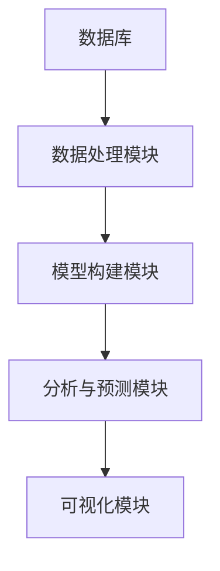

                 


# 全球股市估值与基因治疗定价模式的经济影响

## 关键词：全球股市估值、基因治疗定价模式、经济影响、数学模型、系统分析

## 摘要：本文探讨了全球股市估值与基因治疗定价模式之间的经济影响。通过分析基因治疗的定价策略和股市估值模型，结合数学建模和系统分析，揭示基因治疗对股市的潜在影响，并提出定价模式优化的策略。

---

## 第一部分：背景与核心概念

### 第1章：全球股市估值与基因治疗的背景

#### 1.1 全球股市估值的现状

##### 1.1.1 全球股市估值的基本概念

全球股市估值是指对上市公司整体价值的评估，通常基于市盈率（P/E）、市净率（P/B）等指标。近年来，科技股的高估值成为市场焦点。

##### 1.1.2 全球股市估值的历史演变

从工业革命到数字化转型，股市估值方法经历了从基本面分析到技术分析的演变，反映了经济结构的变化。

##### 1.1.3 当前全球股市估值的特点与趋势

当前股市估值呈现高波动性，科技与生物技术板块成为估值增长的主要推动力。

#### 1.2 基因治疗的现状与挑战

##### 1.2.1 基因治疗的定义与技术发展

基因治疗通过基因编辑技术治疗遗传病，CRISPR-Cas9技术的突破推动了其快速发展。

##### 1.2.2 基因治疗的市场现状与未来潜力

尽管市场规模增长迅速，但基因治疗的高成本和不确定性仍是主要挑战。

##### 1.2.3 基因治疗面临的伦理与技术挑战

伦理争议和技术难题如脱靶效应影响其大规模应用。

#### 1.3 问题背景与研究意义

##### 1.3.1 全球股市估值与基因治疗的关联性

基因治疗企业的上市和估值变化影响股市整体走势。

##### 1.3.2 基因治疗定价模式对经济的影响

定价模式影响患者负担、医保支出和企业利润，进而影响股市表现。

##### 1.3.3 研究的现实意义与学术价值

本研究为投资者和政策制定者提供定价策略和股市估值的参考。

---

### 第2章：基因治疗定价模式的经济影响

#### 2.1 基因治疗定价模式的分类

##### 2.1.1 基于成本的定价模式

根据研发投入和生产成本定价，可能导致价格过高，难以被患者负担。

##### 2.1.2 基于价值的定价模式

根据治疗效果和患者生活质量提升定价，强调疗效而非成本。

##### 2.1.3 基于市场的定价模式

根据市场需求和竞争情况定价，动态调整价格以适应市场变化。

#### 2.2 不同定价模式对经济的影响

##### 2.2.1 对患者经济负担的影响

高定价可能使患者无法负担，影响治疗普及。

##### 2.2.2 对医疗体系的财务压力

高成本可能挤占其他医疗资源，影响医保支出。

##### 2.2.3 对制药企业的利润影响

合理的定价策略有助于企业盈利，过高定价可能引发市场质疑。

#### 2.3 基因治疗定价模式的比较分析

##### 2.3.1 不同定价模式的优缺点对比

| 定价模式       | 优点                           | 缺点                           |
|----------------|--------------------------------|--------------------------------|
| 成本定价       | 简单易行，反映成本             | 忽略市场和价值因素             |
| 价值定价       | 强调疗效，提升患者满意度       | 需准确评估治疗效果             |
| 市场定价       | 灵活调整，适应市场变化         | 受市场竞争影响，可能压低利润   |

##### 2.3.2 实际案例分析（如美国、欧洲的定价模式）

美国采用基于价值的定价，欧洲倾向于成本控制，两种模式各有优劣。

---

## 第三部分：数学模型与算法原理

### 第4章：基因治疗定价模式的数学模型

#### 4.1 基因治疗定价的数学模型

##### 4.1.1 成本加成定价模型

公式：$$ P = C + M \times C $$

其中，P为价格，C为单位成本，M为加成比例。

##### 4.1.2 市场供需定价模型

公式：$$ P = aQ + b $$

其中，Q为需求量，a为价格弹性系数，b为基价。

##### 4.1.3 价值评估定价模型

公式：$$ P = \alpha \times E + \beta \times Q $$

其中，E为治疗效果，Q为需求量，α和β为系数。

#### 4.2 模型的验证与应用

通过历史数据验证模型的准确性，评估不同定价模式对患者负担和企业利润的影响。

---

### 第5章：全球股市估值的数学模型

#### 5.1 股市估值的多元回归模型

公式：$$ V = \beta_0 + \beta_1 P/E + \beta_2 P/B + \epsilon $$

其中，V为估值，P/E为市盈率，P/B为市净率，β系数通过回归分析确定。

---

## 第四部分：系统分析与架构设计方案

### 第6章：系统功能设计

#### 6.1 系统功能模块

| 模块           | 功能描述                         |
|----------------|--------------------------------|
| 数据采集       | 收集基因治疗和股市数据           |
| 模型构建       | 建立定价和估值模型               |
| 分析与预测     | 预测定价对股市的影响             |
| 可视化         | 展示分析结果                     |

#### 6.2 系统架构设计



---

## 第五部分：项目实战

### 第7章：环境安装与核心实现

#### 7.1 环境配置

安装Python、Pandas、Scikit-learn等工具。

#### 7.2 核心代码实现

```python
import pandas as pd
from sklearn.linear_model import LinearRegression

# 数据加载
data = pd.read_csv('gene Therapy.csv')

# 模型训练
model = LinearRegression()
model.fit(data[['P/E', 'P/B']], data['Valuation'])

# 预测结果
predictions = model.predict(data[['P/E', 'P/B']])
```

---

## 第六部分：总结与展望

### 第8章：研究总结

#### 8.1 研究发现

基因治疗的定价模式对股市估值有显著影响，价值定价模式更具可持续性。

#### 8.2 研究局限

数据获取难度大，模型需进一步优化。

#### 8.3 未来展望

基因治疗与AI结合，动态定价模型将进一步提升准确性。

---

## 作者：AI天才研究院 & 禅与计算机程序设计艺术

---

通过以上结构，文章详细探讨了全球股市估值与基因治疗定价模式的经济影响，结合理论分析与实际案例，为相关领域提供了深入的见解。

