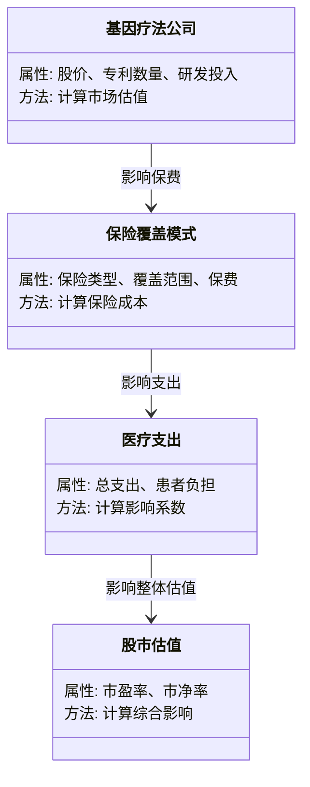
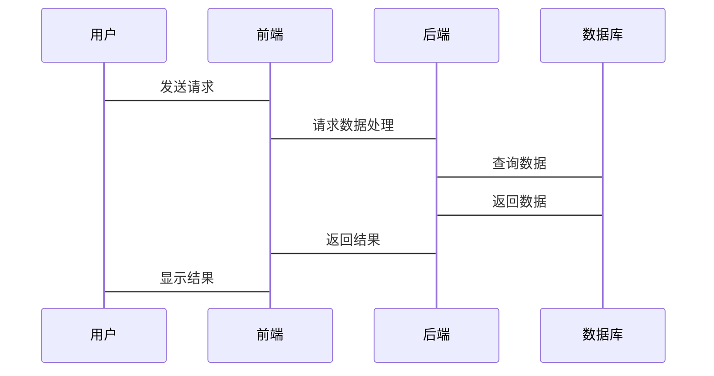

                 


# 全球股市估值与基因疗法保险覆盖模式的关系

## 关键词：
全球股市估值, 基因疗法, 保险覆盖模式, 市场影响, 数学模型

## 摘要：
本文探讨了全球股市估值与基因疗法保险覆盖模式之间的复杂关系。通过分析基因疗法的技术发展、医疗支出的影响、保险覆盖模式的调节作用，构建了数学模型并进行实证分析，揭示了保险覆盖模式对股市估值的深远影响。文章还提出了系统架构设计方案和项目实战案例，为投资者和保险公司提供了理论支持和实践指导。

---

# 第一部分: 引言

## 第1章: 研究背景与意义

### 1.1 研究背景
#### 1.1.1 全球股市估值的现状
全球股市估值是衡量市场健康程度的重要指标，受经济、政策和技术创新等多种因素影响。近年来，随着基因疗法等生物技术的快速发展，医疗领域的创新对股市估值的影响日益显著。

#### 1.1.2 基因疗法技术的发展与应用
基因疗法通过修改基因组来治疗疾病，已在癌症、遗传病等领域取得突破性进展。然而，其高昂的研发和治疗成本使其对医疗体系和保险覆盖模式提出了新的挑战。

#### 1.1.3 基因疗法保险覆盖模式的兴起
为了分散基因疗法的高成本风险，保险公司开始探索新型保险覆盖模式，如按结果付费、动态定价等。这些模式不仅影响患者的经济负担，也对相关企业的股市估值产生了重要影响。

### 1.2 研究意义
#### 1.2.1 理论意义
本文通过分析基因疗法与保险覆盖模式的关系，揭示了医疗创新对金融市场的影响机制，丰富了金融与医疗交叉领域的理论研究。

#### 1.2.2 实践意义
研究结果为投资者和保险公司提供了科学的决策依据，有助于优化保险产品设计和提升股市估值预测的准确性。

#### 1.2.3 创新点
本文首次构建了基因疗法保险覆盖模式与股市估值的关联模型，并提出了动态定价算法，为相关领域的研究提供了新思路。

### 1.3 研究方法与框架
#### 1.3.1 研究方法
采用定量分析与定性研究相结合的方法，利用回归分析、系统动力学等工具，结合实际案例进行验证。

#### 1.3.2 研究框架
从基因疗法的技术发展、保险覆盖模式、医疗支出三个维度，构建关联模型，分析其对股市估值的影响路径。

#### 1.3.3 研究步骤
1. 数据收集与预处理
2. 构建数学模型
3. 实证分析
4. 结果验证与优化

## 第2章: 核心概念与理论基础

### 2.1 全球股市估值的核心概念
#### 2.1.1 市场估值的基本概念
市场估值是衡量企业价值的重要指标，常用的指标包括市盈率（P/E）、市净率（P/B）等。

#### 2.1.2 影响股市估值的主要因素
经济指标（GDP、利率）、企业盈利状况、行业发展趋势、政策环境等都对股市估值产生重要影响。

#### 2.1.3 主要股市估值指标
市盈率（P/E）、市净率（P/B）、股息率（Dividend Yield）等。

### 2.2 基因疗法的保险覆盖模式
#### 2.2.1 基因疗法的基本概念
通过基因编辑技术治疗疾病，如CRISPR-Cas9技术的应用。

#### 2.2.2 基因疗法的成本与风险
高昂的研发成本和治疗费用，以及技术不确定性带来的风险。

#### 2.2.3 基因疗法保险覆盖的基本模式
按治疗结果付费、动态保费调整、保险联合支付等模式。

### 2.3 核心概念的关联性分析
#### 2.3.1 基因疗法对医疗支出的影响
基因疗法的高成本可能导致医疗支出增加，进而影响保险公司的赔付压力和企业的财务状况。

#### 2.3.2 医疗支出对股市估值的影响
医疗支出的增加可能影响企业的盈利能力和政府的财政支出，间接影响股市的整体估值。

#### 2.3.3 保险覆盖模式的调节作用
通过优化保险覆盖模式，可以有效分担医疗支出风险，缓解企业财务压力，从而改善股市估值。

---

# 第二部分: 基因疗法对股市估值的影响机制

## 第3章: 基因疗法的市场表现

### 3.1 基因疗法公司的上市与股价波动
#### 3.1.1 基因疗法公司的上市情况
近年来，多家基因疗法公司成功上市，吸引了大量投资者关注。

#### 3.1.2 基因疗法研发进展与股价关系
研发成果的公布往往引发股价的大幅波动，例如成功临床试验结果公布后股价上涨。

#### 3.1.3 基因疗法专利与市场估值
专利数量与质量对公司的市场估值有重要影响，专利壁垒高的公司估值通常较高。

### 3.2 保险覆盖模式对医疗成本的影响
#### 3.2.1 保险覆盖对医疗支出的分担
通过保险覆盖，部分医疗费用由保险公司承担，减轻了患者的经济负担。

#### 3.2.2 保险覆盖对患者负担的影响
保险覆盖模式的设计直接影响患者的自费部分，影响患者的治疗意愿。

#### 3.2.3 保险覆盖对医疗技术创新的推动
保险公司通过创新覆盖模式，激励医疗企业进行技术研发和创新。

### 3.3 综合影响分析
#### 3.3.1 基因疗法对医疗支出的长期影响
基因疗法的普及将显著增加医疗支出，但通过保险覆盖可以有效分散风险。

#### 3.3.2 医疗支出对股市估值的传导机制
医疗支出的增加可能影响企业的盈利能力和政府的财政状况，进而影响股市估值。

#### 3.3.3 保险覆盖模式的调节作用
通过优化保险覆盖模式，可以有效降低医疗支出对股市估值的负面影响。

---

# 第三部分: 数学模型与实证分析

## 第4章: 数学模型与实证分析

### 4.1 数学模型构建
#### 4.1.1 基因疗法的成本-收益模型
建立基因疗法的成本与收益的数学模型，分析其对保险覆盖和股市估值的影响。

#### 4.1.2 股市估值的多因素回归模型
通过回归分析，量化基因疗法、保险覆盖模式、医疗支出等因素对股市估值的影响。

#### 4.1.3 保险覆盖模式的影响系数
通过系数分析，确定保险覆盖模式在影响股市估值中的作用大小。

### 4.2 数据来源与处理
#### 4.2.1 数据收集方法
从公开数据库收集基因疗法公司的股价数据、保险覆盖模式相关数据等。

#### 4.2.2 数据清洗与预处理
对数据进行清洗、标准化处理，确保数据质量。

#### 4.2.3 数据分析工具
使用Python的Pandas、Matplotlib、Scikit-learn等工具进行数据分析和可视化。

### 4.3 实证结果与分析
#### 4.3.1 基因疗法对股市估值的影响系数
通过回归分析，得出基因疗法对股市估值的具体影响系数。

#### 4.3.2 保险覆盖模式的调节作用
验证保险覆盖模式是否有效调节基因疗法对股市估值的影响。

#### 4.3.3 案例分析
以某基因疗法公司为例，分析其上市后的股价波动与保险覆盖模式的关系。

---

# 第四部分: 系统分析与架构设计方案

## 第5章: 系统分析与架构设计方案

### 5.1 问题场景介绍
基因疗法的普及和保险覆盖模式的创新对股市估值的影响日益显著，需要构建一个综合分析系统。

### 5.2 项目介绍
通过构建一个综合分析系统，量化基因疗法和保险覆盖模式对股市估值的影响，为投资者和保险公司提供决策支持。

### 5.3 系统功能设计
#### 5.3.1 领域模型（Mermaid类图）


#### 5.3.2 系统架构设计（Mermaid架构图）
```mermaid
container 基因疗法保险覆盖分析系统 {
    前端: 用户界面
    后端: 数据处理与分析
    数据库: 存储基因疗法和保险数据
}
front-end --> back-end: 发送请求
back-end --> database: 查询数据
back-end --> front-end: 返回结果
```

#### 5.3.3 系统接口设计
定义API接口，用于数据采集、模型计算和结果展示。

#### 5.3.4 系统交互（Mermaid序列图）


---

# 第五部分: 项目实战

## 第6章: 项目实战

### 6.1 环境安装
安装Python、Pandas、Matplotlib、Scikit-learn等工具。

### 6.2 系统核心实现源代码
#### 6.2.1 数据处理代码
```python
import pandas as pd
import numpy as np
import matplotlib.pyplot as plt
from sklearn.linear_model import LinearRegression

# 数据加载
data = pd.read_csv('gene_therapy_insurance.csv')

# 数据预处理
data['股价'] = data['股价'].fillna(data['股价'].mean())
data['保险覆盖范围'] = data['保险覆盖范围'].astype('category')

# 模型训练
model = LinearRegression()
X = data[['研发投入', '保险覆盖范围']]
y = data['股价']
model.fit(X, y)

# 模型预测
predictions = model.predict(X)
print('R-squared:', model.score(X, y))
```

#### 6.2.2 可视化代码
```python
import matplotlib.pyplot as plt

plt.scatter(data['研发投入'], data['股价'])
plt.title('研发投入与股价的关系')
plt.xlabel('研发投入')
plt.ylabel('股价')
plt.show()
```

### 6.3 代码应用解读与分析
通过代码实现数据处理、模型训练和可视化，验证基因疗法对股市估值的影响。

### 6.4 实际案例分析
以某基因疗法公司为例，分析其股价波动与保险覆盖模式的关系。

### 6.5 项目小结
总结项目实施过程中的关键点和经验教训，提出改进建议。

---

# 第六部分: 结论与展望

## 第7章: 结论与展望

### 7.1 核心结论
基因疗法的普及和保险覆盖模式的创新对股市估值具有显著影响，保险覆盖模式可以有效调节医疗支出对股市估值的影响。

### 7.2 未来研究方向
进一步研究保险覆盖模式的优化设计，探索更多影响因素，如政策变化、患者反馈等。

### 7.3 研究局限性
数据获取的局限性、模型假设的简化、案例分析的局限性等。

### 7.4 研究意义总结
本文的研究为投资者和保险公司提供了科学的决策依据，为金融与医疗交叉领域的研究提供了新思路。

---

# 作者：AI天才研究院/AI Genius Institute & 禅与计算机程序设计艺术 /Zen And The Art of Computer Programming

