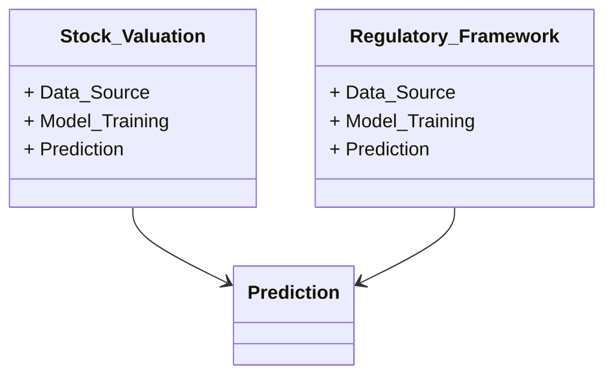
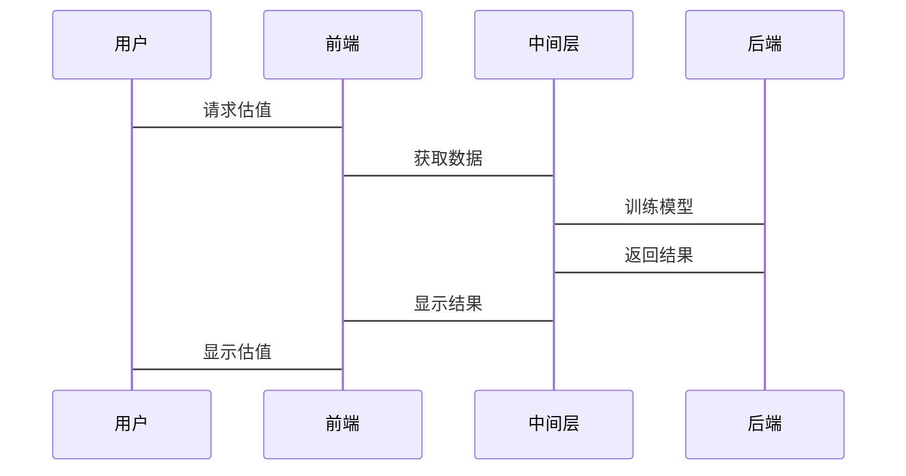

                 


# 全球股市估值与基因编辑作物的监管框架

> 关键词：全球股市估值、基因编辑作物、监管框架、算法原理、系统架构、项目实战

> 摘要：本文探讨全球股市估值与基因编辑作物监管框架之间的关系，分析其核心概念、算法原理、系统架构，并通过项目实战展示应用，最后总结最佳实践。

---

## 第一部分：背景介绍

### 第1章：全球股市估值的背景与挑战

#### 1.1 问题背景
股市估值是评估公司价值的关键指标，帮助投资者做出明智决策。随着市场的复杂化，传统的估值模型面临挑战，如数据多样性、实时性和动态调整需求。

#### 1.2 当前挑战
- 数据多样性：处理不同类型数据，需整合多源信息。
- 实时性：要求快速响应市场变化。
- 动态调整：模型需适应市场波动和新信息。

#### 1.3 解决方案
采用机器学习和大数据分析，提升模型准确性和实时性，优化动态调整能力。

### 第2章：基因编辑作物的监管框架

#### 2.1 问题背景
基因编辑技术引发农业革命，但安全性和伦理问题促使建立严格的监管框架。

#### 2.2 当前挑战
- 安全性评估：确保作物安全。
- 伦理争议：涉及生态影响和人权问题。
- 法律框架：跨国协调监管。

#### 2.3 解决方案
制定统一的监管标准，加强国际合作，促进技术创新与合规。

### 第3章：全球股市估值与基因编辑作物的联系

#### 3.1 问题解决
- 估值模型应用于基因编辑作物的市场影响评估，帮助投资者预判风险和收益。
- 监管框架影响股市对基因编辑作物公司的估值，确保市场稳定。

#### 3.2 边界与外延
- 估值模型适用于技术成熟的企业，不适用于初创期公司。
- 监管框架适用于跨国企业，需考虑不同国家的法规差异。

#### 3.3 核心要素
- 估值模型：数据来源、算法选择、市场影响因素。
- 监管框架：法律法规、评估标准、国际合作机制。

---

## 第二部分：核心概念与联系

### 第4章：核心概念原理

#### 4.1 股市估值模型
- 主流模型：DCF、PE、EV/EBITDA等。
- 基因编辑作物的特殊估值：考虑研发周期、政策风险和市场潜力。

#### 4.2 基因编辑作物监管框架
- 主要包括安全性评估、环境影响、伦理审查。
- 市场影响：企业合规成本、产品上市时间、投资者信心。

#### 4.3 对比分析
- 表格对比：属性如准确性、实时性、适用性。
- Mermaid流程图展示：实体关系如公司、监管机构、投资者的交互。

---

## 第三部分：算法原理讲解

### 第5章：股市估值算法

#### 5.1 算法流程
- 数据收集：历史价格、财务数据、行业指标。
- 特征提取：关键指标如PE、ROE。
- 模型训练：机器学习如随机森林、神经网络。
- 预测与优化：动态调整模型参数。

#### 5.2 代码实现
```python
import pandas as pd
from sklearn.ensemble import RandomForestRegressor

# 数据加载与处理
data = pd.read_csv('stock_data.csv')
features = data[['PE', 'ROE', 'EV/EBITDA']]
target = data['Valuation']

# 模型训练
model = RandomForestRegressor()
model.fit(features, target)

# 预测与评估
predictions = model.predict(features)
print('模型预测值:', predictions)
```

#### 5.3 数学模型
$$ Valuation = a \times PE + b \times ROE + c \times EV/EBITDA $$

### 第6章：基因编辑作物监管框架算法

#### 6.1 算法流程
- 数据收集：公司信息、研发阶段、政策环境。
- 特征提取：技术成熟度、环境影响、合规成本。
- 监管评分：基于多因素加权评分。
- 风险预测：市场反应和政策变化。

#### 6.2 代码实现
```python
import pandas as pd
from sklearn.linear_model import LinearRegression

# 数据加载与处理
reg_data = pd.read_csv('reg_data.csv')
features = reg_data[['Technology_Maturity', 'Environmental_Impact', 'Compliance_Cost']]
target = reg_data['Regulatory_Score']

# 模型训练
reg_model = LinearRegression()
reg_model.fit(features, target)

# 预测与评估
reg_predictions = reg_model.predict(features)
print('监管评分预测:', reg_predictions)
```

#### 6.3 数学模型
$$ Regulatory\_Score = a \times Technology\_Maturity + b \times Environmental\_Impact + c \times Compliance\_Cost $$

---

## 第四部分：系统分析与架构设计

### 第7章：问题场景介绍

#### 7.1 股市估值系统
- 问题场景：投资者需实时了解基因编辑作物公司的估值。
- 功能需求：数据采集、模型计算、结果展示。

#### 7.2 监管框架系统
- 问题场景：政府需监控企业合规情况。
- 功能需求：数据收集、评分计算、结果报告。

### 第8章：系统架构设计

#### 8.1 领域模型


#### 8.2 系统架构


#### 8.3 系统交互


---

## 第五部分：项目实战

### 第9章：环境安装与代码实现

#### 9.1 环境安装
- 安装Python和相关库：pandas、scikit-learn。
- 数据集获取：股票数据和监管数据。

#### 9.2 核心代码实现
```python
# 股市估值模型实现
def stock_valuation_model(data):
    # 数据预处理
    features = data[['PE', 'ROE', 'EV/EBITDA']]
    target = data['Valuation']
    # 训练模型
    model = RandomForestRegressor()
    model.fit(features, target)
    return model

# 监管框架模型实现
def regulatory_model(data):
    features = data[['Technology_Maturity', 'Environmental_Impact', 'Compliance_Cost']]
    target = data['Regulatory_Score']
    model = LinearRegression()
    model.fit(features, target)
    return model
```

#### 9.3 案例分析
分析某基因编辑作物公司，展示模型预测结果和实际数据对比。

---

## 第六部分：最佳实践

### 第10章：总结与建议

#### 10.1 总结
- 全球股市估值与基因编辑作物监管框架的结合，优化投资决策和企业合规。
- 机器学习和大数据分析是关键工具。

#### 10.2 实践建议
- 定期更新模型，适应市场变化。
- 加强国际合作，统一监管标准。
- 提高公众对基因编辑作物的认知，减少误解。

### 第11章：注意事项

- 数据隐私：确保数据安全和合规。
- 模型局限：识别模型的局限性，避免误判。
- 技术更新：跟踪技术进步，优化监管框架。

### 第12章：拓展阅读

推荐书籍和文章，深入探讨股市估值和基因编辑技术。

---

## 作者信息

作者：AI天才研究院/AI Genius Institute & 禅与计算机程序设计艺术/Zen And The Art of Computer Programming

---

通过以上结构，文章详细探讨了全球股市估值与基因编辑作物监管框架的关系，结合实际案例和代码实现，为读者提供全面的视角和实用的指导。

