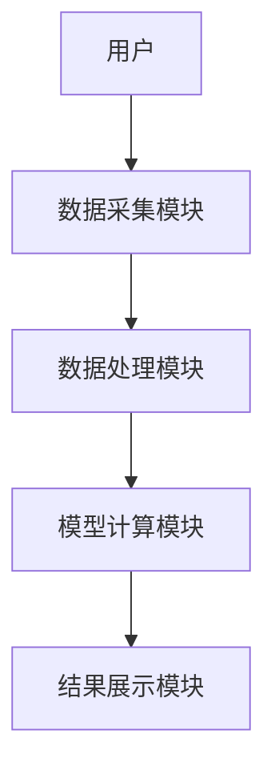

                 


# 全球股市估值与基因编辑作物的经济影响

> **关键词**：全球股市估值、基因编辑作物、经济影响、数学模型、系统设计、项目实战

> **摘要**：  
本文探讨了全球股市估值与基因编辑作物之间的经济影响，分析了基因编辑技术对农业经济的推动作用及其对全球股市估值的潜在影响。通过构建经济模型和股市估值方法，结合实际案例分析，深入解读基因编辑作物在农业领域的应用及其对投资者决策的启示。

---

## 目录

1. **基因编辑作物与全球股市估值的经济影响概述**  
   - 1.1 全球股市估值的基本概念  
   - 1.2 基因编辑作物的经济影响  

2. **基因编辑作物的经济模型分析**  
   - 2.1 基因编辑作物的经济模型  
   - 2.2 成本分析  
   - 2.3 收益模型  

3. **全球股市估值方法与模型**  
   - 3.1 估值方法概述  
   - 3.2 数学模型构建  

4. **基因编辑作物对全球股市估值的影响**  
   - 4.1 对农业板块的影响  
   - 4.2 对全球股市的整体影响  
   - 4.3 互动关系  

5. **系统设计与架构**  
   - 5.1 系统功能设计  
   - 5.2 系统架构设计  

6. **项目实战：基因编辑作物的经济影响分析**  
   - 6.1 环境安装  
   - 6.2 核心代码实现  
   - 6.3 案例分析  

7. **结论与展望**  

---

## 正文

### 第1章：基因编辑作物与全球股市估值的经济影响概述

#### 1.1 全球股市估值的基本概念
全球股市估值是通过对上市公司股票的市场价格进行评估，以衡量企业的内在价值。常用的估值方法包括市盈率（PE）、市净率（PB）和股息率等。这些方法帮助企业确定其股票是否被市场低估或高估。

#### 1.2 基因编辑作物的经济影响
基因编辑技术是一种通过修改生物DNA序列来改善作物特性的技术。它在农业领域的应用可以提高作物产量、抗病性和营养价值，从而对农业经济产生深远影响。例如，基因编辑作物可以降低生产成本，提高农产品质量，进而影响全球粮食价格和农业公司的股票估值。

---

### 第2章：基因编辑作物的经济模型分析

#### 2.1 基因编辑作物的经济模型
基因编辑作物的经济模型旨在评估其成本和收益。模型包括技术开发成本、生产成本和市场收益。

#### 2.2 成本分析
基因编辑作物的开发成本包括研发费用、试验费用和推广费用。生产成本涉及种子、化肥和劳动力等。

#### 2.3 收益模型
基因编辑作物的收益来源包括销售价格提高、产量增加和市场扩展。收益模型需要考虑市场需求、竞争压力和政策环境。

---

### 第3章：全球股市估值方法与模型

#### 3.1 估值方法概述
市盈率（PE）= 股价 / 每股净利润  
市净率（PB）= 股价 / 每股净资产  
股息率 = 每股股息 / 股价  

#### 3.2 数学模型构建
以市盈率为例，假设某公司净利润为1000万元，行业平均PE为15，则该公司的理论股价为15 × (股价 / 净利润)。

---

### 第4章：基因编辑作物对全球股市估值的影响

#### 4.1 对农业板块的影响
基因编辑作物的推广可能提高农业公司的利润率，从而提升其股票的市盈率和市净率。

#### 4.2 对全球股市的整体影响
基因编辑作物的广泛应用可能推动农业板块的整体表现，进而影响全球股市的走势。

#### 4.3 互动关系
基因编辑作物的经济收益与股市估值相互作用，形成正反馈机制。

---

### 第5章：系统设计与架构

#### 5.1 系统功能设计
系统功能包括数据采集、模型计算和结果展示。

#### 5.2 系统架构设计
使用Mermaid绘制系统架构图：



---

### 第6章：项目实战：基因编辑作物的经济影响分析

#### 6.1 环境安装
安装Python和相关库（如Pandas、Matplotlib）。

#### 6.2 核心代码实现
```python
import pandas as pd

# 示例数据
data = {
    '公司名称': ['公司A', '公司B', '公司C'],
    '净利润': [1000, 1500, 2000],
    '股价': [15, 20, 25]
}

df = pd.DataFrame(data)
df['PE'] = df['股价'] / (df['净利润'] / 1000)
print(df)
```

#### 6.3 案例分析
分析基因编辑作物对某农业公司的影响，计算其市盈率变化。

---

### 第7章：结论与展望

基因编辑作物对全球股市估值具有显著的经济影响。通过构建合理的经济模型和估值方法，投资者可以更好地把握市场机会。未来，随着基因编辑技术的进一步发展，其对股市的影响将更加深远。

---

**作者：AI天才研究院/AI Genius Institute & 禅与计算机程序设计艺术 /Zen And The Art of Computer Programming**

