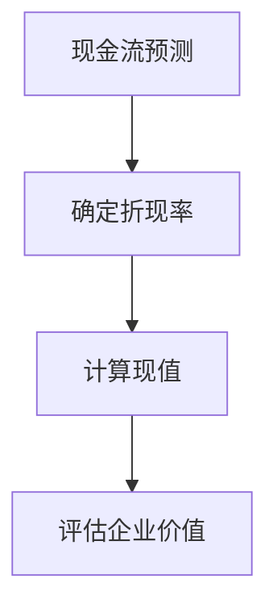

                 

# 全球股市估值与基因编辑技术在农业中的监管框架

> 关键词：全球股市估值、基因编辑技术、农业应用、监管框架、经济影响

> 摘要：本文探讨了全球股市估值与基因编辑技术在农业中的应用及其监管框架。通过分析股市估值的核心概念、模型与实际案例，结合基因编辑技术的基本原理、农业中的具体应用及其监管框架，本文深入探讨了两者之间的相互影响，并提出了统一监管框架的策略。文章旨在为投资者、农业科学家和政策制定者提供理论依据和实践指导，以促进农业技术的健康发展。

---

## 第一部分: 全球股市估值与基因编辑技术的背景与概述

### 第1章: 全球股市估值概述

#### 1.1 股市估值的基本概念

股市估值是通过对企业的内在价值和市场价值进行评估，以确定其股票价格合理性的过程。内在价值是企业未来现金流的现值，而市场价值则是由市场供需关系决定的价格。股市估值的核心在于找到企业的真实价值，从而为投资决策提供依据。

#### 1.2 全球股市估值的现状与趋势

全球股市估值受到经济周期、市场情绪、政策环境等多种因素的影响。随着数字化和全球化的推进，股市估值的方法和工具也在不断进化。例如，投资者 increasingly rely on大数据和人工智能技术来辅助估值。

---

### 第2章: 基因编辑技术在农业中的应用概述

#### 2.1 基因编辑技术的基本概念

基因编辑技术是一种通过人工手段对生物基因组进行精确修改的技术。CRISPR-Cas9是目前最常用的基因编辑工具，它能够高效、精准地编辑基因组，从而实现对生物性状的改良。

#### 2.2 基因编辑技术在农业中的应用

基因编辑技术在农业中的应用主要集中在作物改良和畜牧养殖方面。例如，通过基因编辑可以提高作物的抗病性和营养价值，或者改良牲畜的生长速度和肉质。

---

## 第二部分: 全球股市估值与基因编辑技术的核心概念与联系

### 第3章: 全球股市估值的核心概念与模型

#### 3.1 股市估值的核心概念

股市估值的核心在于对企业未来现金流的预测和折现。市盈率（P/E）和市净率（P/B）是常用的估值指标。市盈率反映了企业盈利能力，而市净率则反映了资产价值。

#### 3.2 股市估值的主要模型

现金流折现模型（DCF）是股市估值的核心模型之一。以下是DCF模型的mermaid流程图：

DCF模型通过预测企业未来现金流并将其折现为现值，以评估企业的真实价值。

---

### 第4章: 基因编辑技术的监管框架与伦理问题

#### 4.1 基因编辑技术的监管框架

基因编辑技术的监管框架包括国际和国内两个层面。例如，国际上，OECD和WHO等组织制定了相关指南；国内则需要遵循各国的法律法规。

#### 4.2 基因编辑技术的伦理问题

基因编辑技术的伦理争议主要集中在生态平衡和人类健康方面。例如，基因编辑可能对生态系统造成不可逆的影响，或者引发基因歧视等问题。

---

## 第三部分: 全球股市估值与基因编辑技术的监管框架与结合

### 第5章: 全球股市估值与基因编辑技术的监管框架

#### 5.1 股市估值与基因编辑技术的相互影响

基因编辑技术在农业中的应用可能会影响企业的盈利能力和市场价值，从而影响其股价。例如，基因编辑改良的作物可能提高企业的利润率，进而提升其股票价值。

#### 5.2 基因编辑技术对股市估值模型的挑战

基因编辑技术的不确定性和潜在风险可能会影响股市估值模型的有效性。例如，基因编辑技术可能引发监管风险或市场接受度问题，从而影响企业的未来现金流。

---

### 第6章: 统一监管框架的制定与实施

#### 6.1 统一监管框架的制定

为了应对基因编辑技术在农业中的监管挑战，需要制定统一的监管框架。这包括明确基因编辑技术的使用范围、审批流程和风险评估标准。

#### 6.2 统一监管框架的实施

统一监管框架的实施需要政府、企业和学术界的共同努力。例如，政府可以制定相关政策，企业可以遵循监管要求，学术界可以提供技术支持。

---

## 结语

全球股市估值与基因编辑技术在农业中的监管框架是复杂而重要的课题。通过对股市估值的核心概念、基因编辑技术的基本原理及其监管框架的深入分析，本文提出了统一监管框架的策略，以促进农业技术的健康发展。

---

作者：AI天才研究院/AI Genius Institute & 禅与计算机程序设计艺术 /Zen And The Art of Computer Programming

