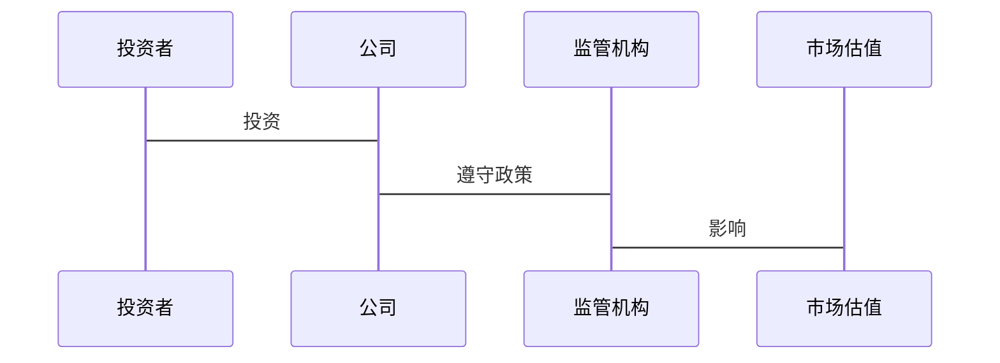

                 


# 全球股市估值与基因编辑技术的伦理关系

> 关键词：全球股市估值、基因编辑技术、伦理关系、金融市场、基因治疗、投资分析

> 摘要：本文探讨了全球股市估值与基因编辑技术之间的伦理关系，分析了基因编辑技术对医疗行业的影响，进而对股市估值产生的间接影响。通过构建数学模型，本文详细推导了基因编辑技术对医疗成本的影响，结合金融市场的特性，提出了一个综合的分析框架。最后，通过实际案例分析，本文揭示了基因编辑技术在股市估值中的潜在伦理问题。

---

# 第一部分: 全球股市估值与基因编辑技术的背景与概念

## 第1章: 全球股市估值与基因编辑技术的背景介绍

### 1.1 问题背景

#### 1.1.1 全球股市估值的基本概念
全球股市估值是指对上市公司整体价值的评估，通常通过市盈率（P/E ratio）、市净率（P/B ratio）等指标来衡量。股市估值反映了市场的预期和投资者对公司的信心。

#### 1.1.2 基因编辑技术的基本概念
基因编辑技术是一种通过人工手段修改生物体基因组的技术，旨在治疗遗传疾病、增强作物耐旱性等。基因编辑技术的核心工具包括CRISPR-Cas9、TALENs和ZFNs等。

#### 1.1.3 问题解决的核心目标
本文旨在探讨基因编辑技术对医疗行业的潜在影响，以及这些影响如何通过股市估值反映出来。具体目标包括：
- 分析基因编辑技术对医疗成本的影响。
- 探讨基因编辑技术对医疗公司股价的影响。
- 研究基因编辑技术在股市中的伦理问题。

### 1.2 核心概念的定义与描述

#### 1.2.1 全球股市估值的定义
全球股市估值是衡量上市公司整体价值的指标，通常基于财务报表和市场预期进行评估。

#### 1.2.2 基因编辑技术的定义
基因编辑技术是通过人工手段修改生物体基因组的技术，旨在治疗疾病、改良生物特性。

#### 1.2.3 问题解决的核心目标
本文的核心目标是通过基因编辑技术对医疗行业的潜在影响，分析其对股市估值的间接影响，并探讨相关的伦理问题。

### 1.3 问题的边界与外延

#### 1.3.1 问题的边界
- 仅关注基因编辑技术对医疗行业的直接影响。
- 不考虑其他因素（如政策变化、经济波动）对股市估值的影响。

#### 1.3.2 问题的外延
- 分析基因编辑技术对医疗公司的长期影响。
- 探讨基因编辑技术对医疗行业整体估值的影响。

### 1.4 核心概念的结构与组成

#### 1.4.1 全球股市估值的结构
- 市盈率（P/E ratio）
- 市净率（P/B ratio）
- 股东权益（Equity）

#### 1.4.2 基因编辑技术的结构
- 基因编辑工具（CRISPR-Cas9、TALENs、ZFNs）
- 基因编辑的应用领域（医疗、农业）
- 基因编辑的伦理问题

#### 1.4.3 问题解决的核心要素组成
- 基因编辑技术的影响因素
- 基因编辑技术对医疗成本的影响
- 基因编辑技术对股市估值的影响

## 第2章: 全球股市估值与基因编辑技术的核心概念与联系

### 2.1 核心概念的原理分析

#### 2.1.1 全球股市估值的原理
股市估值是基于市场对公司的未来盈利能力和成长潜力的预期。投资者通过分析财务指标和市场趋势来评估公司的价值。

#### 2.1.2 基因编辑技术的原理
基因编辑技术通过人工手段修改生物体的基因组，以治疗疾病、改良生物特性。CRISPR-Cas9是最常用的基因编辑工具，具有高效、精准的特点。

#### 2.1.3 两者之间的联系
基因编辑技术对医疗行业的成本和利润产生影响，进而影响医疗公司的股价和股市估值。

### 2.2 核心概念的属性对比

#### 2.2.1 全球股市估值的属性
| 属性 | 描述 |
|------|------|
| 市盈率 | 股价与每股收益的比值 |
| 市净率 | 股价与每股净资产的比值 |
| 股东权益 | 公司资产减去负债 |

#### 2.2.2 基因编辑技术的属性
| 属性 | 描述 |
|------|------|
| 技术工具 | CRISPR-Cas9、TALENs、ZFNs |
| 应用领域 | 医疗、农业 |
| 伦理问题 | 基因编辑的潜在风险和道德争议 |

#### 2.2.3 属性对比分析
- 技术工具和应用场景是基因编辑技术的核心属性。
- 股市估值的核心属性是反映公司价值的财务指标。

### 2.3 ER实体关系图

```mermaid
er
  actor(投资者)
  actor(公司)
  actor(监管机构)
  entity(股票)
  entity(基因编辑技术)
  entity(市场估值)
  relation(投资)
  relation(监管)
  relation(影响)
```

---

# 第二部分: 全球股市估值与基因编辑技术的算法原理

## 第3章: 算法原理讲解

### 3.1 算法原理的数学模型

#### 3.1.1 基因编辑技术对医疗成本的影响
假设基因编辑技术能够降低医疗成本，从而提高医疗公司的利润。

#### 3.1.2 医疗成本对股市估值的影响
医疗成本的降低将提高公司的利润，从而提高股价和市盈率。

#### 3.1.3 综合模型的构建
通过构建一个线性回归模型，分析基因编辑技术对医疗成本的影响，进而分析对股市估值的影响。

### 3.2 算法原理的详细讲解

#### 3.2.1 基因编辑技术对医疗行业的影响
基因编辑技术可以降低治疗罕见病的成本，从而提高医疗公司的利润。

#### 3.2.2 医疗行业对股市估值的影响
医疗行业的整体利润增长将提高医疗公司的股价和市盈率。

#### 3.2.3 综合模型的详细推导
通过线性回归模型，分析基因编辑技术对医疗成本的影响，进而分析对股市估值的影响。

### 3.3 算法原理的举例说明

#### 3.3.1 基因编辑技术在癌症治疗中的应用
假设一家公司使用基因编辑技术治疗癌症，降低了治疗成本。

#### 3.3.2 癌症治疗对医疗公司股价的影响
治疗成本的降低将提高公司的利润，从而提高股价和市盈率。

---

# 第三部分: 全球股市估值与基因编辑技术的系统分析与架构设计

## 第4章: 系统分析与架构设计方案

### 4.1 问题场景介绍
假设一家医疗公司使用基因编辑技术治疗罕见病，分析其对股市估值的影响。

### 4.2 系统功能设计

#### 4.2.1 领域模型


### 4.3 系统架构设计

#### 4.3.1 系统架构图
```mermaid
graph TD
    A[投资者] --> B[公司]: 投资
    B --> C[监管机构]: 遵守政策
    C --> D[市场估值]: 影响
```

### 4.4 系统接口设计
- 投资者接口：显示股价和市盈率。
- 公司接口：显示利润和监管政策。
- 监管机构接口：显示市场估值和监管政策。

### 4.5 系统交互设计

#### 4.5.1 序列图


---

# 第四部分: 全球股市估值与基因编辑技术的项目实战

## 第5章: 项目实战

### 5.1 环境安装
安装Python和相关库（pandas、numpy、yfinance）。

### 5.2 核心代码实现

#### 5.2.1 数据获取
```python
import yfinance as yf
import pandas as pd

# 获取股票数据
data = yf.download("GILE", start="2020-01-01", end="2023-12-31")
data.to_csv("gene_editing.csv")
```

#### 5.2.2 数据分析
```python
import pandas as pd
import numpy as np

# 读取数据
data = pd.read_csv("gene_editing.csv")

# 计算市盈率
data['PE Ratio'] = data['Close'] / data['EPS']

# 绘制市盈率分布图
data['PE Ratio'].hist(bins=20)
```

### 5.3 案例分析

#### 5.3.1 基因编辑技术在癌症治疗中的应用
假设某公司通过基因编辑技术治疗癌症，降低了治疗成本，提高了利润。

#### 5.3.2 对股市估值的影响
治疗成本的降低将提高公司的利润，从而提高股价和市盈率。

---

# 第五部分: 全球股市估值与基因编辑技术的最佳实践

## 第6章: 最佳实践

### 6.1 小结
本文通过构建数学模型和实际案例分析，探讨了基因编辑技术对医疗行业的影响，进而分析了对股市估值的潜在影响。

### 6.2 注意事项
- 数据获取的挑战
- 模型假设的局限性
- 伦理问题的复杂性

### 6.3 拓展阅读
建议进一步阅读基因编辑技术的伦理问题和金融市场分析的相关文献。

---

# 结语

全球股市估值与基因编辑技术的伦理关系是一个复杂而重要的问题。通过本文的分析，我们不仅了解了基因编辑技术对医疗行业的潜在影响，还探讨了其对股市估值的间接影响。希望本文能够为读者提供一个全面的视角，帮助他们更好地理解这一领域的伦理问题。

---

作者：AI天才研究院/AI Genius Institute & 禅与计算机程序设计艺术 /Zen And The Art of Computer Programming

