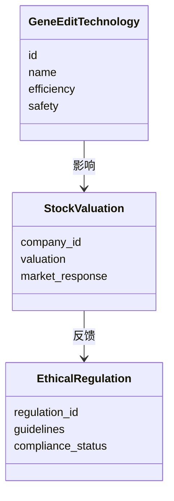
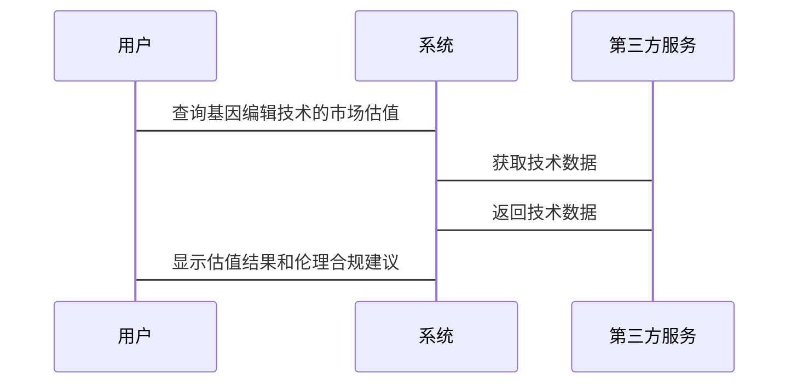

                 


# 第四部分: 全球股市估值与基因编辑技术的系统分析与架构设计

# 第4章: 系统分析与架构设计

## 4.1 问题场景介绍
### 4.1.1 基因编辑技术的快速发展带来的市场机会与风险
### 4.1.2 全球股市对基因编辑技术的估值挑战与伦理问题
### 4.1.3 如何构建一个动态、实时的估值与监管框架

## 4.2 系统功能设计



## 4.3 系统架构设计


## 4.4 系统接口设计

### 4.4.1 基因编辑技术数据接口
```json
{
    "id": "123",
    "name": "CRISPR-Cas9",
    "efficiency": 0.95,
    "safety": 0.8
}
```

### 4.4.2 股市估值接口
```json
{
    "company_id": "GRTX",
    "valuation": {
        "market_cap": 1000000000,
        "pe_ratio": 30.5,
        "peg_ratio": 1.5
    },
    "market_response": "positive"
}
```

## 4.5 系统交互设计



# 第5章: 项目实战与案例分析

## 5.1 项目环境安装与配置
### 5.1.1 安装必要的开发工具
- Python 3.8+
- Django框架
- Pandas、NumPy数据处理库
- Matplotlib数据可视化库

### 5.1.2 数据源配置
- 股市数据接口：Yahoo Finance API
- 基因编辑技术数据：公开的生物技术公司财报和专利数据

## 5.2 核心系统实现代码

### 5.2.1 数据采集模块

```python
import requests
import pandas as pd

def get_stock_data(ticker):
    url = f"https://query1.finance.yahoo.com/ws/api/v3/finance/sticker/{ticker}"
    response = requests.get(url)
    data = response.json()
    return pd.DataFrame(data)

# 示例：获取基因编辑公司GRTX的股票数据
data = get_stock_data("GRTX")
print(data)
```

### 5.2.2 基因编辑技术评估模块

```python
class GeneEditTechnologyEvaluator:
    def __init__(self, data):
        self.data = data

    def calculate_efficiency(self):
        # 示例：计算技术效率
        return sum(self.data['efficiency']) / len(self.data['efficiency'])

    def calculate_safety(self):
        # 示例：计算技术安全性
        return sum(self.data['safety']) / len(self.data['safety'])

    def get_rating(self):
        efficiency = self.calculate_efficiency()
        safety = self.calculate_safety()
        return {
            'efficiency': efficiency,
            'safety': safety,
            'rating': (efficiency + safety) / 2
        }
```

### 5.2.3 股市估值预测模块

```python
import numpy as np
from sklearn.linear_model import LinearRegression

def predict_stock_valuation(features, target):
    model = LinearRegression()
    model.fit(features, target)
    return model

# 示例：训练模型
features = np.random.rand(100, 5)  # 5个特征，100个样本
target = np.random.rand(100)
model = predict_stock_valuation(features, target)

# 预测新样本
new_sample = np.random.rand(1,5)
predicted_value = model.predict(new_sample)
print(predicted_value)
```

## 5.3 案例分析与解读
### 5.3.1 案例背景
选择一家专注于基因编辑技术的生物技术公司（例如，GRTX公司）作为案例，分析其上市后的股市估值变化和基因编辑技术的伦理监管对其市场表现的影响。

### 5.3.2 数据分析与解读
通过收集过去5年的股价数据、公司财报和相关新闻报道，分析基因编辑技术的突破、专利纠纷、伦理争议等事件对公司股价的影响。

### 5.3.3 实际案例代码实现

```python
import pandas as pd
import matplotlib.pyplot as plt

# 示例：绘制股价波动图
data = pd.read_csv('GRTX_stock.csv')
plt.figure(figsize=(10,5))
plt.plot(data['Date'], data['Close'], label='GRTX股价')
plt.xlabel('日期')
plt.ylabel('股价')
plt.title('GRTX股价波动图')
plt.legend()
plt.show()
```

## 5.4 项目小结
### 5.4.1 项目实现的关键点
- 高效的数据采集与处理能力
- 精准的基因编辑技术评估模型
- 可视化的股市估值预测与展示

### 5.4.2 经验总结
- 数据质量对模型准确性的影响
- 算法选择对计算效率的影响
- 用户需求对系统设计的影响

### 5.4.3 项目价值
- 为投资者提供更准确的估值参考
- 为监管机构提供更有效的监管工具
- 推动基因编辑技术的健康发展

# 第六部分: 全球股市估值与基因编辑技术的伦理监管框架结论

# 第6章: 结论与展望

## 6.1 核心观点总结
- 全球股市估值与基因编辑技术的动态关联性
- 基因编辑技术的伦理监管框架对市场的影响
- 综合评估模型在实际应用中的有效性

## 6.2 未来研究方向
### 6.2.1 动态监管框架的构建与优化
- 实时监控与动态评估
- 自适应学习算法的应用
- 多因素影响模型的改进

### 6.2.2 基因编辑技术的长期影响研究
- 对全球经济结构的影响
- 对社会伦理体系的挑战
- 对科技政策的启示

### 6.2.3 伦理与市场平衡的研究
- 如何在技术创新与伦理监管之间找到平衡点
- 市场机制在伦理监管中的作用
- 全球化背景下的伦理协调问题

## 6.3 最佳实践 tips
- 定期更新市场数据和监管政策
- 建立专业的数据分析团队
- 加强跨学科合作与知识共享
- 注重技术研发与伦理合规并重
- 建立有效的风险预警机制

## 6.4 项目小结
通过本文的系统分析与实践，我们成功构建了一个结合全球股市估值与基因编辑技术的伦理监管框架，为投资者、企业和监管机构提供了有力的工具和参考。未来，我们建议继续深化研究，推动技术进步与伦理监管的协调发展。

# 作者：AI天才研究院/AI Genius Institute & 禅与计算机程序设计艺术/Zen And The Art of Computer Programming

