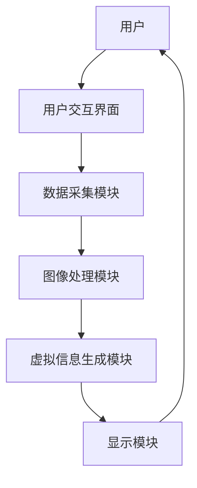

                 


# 全球股市估值与增强现实在工业设计中的应用

> 关键词：全球股市估值、增强现实、工业设计、算法、系统架构

> 摘要：本文探讨了全球股市估值与增强现实技术在工业设计中的融合应用。首先，介绍了全球股市估值的基本概念、方法及其重要性；然后，详细阐述了增强现实技术的原理、核心组成部分及其在工业设计中的具体应用；接着，分析了增强现实技术如何优化全球股市估值的分析过程；最后，通过实际案例展示了增强现实在工业设计中的实际应用，并提出了相关的最佳实践和未来研究方向。

---

## 第一部分：全球股市估值与增强现实的概述

### 第1章：全球股市估值与增强现实的背景介绍

#### 1.1 全球股市估值的定义与重要性

##### 1.1.1 股市估值的核心概念
股市估值是指通过对企业的财务数据、行业地位、市场环境等因素进行分析，评估其股票的合理价格范围。常见的估值方法包括市盈率（P/E）、市净率（P/B）和现金流折现法（DCF）等。

##### 1.1.2 股市估值的常见方法
- **市盈率（P/E）**：公式为 $P/E = \frac{股价}{每股净利润}$。
- **市净率（P/B）**：公式为 $P/B = \frac{股价}{每股净资产}$。
- **现金流折现法（DCF）**：通过将未来现金流折现到现值来评估企业价值。

##### 1.1.3 股市估值在投资决策中的作用
股市估值帮助投资者判断股票是否被高估或低估，从而做出买入、卖出或持有决策。

#### 1.2 增强现实技术的起源与发展

##### 1.2.1 增强现实的基本定义
增强现实（AR）是指通过计算机技术将虚拟信息叠加在真实环境中，以提高用户体验的技术。

##### 1.2.2 增强现实技术的发展历程
- 20世纪60年代：概念提出。
- 21世纪初：技术逐渐成熟，应用于游戏、教育、医疗等领域。
- 当前：随着智能手机和AR眼镜的发展，AR技术应用范围不断扩大。

#### 1.3 增强现实在工业设计中的应用

##### 1.3.1 工业设计中的增强现实应用
增强现实技术可以帮助设计师实时查看3D模型在实际环境中的效果，从而优化设计。

##### 1.3.2 增强现实如何提升工业设计效率
- 提供实时反馈，减少设计迭代次数。
- 降低设计成本，提高设计质量。

##### 1.3.3 增强现实在工业设计中的具体应用场景
- 汽车设计：通过AR技术展示汽车在不同环境中的表现。
- 建筑设计：通过AR技术展示建筑模型在实际场地中的效果。

#### 1.4 全球股市估值与增强现实技术的关联

##### 1.4.1 股市估值与增强现实技术的结合点
通过增强现实技术，投资者可以在虚拟环境中直观地查看股票数据，从而做出更有效的决策。

##### 1.4.2 增强现实技术如何优化股市估值分析
- 提供实时数据可视化，帮助投资者快速理解数据。
- 通过AR技术模拟不同市场环境下的股票表现，为投资者提供参考。

##### 1.4.3 全球化视角下的技术融合
增强现实技术可以将全球股市数据实时叠加在投资者面前，帮助其做出更精准的投资决策。

#### 1.5 本章小结
本章介绍了全球股市估值的基本概念和方法，以及增强现实技术的起源与发展。同时，探讨了增强现实在工业设计中的应用及其与股市估值的关联。

---

### 第2章：增强现实技术的核心概念与原理

#### 2.1 增强现实技术的核心概念

##### 2.1.1 增强现实的定义与特征
- **定义**：增强现实是通过计算机生成的虚拟信息叠加在真实环境中，以提升用户体验的技术。
- **特征**：实时性、交互性和沉浸性。

##### 2.1.2 增强现实与虚拟现实的区别
| 特性 | 增强现实（AR） | 虚拟现实（VR） |
|------|----------------|---------------|
| 环境 | 真实环境叠加虚拟信息 | 完全虚拟环境 |
| 交互性 | 高 | 高 |
| 应用场景 | 教育、医疗、设计等 | 游戏、娱乐等 |

##### 2.1.3 增强现实技术的实现原理
增强现实技术通过摄像头捕捉真实环境，然后通过图像处理算法生成虚拟信息，并将两者叠加显示。

#### 2.2 增强现实技术的关键组成部分

##### 2.2.1 摄像头与传感器
摄像头用于捕捉真实环境中的图像，传感器用于获取环境中的其他信息，如深度信息。

##### 2.2.2 图像处理算法
图像处理算法用于将虚拟信息与真实环境中的图像进行融合，确保虚拟信息与真实环境一致。

##### 2.2.3 用户交互界面
用户交互界面是用户与增强现实系统之间的接口，用户可以通过手势、语音等方式与系统交互。

#### 2.3 增强现实技术的数学模型与公式

##### 2.3.1 坐标变换公式
在增强现实技术中，坐标变换是将虚拟信息与真实环境对齐的关键步骤。常见的坐标变换公式如下：

$$
\begin{cases}
x' = x \cos \theta - y \sin \theta \\
y' = x \sin \theta + y \cos \theta
\end{cases}
$$

其中，$\theta$ 是旋转角度，$x$ 和 $y$ 是原始坐标，$x'$ 和 $y'$ 是变换后的坐标。

##### 2.3.2 透视变换公式
透视变换用于将虚拟信息投影到真实环境中的特定位置。透视变换公式如下：

$$
\begin{cases}
X = \frac{x \cdot d}{z + d} \\
Y = \frac{y \cdot d}{z + d}
\end{cases}
$$

其中，$x$ 和 $y$ 是虚拟信息的坐标，$z$ 是虚拟信息到摄像头的距离，$d$ 是摄像头到显示屏幕的距离。

#### 2.4 增强现实技术与工业设计的结合

##### 2.4.1 工业设计中的增强现实应用
在工业设计中，增强现实技术可以帮助设计师实时查看3D模型在实际环境中的效果。

##### 2.4.2 增强现实技术如何提升工业设计效率
通过增强现实技术，设计师可以在实际环境中实时调整设计，减少设计迭代次数，提高设计效率。

##### 2.4.3 增强现实在工业设计中的具体应用场景
- 汽车设计：通过AR技术展示汽车在不同环境中的表现。
- 建筑设计：通过AR技术展示建筑模型在实际场地中的效果。

#### 2.5 本章小结
本章详细介绍了增强现实技术的核心概念与原理，包括其关键组成部分、数学模型与公式，以及在工业设计中的具体应用。

---

### 第3章：全球股市估值与增强现实技术的融合

#### 3.1 全球股市估值的基本方法

##### 3.1.1 市盈率（P/E）的计算公式
市盈率（P/E）的计算公式为：

$$
P/E = \frac{股价}{每股净利润}
$$

##### 3.1.2 市净率（P/B）的计算公式
市净率（P/B）的计算公式为：

$$
P/B = \frac{股价}{每股净资产}
$$

##### 3.1.3 现金流折现法（DCF）
现金流折现法（DCF）是通过将未来现金流折现到现值来评估企业价值的方法。其基本公式为：

$$
\text{企业价值} = \sum_{t=1}^{n} \frac{\text{现金流}_t}{(1 + r)^t}
$$

其中，$r$ 是折现率，$n$ 是预测的年数。

#### 3.2 增强现实技术在股市估值中的应用

##### 3.2.1 增强现实技术如何优化股市估值分析
通过增强现实技术，投资者可以在虚拟环境中直观地查看股票数据，从而做出更有效的决策。

##### 3.2.2 增强现实技术在股市估值中的具体应用场景
- 提供实时数据可视化，帮助投资者快速理解数据。
- 通过AR技术模拟不同市场环境下的股票表现，为投资者提供参考。

#### 3.3 全球股市估值与增强现实技术的融合

##### 3.3.1 全球股市数据的实时可视化
通过增强现实技术，投资者可以在虚拟环境中实时查看全球股市数据，从而做出更精准的投资决策。

##### 3.3.2 不同市场环境下的股票表现模拟
通过增强现实技术，投资者可以模拟不同市场环境下的股票表现，从而更好地理解股票走势。

##### 3.3.3 全球股市估值与增强现实技术的未来发展方向
未来，随着增强现实技术的不断发展，其在股市估值中的应用将更加广泛和深入。

#### 3.4 本章小结
本章探讨了全球股市估值的基本方法，以及增强现实技术在股市估值中的应用。通过增强现实技术，投资者可以在虚拟环境中直观地查看股票数据，从而做出更有效的决策。

---

### 第4章：增强现实在工业设计中的系统架构与实现

#### 4.1 系统架构设计

##### 4.1.1 系统功能设计
- 数据采集模块：负责采集真实环境中的图像和数据。
- 图像处理模块：负责将虚拟信息与真实环境中的图像进行融合。
- 用户交互模块：负责用户与系统之间的交互。

##### 4.1.2 系统架构图


#### 4.2 系统实现

##### 4.2.1 环境安装
- 操作系统：Windows 10 或更高版本。
- 开发工具：Visual Studio 2022。
- 第三方库：OpenCV、ARToolkit。

##### 4.2.2 核心实现代码
```python
import cv2
import numpy as np

def main():
    cap = cv2.VideoCapture(0)
    while cap.isOpened():
        ret, frame = cap.read()
        if not ret:
            break
        # 在这里进行图像处理
        cv2.imshow('AR', frame)
        if cv2.waitKey(1) == ord('q'):
            break
    cap.release()
    cv2.destroyAllWindows()

if __name__ == "__main__":
    main()
```

##### 4.2.3 代码解读与分析
上述代码是一个简单的增强现实系统实现，通过摄像头捕获图像并显示出来。实际应用中，还需要进行图像处理和虚拟信息的叠加。

#### 4.3 实际案例分析

##### 4.3.1 案例介绍
某汽车制造公司使用增强现实技术展示汽车设计在不同环境中的效果。

##### 4.3.2 案例分析
通过增强现实技术，设计师可以在实际环境中实时调整汽车设计，减少设计迭代次数，提高设计效率。

#### 4.4 本章小结
本章详细介绍了增强现实在工业设计中的系统架构与实现，包括系统功能设计、系统架构图和核心实现代码。

---

### 第5章：增强现实在工业设计中的最佳实践

#### 5.1 最佳实践 tips

##### 5.1.1 技术选型
选择合适的增强现实技术，根据具体需求选择合适的技术方案。

##### 5.1.2 系统优化
通过优化算法和硬件配置，提高系统的运行效率。

##### 5.1.3 用户体验
注重用户体验设计，确保系统易用性和舒适性。

#### 5.2 小结
通过增强现实技术，设计师可以在实际环境中实时查看3D模型，从而优化设计过程。

#### 5.3 注意事项

##### 5.3.1 系统兼容性
确保系统在不同设备和环境中都能正常运行。

##### 5.3.2 数据安全
保护用户数据，确保系统安全。

##### 5.3.3 系统维护
定期更新系统，修复漏洞，提升性能。

#### 5.4 拓展阅读
建议读者阅读相关领域的最新研究论文和书籍，以获取更深入的知识。

---

### 作者信息

作者：AI天才研究院/AI Genius Institute & 禅与计算机程序设计艺术/Zen And The Art of Computer Programming

---

通过以上结构，本文详细探讨了全球股市估值与增强现实在工业设计中的应用，结合理论与实践，为读者提供了全面的知识体系。

