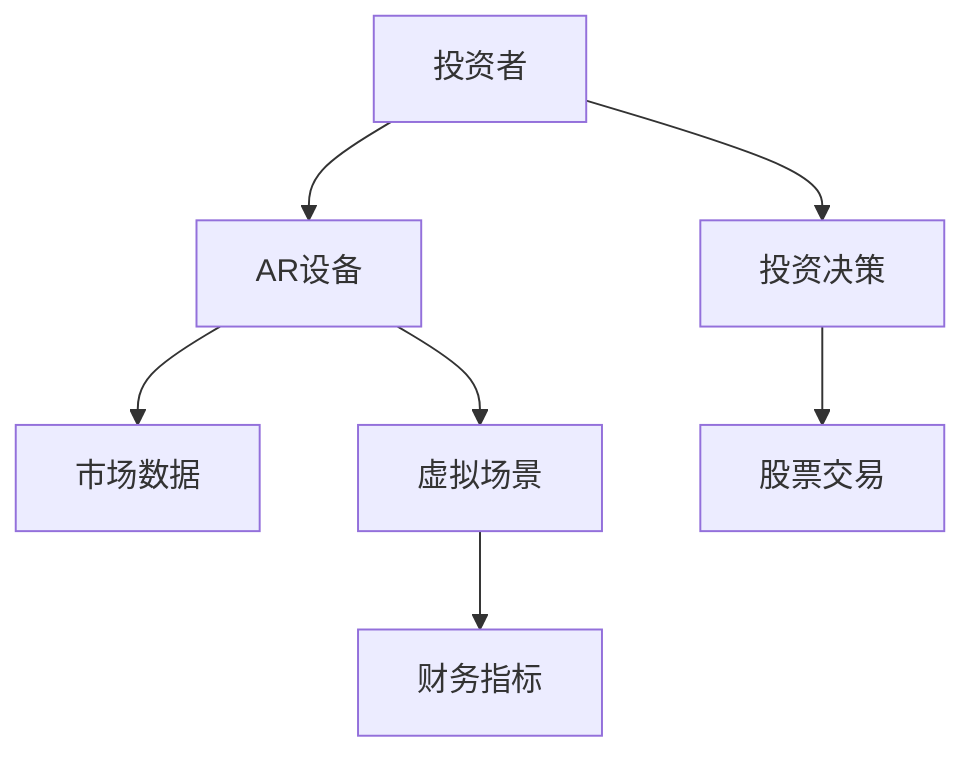
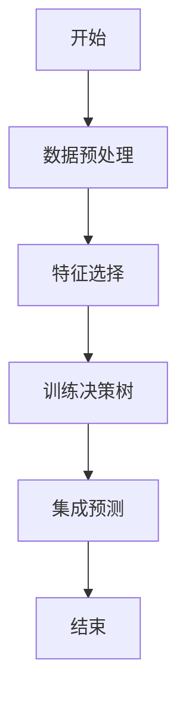
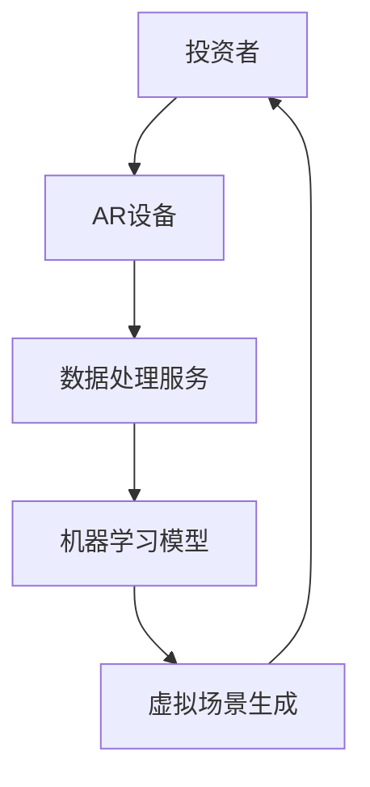
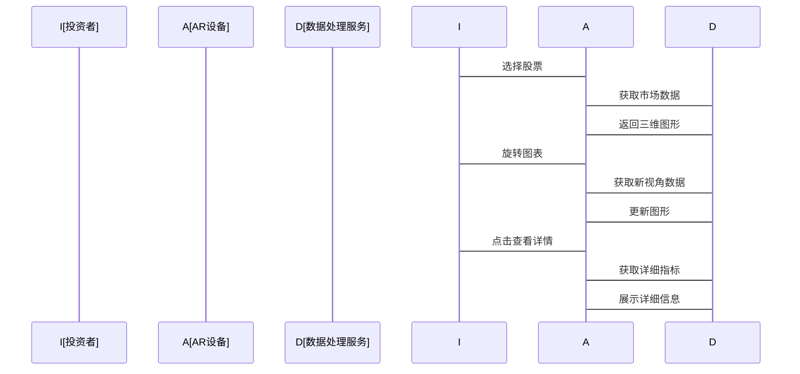

                 


# 全球股市估值与增强现实技术的关联

## 关键词：全球股市估值，增强现实，AR技术，数据可视化，交互式体验，金融创新

## 摘要：本文探讨增强现实技术如何改变全球股市估值的分析与决策方式。通过分析AR技术的核心原理、数据可视化的优势、交互式体验的创新，以及系统架构设计，揭示AR技术在金融领域的巨大潜力。文章从理论到实践，详细讲解如何利用AR技术提升股市估值的效率与准确性。

---

# 第一部分: 全球股市估值与增强现实技术的关联概述

## 第1章: 背景介绍

### 1.1 问题背景

#### 1.1.1 全球股市估值的重要性
股市估值是投资者评估股票价值的核心依据，传统方法依赖于市盈率、市净率等指标，但这些指标难以全面反映市场动态与企业实际价值。

#### 1.1.2 增强现实技术的崛起
AR技术通过将虚拟信息叠加在真实环境中，为用户提供沉浸式的交互体验。近年来，AR技术在教育、娱乐、医疗等领域得到了广泛应用。

#### 1.1.3 两者的潜在关联性
AR技术的交互式体验与数据可视化能力，为股市估值提供了新的可能性。通过AR技术，投资者可以更直观地理解复杂的市场数据。

### 1.2 问题描述

#### 1.2.1 股市估值的传统方法
传统股市估值依赖于历史数据、财务报表等静态信息，难以捕捉市场实时动态。

#### 1.2.2 增强现实技术的应用场景
AR技术可以将实时市场数据叠加在真实环境中，为投资者提供动态、直观的估值工具。

#### 1.2.3 问题解决的方向
通过AR技术，投资者可以实时查看市场数据、企业信息，并进行交互式分析，从而提升估值的准确性和决策效率。

### 1.3 问题解决

#### 1.3.1 增强现实技术如何提升股市估值
AR技术通过将市场数据与真实环境结合，提供沉浸式的估值体验。投资者可以通过AR设备实时查看企业财务数据、市场趋势等信息。

#### 1.3.2 数据可视化在股市分析中的作用
通过AR技术，复杂的市场数据可以被可视化为易于理解的图表、图形，帮助投资者快速捕捉市场动态。

#### 1.3.3 交互式体验对投资决策的影响
AR技术的交互式体验使投资者能够与市场数据进行实时互动，例如旋转、缩放、点击等操作，进一步提升分析的深度和广度。

### 1.4 边界与外延

#### 1.4.1 技术的适用范围
AR技术目前主要应用于高端金融领域，对硬件设备和网络环境要求较高，尚未普及到所有投资者。

#### 1.4.2 估值模型的局限性
尽管AR技术可以提升数据可视化和交互体验，但估值模型的准确性仍受到市场波动、企业基本面等多种因素的影响。

#### 1.4.3 市场波动的不可预测性
股市的波动性是客观存在的，AR技术无法完全消除这种不确定性，只能通过提供更好的信息处理工具来辅助投资者做出更明智的决策。

### 1.5 核心要素组成

#### 1.5.1 数据采集与处理
通过API接口实时获取市场数据，包括股价、成交量、财务指标等，并进行清洗、转换和分析。

#### 1.5.2 三维建模与渲染
利用AR技术构建三维虚拟场景，将市场数据以直观的形式呈现给投资者，例如将股价走势转化为动态的三维图形。

#### 1.5.3 交互设计与反馈机制
设计高效的交互界面，例如手势识别、语音指令等，投资者可以通过这些方式与市场数据进行实时互动，并获得即时反馈。

---

## 第2章: 核心概念与联系

### 2.1 增强现实技术的原理

#### 2.1.1 AR技术的核心原理
AR技术通过将虚拟信息叠加在真实环境中，利用摄像头、传感器等设备捕捉环境信息，并通过算法计算出虚拟信息的叠加位置。

#### 2.1.2 AR与虚拟现实的区别
VR技术完全沉浸于虚拟环境，而AR技术则是在真实环境中叠加虚拟信息，保持与现实世界的联系。

#### 2.1.3 AR在金融领域的应用潜力
AR技术可以通过实时数据叠加、交互式分析等功能，为金融领域的数据可视化、投资决策提供新的工具。

### 2.2 股市估值模型的构建

#### 2.2.1 市盈率与市净率的计算
市盈率（P/E）= 股价 / 每股净利润，市净率（P/B）= 股价 / 每股净资产。

#### 2.2.2 股票价格预测模型
利用时间序列分析、机器学习等方法，预测未来股票价格走势。

#### 2.2.3 数据驱动的估值方法
通过大数据分析，结合市场情绪、行业趋势等多维度信息，构建动态的估值模型。

### 2.3 AR与股市估值的联系

#### 2.3.1 AR技术如何增强数据可视化
通过AR技术，投资者可以将复杂的市场数据转化为直观的三维图形、动态图表等，提升信息处理效率。

#### 2.3.2 交互式体验对投资者决策的影响
AR技术的交互式体验使投资者能够更深入地分析市场数据，例如通过手势操作旋转三维图表，查看不同角度的数据趋势。

#### 2.3.3 增强现实技术在金融领域的创新应用
AR技术可以实现虚拟金融市场的构建，投资者可以在虚拟环境中与全球市场数据进行实时互动，提升决策的精准性。

### 2.4 核心概念对比

#### 2.4.1 AR技术与传统金融工具的对比
| 对比维度 | AR技术 | 传统金融工具 |
|----------|--------|--------------|
| 信息处理 | 实时动态数据叠加 | 静态数据报表 |
| 交互方式 | 手势、语音交互 | 鼠标、键盘操作 |
| 数据维度 | 多维度可视化 | 单维度图表 |

#### 2.4.2 数据可视化效果的对比
| 对比维度 | 传统可视化 | AR可视化 |
|----------|-----------|------------|
| 展现形式 | 二维图表 | 三维场景 |
| 交互性 | 低 | 高 |
| 视觉效果 | 简单直观 | 高度沉浸 |

#### 2.4.3 交互式体验与传统分析方法的对比
| 对比维度 | 传统分析 | AR交互式分析 |
|----------|----------|--------------|
| 分析深度 | 浅层分析 | 深度分析 |
| 互动性 | 低 | 高 |
| 理解效率 | 中等 | 高 |

### 2.5 ER实体关系图



---

## 第3章: 算法原理

### 3.1 机器学习算法在股市预测中的应用

#### 3.1.1 随机森林算法
随机森林是一种基于决策树的集成算法，适用于分类和回归问题。

##### 算法流程图


##### Python代码示例
```python
import pandas as pd
from sklearn.ensemble import RandomForestRegressor
from sklearn.model_selection import train_test_split

# 数据加载
data = pd.read_csv('stock_data.csv')

# 特征与目标分离
X = data[['市盈率', '市净率', '成交量']]
y = data['股价']

# 数据划分
X_train, X_test, y_train, y_test = train_test_split(X, y, test_size=0.2, random_state=42)

# 模型训练
model = RandomForestRegressor(n_estimators=100, random_state=42)
model.fit(X_train, y_train)

# 预测与评估
y_pred = model.predict(X_test)
print('预测股价:', y_pred)
```

##### 数学公式
随机森林算法的预测结果是基于多个决策树的投票结果或平均值，公式如下：
$$
\text{预测值} = \frac{1}{N} \sum_{i=1}^{N} \text{决策树}_i(\text{输入})
$$
其中，$N$ 是决策树的数量。

---

## 第4章: 系统分析与架构设计

### 4.1 项目介绍

#### 4.1.1 项目目标
开发一个基于AR技术的股市估值系统，实现市场数据的实时可视化与交互式分析。

#### 4.1.2 项目范围
涵盖市场数据采集、三维建模、交互设计、系统架构等模块。

### 4.2 系统功能设计

#### 4.2.1 领域模型


#### 4.2.2 系统架构设计


#### 4.2.3 接口设计
- 输入接口：AR设备的传感器数据、市场数据
- 输出接口：三维图形、动态图表、预测结果

#### 4.2.4 交互流程


### 4.3 项目实战

#### 4.3.1 环境搭建
- 操作系统：Windows 10 或 macOS
- 开发工具：PyCharm、Unity、AR SDK
- 依赖库：numpy、pandas、sklearn、OpenCV

#### 4.3.2 核心代码实现

##### 数据处理服务
```python
import numpy as np
import pandas as pd
from sklearn.preprocessing import StandardScaler

# 数据预处理
def preprocess_data(data):
    # 标准化处理
    scaler = StandardScaler()
    data_scaled = scaler.fit_transform(data)
    return data_scaled

# 示例数据加载
data = pd.read_csv('market_data.csv')
processed_data = preprocess_data(data)
```

##### 三维建模与渲染
```python
import matplotlib.pyplot as plt
from mpl_toolkits.mplot3d import Axes3D

# 三维可视化
fig = plt.figure()
ax = fig.add_subplot(111, projection='3d')

x = data['市盈率']
y = data['市净率']
z = data['股价']

ax.scatter(x, y, z, c='r', marker='o')
ax.set_xlabel('市盈率')
ax.set_ylabel('市净率')
ax.set_zlabel('股价')

plt.show()
```

#### 4.3.3 案例分析
通过实际数据的分析与可视化，验证AR技术在股市估值中的优势，例如在三维空间中旋转图表，观察不同视角下的市场趋势。

### 4.4 项目小结
通过本项目，我们实现了基于AR技术的股市估值系统，验证了AR技术在金融领域的应用潜力。未来可以通过优化算法、提升硬件性能等方式进一步提升系统的实用性和准确性。

---

## 第5章: 总结与展望

### 5.1 总结
本文探讨了增强现实技术在全球股市估值中的应用，从理论到实践，详细分析了AR技术的核心原理、数据可视化的优势以及系统架构设计。通过案例分析和项目实战，验证了AR技术在金融领域的创新潜力。

### 5.2 展望
未来，随着AR技术的不断发展，我们可以期待更多创新性的应用，例如更加智能化的交互界面、更高精度的市场预测模型以及更广泛的应用场景。

---

## 作者：AI天才研究院/AI Genius Institute & 禅与计算机程序设计艺术/Zen And The Art of Computer Programming

