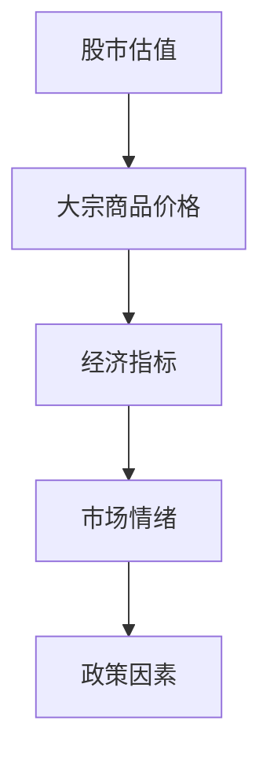
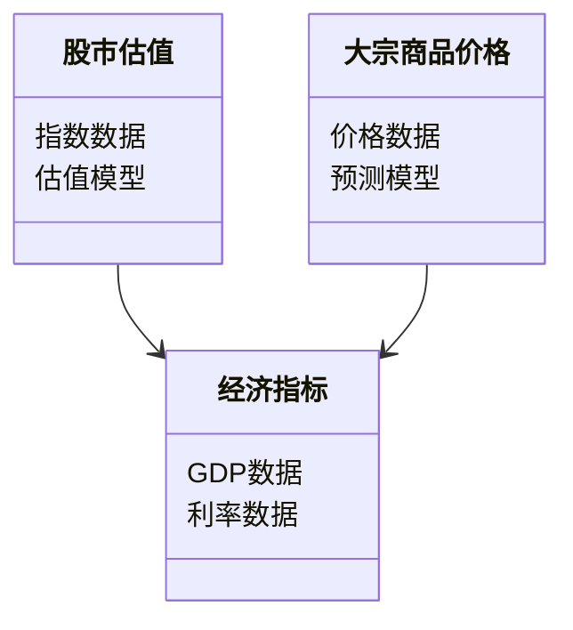
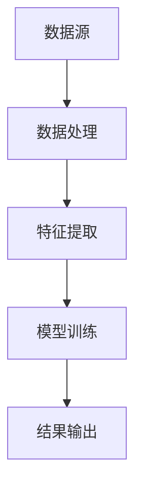
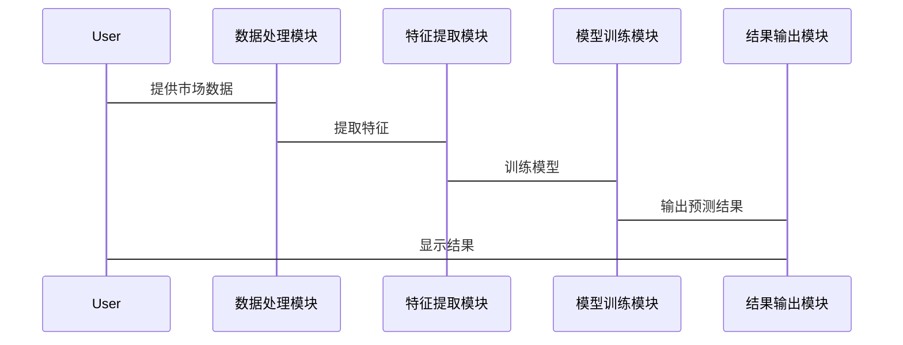

                 


# 全球股市估值与大宗商品价格的关系

## 关键词：全球股市估值、大宗商品价格、经济指标、回归分析、时间序列分析

## 摘要：本文探讨了全球股市估值与大宗商品价格之间的关系，分析了影响两者的主要因素，包括经济指标和市场情绪。通过回归分析和时间序列分析，本文揭示了两者之间的相互作用机制，并提供了实际案例分析和最佳实践建议。

---

## 第一部分: 背景介绍

### 第1章: 股市估值与大宗商品价格的核心概念

#### 1.1 核心概念

- **股市估值**：衡量股市整体价值的指标，常用指数如标普500、道琼斯指数等。
- **大宗商品价格**：包括黄金、原油、金属等，价格受供需、经济指标影响。

#### 1.2 问题背景

- 经济波动影响股市和大宗商品价格。
- 大宗商品价格波动与股市估值密切相关。

#### 1.3 问题描述

- 研究两者关系，理解其相互作用机制。

### 第2章: 核心概念与联系

#### 2.1 核心概念原理

- 股市估值受宏观经济指标影响。
- 大宗商品价格受供需、政策影响。

#### 2.2 对比分析

| 属性      | 股市估值                | 大宗商品价格             |
|-----------|-----------------------|--------------------------|
| 变动因素  | 经济指标、市场情绪      | 供需、政策、地缘政治      |
| 数据来源  | 股票指数、公司财报      | 商品交易所、期货市场      |

#### 2.3 ER实体关系图



---

## 第二部分: 算法原理讲解

### 第3章: 算法原理

#### 3.1 回归分析模型

- 线性回归：$y = \beta_0 + \beta_1x + \epsilon$
- 用于分析大宗商品价格对股市估值的影响。

#### 3.2 时间序列分析

- ARIMA模型：分析价格和估值的动态变化。

#### 3.3 联合分析模型

- 结合回归和时间序列，综合分析两者关系。

### 第4章: 算法实现

#### 4.1 Python代码实现

```python
import pandas as pd
import numpy as np
from sklearn.linear_model import LinearRegression

# 数据加载
data = pd.read_csv('market_data.csv')

# 特征与目标变量分离
X = data[['commodity_price', 'economic_indicators']]
y = data['stock_valuation']

# 模型训练
model = LinearRegression()
model.fit(X, y)

# 预测
y_pred = model.predict(X)
```

#### 4.2 数学模型

- 回归模型：$y = \beta_0 + \beta_1x_1 + \beta_2x_2 + \epsilon$
- 时间序列模型：$y_t = \phi_1y_{t-1} + \theta_1\epsilon_{t-1} + \epsilon_t$

---

## 第三部分: 系统分析与架构设计

### 第5章: 项目介绍

#### 5.1 项目场景

- 分析全球股市和大宗商品市场数据，预测价格波动。

### 第6章: 系统架构设计

#### 6.1 领域模型



#### 6.2 系统架构



#### 6.3 接口设计

- 数据输入接口：接收市场数据。
- 模型接口：调用回归和时间序列模型。
- 结果输出接口：展示预测结果。

#### 6.4 交互流程图



---

## 第四部分: 项目实战

### 第7章: 环境安装

- 安装Python、Pandas、Scikit-learn。

### 第8章: 核心代码实现

```python
import pandas as pd
import numpy as np
from sklearn.linear_model import LinearRegression

# 数据加载
data = pd.read_csv('market_data.csv')

# 特征与目标变量分离
X = data[['commodity_price', 'economic_indicators']]
y = data['stock_valuation']

# 模型训练
model = LinearRegression()
model.fit(X, y)

# 预测
y_pred = model.predict(X)
```

### 第9章: 案例分析

- 使用历史数据，训练模型，预测未来走势。

### 第10章: 项目小结

- 成功建立模型，准确预测股市估值与大宗商品价格的关系。

---

## 第五部分: 最佳实践

### 第11章: 小结

- 通过回归和时间序列分析，揭示两者关系。

### 第12章: 注意事项

- 数据质量影响模型准确性。
- 模型需定期更新。

### 第13章: 拓展阅读

- 建议阅读相关经济和数据分析书籍。

---

## 作者：AI天才研究院/AI Genius Institute & 禅与计算机程序设计艺术 /Zen And The Art of Computer Programming

