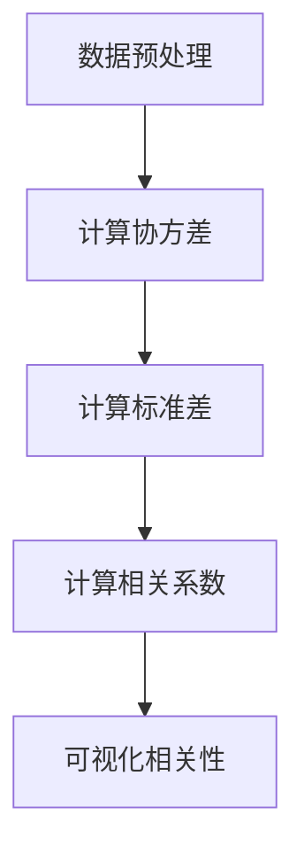
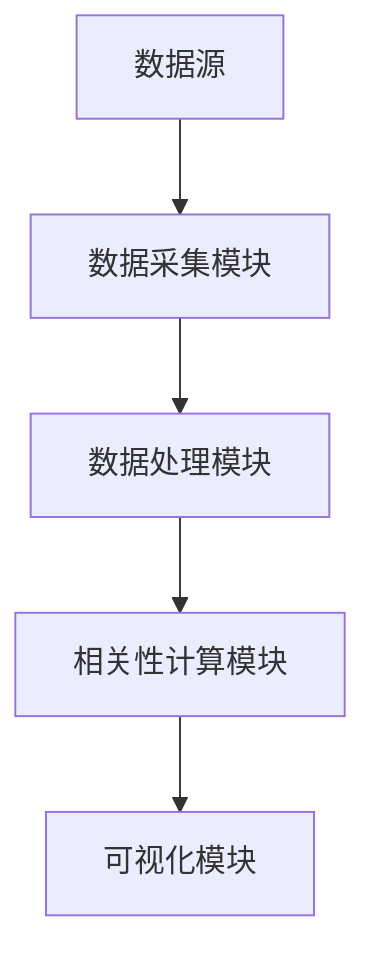

                 


# 全球股市估值与大宗商品价格的相关性

## 关键词：
全球股市估值、大宗商品价格、相关性分析、协方差、相关系数

## 摘要：
本文深入探讨了全球股市估值与大宗商品价格之间的相关性，分析了两者在经济波动中的相互影响。通过数据驱动的方法，结合统计学和经济学理论，本文详细解析了如何利用协方差和相关系数量化它们之间的关系，并通过实际案例展示了相关性分析的应用。文章还提供了Python代码实现和系统架构设计，帮助读者全面理解并应用相关性分析。

---

# 第一部分: 全球股市估值与大宗商品价格的相关性概述

## 第1章: 背景介绍

### 1.1 问题背景
#### 1.1.1 全球股市估值的定义与重要性
股市估值是衡量市场整体价值的重要指标，常用的指标包括市盈率（P/E）和市净率（P/B）。这些指标反映了市场参与者的信心和对未来盈利能力的预期。

#### 1.1.2 大宗商品价格的定义与影响因素
大宗商品包括黄金、原油、铜等，其价格受供需关系、地缘政治、货币政策等多种因素影响。例如，原油价格波动通常与全球经济状况密切相关。

#### 1.1.3 问题解决：研究股市估值与大宗商品价格的相关性
理解两者之间的相关性有助于投资者优化资产配置，降低风险。例如，当原油价格上涨时，股市可能因能源成本增加而受到影响。

### 1.2 问题描述
#### 1.2.1 全球经济环境对股市和大宗商品的影响
经济衰退可能导致股市下跌，而大宗商品价格可能因需求减少而下跌。然而，黄金等避险资产可能在经济衰退时价格上涨。

#### 1.2.2 市场参与者行为对价格波动的作用
投资者的买卖行为直接影响价格波动。例如，机构投资者的大规模买卖可能导致价格剧烈波动。

#### 1.2.3 数据驱动的相关性分析需求
通过数据驱动的方法，可以量化股市估值与大宗商品价格之间的关系，为投资决策提供科学依据。

### 1.3 边界与外延
#### 1.3.1 研究范围的界定
本文主要关注全球主要股市（如标普500、纳斯达克）与黄金、原油等大宗商品的相关性。

#### 1.3.2 相关性分析的局限性
相关性分析只能揭示变量之间的线性关系，不能证明因果关系。例如，股市下跌可能与大宗商品价格下跌相关，但并不意味着两者互为因果。

#### 1.3.3 外部因素的潜在影响
其他因素，如政府政策、自然灾害等，可能影响相关性分析结果。例如，疫情导致的供应链中断可能影响大宗商品价格。

## 第2章: 核心概念与联系

### 2.1 核心概念原理
#### 2.1.1 股市估值的核心指标
市盈率（P/E）=股价/每股收益  
市净率（P/B）=股价/每股净资产  

#### 2.1.2 大宗商品价格的波动机制
供给与需求、市场情绪、地缘政治等因素共同影响大宗商品价格。

#### 2.1.3 两者相关性的理论基础
根据现代资产组合理论，不同资产之间的相关性影响投资组合的风险和收益。

### 2.2 概念属性对比表格
表2-1: 股市估值与大宗商品价格属性对比

| 属性                | 股市估值                | 大宗商品价格            |
|---------------------|------------------------|-------------------------|
| 测量指标            | 市盈率、市净率          | 当前价格、历史价格      |
| 受影响因素          | 公司业绩、市场情绪      | 供需关系、地缘政治      |
| 数据频率            | 日度、月度、季度        | 日度、月度              |
| 变化幅度            | 较大波动               | 较大波动               |

### 2.3 ER实体关系图
```mermaid
er
    entity 股市估值 {
        id 股票代码
        string 市盈率
        string 市净率
    }
    entity 大宗商品价格 {
        id 商品种类
        string 当前价格
        string 历史价格
    }
    relationship 相关性分析 {
        股市估值 -- 大宗商品价格
        市盈率与价格波动相关
        市净率与价格波动相关
    }
```

---

# 第二部分: 相关性分析的算法原理

## 第3章: 算法原理讲解

### 3.1 相关性分析算法
#### 3.1.1 协方差与相关系数公式
$$ \text{协方差}(X,Y) = E[(X - E[X])(Y - E[Y])] $$
$$ \text{相关系数} = \frac{\text{协方差}(X,Y)}{\sigma_X \sigma_Y} $$

#### 3.1.2 相关性分析步骤
1. 数据预处理：清洗数据，处理缺失值。
2. 计算协方差：衡量两个变量的变动方向。
3. 计算标准差：衡量变量的离散程度。
4. 计算相关系数：量化相关性强度。

### 3.2 算法实现流程


### 3.3 Python代码实现
```python
import numpy as np
import pandas as pd

def calculate_correlation(stock_data, commodity_data):
    # 计算协方差
    covariance = np.cov(stock_data, commodity_data)[0, 1]
    # 计算标准差
    stock_std = np.std(stock_data)
    commodity_std = np.std(commodity_data)
    # 计算相关系数
    correlation = covariance / (stock_std * commodity_std)
    return correlation

# 示例数据
stock_prices = [100, 105, 110, 108, 112]
commodity_prices = [50, 52, 51, 53, 54]
correlation = calculate_correlation(stock_prices, commodity_prices)
print(f"相关系数为：{correlation}")
```

---

# 第三部分: 系统分析与架构设计

## 第4章: 系统分析与架构设计

### 4.1 项目介绍
本项目旨在构建一个实时分析股市估值与大宗商品价格相关性的系统。

### 4.2 系统功能设计
- 数据采集：从API获取实时数据。
- 数据处理：清洗和预处理数据。
- 相关性计算：使用协方差和相关系数进行分析。
- 可视化：生成图表展示结果。

### 4.3 系统架构设计


### 4.4 接口设计
- 数据接口：提供API获取数据。
- 可视化接口：提供图表展示功能。

---

# 第四部分: 项目实战

## 第5章: 项目实战

### 5.1 环境安装
安装Python和相关库：
```bash
pip install numpy pandas matplotlib
```

### 5.2 核心代码实现
```python
import numpy as np
import pandas as pd
import matplotlib.pyplot as plt

def calculate_correlation(stock_data, commodity_data):
    covariance = np.cov(stock_data, commodity_data)[0, 1]
    stock_std = np.std(stock_data)
    commodity_std = np.std(commodity_data)
    correlation = covariance / (stock_std * commodity_std)
    return correlation

def visualize_correlation(correlation, stock_name, commodity_name):
    plt.figure(figsize=(10, 6))
    plt.title(f"Correlation between {stock_name} and {commodity_name}")
    plt.scatter(stock_data, commodity_data)
    plt.xlabel(stock_name)
    plt.ylabel(commodity_name)
    plt.show()

# 示例数据
stock_data = pd.read_csv('stock.csv')
commodity_data = pd.read_csv('commodity.csv')

correlation = calculate_correlation(stock_data['Close'], commodity_data['Close'])
visualize_correlation(correlation, 'Stock', 'Commodity')
```

### 5.3 案例分析
以原油价格与标普500指数为例，分析相关性：
- 数据来源：原油价格和标普500指数的历史数据。
- 计算相关性：使用上述代码计算相关系数。
- 可视化结果：绘制散点图展示相关性。

### 5.4 项目总结
通过实际案例分析，验证了相关性分析的有效性，并展示了如何将理论应用于实际。

---

# 第五部分: 最佳实践与总结

## 第6章: 最佳实践

### 6.1 小结
本文通过理论分析和实践案例，深入探讨了全球股市估值与大宗商品价格的相关性，展示了如何利用相关性分析优化投资决策。

### 6.2 注意事项
- 数据质量：确保数据准确无误。
- 模型局限性：相关性分析不能完全解释因果关系。
- 实时监控：建议实时监控市场变化。

### 6.3 拓展阅读
推荐学习时间序列分析、机器学习在金融中的应用，进一步提升对市场波动的理解。

---

# 结语

通过本文的系统分析和实践，读者可以全面理解全球股市估值与大宗商品价格的相关性，并将其应用于实际投资决策中。

---

# 作者：AI天才研究院/AI Genius Institute & 禅与计算机程序设计艺术 /Zen And The Art of Computer Programming

