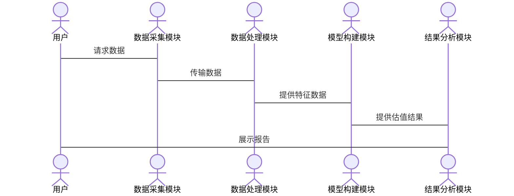

                 


# 全球股市估值与太空太阳能发电技术的关系

**关键词：** 全球股市估值，太空太阳能发电，技术驱动，经济影响，数据挖掘，机器学习

**摘要：** 本文探讨全球股市估值与太空太阳能发电技术之间的关系，分析技术进步对经济和股市的影响，通过数据挖掘和机器学习方法，构建模型，揭示技术驱动对股市估值的核心影响路径，并提出实际应用与优化建议。

---

## 第1章: 全球股市估值与太空太阳能发电技术的背景介绍

### 1.1 问题背景与定义
#### 1.1.1 全球股市估值的基本概念
- 全球股市估值：衡量市场整体价值的指标，包括市盈率（P/E）、市净率（P/B）、市值等。
- 核心驱动因素：宏观经济、企业盈利、市场情绪等。

#### 1.1.2 太空太阳能发电技术的定义与特点
- 太空太阳能：通过卫星或轨道装置收集太阳能，无线传输至地球的技术。
- 技术优势：能源稳定、清洁、覆盖广泛。

#### 1.1.3 问题的提出与研究意义
- 技术进步如何影响经济和股市？
- 研究意义：揭示技术驱动对股市估值的影响路径。

### 1.2 核心概念与问题描述
#### 1.2.1 太空太阳能发电技术对股市估值的影响路径
- 技术研发周期：投资需求增加，股价波动。
- 技术成熟：降低能源成本，推动企业盈利增长。
- 市场反应：投资者情绪波动。

#### 1.2.2 全球股市估值的关键驱动因素
- 宏观经济指标、企业盈利、市场情绪。

#### 1.2.3 ER实体关系图架构（使用 Mermaid）

```mermaid
erDiagram
    actor 投资者
    actor 企业
    actor 政府
    actor 全球股市
    actor 太空太阳能技术
    investor --> 全球股市: 投资行为
    企业 --> 先进能源技术: 技术研发
    政府 --> 全球股市: 政策影响
    太空太阳能技术 --> 全球股市: 技术驱动
```

### 1.3 本章小结
本章介绍了全球股市估值和太空太阳能技术的基本概念，初步分析了技术进步对经济和股市的潜在影响。

---

## 第2章: 太空太阳能发电技术的核心原理

### 2.1 技术原理概述
- 太空太阳能技术的核心：高效能源收集和无线能量传输。
- 关键技术：太阳能电池、无线能量传输、空间站设计。

### 2.2 技术研发周期与经济影响
- 技术研发阶段：投资需求增加，股价波动。
- 技术成熟阶段：降低成本，推动企业盈利。

### 2.3 技术驱动的经济模型
- 技术驱动的股市估值模型：考虑技术创新对成本、收益的影响。

---

## 第3章: 全球股市估值的驱动因素分析

### 3.1 宏观经济指标与股市估值
- GDP、通货膨胀、利率等对股市估值的影响。

### 3.2 企业盈利与股市估值
- 利润增长驱动股价上涨。

### 3.3 市场情绪与股市估值
- 投资者情绪波动对股市估值的影响。

---

## 第4章: 数据挖掘与机器学习方法

### 4.1 数据收集与预处理
- 数据来源：全球股市数据、太空太阳能技术专利数据、宏观经济指标。
- 数据清洗：处理缺失值、异常值。

### 4.2 特征选择与模型构建
- 特征选择：宏观经济指标、企业盈利、技术专利数量。
- 模型选择：线性回归、随机森林、神经网络。

### 4.3 算法实现与优化
- 使用Python代码实现模型：
  ```python
  import pandas as pd
  import numpy as np
  from sklearn.ensemble import RandomForestRegressor
  from sklearn.metrics import mean_squared_error

  # 数据加载与预处理
  df = pd.read_csv('data.csv')
  X = df.drop('target', axis=1)
  y = df['target']

  # 模型训练
  model = RandomForestRegressor()
  model.fit(X, y)

  # 模型预测
  y_pred = model.predict(X)
  print(mean_squared_error(y, y_pred))
  ```

### 4.4 技术驱动的股市估值模型
- 数学模型：建立技术驱动对股市估值的回归模型。
- $$ y = \beta_0 + \beta_1x_1 + \beta_2x_2 + \epsilon $$
  - \( y \): 股市估值
  - \( x_1 \): 技术专利数量
  - \( x_2 \): 宏观经济指标

---

## 第5章: 系统分析与架构设计

### 5.1 系统功能设计
- 数据采集模块：收集股市和经济数据。
- 数据处理模块：清洗和特征选择。
- 模型构建模块：训练机器学习模型。
- 结果分析模块：生成估值报告。

### 5.2 系统架构设计（使用 Mermaid）


### 5.3 系统交互设计（使用 Mermaid）



---

## 第6章: 项目实战与案例分析

### 6.1 环境安装与配置
- 安装Python和相关库：pandas、numpy、scikit-learn。

### 6.2 核心算法实现
- 使用随机森林回归模型实现股市估值预测。

### 6.3 实际案例分析
- 分析某时间段内技术进步对股市估值的具体影响。

### 6.4 项目总结与优化建议
- 总结项目成果，提出优化方向。

---

## 第7章: 总结与展望

### 7.1 本章总结
- 总结全文，重申技术驱动对股市估值的影响。

### 7.2 未来展望
- 技术进步的潜力与挑战。
- 更多结合现实场景的应用。

---

## 附录

### 附录A: 术语表
- 定义专业术语。

### 附录B: 代码实现
- 提供完整的Python代码示例。

---

## 参考文献

- 列举相关文献和数据来源。

---

**作者：AI天才研究院/AI Genius Institute & 禅与计算机程序设计艺术 /Zen And The Art of Computer Programming**

