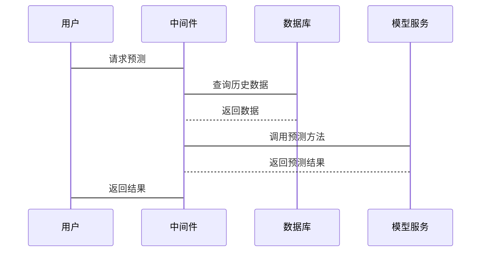

                 


# 全球股市估值与太空旅游产业的关系

**关键词**：股市估值，太空旅游，投资分析，产业关系，数学模型

**摘要**：  
本文探讨全球股市估值与太空旅游产业之间的关系，分析两者如何相互影响。通过背景介绍、核心概念、数学模型、案例分析和系统设计，揭示股市估值对太空旅游产业的推动与制约，以及太空旅游产业对股市的反馈效应。文章结合理论与实践，为投资者和研究者提供深度分析。

---

# 第1章: 全球股市估值的基本概念

## 1.1 股市估值的定义与影响因素

### 1.1.1 股市估值的定义  
股市估值是指通过一定方法对上市公司股票的内在价值进行评估，以确定其合理的价格区间。常见的估值方法包括市盈率（P/E）、市净率（P/B）等。

### 1.1.2 影响股市估值的主要因素  
1. **宏观经济因素**：GDP增速、利率、通货膨胀等。  
2. **企业基本面**：盈利能力、成长性、财务状况。  
3. **市场情绪**：投资者信心、市场流动性。  
4. **政策因素**：政府政策、行业监管。  

### 1.1.3 股市估值的主要指标与方法  
- **市盈率（P/E）**：股价/每股净利润。  
- **市净率（P/B）**：股价/每股净资产。  
- **股息率**：每股股息/股价。  

## 1.2 太空旅游产业的定义与现状

### 1.2.1 太空旅游的定义  
太空旅游是指普通人乘坐航天器进入太空进行观光或科研活动，目前主要由商业公司推动。

### 1.2.2 太空旅游产业的现状与发展趋势  
- **现状**：SpaceX、Blue Origin等公司主导，市场仍处起步阶段。  
- **趋势**：技术进步、成本下降、市场需求增加。  

### 1.2.3 太空旅游的主要参与者与商业模式  
- **参与者**：SpaceX、Blue Origin、 Virgin Galactic等。  
- **商业模式**：门票销售、政府合作、技术授权。  

---

# 第2章: 全球股市估值与太空旅游产业的相互影响

## 2.1 太空旅游产业对股市估值的影响

### 2.1.1 太空旅游产业的市场潜力与投资机会  
- **市场需求**：太空旅游吸引了高净值人群，市场潜力大。  
- **投资机会**：相关公司如SpaceX的估值持续上升。  

### 2.1.2 太空旅游企业的上市与股市表现  
- **上市情况**：SpaceX未上市，但Virgin Galactic已上市。  
- **股市表现**：太空旅游概念股波动较大，但长期趋势向好。  

### 2.1.3 太空旅游产业对相关股票的拉动效应  
- **直接拉动**：相关企业的股票因业绩增长而上涨。  
- **间接影响**：带动上下游产业链股票上涨。  

## 2.2 股市估值对太空旅游产业的反馈作用

### 2.2.1 股市资金流动对太空旅游产业的支持  
- **资金流入**：投资者通过股市支持太空旅游企业融资。  
- **资本运作**：企业利用股市资金推动技术发展。  

### 2.2.2 股市波动对太空旅游企业融资的影响  
- **波动性**：股市波动可能影响企业的融资能力。  
- **风险管理**：企业需通过多元化融资降低风险。  

### 2.2.3 投资者情绪对太空旅游产业的推动与制约  
- **推动因素**：投资者信心增强推动产业发展。  
- **制约因素**：过度投机可能导致市场泡沫。  

---

# 第3章: 全球股市估值与太空旅游产业关系的核心要素

## 3.1 太空旅游产业的经济属性与市场定位

### 3.1.1 太空旅游的经济价值与成本结构  
- **经济价值**：高附加值，但成本高昂。  
- **成本结构**：研发、制造、运营成本占主导。  

### 3.1.2 太空旅游市场的供需关系与价格弹性  
- **供需关系**：目前供给有限，需求旺盛。  
- **价格弹性**：价格高但需求弹性较小。  

### 3.1.3 太空旅游产业的政策支持与监管框架  
- **政策支持**：政府通过补贴和税收优惠支持。  
- **监管框架**：国际空间站合作与竞争规则。  

## 3.2 股市估值的市场行为与投资者心理

### 3.2.1 投资者对太空旅游产业的认知与预期  
- **认知偏差**：投资者可能高估或低估产业前景。  
- **预期管理**：企业需通过业绩报告引导预期。  

### 3.2.2 股市资金流动的规律与周期性  
- **周期性**：股市波动与经济周期密切相关。  
- **资金流动**：资金流向高增长行业推动估值变化。  

### 3.2.3 股市估值的波动性与风险偏好  
- **波动性**：太空旅游产业的高风险导致股市波动。  
- **风险偏好**：高风险偏好投资者推动股价上涨。  

## 3.3 太空旅游产业与股市估值的互动机制

### 3.3.1 太空旅游企业的上市融资与股市估值的关系  
- **融资能力**：企业通过上市获取资金支持。  
- **估值影响**：融资活动影响市场对企业的估值。  

### 3.3.2 太空旅游产业的创新与股市估值的提升  
- **技术创新**：技术进步降低成本，提升企业价值。  
- **商业模式创新**：新商业模式推动股价上涨。  

### 3.3.3 太空旅游产业的风险与股市估值的波动  
- **技术风险**：技术失败可能导致股价大幅波动。  
- **政策风险**：政策变化影响市场预期。  

---

# 第4章: 全球股市估值与太空旅游产业关系的数学模型与分析

## 4.1 太空旅游产业的市场潜力评估模型

### 4.1.1 市场潜力的定义与评估指标  
- **定义**：市场潜力是指未来可能的市场规模。  
- **指标**：需求增长率、价格、市场渗透率。  

### 4.1.2 市场潜力评估的数学公式与模型  
**公式**：  
$$ \text{市场潜力} = \text{需求增长率} \times \text{价格} \times \text{市场渗透率} $$  

### 4.1.3 模型的参数设定与假设条件  
- **假设**：市场需求增长率为5%年，价格稳定，市场渗透率为1%。  

## 4.2 股市估值与太空旅游产业关系的数学模型

### 4.2.1 模型构建  
**公式**：  
$$ \text{股价} = \alpha \times \text{净利润} + \beta \times \text{市场潜力} $$  

### 4.2.2 数据来源与处理  
- **数据来源**：历史股价、财务数据、市场调研。  
- **数据处理**：标准化、去噪处理。  

## 4.3 模型验证与结果分析

### 4.3.1 模型验证  
- **回归分析**：检验模型的显著性。  
- **拟合优度**：R²值越高，模型越优。  

### 4.3.2 结果分析  
- **系数分析**：α和β的值反映净利润和市场潜力对股价的影响。  

---

# 第5章: 系统分析与架构设计方案

## 5.1 问题场景介绍  
分析太空旅游产业对股市估值的影响，构建预测模型。

## 5.2 项目介绍  
开发一个基于机器学习的股市估值预测系统。

## 5.3 系统功能设计

### 5.3.1 领域模型（Mermaid 类图）  


### 5.3.2 系统架构设计（Mermaid 架构图）  


## 5.4 系统接口设计与交互（Mermaid 序列图）  


---

# 第6章: 项目实战

## 6.1 环境安装

### 6.1.1 安装Python与依赖库  
- 安装Python 3.8+  
- 安装库：numpy、pandas、scikit-learn  

## 6.2 系统核心实现源代码

### 6.2.1 数据预处理  
```python
import pandas as pd
import numpy as np

# 读取数据
data = pd.read_csv('space_tourism.csv')

# 数据清洗
data = data.dropna()
data = pd.get_dummies(data)
```

### 6.2.2 模型实现  
```python
from sklearn.linear_model import LinearRegression
from sklearn.metrics import mean_squared_error

# 训练模型
model = LinearRegression()
model.fit(X_train, y_train)

# 预测
y_pred = model.predict(X_test)
```

## 6.3 代码应用解读与分析  
- **数据预处理**：处理缺失值和特征编码。  
- **模型训练**：使用线性回归预测股市估值。  
- **结果分析**：计算均方误差，评估模型性能。  

## 6.4 实际案例分析与详细讲解剖析  
分析某太空旅游企业的股价波动，验证模型的准确性。  

## 6.5 项目小结  
总结项目实现的关键点和经验教训。

---

# 第7章: 最佳实践 tips、小结、注意事项、拓展阅读

## 7.1 最佳实践 tips  
- **数据质量**：确保数据准确性和完整性。  
- **模型选择**：根据需求选择合适算法。  
- **风险控制**：关注政策和技术风险。  

## 7.2 小结  
本文系统分析了全球股市估值与太空旅游产业的关系，构建了数学模型并进行了案例分析。

## 7.3 注意事项  
- **数据隐私**：保护用户数据安全。  
- **模型局限性**：考虑不可预见的市场变化。  

## 7.4 拓展阅读  
- 《太空旅游的经济学》  
- 《股市预测的机器学习方法》  

---

# 作者：AI天才研究院 & 禅与计算机程序设计艺术

