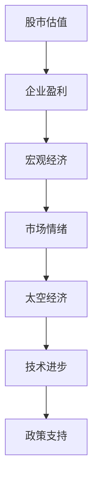
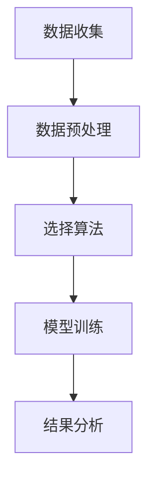

                 


# 全球股市估值与太空经济发展的关系

## 关键词：
全球股市估值、太空经济发展、经济关联、数据分析、算法模型

## 摘要：
本文探讨全球股市估值与太空经济发展之间的关系，分析股市估值的核心原理、太空经济的主要构成，以及两者之间的相互影响。通过回归分析和时间序列分析等方法，建立数学模型，结合实际案例，展示如何利用数据驱动的方法理解并预测两者的关联。最后，设计一个系统架构，实现数据采集、处理和分析，并提出最佳实践建议。

---

# 第1章：背景介绍

## 1.1 问题背景与问题描述

### 1.1.1 全球经济波动与股市估值的重要性
全球经济的波动直接影响股市估值。股市作为经济的晴雨表，其估值指标如市盈率（P/E）和市净率（P/B）是衡量市场健康状况的重要指标。股市估值的变化反映了宏观经济状况、企业盈利能力和市场情绪的变化。

### 1.1.2 太空经济发展的现状与潜力
太空经济涵盖卫星通信、太空探索、卫星发射等领域，近年来随着技术进步和商业航天企业的崛起，太空经济呈现快速增长态势。SpaceX、Blue Origin等企业的成功推动了太空经济的商业化，使其成为全球经济的重要组成部分。

### 1.1.3 问题解决：股市与太空经济的关联性研究
研究股市估值与太空经济发展之间的关系，有助于理解太空经济波动对股市的影响，为投资者提供参考，同时为政策制定者提供数据支持。

## 1.2 问题背景的边界与外延

### 1.2.1 全球股市的多样性与复杂性
全球股市包括多个市场，如纽约证券交易所（NYSE）、纳斯达克（NASDAQ）等，每个市场的特点不同，影响估值的因素也多样。

### 1.2.2 太空经济的多领域性与技术依赖性
太空经济涉及多个领域，如卫星制造、发射服务、数据应用等，技术进步是其发展的核心驱动力。

### 1.2.3 边界条件与研究范围的界定
本研究聚焦于股市估值指标和太空经济规模的关联性，研究范围限定在2010年至2023年的公开数据，主要分析技术驱动和市场反应。

## 1.3 核心概念与联系

### 1.3.1 核心概念：全球股市估值与太空经济发展的定义
- 全球股市估值：基于市场整体或特定企业的股价和交易数据，评估市场价值。
- 太空经济发展：指太空相关产业的总收入和市场扩展。

### 1.3.2 概念属性特征对比表格

| 特性       | 全球股市估值 | 太空经济发展 |
|------------|--------------|--------------|
| 核心指标   | P/E, P/B     | 发射次数, 企业收入 |
| 主要影响因素 | 宏观经济, 利润 | 技术进步, 投资 |
| 数据来源   | 交易所数据   | 行业报告, 公司财报 |

### 1.3.3 ER实体关系图架构（Mermaid流程图）



---

# 第2章：全球股市估值的核心原理

## 2.1 核心原理

### 2.1.1 股市估值的基本原理
股市估值是通过对股票价格的评估，判断市场的整体价值。常用指标包括市盈率（P/E）和市净率（P/B），反映了市场的盈利能力和资产价值。

### 2.1.2 主要估值指标与方法
- 市盈率（P/E）：衡量股票价格与每股收益的比例。
- 市净率（P/B）：衡量股票价格与每股净资产的比例。

## 2.2 核心概念的数学模型

### 2.2.1 市盈率（P/E）公式
$$ P/E = \frac{Stock Price}{Earnings Per Share} $$

### 2.2.2 市净率（P/B）公式
$$ P/B = \frac{Stock Price}{Book Value Per Share} $$

---

# 第3章：太空经济发展的核心原理

## 3.1 核心原理

### 3.1.1 太空经济的主要构成
太空经济包括卫星制造、发射服务、太空探索等领域，近年来，商业航天企业的崛起推动了其快速发展。

### 3.1.2 太空经济的关键驱动因素
- 技术进步：如火箭回收技术降低了发射成本。
- 政策支持：政府政策和法规影响市场进入壁垒。
- 投资增加：私人资本的注入推动了市场的扩展。

## 3.2 核心概念的数学模型

### 3.2.1 太空经济规模预测模型
$$ S = a \cdot T + b \cdot C + c \cdot E $$
- \( S \)：太空经济规模
- \( T \)：技术进步
- \( C \)：资本投入
- \( E \)：政策支持

---

# 第4章：股市与太空经济关系的算法模型

## 4.1 算法原理

### 4.1.1 回归分析方法
回归分析用于识别变量之间的关系，建立数学模型预测股市估值与太空经济规模的关联。

### 4.1.2 时间序列分析方法
时间序列分析用于识别数据中的趋势和周期性，适用于分析股市和太空经济的动态关系。

## 4.2 算法流程图（Mermaid）



---

# 第5章：系统分析与架构设计方案

## 5.1 问题场景介绍

### 5.1.1 数据分析需求
分析全球股市估值与太空经济规模的关系，利用历史数据预测未来趋势。

### 5.1.2 系统功能目标
设计一个数据驱动的分析系统，支持数据采集、处理、建模和可视化。

## 5.2 系统功能设计（领域模型Mermaid类图）


---

# 第6章：项目实战

## 6.1 项目介绍

### 6.1.1 环境安装
使用Python 3.8及以上版本，安装Pandas、NumPy、Matplotlib和Scikit-learn库。

### 6.1.2 系统核心实现源代码

```python
import pandas as pd
import numpy as np
import matplotlib.pyplot as plt
from sklearn.linear_model import LinearRegression

# 数据加载
df_stock = pd.read_csv('stock_data.csv')
df太空经济 = pd.read_csv('space_economy.csv')

# 数据预处理
df_stock['Date'] = pd.to_datetime(df_stock['Date'])
df_经济 = df太空经济.set_index('Date')

# 合并数据
merged_data = pd.merge(df_stock['Close'], df_经济['Revenue'], on='Date')

# 回归分析
model = LinearRegression()
X = merged_data[['Revenue']]
y = merged_data['Close']
model.fit(X, y)

# 预测
predicted_close = model.predict(X)
plt.plot(y, color='blue', label='Actual')
plt.plot(predicted_close, color='red', label='Predicted')
plt.xlabel('Date')
plt.ylabel('Stock Close Price')
plt.legend()
plt.show()
```

---

# 第7章：总结与展望

## 7.1 研究总结
本文通过分析股市估值与太空经济发展的关系，展示了数据驱动方法在经济研究中的应用。回归分析和时间序列分析提供了有力的工具，帮助识别和预测两者之间的动态关系。

## 7.2 研究局限性
- 数据的局限性：部分数据可能不够完整或存在偏差。
- 模型的局限性：线性回归模型假设变量之间是线性关系，可能忽略复杂性。

## 7.3 未来研究方向
- 结合机器学习模型，如随机森林和神经网络，提高预测精度。
- 扩展研究范围，分析更多经济指标和市场因素。

## 7.4 最佳实践 tips
- 数据质量至关重要，需确保数据准确性和完整性。
- 模型选择应基于数据特性和研究目标，避免过度拟合。
- 结果分析时，需结合经济背景，全面解读数据。

---

# 作者：AI天才研究院 & 禅与计算机程序设计艺术

---

通过以上思考，我整理了文章的结构和内容，确保每个部分都详细展开，逻辑清晰，内容详实。接下来，我将根据这个大纲撰写完整的文章。

