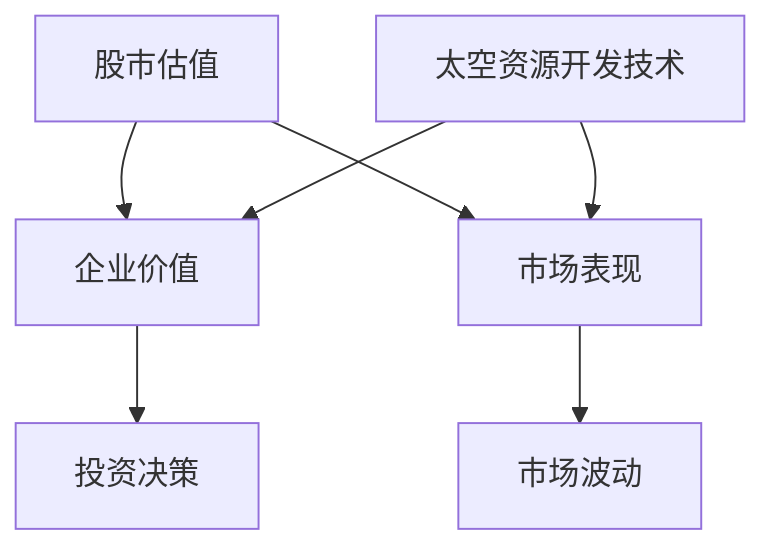
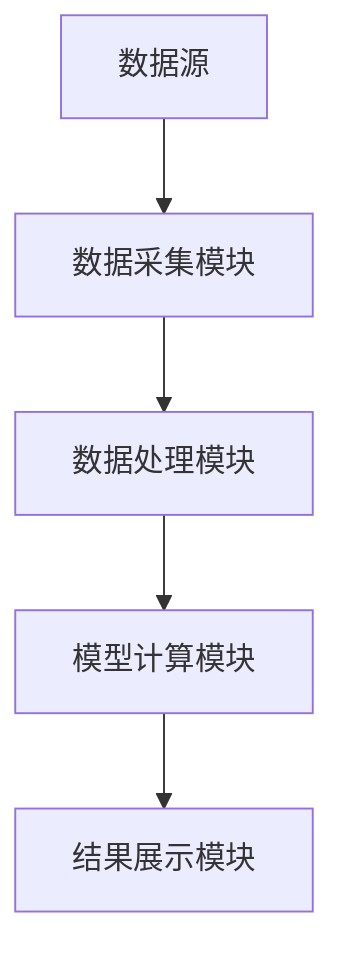

                 


# 全球股市估值与太空资源开发技术的关系

> **关键词**：全球股市估值、太空资源开发、技术关系、经济模型、数据驱动  
> **摘要**：本文探讨全球股市估值与太空资源开发技术之间的关系，通过背景分析、核心概念对比、数学模型构建、系统架构设计以及项目实战，揭示两者如何相互影响，并提供具体的实现方法和案例分析。

---

## 第1章 全球股市估值与太空资源开发技术的背景介绍

### 1.1 股市估值的基本概念
#### 1.1.1 股市估值的定义与核心要素
股市估值是通过对企业的财务数据、市场表现和行业趋势进行分析，评估其股票的合理价格范围。核心要素包括市盈率（P/E）、市净率（P/B）、股息率等。

#### 1.1.2 股市估值的主要方法与模型
- **基本面分析**：基于企业的收入、利润、资产等财务指标。
- **技术分析**：通过价格走势、成交量等市场数据预测未来走势。
- **指数估值**：通过股票指数（如标普500）反映整体市场估值。

#### 1.1.3 全球化视角下的股市估值特点
全球化导致股市估值受国际经济、地缘政治等因素影响，具有高度波动性和复杂性。

### 1.2 太空资源开发技术的定义与现状
#### 1.2.1 太空资源开发的定义
指利用技术手段开发和利用太空资源，包括卫星、小行星等。

#### 1.2.2 太空资源开发的主要技术领域
- 卫星技术
- 深空探测技术
- 航天器回收技术

#### 1.2.3 当前太空资源开发的技术挑战与进展
- 技术难度大
- 成本高昂
- 市场需求逐渐增长

### 1.3 全球股市估值与太空资源开发技术的关系背景
#### 1.3.1 问题背景与问题描述
随着太空资源开发的商业化，其对全球经济和股市的影响日益显著。

#### 1.3.2 问题解决的必要性与可行性
通过量化分析，揭示股市估值与太空技术之间的潜在关联。

#### 1.3.3 问题的边界与外延
仅关注经济和技术层面，不涉及政策和伦理问题。

---

## 第2章 全球股市估值与太空资源开发技术的核心概念与联系

### 2.1 核心概念的原理与特征
#### 2.1.1 股市估值的核心原理
基于企业财务数据和市场情绪，评估股票的合理价格。

#### 2.1.2 太空资源开发技术的核心原理
通过技术创新实现资源的高效开发和利用。

#### 2.1.3 两者的核心特征对比
- **股市估值**：数据驱动、实时性、复杂性
- **太空资源开发技术**：技术创新、高成本、高风险

### 2.2 核心概念的属性特征对比表格

| **属性**         | **股市估值**                     | **太空资源开发技术**               |
|------------------|----------------------------------|-------------------------------------|
| 核心目标         | 评估企业价值与市场表现           | 开发与利用太空资源                   |
| 主要驱动因素     | 经济指标、企业业绩、市场情绪     | 技术进步、政策支持、市场需求       |
| 应用领域         | 金融投资、风险管理               | 科技创新、资源利用、军事应用       |
| 发展趋势         | 数字化、智能化、全球化           | 商业化、国际化、技术集成化           |

### 2.3 ER实体关系图（Mermaid流程图）


---

## 第3章 全球股市估值与太空资源开发技术的数学模型与算法原理

### 3.1 数学模型构建
#### 3.1.1 综合指数模型
$$
\text{综合指数} = \alpha \times \text{股市估值指标} + \beta \times \text{太空技术指标}
$$
其中，$\alpha$ 和 $\beta$ 是权重系数，需通过数据拟合确定。

#### 3.1.2 数据来源与预处理
- 数据来源：历史股市数据、太空技术专利数据。
- 预处理：标准化、缺失值处理、异常值剔除。

### 3.2 算法原理
#### 3.2.1 算法流程
1. 数据采集：获取相关数据。
2. 特征提取：提取关键指标。
3. 模型训练：使用回归算法建立关系模型。
4. 模型验证：通过历史数据验证模型准确性。

#### 3.2.2 算法实现
使用Python的机器学习库（如scikit-learn）实现线性回归模型。

---

## 第4章 系统架构设计与实现

### 4.1 系统功能设计
- 数据采集模块
- 数据处理模块
- 模型计算模块
- 结果展示模块

### 4.2 系统架构设计


---

## 第5章 项目实战与案例分析

### 5.1 项目实战
#### 5.1.1 环境安装
安装Python、Pandas、Scikit-learn等库。

#### 5.1.2 核心代码实现
```python
import pandas as pd
from sklearn.linear_model import LinearRegression

# 数据预处理
data = pd.read_csv('data.csv')
X = data[['stock_valuation', 'space_technology']]
y = data['index']

# 模型训练
model = LinearRegression()
model.fit(X, y)

# 预测与评估
预测值 = model.predict(X)
print(预测值)
```

### 5.2 案例分析
以小行星资源开发为例，分析其对股市估值的影响。

---

## 第6章 总结与展望

### 6.1 研究总结
本文构建了股市估值与太空技术的关系模型，揭示了两者之间的潜在联系。

### 6.2 未来展望
未来可进一步研究技术进步对股市估值的长期影响。

### 6.3 注意事项
- 数据质量影响模型准确性。
- 模型需结合实际情况进行调整。

### 6.4 扩展阅读
推荐阅读相关领域的学术论文和行业报告。

---

**作者：AI天才研究院 & 禅与计算机程序设计艺术**

