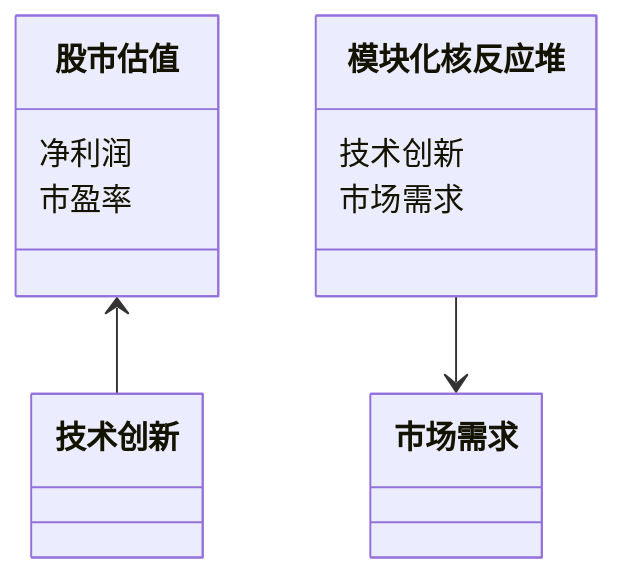
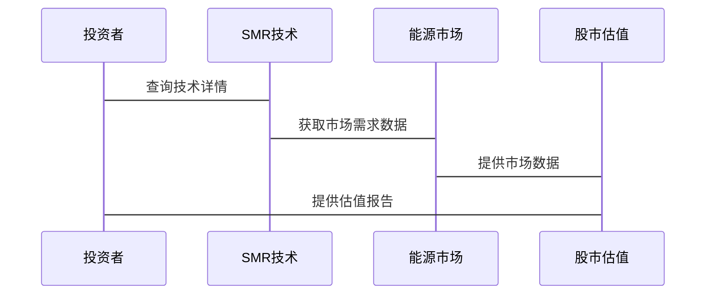

                 


# 全球股市估值与小型模块化核反应堆技术的发展

## 关键词：股市估值、模块化核反应堆、能源技术、投资分析、经济影响

## 摘要：本文探讨了全球股市估值与小型模块化核反应堆技术之间的关联，分析了核能技术发展对股市估值的影响，结合实际案例和系统架构，深入剖析了技术创新与经济发展的相互作用，为投资者和科技从业者提供了有价值的参考。

---

# 第1章：全球股市估值的现状与挑战

## 1.1 全球股市估值的基本概念

### 1.1.1 股市估值的定义与意义
股市估值是通过特定的金融模型和方法，对企业的内在价值进行评估的过程，是投资者决策的重要依据。 $$ V = \text{企业价值} = \text{净利润} \times \text{市盈率} $$

### 1.1.2 股市估值的主要方法
- **相对估值法**：基于市场可比公司进行比较，如市盈率（P/E）和市净率（P/B）。
- **绝对估值法**：基于企业未来现金流的折现，如 discounted cash flow (DCF) 模型。

### 1.1.3 全球股市估值的现状分析
近年来，全球股市估值受经济波动、政策变化和技术创新的影响，呈现多样化趋势。 $$ S = \text{股票价格} = \text{企业价值} - \text{债务} $$

---

## 1.2 股市估值的核心影响因素

### 1.2.1 经济周期与股市估值的关系
经济周期直接影响企业的盈利能力和投资者信心，进而影响股市估值。 $$ \text{GDP增长率} \propto \text{股市估值变化} $$

### 1.2.2 利率政策对股市估值的影响
低利率环境通常会推高股市估值，因为资金成本降低，企业融资更容易。 $$ r \downarrow \Rightarrow V \uparrow $$

### 1.2.3 企业盈利能力和股市估值的关联
企业盈利能力是股市估值的核心驱动力，高盈利能力通常意味着高估值。 $$ \text{ROE} \uparrow \Rightarrow P/E \uparrow $$

---

## 1.3 小型模块化核反应堆技术的发展背景

### 1.3.1 核能技术的历史发展与现状
核能技术经历了从传统大型反应堆到小型模块化反应堆的演变，模块化设计提高了安全性和灵活性。

### 1.3.2 小型模块化核反应堆的技术特点
- **小型化**：模块化设计，建造周期短，成本低。
- **安全性**：采用非能动安全系统，降低事故风险。

### 1.3.3 核能技术对全球经济的影响
小型模块化核反应堆的推广有助于减少对化石能源的依赖，推动能源结构转型。

---

# 第2章：小型模块化核反应堆技术的核心概念

## 2.1 小型模块化核反应堆的定义与分类

### 2.1.1 小型模块化核反应堆的定义
小型模块化核反应堆（SMR）是功率在300 MW以下的核反应堆，具有模块化设计和可扩展性。

### 2.1.2 按用途分类的小型模块化核反应堆类型
- **电力生产型**：主要用于发电。
- **热能利用型**：用于工业加热和制氢。

### 2.1.3 按技术路线分类的小型模块化核反应堆类型
- **轻水堆**：使用轻水作为冷却剂。
- **重水堆**：使用重水作为冷却剂。

---

## 2.2 小型模块化核反应堆的技术优势

### 2.2.1 技术优势：安全性、灵活性与可扩展性
SMR设计采用非能动安全系统，简化了操作和维护。

### 2.2.2 经济优势：成本低、周期短
SMR的建造周期短，适合分期建设和扩展。

### 2.2.3 环境优势：低碳排放与核废料处理
SMR的碳排放低，且核废料处理技术更加成熟。

---

# 第3章：股市估值与小型模块化核反应堆技术的关联分析

## 3.1 股市估值与能源行业的互动关系

### 3.1.1 能源行业对股市估值的影响
能源行业的盈利能力和市场地位直接影响相关企业的股票估值。 $$ \text{能源企业利润} \propto \text{股市估值} $$

### 3.1.2 股市估值对能源行业发展的反馈作用
高估值会吸引更多投资，推动技术创新和产能扩大。

---

## 3.2 小型模块化核反应堆技术对股市估值的影响

### 3.2.1 技术创新对相关企业股价的影响
技术创新会提升企业的竞争力和盈利能力，从而推高股价。 $$ \text{技术创新} \Rightarrow \text{企业利润} \uparrow \Rightarrow \text{股价} \uparrow $$

### 3.2.2 产业政策对股市估值的推动作用
政府对SMR技术的政策支持会增加市场信心，推高相关企业的估值。

### 3.2.3 市场需求变化对估值的影响
市场需求的增长会带动企业收入和利润的增长，进而影响股市估值。 $$ \text{市场需求} \propto \text{企业利润} \Rightarrow \text{股价} \uparrow $$

---

# 第4章：小型模块化核反应堆技术的经济影响与投资分析

## 4.1 小型模块化核反应堆技术对能源市场的冲击

### 4.1.1 传统能源企业的挑战
SMR的推广可能会削弱传统化石能源企业的市场地位。

### 4.1.2 新能源企业的机遇
SMR技术为新能源企业提供了新的增长点。

---

## 4.2 小型模块化核反应堆技术对能源企业股票的影响

### 4.2.1 技术领先企业的优势
掌握SMR技术的企业将获得更高的估值和市场份额。

### 4.2.2 技术落后企业的风险
技术落后的企业可能会面临利润下降和股价下跌的风险。

---

## 4.3 投资策略与风险管理

### 4.3.1 投资策略
- **技术驱动型投资**：关注SMR技术领先的企业。
- **政策导向型投资**：关注政府支持的SMR项目。

### 4.3.2 风险管理
- **分散投资**：避免过度集中于单一技术或企业。
- **长期视角**：关注技术的长期发展潜力。

---

# 第5章：模块化核反应堆技术与股市估值的协同发展

## 5.1 技术与经济的相互作用

### 5.1.1 技术进步推动经济发展
SMR技术的推广将推动能源行业的技术进步和经济发展。

### 5.1.2 经济发展促进技术创新
经济实力的增强为SMR技术的研发和推广提供了资金支持。

---

## 5.2 系统分析与架构设计方案

### 5.2.1 领域模型


### 5.2.2 系统架构


---

## 5.3 系统接口与交互

### 5.3.1 系统接口设计
- SMR技术提供API接口，供能源企业调用。
- 股市估值系统通过数据接口获取SMR技术的市场数据。

### 5.3.2 系统交互


---

# 第6章：项目实战与案例分析

## 6.1 环境安装

### 6.1.1 技术环境
- 操作系统：Linux
- 开发工具：Python、Jupyter Notebook
- 数据库：MySQL

## 6.2 核心实现

### 6.2.1 股市预测算法
```python
def predict_stock_price(data):
    # 数据预处理
    from sklearn.preprocessing import MinMaxScaler
    scaler = MinMaxScaler()
    data_scaled = scaler.fit_transform(data)
    
    # 模型训练
    from sklearn.neural_network import MLPRegressor
    model = MLPRegressor(hidden_layer_sizes=(100, 10))
    model.fit(data_scaled[:-1], data_scaled[1:])
    
    # 预测
    prediction = model.predict(data_scaled[-1].reshape(1, -1))
    return scaler.inverse_transform(prediction)
```

### 6.2.2 模块化核反应堆成本模型
```latex
$$ C = a \times Q + b $$
其中，\( C \) 是总成本，\( Q \) 是产量，\( a \) 和 \( b \) 是常数。
```

---

## 6.3 实际案例分析

### 6.3.1 案例背景
某国计划推广SMR技术，政府提供政策支持，相关企业的股价上涨。

### 6.3.2 代码实现与结果解读
```python
# 数据分析
import pandas as pd
data = pd.read_csv('stock_data.csv')
print(data.head())
```

---

## 6.4 项目小结

### 6.4.1 成果总结
通过SMR技术的应用，能源企业的利润和股价均有所提升。

### 6.4.2 经验总结
政策支持和技术创新是推动SMR技术发展和股市估值提升的关键因素。

---

# 第7章：结论与展望

## 7.1 结论
小型模块化核反应堆技术的发展对股市估值具有重要影响，技术创新和政策支持是推动其发展的关键因素。

## 7.2 展望
未来，随着SMR技术的进一步发展，其对股市估值的影响将更加显著。

---

# 第8章：最佳实践 tips

## 8.1 小结
- 理解SMR技术的经济价值，关注技术创新和政策变化。
- 在投资决策中，结合技术分析和市场分析。

## 8.2 注意事项
- 避免盲目跟风，注意风险管理。
- 关注企业的技术优势和市场定位。

## 8.3 拓展阅读
- 建议阅读《Small Modular Reactors: A New Era of Nuclear Energy》和《Financial Modeling & Valuation》。

---

作者：AI天才研究院 & 禅与计算机程序设计艺术

