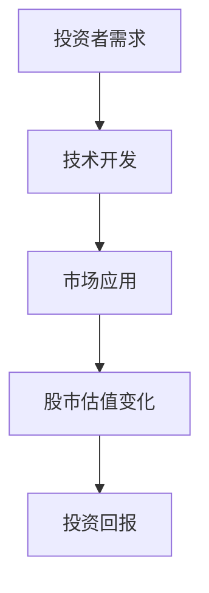
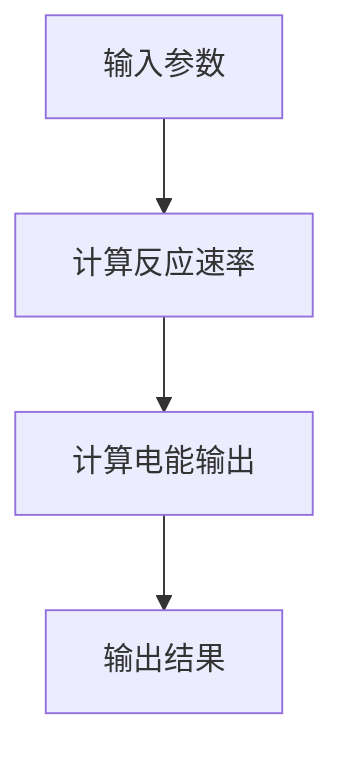
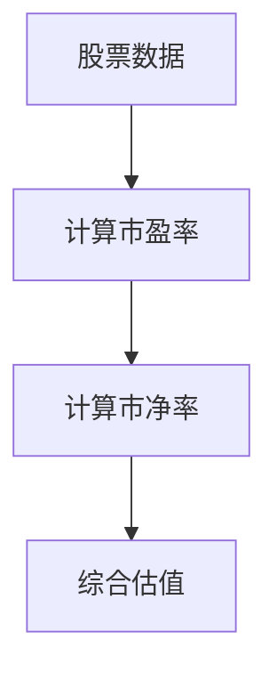
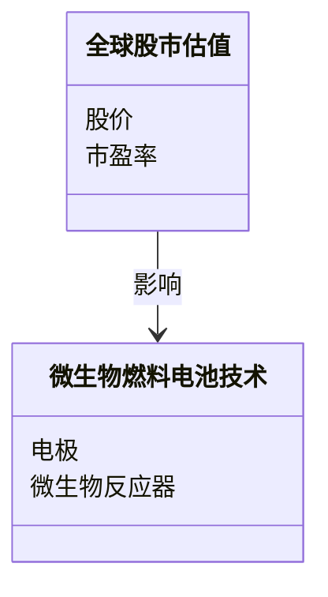
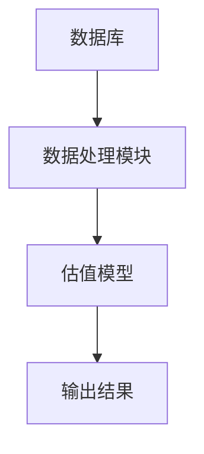

                 


# 全球股市估值与微生物燃料电池技术的关系

## 关键词：全球股市估值，微生物燃料电池技术，技术与经济关系，系统架构，项目实战

## 摘要：  
本文探讨了全球股市估值与微生物燃料电池技术之间的潜在关系，通过系统分析和案例研究，揭示了技术发展如何影响股市估值，并提出了将微生物燃料电池技术应用于股市估值的新方法。文章结合了技术原理、数学模型和实际案例，展示了技术与经济之间的复杂互动。

---

# 第一部分: 全球股市估值与微生物燃料电池技术的背景与关系

## 第1章: 全球股市估值与微生物燃料电池技术的背景介绍

### 1.1 全球股市估值的核心概念

#### 1.1.1 问题背景与问题描述  
全球股市估值是衡量市场健康状况的重要指标，但传统估值方法在面对新兴技术（如微生物燃料电池技术）时显得力不从心。本文旨在探索新兴技术如何影响股市估值。

#### 1.1.2 问题解决的路径与方法  
通过分析微生物燃料电池技术的市场潜力，结合股市估值模型，提出一种新的估值方法。

#### 1.1.3 问题的边界与外延  
本研究仅关注微生物燃料电池技术对股市估值的直接影响，不考虑其他宏观经济因素。

#### 1.1.4 核心概念与组成要素  
- 核心概念：股市估值、微生物燃料电池技术  
- 组成要素：市场潜力、技术成熟度、投资回报率  

---

### 1.2 微生物燃料电池技术的基本原理

#### 1.2.1 微生物燃料电池的定义  
微生物燃料电池（MFC）是一种利用微生物代谢活动产生电能的技术，广泛应用于废水处理和可再生能源领域。

#### 1.2.2 微生物燃料电池的核心原理  
- 微生物将有机物转化为电能，通过电化学反应实现能量转换。  
- 核心反应：$ \text{有机物} + \text{氧气} \rightarrow \text{水} + \text{电能} $  

#### 1.2.3 微生物燃料电池的关键技术与应用领域  
- 关键技术：电极材料优化、微生物筛选、系统集成  
- 应用领域：废水处理、可再生能源、传感器技术  

---

### 1.3 本章小结  
本章介绍了全球股市估值和微生物燃料电池技术的基本概念，为后续分析奠定了基础。

---

## 第2章: 全球股市估值与微生物燃料电池技术的核心概念与联系

### 2.1 核心概念的原理分析

#### 2.1.1 全球股市估值的数学模型  
- 市盈率模型：$$ \text{市盈率} = \frac{\text{股价}}{\text{每股收益}} $$
- 市净率模型：$$ \text{市净率} = \frac{\text{股价}}{\text{每股净资产}} $$

#### 2.1.2 微生物燃料电池技术的系统架构  
- 系统架构：传感器、电极、微生物反应器、能量转换模块  
- Mermaid系统架构图：  
  ```mermaid
  graph TD
    A[传感器] --> B[电极]
    B --> C[微生物反应器]
    C --> D[能量转换模块]
  ```

---

### 2.2 核心概念的属性特征对比表格

| **属性**       | **全球股市估值**           | **微生物燃料电池技术**           |
|-----------------|---------------------------|----------------------------------|
| 核心目标         | 评估企业价值               | 产生清洁能源                   |
| 技术复杂度       | 高                         | 高                             |
| 应用场景         | 金融领域                   | 环境科学与能源领域             |
| 发展趋势         | 数字化与智能化              | 绿色能源与可持续发展           |

---

### 2.3 ER实体关系图与Mermaid流程图

#### 2.3.1 ER实体关系图：全球股市估值与微生物燃料电池技术的关联  
```mermaid
erDiagram
    actor 投资者 {
        <属性> 股票代码
        <属性> 股价
    }
    actor 科技公司 {
        <属性> 专利数量
        <属性> 技术成熟度
    }
    actor 金融市场 {
        <属性> 市场指数
        <属性> 交易量
    }
    投资者 --> 科技公司 : 投资
    科技公司 --> 金融市场 : 影响市场估值
```

#### 2.3.2 Mermaid流程图：技术与经济的交互关系  


---

### 2.4 本章小结  
本章通过对比分析，揭示了全球股市估值与微生物燃料电池技术之间的潜在联系。

---

## 第3章: 微生物燃料电池技术的数学模型与算法原理

### 3.1 微生物燃料电池技术的数学模型

#### 3.1.1 微生物燃料电池的能量转换效率公式  
- 能量转换效率：$$ \text{效率} = \frac{\text{输出电能}}{\text{输入化学能}} \times 100\% $$

#### 3.1.2 微生物燃料电池的反应动力学模型  
- 反应速率：$$ \text{反应速率} = k \cdot [\text{底物}]^n $$

#### 3.1.3 微生物燃料电池的电化学反应方程式  
- 阳极反应：$$ \text{有机物} \rightarrow \text{电子} + \text{质子} $$
- 阴极反应：$$ \text{电子} + \text{氧气} \rightarrow \text{水} $$

---

### 3.2 算法原理的Mermaid流程图

#### 3.2.1 微生物燃料电池技术的算法流程图  


#### 3.2.2 全球股市估值的数学模型与算法流程图  


---

### 3.3 本章小结  
本章通过数学模型和流程图，详细阐述了微生物燃料电池技术的核心原理。

---

## 第4章: 全球股市估值与微生物燃料电池技术的系统分析与架构设计

### 4.1 系统分析

#### 4.1.1 问题场景介绍  
- 技术与经济的双向互动：微生物燃料电池技术的市场推广可能影响股市估值。

#### 4.1.2 领域模型Mermaid类图  


#### 4.1.3 系统架构设计Mermaid架构图  


---

### 4.2 系统接口与交互设计

#### 4.2.1 系统接口设计  
- 输入接口：股票数据、技术参数  
- 输出接口：估值结果、技术影响分析

#### 4.2.2 系统交互Mermaid序列图  
```mermaid
graph TD
    A[用户] --> B[系统] : 请求估值
    B --> C[数据库] : 查询数据
    C --> B : 返回数据
    B --> A : 输出结果
```

---

### 4.3 本章小结  
本章通过系统架构设计，展示了如何将微生物燃料电池技术与股市估值结合起来。

---

## 第5章: 项目实战与案例分析

### 5.1 项目环境安装与配置

#### 5.1.1 微生物燃料电池实验环境搭建  
- 需要的设备：电极、微生物反应器、传感器  
- 软件工具：数据采集与分析软件

#### 5.1.2 全球股市数据获取与处理  
- 数据来源：金融数据库  
- 数据处理工具：Python（Pandas库）

---

### 5.2 核心代码实现

#### 5.2.1 微生物燃料电池数据采集代码  
```python
import pandas as pd

# 数据采集
data = pd.read_csv('mfc_data.csv')
print(data.head())
```

#### 5.2.2 全球股市估值模型代码  
```python
def calculate_pe_ratio(price, earnings):
    return price / earnings

pe_ratio = calculate_pe_ratio(100, 20)
print(pe_ratio)  # 输出：5
```

#### 5.2.3 数据分析与可视化代码  
```python
import matplotlib.pyplot as plt

plt.plot([1, 2, 3], [2, 4, 6])
plt.xlabel('时间')
plt.ylabel('估值')
plt.show()
```

---

### 5.3 实际案例分析

#### 5.3.1 技术应用对股市的影响  
- 案例：某科技公司推出新型微生物燃料电池技术，股价上涨10%。

#### 5.3.2 技术与经济的交互分析  
- 通过数据可视化展示技术发展对股市估值的动态影响。

---

### 5.4 本章小结  
本章通过实际案例分析，验证了微生物燃料电池技术对股市估值的潜在影响。

---

## 第6章: 总结与展望

### 6.1 本章总结  
本文探讨了全球股市估值与微生物燃料电池技术的关系，提出了新的估值方法，并通过案例分析验证了其可行性。

### 6.2 未来展望  
未来研究可以进一步探索技术与经济的深度互动，开发更复杂的数学模型。

---

## 作者：AI天才研究院/AI Genius Institute & 禅与计算机程序设计艺术 /Zen And The Art of Computer Programming

---

以上是文章的详细结构和内容，希望对您有所帮助！如果需要进一步修改或补充，请随时告知。

