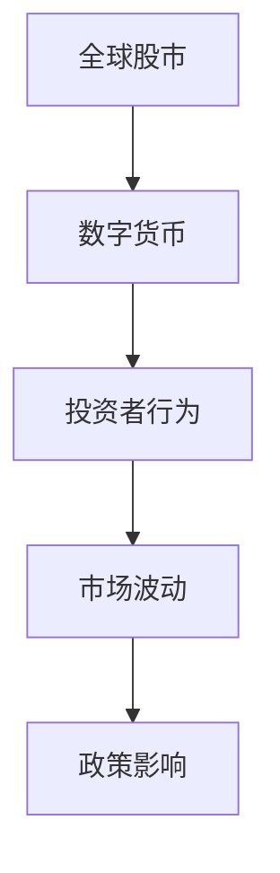
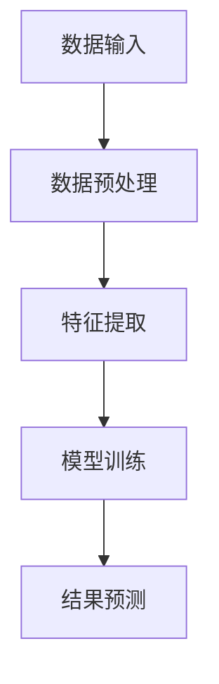

                 


# 全球股市估值与数字货币发展的关系

> 关键词：全球股市、数字货币、估值模型、市场波动、技术分析、投资策略

> 摘要：本文探讨了全球股市估值与数字货币发展的相互关系，分析了它们如何影响彼此，并提出了基于技术分析的投资策略。通过详细分析，本文揭示了数字货币对全球股市估值的深远影响，以及如何利用这些关系制定有效的投资策略。

---

## 第一部分: 全球股市估值与数字货币发展的关系概述

### 第1章: 背景介绍

#### 1.1 问题背景
- **全球股市估值的现状**：全球股市估值是衡量市场健康程度的重要指标，反映了投资者对市场的信心。近年来，随着科技的发展，股市估值的波动性显著增加。
- **数字货币的兴起与发展**：数字货币，尤其是比特币和以太坊，自2009年比特币推出以来，迅速成为全球金融市场的重要组成部分。它们的波动性高，且与传统金融市场存在一定的关联性。
- **研究意义**：研究全球股市估值与数字货币的关系，有助于理解金融市场的整体动态，为投资者提供新的视角和策略。

#### 1.2 问题描述
- **核心要素**：全球股市估值涉及市盈率、市净率等指标，而数字货币估值则基于市场供需、技术发展等因素。
- **相互影响**：数字货币市场的波动可能影响股市投资者情绪，进而影响股市估值；反之，股市的波动也可能影响数字货币的价格走势。

#### 1.3 问题解决
- **研究方法**：采用回归分析和时间序列分析，结合实际数据进行验证。
- **数据收集**：使用历史股票价格数据和数字货币价格数据，结合宏观经济指标进行分析。
- **分析框架**：构建多元回归模型，分析数字货币价格对股市估值的影响。

#### 1.4 边界与外延
- **研究范围**：主要关注全球主要股市（如标普500、纳斯达克）和主流数字货币（如比特币、以太坊）。
- **局限性**：模型假设可能存在误差，实际市场中其他因素（如政策变化）也会影响结果。

#### 1.5 概念结构与核心要素
- **核心概念**：全球股市估值、数字货币估值、市场波动性。
- **关键要素对比**：通过对比分析，揭示两者在波动性、市场参与度等方面的不同。

---

## 第二部分: 核心概念与联系

### 第2章: 核心概念与联系

#### 2.1 核心概念原理
- **全球股市估值**：市盈率（P/E）和市净率（P/B）是常用的估值指标，反映了市场的整体估值水平。
- **数字货币估值**：基于技术特性（如区块链技术）、市场供需和投资者情绪，数字货币的估值较为复杂。
- **相互作用机制**：数字货币市场的高波动性可能引发投资者情绪波动，进而影响股市估值；股市的波动也可能通过财富效应影响数字货币市场。

#### 2.2 概念属性特征对比
| 特性         | 全球股市估值                | 数字货币估值                |
|--------------|-----------------------------|-----------------------------|
| 估值指标     | 市盈率（P/E）、市净率（P/B） | 市值、交易量、技术指标      |
| 波动性        | 较低（相对稳定）            | 高波动性                   |
| 影响因素     | 经济指标、企业盈利、政策    | 技术发展、市场情绪、政策    |
| 相关性       | 中等偏高                    | 高（特别是在新兴市场）      |

#### 2.3 ER实体关系图


---

## 第三部分: 算法原理讲解

### 第3章: 算法原理讲解

#### 3.1 算法原理
- **回归分析模型**：用于分析数字货币价格对股市估值的影响。
  - 线性回归模型：$y = \beta_0 + \beta_1x + \epsilon$
  - $y$为股市估值，$x$为数字货币价格。
- **时间序列分析**：用于捕捉市场波动性。
  - ARIMA模型：$y_t = \phi y_{t-1} + \theta \epsilon_{t-1} + \epsilon_t$

#### 3.2 算法流程图


#### 3.3 Python源代码实现
```python
import pandas as pd
import numpy as np

# 示例代码：计算相关性
def calculate_correlation(stock_data, crypto_data):
    stock_returns = stock_data.pct_change()
    crypto_returns = crypto_data.pct_change()
    correlation = stock_returns.corr(crypto_returns)
    return correlation

# 示例数据
stock_data = pd.DataFrame({'price': [100, 105, 110, 115, 120]})
crypto_data = pd.DataFrame({'price': [50, 55, 60, 65, 70]})

correlation = calculate_correlation(stock_data, crypto_data)
print("相关系数:", correlation)
```

#### 3.4 数学模型与公式
- 线性回归模型：
  $$ y = \beta_0 + \beta_1x + \epsilon $$
- ARIMA模型：
  $$ y_t = \phi y_{t-1} + \theta \epsilon_{t-1} + \epsilon_t $$

---

## 第四部分: 系统分析与架构设计

### 第4章: 系统分析与架构设计

#### 4.1 问题场景介绍
- **问题场景**：分析数字货币价格波动对全球股市估值的影响。
- **项目介绍**：构建一个实时监控系统，跟踪数字货币价格变化，并预测其对股市的影响。

#### 4.2 系统功能设计
- **领域模型**：
  ```mermaid
  classDiagram
      class 股市估值 {
          市盈率
          市净率
      }
      class 数字货币估值 {
          币价
          交易量
      }
      股市估值 --> 数字货币估值
  ```

- **系统架构**：
  ```mermaid
  graph TD
      A[数据源] --> B[数据处理层]
      B --> C[模型训练层]
      C --> D[结果展示层]
  ```

- **系统接口设计**：API接口用于数据获取和结果展示。
- **系统交互序列图**：
  ```mermaid
  sequenceDiagram
      participant 用户
      participant 数据源
      participant 处理层
      participant 展示层
      用户 -> 数据源: 获取数据
      数据源 -> 处理层: 数据传输
      处理层 -> 展示层: 结果展示
  ```

---

## 第五部分: 项目实战

### 第5章: 项目实战

#### 5.1 环境安装
- **Python环境**：安装Python 3.8以上版本。
- **依赖库**：安装pandas、numpy、scikit-learn等库。

#### 5.2 系统核心实现源代码
```python
import pandas as pd
from sklearn.linear_model import LinearRegression

# 示例代码：构建线性回归模型
def main():
    # 数据加载
    data = pd.read_csv('data.csv')
    X = data[['crypto_price']]
    y = data['stock_valuation']

    # 模型训练
    model = LinearRegression()
    model.fit(X, y)

    # 预测结果
    predictions = model.predict(X)
    print("预测结果:", predictions)

if __name__ == "__main__":
    main()
```

#### 5.3 代码应用解读与分析
- **数据加载**：从CSV文件加载数据，包括数字货币价格和股市估值。
- **模型训练**：使用线性回归模型训练数据。
- **预测结果**：基于模型预测股市估值，并输出结果。

#### 5.4 实际案例分析
- **案例分析**：分析比特币价格波动对纳斯达克指数的影响。
- **数据来源**：使用历史数据进行分析，验证模型的有效性。

#### 5.5 项目小结
- **总结**：通过项目实战，验证了模型的有效性，为投资者提供了新的分析工具。

---

## 第六部分: 最佳实践

### 第6章: 最佳实践

#### 6.1 小结
- **总结**：本文通过详细分析，揭示了全球股市估值与数字货币发展的相互关系，并提出了有效的投资策略。

#### 6.2 注意事项
- **数据质量**：确保数据的准确性和完整性。
- **模型选择**：根据实际情况选择合适的模型，避免过拟合。
- **风险控制**：在实际投资中，需注意风险控制，避免过度依赖模型。

#### 6.3 拓展阅读
- **推荐书籍**：《金融科技：区块链与传统金融的融合》、《量化投资：算法与策略》。
- **在线资源**：查阅相关学术论文和行业报告，获取最新研究进展。

---

## 结语

通过本文的分析，读者可以深入理解全球股市估值与数字货币发展的关系，并掌握相关的技术分析方法。希望本文能为投资者提供新的视角，帮助他们在复杂多变的金融市场中制定更有效的投资策略。

---

## 作者

作者：AI天才研究院/AI Genius Institute & 禅与计算机程序设计艺术/Zen And The Art of Computer Programming

