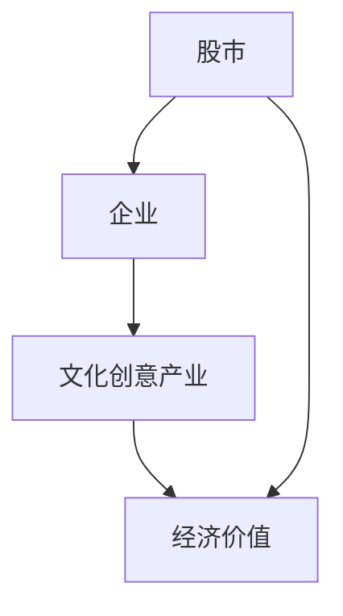
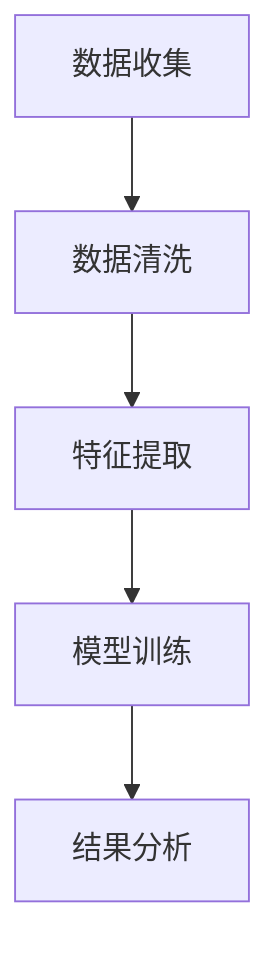
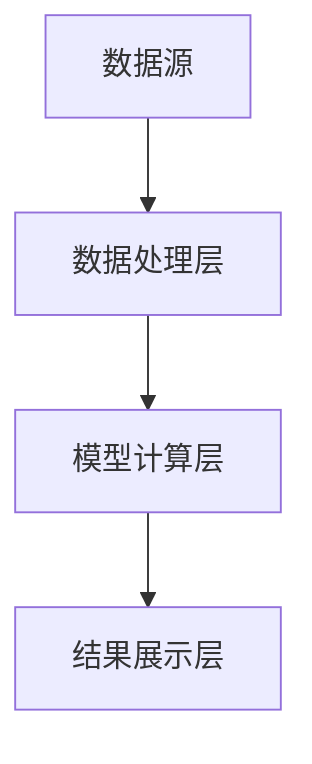
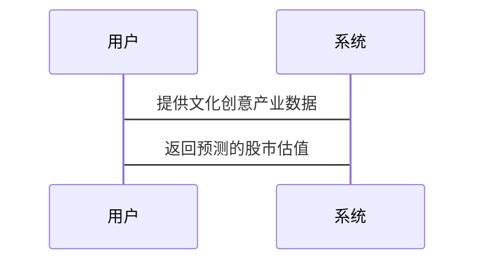

                 


# 全球股市估值与文化创意产业的关联

## 关键词：
全球股市估值、文化创意产业、关联性分析、经济影响、投资策略

## 摘要：
本文探讨全球股市估值与文化创意产业之间的相互关联，分析文化创意产业对股市估值的影响机制，并通过实证分析提出投资策略。通过多元回归模型和时间序列分析，揭示两者之间的量化关系，为投资者提供科学决策依据。

---

# 第1章 背景介绍

## 1.1 问题背景

### 1.1.1 全球股市估值的现状
全球股市估值受多种因素影响，包括经济指标、政策变化和市场情绪。近年来，文化创意产业的崛起为股市估值带来了新的变量。

### 1.1.2 文化创意产业的定义与特征
文化创意产业涵盖影视、游戏、设计等多个领域，具有高附加值和创新驱动的特点，对经济贡献显著。

### 1.1.3 两者的关联性与研究意义
研究两者关联有助于理解文化创意产业对股市的影响，为投资决策提供支持。

## 1.2 问题描述

### 1.2.1 股市估值的核心指标
包括市盈率、市净率等，反映企业价值和市场预期。

### 1.2.2 文化创意产业的经济贡献
通过产值、就业等指标衡量其经济影响。

### 1.2.3 两者关联的潜在影响
文化创意产业可能通过提升企业价值影响股市估值。

## 1.3 问题解决

### 1.3.1 数据收集与分析方法
使用历史数据，结合统计和机器学习方法进行分析。

### 1.3.2 关联性分析框架
构建多元回归模型，量化两者关系。

### 1.3.3 案例研究与实证分析
通过具体案例验证假设，提供实证支持。

## 1.4 边界与外延

### 1.4.1 股市估值的边界条件
考虑行业特性，如科技股与传统股的差异。

### 1.4.2 文化创意产业的边界条件
区分不同类型企业，如内容创作与发行商。

### 1.4.3 两者的相互影响与外延
文化创意产业不仅影响股市，还影响整体经济结构。

## 1.5 概念结构与核心要素

### 1.5.1 核心概念组成
包括股市估值模型和文化创意产业经济指标。

### 1.5.2 关联性模型
构建双向影响模型，分析互动关系。

### 1.5.3 案例分析与模型验证
通过具体案例验证模型的有效性。

---

# 第2章 核心概念与联系

## 2.1 核心概念原理

### 2.1.1 股市估值的计算方法
使用市盈率、市净率等指标，结合行业基准进行评估。

### 2.1.2 文化创意产业的经济价值
通过产值、就业数据和创新贡献衡量其经济影响。

### 2.1.3 两者的相互作用机制
文化创意产业通过提升企业创新能力和市场影响力，影响股市估值。

## 2.2 概念属性特征对比

| 属性 | 股市估值 | 文化创意产业 |
|------|----------|--------------|
| 定义 | 企业价值 | 经济与文化产出 |
| 测度 | 市盈率、市净率 | 产值、就业 |
| 影响因素 | 经济指标、政策 | 创新能力、市场需求 |
| 时间跨度 | 短期波动 | 长期趋势 |

### 2.2.1 股市估值的属性特征
股市估值受宏观经济和行业因素影响，具有波动性和敏感性。

### 2.2.2 文化创意产业的属性特征
文化创意产业具有创新性和高附加值，受市场需求和政策支持影响。

### 2.2.3 对比分析与总结
两者在测度、影响因素和时间跨度上有显著差异，但存在相互作用。

## 2.3 ER实体关系图



---

# 第3章 算法原理讲解

## 3.1 算法原理

### 3.1.1 多元回归模型
用于量化文化创意产业对股市估值的影响，公式为：
$$ \text{Valuation} = \beta_0 + \beta_1 \times \text{Revenue} + \epsilon $$

### 3.1.2 时间序列分析
使用ARIMA模型预测股市估值的变化趋势。

### 3.1.3 聚类分析与分类算法
通过聚类分析将企业分为不同类别，分类算法预测其估值变动。

## 3.2 算法流程图



## 3.3 Python源代码实现

```python
import pandas as pd
import numpy as np
from sklearn.linear_model import LinearRegression

# 示例数据
data = pd.DataFrame({
    '文化创意产业收入': [100, 200, 300, 400],
    '股市估值': [150, 250, 350, 450]
})

# 模型训练
model = LinearRegression()
model.fit(data[['文化创意产业收入']], data['股市估值'])

# 预测结果
print(model.predict([[250]]))
```

## 3.4 数学模型与公式

### 3.4.1 多元回归模型
$$ \hat{y} = \beta_0 + \beta_1 x_1 + \beta_2 x_2 + \dots + \beta_n x_n + \epsilon $$

### 3.4.2 时间序列模型
使用ARIMA模型预测未来值：
$$ \hat{y}_t = \phi_1 \hat{y}_{t-1} + \phi_2 \hat{y}_{t-2} + \theta_1 \epsilon_{t-1} $$

---

# 第4章 系统分析与架构设计

## 4.1 问题场景介绍

### 4.1.1 问题场景
分析文化创意产业对股市估值的影响，帮助投资者制定策略。

## 4.2 系统功能设计

### 4.2.1 领域模型设计
```mermaid
classDiagram
    class 股市估值 {
        市盈率
        市净率
    }
    class 文化创意产业 {
        产值
        就业
    }
    股市估值 <--- 关联关系 <--> 文化创意产业
```

### 4.2.2 系统架构设计


## 4.3 系统接口与交互

### 4.3.1 接口设计
- 数据输入接口
- 模型计算接口
- 结果输出接口

### 4.3.2 交互流程


---

# 第5章 项目实战

## 5.1 环境安装

### 5.1.1 安装Python和相关库
```bash
pip install numpy pandas scikit-learn
```

## 5.2 系统核心实现

### 5.2.1 数据处理
```python
import pandas as pd
data = pd.read_csv('data.csv')
```

### 5.2.2 模型实现
```python
from sklearn.linear_model import LinearRegression
model = LinearRegression()
model.fit(X, y)
```

### 5.2.3 结果展示
```python
print('预测结果:', model.predict(X_new))
```

## 5.3 实际案例分析

### 5.3.1 案例背景
分析某文化创意企业的数据，预测其对股市的影响。

### 5.3.2 数据解读
通过回归系数，量化文化创意产业收入对股市估值的影响。

## 5.4 项目小结
总结项目实现过程，强调方法的有效性和应用价值。

---

# 第6章 最佳实践

## 6.1 小结
本文分析了全球股市估值与文化创意产业的关联，提出了量化分析方法，为投资决策提供支持。

## 6.2 注意事项
- 数据质量影响结果准确性
- 模型选择需结合实际场景
- 需持续监控市场变化

## 6.3 拓展阅读
建议阅读相关学术论文和行业报告，深入理解两者关系。

---

作者：AI天才研究院 & 禅与计算机程序设计艺术

