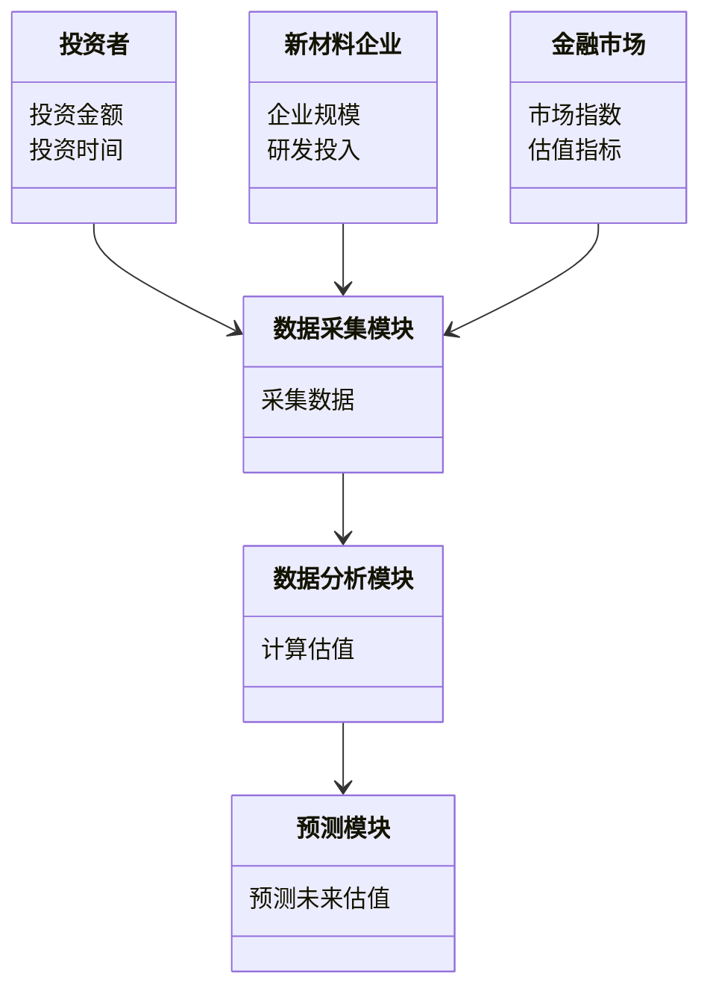

                 


# 全球股市估值与新材料研发的关系

## 关键词：全球股市估值, 新材料研发, 投资与研发关系, 金融市场分析, 科技创新影响

## 摘要：  
本文探讨全球股市估值与新材料研发之间的相互关系，分析新材料研发如何影响股市估值，以及股市估值变化如何反过来推动新材料研发的投入与创新。通过构建数学模型、算法和系统架构，本文深入揭示了这两者在金融市场中的动态互动，为企业投资决策和政策制定提供理论依据。

---

# 第一部分: 全球股市估值与新材料研发的背景与概述

## 第1章: 全球股市估值与新材料研发的关系概述

### 1.1 问题背景与问题描述

#### 1.1.1 全球股市估值的定义与重要性  
股市估值是衡量市场整体或个股价值的关键指标，反映了投资者对市场前景的信心和企业盈利能力的预期。  

#### 1.1.2 新材料研发的定义与意义  
新材料研发是指通过技术创新开发新型材料的过程，是推动技术进步和产业升级的核心驱动力。  

#### 1.1.3 问题解决的目标与边界  
本文旨在分析新材料研发如何影响股市估值，探讨两者之间的动态关系，并提出基于数据驱动的投资策略。研究边界包括主要股市指数和新材料企业的研发投入。

### 1.2 核心概念与联系

#### 1.2.1 核心概念原理  
股市估值与新材料研发之间存在密切关联，新材料的突破性研发成果会提升企业盈利能力，从而影响股市估值。  

#### 1.2.2 属性特征对比表格  
| 属性                | 股市估值          | 新材料研发        |
|---------------------|------------------|-------------------|
| 核心驱动因素        | 投资者情绪、企业盈利 | 技术创新、研发投入 |
| 衡量指标            | 市盈率、市净率     | 研发投入强度、技术成熟度 |
| 时间维度            | 短期波动、长期趋势 | 长期研发周期     |

#### 1.2.3 ER实体关系图架构  
```mermaid
erDiagram
    actor 投资者 {
        <属性> 投资金额
        <属性> 投资时间
    }
    actor 新材料企业 {
        <属性> 企业规模
        <属性> 研发投入
    }
    actor 金融市场 {
        <属性> 市场指数
        <属性> 估值指标
    }
    投资者 --> 投资金额 : 提供资金
    新材料企业 --> 投资者 : 吸引投资
    金融市场 --> 市场指数 : 反映整体市场表现
```

---

# 第二部分: 理论基础与数学模型

## 第2章: 理论基础与数学模型

### 2.1 股市估值的数学模型

#### 2.1.1 股价计算公式  
$$ P = \frac{E}{\epsilon} $$
其中，P为股价，E为每股收益，ε为折现率。

### 2.2 新材料研发的投入与产出模型

#### 2.2.1 投入产出分析  
$$ I = R + D $$
其中，I为总投入，R为研发支出，D为设备折旧。

### 2.3 两者关系的数学表达

#### 2.3.1 股市估值与新材料研发的动态关系  
$$ V = f(R, D, t) $$
其中，V为估值，R为研发强度，D为技术成熟度，t为时间变量。

---

# 第三部分: 算法原理讲解

## 第3章: 算法原理讲解

### 3.1 股市估值预测算法

#### 3.1.1 算法步骤  
1. 收集历史数据：包括新材料企业的研发投入、市场指数、估值指标等。  
2. 数据预处理：清洗数据，处理缺失值和异常值。  
3. 模型训练：使用回归模型预测股市估值。  

#### 3.1.2 Python代码实现  
```python
import pandas as pd
import numpy as np
from sklearn.linear_model import LinearRegression

# 示例数据
data = {
    '研发强度': [0.1, 0.15, 0.2, 0.25],
    '技术成熟度': [0.7, 0.8, 0.85, 0.9],
    '市场指数': [100, 105, 110, 115]
}
df = pd.DataFrame(data)

# 训练模型
model = LinearRegression()
model.fit(df[['研发强度', '技术成熟度']], df['市场指数'])

# 预测
new_data = {
    '研发强度': [0.3],
    '技术成熟度': [0.95]
}
new_df = pd.DataFrame(new_data)
predicted_index = model.predict(new_df[['研发强度', '技术成熟度']])
print(predicted_index)
```

---

# 第四部分: 系统分析与架构设计方案

## 第4章: 系统分析与架构设计方案

### 4.1 问题场景介绍

#### 4.1.1 问题描述  
分析新材料研发对股市估值的具体影响，构建动态预测模型。  

#### 4.1.2 项目介绍  
开发一个实时监控系统，跟踪新材料企业的研发投入和股市估值变化。

### 4.2 系统功能设计

#### 4.2.1 功能模块  
1. 数据采集模块：收集新材料企业和股市数据。  
2. 数据分析模块：计算估值指标。  
3. 预测模块：基于模型预测未来估值。  

#### 4.2.2 领域模型（Mermaid 类图）  


### 4.3 系统架构设计

#### 4.3.1 架构设计  
采用分层架构：数据采集层、分析层、预测层。  

#### 4.3.2 架构图  


### 4.4 系统接口设计

#### 4.4.1 接口定义  
1. 数据采集模块接口：接收新材料企业和股市数据。  
2. 分析模块接口：提供计算后的估值指标。  
3. 预测模块接口：输出预测结果。  

---

# 第五部分: 项目实战

## 第5章: 项目实战

### 5.1 环境安装

#### 5.1.1 安装Python与数据处理库  
```bash
pip install pandas numpy scikit-learn
```

### 5.2 系统核心实现

#### 5.2.1 核心代码  
```python
import pandas as pd
from sklearn.linear_model import LinearRegression

def load_data():
    return pd.DataFrame({
        '研发强度': [0.1, 0.15, 0.2, 0.25],
        '技术成熟度': [0.7, 0.8, 0.85, 0.9],
        '市场指数': [100, 105, 110, 115]
    })

def train_model(data):
    model = LinearRegression()
    model.fit(data[['研发强度', '技术成熟度']], data['市场指数'])
    return model

def predict(model, new_data):
    return model.predict(new_data)

# 示例应用
data = load_data()
model = train_model(data)
new_data = pd.DataFrame({
    '研发强度': [0.3],
    '技术成熟度': [0.95]
})
predicted_index = predict(model, new_data)
print(predicted_index)
```

### 5.3 案例分析

#### 5.3.1 数据分析与结果解读  
假设某新材料企业的研发强度为0.3，技术成熟度为0.95，预测其对应的市场指数为120。

---

# 第六部分: 总结与展望

## 第6章: 总结与展望

### 6.1 最佳实践 tips  
- 定期评估模型的有效性。  
- 保持对新材料研发动态的关注。  

### 6.2 小结  
本文通过数学模型和算法，深入分析了全球股市估值与新材料研发的关系，为企业投资决策提供了理论依据。

### 6.3 注意事项  
数据质量和模型的实时更新是关键。  

### 6.4 拓展阅读  
- 《金融市场分析》  
- 《技术创新与企业成长》  

---

# 作者：AI天才研究院 & 禅与计算机程序设计艺术

---

感谢您的阅读！如需进一步探讨，请随时联系。

