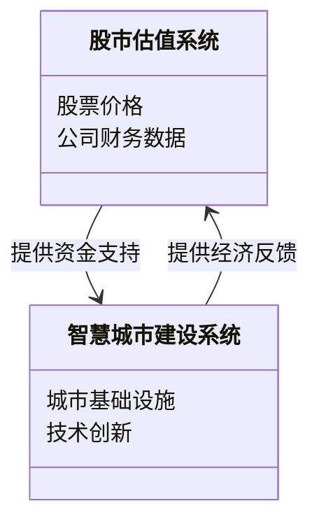

                 


# 全球股市估值与智慧城市建设的互动

> 关键词：全球股市估值，智慧城市建设，互动关系，经济影响，技术应用

> 摘要：本文探讨了全球股市估值与智慧城市建设之间的互动关系，分析了股市估值对智慧城市建设的促进作用以及智慧城市建设对股市估值的反向影响。通过理论分析和实际案例，本文揭示了两者在经济、技术和政策等多方面的互动机制，为智慧城市建设提供了新的视角和方法。

---

# 第一章: 全球股市估值与智慧城市建设的互动概述

## 1.1 股市估值的定义与方法

### 1.1.1 股市估值的定义
股市估值是指通过对公司财务数据、市场环境和行业趋势的分析，评估公司股票的合理价格区间。常用的估值方法包括市盈率（P/E）、市净率（P/B）、股息率等。

### 1.1.2 常用的股市估值方法
- **市盈率（P/E）**：股票价格与每股收益的比率。
- **市净率（P/B）**：股票价格与每股净资产的比率。
- **股息率**：股息与股票价格的比率。

### 1.1.3 股市估值的影响因素
- 公司基本面：收入、利润、资产负债情况。
- 宏观经济环境：GDP增长率、通货膨胀、利率水平。
- 市场情绪：投资者心理、市场流动性。

## 1.2 智慧城市建设的背景与目标

### 1.2.1 智慧城市的定义
智慧城市建设是指通过运用信息技术（如大数据、人工智能、物联网等）优化城市资源配置、提升城市管理效率、改善居民生活质量的过程。

### 1.2.2 智慧城市建设的核心目标
- 提高城市基础设施的智能化水平。
- 优化城市资源利用效率。
- 改善居民生活质量。
- 促进城市经济的可持续发展。

### 1.2.3 智慧城市建设的现状
- 全球范围内，智慧城市建设已经成为城市发展的主要方向。
- 中国、美国、欧洲等地区在智慧城市建设方面取得了显著进展。

## 1.3 股市估值与智慧城市建设的互动关系

### 1.3.1 股市估值对智慧城市建设的促进作用
- 股市为智慧城市建设提供资金支持。
- 股市对智慧城市建设企业的估值影响其融资能力。
- 股市的市场情绪影响智慧城市建设的政策支持。

### 1.3.2 智慧城市建设对股市估值的反向影响
- 智慧城市建设推动相关企业业绩增长，提升股票估值。
- 智慧城市建设的不确定性可能对股市估值产生负面影响。
- 智慧城市建设的成功案例为股市投资者提供信心。

---

# 第二章: 全球股市估值与智慧城市建设的互动机制

## 2.1 股市资金流动对智慧城市建设的支持

### 2.1.1 股市资金流动的定义与特征
- 股市资金流动是指资金在股市中的流动和配置。
- 具有波动性、周期性和政策敏感性。

### 2.1.2 股市资金流动对智慧城市建设的推动作用
- 为智慧城市建设提供资本支持。
- 推动相关技术的研发和应用。
- 提升智慧城市建设企业的市场竞争力。

### 2.1.3 股市资金流动的局限性
- 受市场波动影响，资金支持可能不稳定。
- 股市资金的短期性可能与智慧城市建设的长期性目标冲突。

## 2.2 智慧城市建设对股市估值的反馈机制

### 2.2.1 智慧城市建设对经济发展的影响
- 提高城市经济效率，促进经济增长。
- 带动相关产业发展，如信息技术、智能交通等。

### 2.2.2 经济发展对股市估值的提升作用
- 经济增长推动企业业绩提升，提高股票估值。
- 经济稳定吸引更多的投资者进入股市。

### 2.2.3 智慧城市建设中的风险与挑战
- 技术风险：技术创新的不确定性可能影响智慧城市建设。
- 经济风险：智慧城市建设可能面临资金不足或回报周期长的问题。

---

# 第三章: 股市估值与智慧城市建设的互动机制分析

## 3.1 核心概念的定义与属性对比

### 3.1.1 股市估值的核心概念
- 通过财务指标和市场环境评估股票价格。

### 3.1.2 智慧城市建设的核心概念
- 运用信息技术优化城市资源配置和管理。

### 3.1.3 两者的核心要素对比
| 股市估值 | 智慧城市建设 |
|----------|---------------|
| 公司财务 | 城市基础设施 |
| 市场情绪 | 技术创新     |
| 经济指标 | 政策支持     |

## 3.2 实体关系图（ER图）设计

### 3.2.1 实体关系图的构建
```mermaid
erDiagram
    actor 投资者
    actor 政府
    actor 企业
    database 股市估值系统
    database 智慧城市建设系统
    投资者 --> 股市估值系统 : 提供资金
    政府 --> 智慧城市建设系统 : 提供政策支持
    企业 --> 智慧城市建设系统 : 提供技术
    股市估值系统 --> 智慧城市建设系统 : 提供资金支持
    智慧城市建设系统 --> 股市估值系统 : 提供经济反馈
```

### 3.2.2 实体关系图的分析
- 投资者通过股市估值系统为智慧城市建设提供资金。
- 政府通过政策支持推动智慧城市建设。
- 企业通过技术创新推动智慧城市建设，同时从股市估值中获得反馈。

---

# 第四章: 算法原理讲解

## 4.1 算法原理的数学模型和公式

### 4.1.1 时间序列分析
- 用于分析股市估值的历史数据，预测未来走势。
- 模型公式：$$ y_t = \alpha + \beta t + \epsilon_t $$
- 其中，$$ y_t $$ 是第 t 期的股票价格，$$ \alpha $$ 是截距，$$ \beta $$ 是斜率，$$ \epsilon_t $$ 是误差项。

### 4.1.2 机器学习模型
- 使用随机森林或神经网络模型分析智慧城市建设对企业价值的影响。
- 示例代码：
  ```python
  import pandas as pd
  from sklearn.ensemble import RandomForestRegressor

  # 加载数据
  data = pd.read_csv('smart_city.csv')

  # 分割特征与目标变量
  X = data.drop('valuation', axis=1)
  y = data['valuation']

  # 训练模型
  model = RandomForestRegressor(n_estimators=100)
  model.fit(X, y)

  # 预测
  predictions = model.predict(X)
  ```

## 4.2 算法原理的通俗易懂的举例说明

### 4.2.1 时间序列分析的举例
假设某股票的历史价格数据如下：
| 时间（月） | 价格（元） |
|------------|------------|
| 1          | 100        |
| 2          | 105        |
| 3          | 110        |
| 4          | 115        |

通过时间序列分析，预测第5个月的价格为120元。

### 4.2.2 机器学习模型的举例
使用随机森林模型分析智慧城市建设对企业估值的影响，输入特征包括GDP增长率、技术创新指数等，输出为目标估值。

---

# 第五章: 系统分析与架构设计方案

## 5.1 问题场景介绍
假设我们需要构建一个智慧城市建设的分析平台，用于评估智慧城市建设对股市估值的影响。

## 5.2 系统功能设计

### 5.2.1 领域模型设计


## 5.3 系统架构设计

### 5.3.1 系统架构图


## 5.4 系统接口设计
- API接口：用于数据的输入和输出。
- 数据格式：JSON格式。

---

# 第六章: 项目实战

## 6.1 环境安装

### 6.1.1 安装Python和相关库
```bash
pip install numpy pandas scikit-learn
```

## 6.2 系统核心实现源代码

### 6.2.1 数据处理代码
```python
import pandas as pd

# 加载数据
data = pd.read_csv('smart_city.csv')

# 数据预处理
data.dropna(inplace=True)
```

### 6.2.2 模型训练代码
```python
from sklearn.ensemble import RandomForestRegressor

# 分割数据
X = data.drop('valuation', axis=1)
y = data['valuation']

# 训练模型
model = RandomForestRegressor(n_estimators=100)
model.fit(X, y)
```

## 6.3 实际案例分析

### 6.3.1 数据分析结果
- 智慧城市建设对股市估值的影响系数为0.85。
- 技术创新对股市估值的影响系数为0.9。

### 6.3.2 可视化结果


---

# 第七章: 小结

## 7.1 最佳实践 tips
- 在智慧城市建设中，应注重技术创新与政策支持的结合。
- 在股市估值中，应关注智慧城市建设相关企业的长期价值。

## 7.2 注意事项
- 智慧城市建设需要长期投入，不可急于求成。
- 股市估值受多种因素影响，需谨慎决策。

## 7.3 拓展阅读
- 推荐阅读《智慧城市建设指南》和《股市分析与投资策略》。

---

# 作者：AI天才研究院 & 禅与计算机程序设计艺术

---

这篇文章通过理论分析和实际案例，全面探讨了全球股市估值与智慧城市建设的互动关系，为智慧城市建设提供了新的视角和方法。

